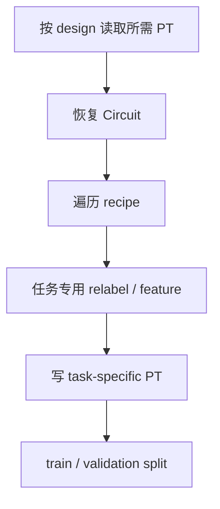
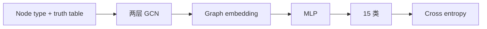
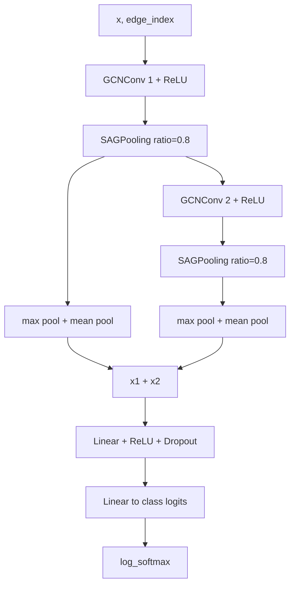
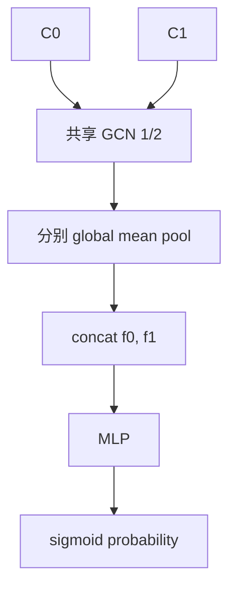
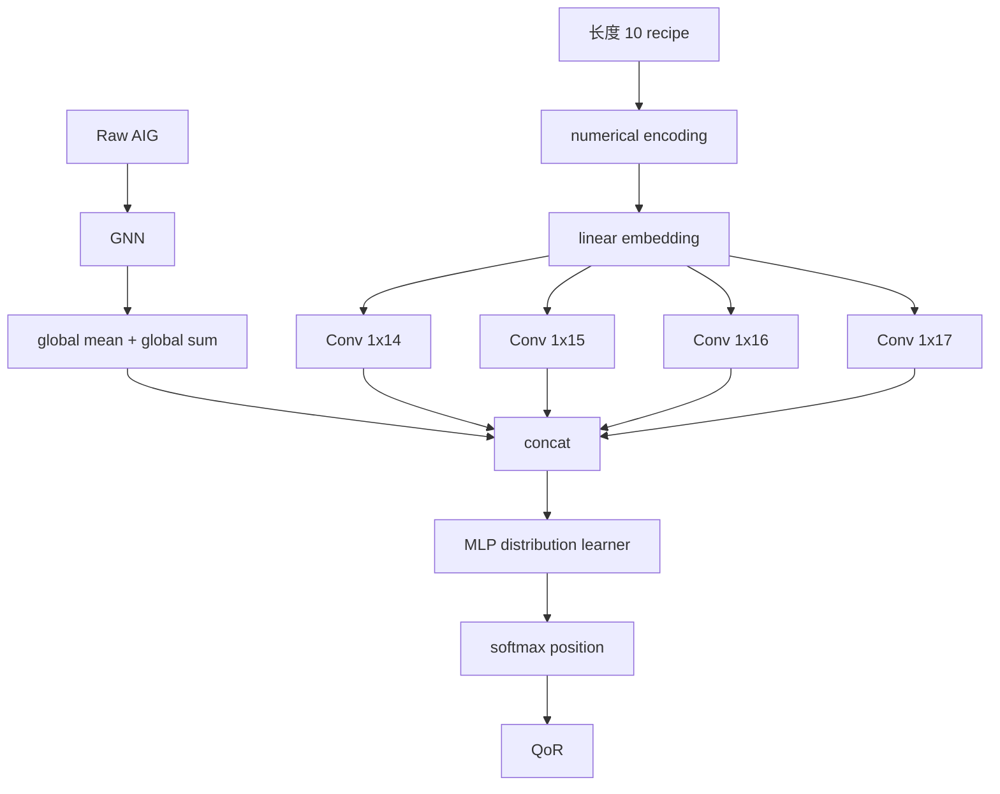
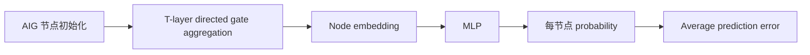
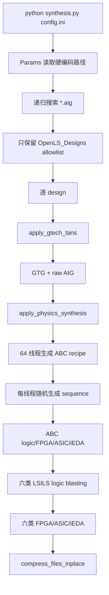

# OpenLS-DGF / ACE：论文、数据生成、Circuit Engine、四类任务与复现边界详解

> 论文：**OpenLS-DGF: An Adaptive Open-Source Dataset Generation Framework for Machine Learning Tasks in Logic Synthesis**  
> 作者：Liwei Ni、Rui Wang、Miao Liu、Xingyu Meng、Xiaoze Lin、Junfeng Liu、Guojie Luo、Zhufei Chu、Weikang Qian、Xiaoyan Yang、Biwei Xie、Xingquan Li、Huawei Li  
> arXiv：2411.09422 v2，2024-11-16，14 页  
> 原论文：[2411.09422_OpenLS-DGF.pdf](./2411.09422_OpenLS-DGF.pdf)  
> 官方论文页：<https://arxiv.org/abs/2411.09422>  
> 官方 PDF：<https://arxiv.org/pdf/2411.09422>  
> 官方代码：<https://github.com/Logic-Factory/ACE>  
> 本地代码 commit：`df1078141e19ec99a79550be216a52ce21e60a96`  
> 本次核验日期：2026-08-02  
> 静态审计记录：[runs/static_audit_20260802.json](./runs/static_audit_20260802.json)

---

```text
┌─────────────────────────────────────────────────────────────────────────────┐
│ P1 任务定义                                                                   │
├─────────────────────────────────────────────────────────────────────────────┤
│ Input    │ Boolean 网络（AIG/OIG/XAG/MIG/PRIMARY/GTG）、综合 recipe、        │
│          │ Sky130/Nangate45/ASAP7/GTECH 技术库、ASIC/FPGA 映射与 STA 结果  │
├──────────┼────────────────────────────────────────────────────────────────┤
│ Output   │ ACE Circuit Engine 打包的 PyTorch 母数据集，以及分类、排序、    │
│          │ QoR 预测、概率预测四类自适应子数据集                            │
├──────────┼────────────────────────────────────────────────────────────────┤
│ Supervision │ design 标签、配对 QoR 顺序、area/timing 数值、节点逻辑概率    │
├──────────┼────────────────────────────────────────────────────────────────┤
│ Why-hard │ 966K 电路规模；需统一 7 种逻辑表示；依赖 Yosys/ABC/LSILS/iEDA   │
│          │ 外部工具链；recipe 跨 design 对齐与源码多处实现口径漂移         │
└─────────────────────────────────────────────────────────────────────────────┘
```

## 0. 先给结论

OpenLS-DGF 不是一篇只提出单个 GNN 模型的论文。

它真正想解决的问题是：

> 能不能用同一套开源逻辑综合生成框架，得到一个既保留原始电路信息、又能按任务抽取子数据集的通用数据底座？

论文给出的答案由三部分组成：

1. **OpenLS-DGF**：从源设计到 GTG、AIG、随机优化、六种逻辑表示、ASIC/FPGA 映射、STA 和打包的七步生成框架；
2. **ACE Circuit Engine**：把 GraphML 载入统一 `Circuit` / `Node` 对象，再转换成 PyTorch Geometric 图；
3. **OpenLS-D-v1**：46 个组合设计、1000 条长度为 10 的 recipe、每个设计 21,000 个电路，共 966,000 个电路，并演示分类、排序、QoR 预测和概率预测四类任务。

论文规模的核心算式是：

```text
每条 recipe：
7 个 Boolean network
+ 7 个 ASIC netlist
+ 7 个 FPGA netlist
= 21 个电路

每个 design：
1000 recipe × 21 = 21,000 个电路

完整 OpenLS-D-v1：
46 design × 21,000 = 966,000 个电路
```

这里的 7 种 Boolean network 是：

```text
ABC 优化 AIG
+ LSILS AIG
+ OIG
+ XAG
+ MIG
+ PRIMARY
+ GTG
```

从组会价值看，这篇论文很值得讲，尤其适合接在 OpenABC-D、DeepGate 和 CircuitNet 后面：

- OpenABC-D 主要围绕 AIG 与 synthesis recipe；
- DeepGate 主要围绕 AIG 节点功能表征；
- OpenLS-DGF 试图把多逻辑表示、技术映射、物理 QoR 和多任务抽取放进同一数据框架。

但是，**当前本地仓库不能表述成“论文四个任务已经跑通”或“OpenLS-D-v1 已复现”**。

本地真实具备：

- 原论文 PDF；
- ACE / OpenLS-DGF 源码；
- 258 个 `.aig` benchmark，其中 `benchmark/openlsd/` 有 53 个；
- Sky130、Nangate45、ASAP7 和 GTECH 等技术库文件；
- 数据生成、GraphML parser、Circuit Engine 和四类任务源码；
- 论文 Figure 2、Figure 3、Figure 9、Figure 10 等原始图文件。

本地真实缺少：

- 论文所述约 410 GB raw files；
- 论文所述约 700 GB PyTorch files；
- 任意生成后的 GraphML、recipe `.seq`、QoR JSON 或压缩 `.zst`；
- 四类任务的 processed `.pt`；
- checkpoint；
- `模型推理.md`；
- 训练日志、推理日志或论文表格复算记录；
- 可直接调用的 LogicFactory 与 iEDA 配置路径。

当前官方 README 的 OpenLS-D-v1 下载项仍写着：

```text
Huggingface: uploading...
```

截至本次核验，没有检索到可信的 OpenLS-D-v1 Hugging Face 数据仓库地址。

因此当前复现状态应写成：

| 层级 | 当前状态 |
|---|---|
| 原论文 | 已归档，身份、哈希已核对 |
| 论文方法 | 七步生成、打包、Circuit Engine、四任务已还原 |
| 源码 | 48 个 tracked Python、7292 行，已逐主链审阅 |
| 输入 benchmark | 本地 258 个 AIG；OpenLS-D 候选目录 53 个 |
| 技术库 | 多个 Liberty / Genlib 本地存在 |
| OpenLS-D-v1 raw / PT | 不存在 |
| checkpoint | 不存在 |
| 既有本地运行记录 | 不存在 |
| 本次新模型运行 | 未执行 |
| 论文数值复现 | 未完成 |
| 综合等级 | **R1：方法、代码和输入资产可审计，数值闭环未建立** |

不重复跑一个随机初始化前向的原因也很明确：

```text
缺数据 + 缺 checkpoint + 缺外部综合工具
```

在这种条件下，随机图上的随机模型输出不能验证：

- 99.8% 分类准确率；
- 99.49% 排序准确率；
- QoR MAPE；
- 概率预测 PE；
- 966,000 电路生成闭环。

本次工作重点因此是把“论文声称什么、当前代码实际做什么、本地到底有什么”分开并对齐。

---

## 1. 证据边界

本文统一使用四类证据。

| 标记 | 来源 | 可以说明什么 |
|---|---|---|
| `[论文]` | 原论文正文、图、表 | 作者定义的方法和作者报告结果 |
| `[代码]` | 当前 commit 源码 | 当前公开实现实际会怎样执行 |
| `[本地资产]` | 本地文件、数量、哈希 | 某个输入、PDF、代码或库是否真实存在 |
| `[已有运行]` | 已保存日志、record、模型推理文档 | 某条路径是否曾在本机执行 |

ACE 当前没有 `[已有运行]` 证据。

所以本文会明确区分：

- `[论文]` 分类第 10 epoch 约 99.8%；
- `[代码]` 当前分类入口使用 `lr=0.001`；
- `[本地资产]` 没有分类 processed `.pt`；
- 不能推出 `[已有运行]` 本机分类达到 99.8%。

同理：

- 仓库含 53 个 OpenLS-D 候选 AIG，不等于已生成 966,000 个电路；
- 含 `SynthNet` 类，不等于有训练好的 QoR 模型；
- 含 `cec.py`，不等于所有生成物已经完成组合等价性检查；
- 含 Sky130 Liberty，不等于 iEDA、LogicFactory、LSILS 的完整运行环境已经齐全。

### 1.1 本次做了什么

- 核对论文标题、作者、版本、日期、页数、PDF 大小和 SHA-256；
- 阅读论文七步数据生成流程；
- 还原 966,000 电路的规模算式；
- 阅读 `synthesis.py`、`checking.py`、`cec.py` 和压缩脚本；
- 阅读 `Circuit`、`Node`、`Tag`、GraphML loader、QoR/sequence loader；
- 阅读通用 `OpenLS_Dataset`；
- 阅读分类、排序、QoR、概率四类任务的 dataset/model/train；
- 对照论文超参数、split、模型结构和结果表；
- 统计 benchmark、技术库、processed data、权重和日志；
- 定位会直接阻断或改变实验口径的实现问题；
- 形成机器可读静态审计记录。

### 1.2 本次没有做什么

- 没有执行 LogicFactory；
- 没有执行 46 × 1000 条综合 recipe；
- 没有生成 966,000 个电路；
- 没有生成约 410 GB raw data；
- 没有生成约 700 GB PyTorch data；
- 没有训练四类模型；
- 没有随机初始化冒充论文 checkpoint；
- 没有修改作者源码后再把结果写成官方复现；
- 没有重新计算论文 Table V、VI、VII。

---

## 2. 论文身份与代码快照

### 2.1 论文信息

| 字段 | 内容 |
|---|---|
| 标题 | OpenLS-DGF: An Adaptive Open-Source Dataset Generation Framework for Machine Learning Tasks in Logic Synthesis |
| 作者 | Liwei Ni 等 13 位作者 |
| arXiv ID | 2411.09422 |
| 版本 | v2 |
| 首次提交 | 2024-11-14 |
| 最近修订 | 2024-11-16 |
| 分类 | cs.AI |
| 页数 | 14 |
| 本地文件 | `2411.09422_OpenLS-DGF.pdf` |
| 本地大小 | 3,548,439 bytes |
| SHA-256 | `d5a422f66e8167ec85741e6037b27b3ec8450e37d0e0a5d2d1ec2fc9b5766db6` |

这篇论文当前应按 arXiv preprint 表述，不应自行补写一个论文没有明确给出的会议接收状态。

### 2.2 代码快照

| 字段 | 内容 |
|---|---|
| remote | `https://github.com/Logic-Factory/ACE.git` |
| commit | `df1078141e19ec99a79550be216a52ce21e60a96` |
| commit 时间 | 2025-07-21T20:36:27+08:00 |
| tracked files | 1,144 |
| tracked Python | 48 个 |
| tracked Python 行数 | 7,292 |
| 当前目录大小 | 269,467,302 bytes，约 257 MiB |

### 2.3 许可证边界

根目录没有发现 `LICENSE` 或 `COPYING`。

唯一发现的许可证文件是：

```text
benchmark/EPFL/LICENSE
```

它只能说明 EPFL benchmark 子目录的授权，不能推出整个 ACE 仓库采用相同许可证。

论文的 Qeios 页面标注 CC BY 4.0，也不能自动覆盖代码许可证。

因此当前准确说法是：

> 论文可公开阅读；代码仓库公开可访问；当前 checkout 未发现覆盖整个代码仓库的根许可证文件。

---

## 3. 它位于 EDA 流程的哪一段

OpenLS-DGF 覆盖逻辑综合到早期物理评价的主干。


它不等同于完整芯片物理实现。

论文和代码主要涉及：

- 逻辑综合；
- 技术无关 Boolean network；
- 标准单元/FPGA LUT 映射；
- ASIC arrival time；
- 图数据打包；
- 逻辑综合相关机器学习任务。

它没有形成一个完整的：

```text
placement → CTS → routing → extraction → signoff STA → DRC/LVS
```

闭环。

虽然脚本调用 iEDA 的 `init; sta; power;`，论文表中的核心标签仍应理解为当前生成流程得到的早期物理/映射 QoR，不应直接等同于最终 signoff PPA。

---

## 4. 论文为什么要提出 OpenLS-DGF

论文认为此前数据集有两类局限。

### 4.1 任务专用

例如：

- DeepGate 数据围绕节点功能和概率；
- Gamora 数据围绕节点分类；
- OpenABC-D 主要围绕 AIG、recipe 和 QoR。

不同任务常有各自的数据格式、生成脚本和预处理。

这导致：

- 相同原始电路被重复生成；
- 不同任务结果难以放在统一底座上比较；
- 想增加新特征时，经常需要重新构建整套数据。

### 4.2 生成流程不是为 ML 数据管理设计

普通 EDA flow 会产生大量中间文件，但不一定：

- 统一保留 GraphML；
- 统一记录 recipe；
- 统一保存 logic / ASIC / FPGA 版本；
- 支持按任务选择性加载；
- 提供稳定的节点索引映射。

OpenLS-DGF 的设计目标因此是：

```text
一次生成通用数据
        ↓
按任务抽取不同子数据集
        ↓
尽量不重复执行昂贵的 EDA 步骤
```

---

## 5. 论文七步数据生成流程

论文 Figure 2 的原图已经随仓库保存。


> 图源：论文 Figure 2 / 仓库 `imgs/dataset_framework.png`。它用于说明源设计、GTG、AIG recipe、多逻辑表示、映射、STA 和 Circuit Engine 的全链关系。

### 5.1 Step 1：Generic Technology Circuit Synthesis

输入可能是：

- Verilog；
- AIG；
- BLIF。

作者先用 Yosys 前端把输入转成 Generic Technology Graph / Circuit，简称 GTG。

GTG 的意义是把不同输入格式统一到一套通用门级中间表示。

它不仅含基本门，还含：

- NAND3；
- MUX21；
- AOI21；
- OAI21。

这些较粗粒度通用单元有助于保留 RTLIL 中间表示的结构属性。

论文要求同时保留：

```text
GTG Verilog
GTG GraphML
```

代码对应：

```text
OpenLS-DGF/synthesis.py
└── Synthesis.apply_gtech_tans()
```

当前代码实际调用：

```text
LogicFactory
  anchor -set yosys
  read_aiger
  hierarchy -auto-top
  techmap
  abc -genlib gtech.genlib
  write_verilog
  anchor -tool lsils
  read_gtech
  write_graphml
```

需要注意：当前入口虽然论文说支持多种源格式，但 `run()` 实际只递归搜索：

```python
glob(..., '**/*.aig')
```

因此当前公开入口的直接输入是 `.aig`，不是自动分派 Verilog/BLIF 的通用入口。

### 5.2 Step 2：AIG Generation

AIG 只由：

- AND2；
- inverter / complemented edge 语义；

构成。

它是 ABC、LSILS 等逻辑优化工具的常用表示。

论文先把 GTG 转为 AIG，并保存：

- 二进制 AIG；
- Verilog；
- GraphML。

代码仍在 `apply_gtech_tans()` 中完成这一步。

### 5.3 Step 3：Logic Optimization Recipes

论文的 command pool 有 13 种不同命令文本：

```text
balance

rewrite
rewrite -l
rewrite -z
rewrite -l -z

refactor
refactor -l
refactor -z
refactor -l -z

resub
resub -l
resub -z
resub -l -z
```

代码中的列表长度是 16，因为 `balance` 被重复 4 次：

```text
12 个 rewrite/refactor/resub 变体
+ balance × 4
= 16 个采样槽
```

所以采样概率是：

| 类别 | 概率 |
|---|---:|
| balance | 4/16 = 25% |
| refactor 家族 | 4/16 = 25% |
| rewrite 家族 | 4/16 = 25% |
| resub 家族 | 4/16 = 25% |
| 每个具体非 balance 命令 | 1/16 = 6.25% |

论文把这种重复解释为平衡四类优化操作的选择概率。

论文数据设置是：

```text
每个 design 1000 条 recipe
每条 recipe 10 个 command
```

代码对应：

```text
OpenLS-DGF/synthesis.py
├── OptCmds_Aig
├── gen_gaussian_sequence()
├── gen_random_sequence()
└── Synthesis.process_logic_root()
```

实际主链调用的是：

```python
gen_random_sequence(self.params.recipe_length())
```

`gen_gaussian_sequence()` 没有进入当前生成主链。

### 5.4 Step 4：Logic Blasting

ABC 优化得到的 AIG 再由 LSILS 转换成六种表示：

| 表示 | 主要逻辑基 |
|---|---|
| AIG | AND + INV |
| OIG | OR + INV |
| XAG | XOR + AND |
| MIG | MAJ3 + INV |
| PRIMARY | primitive gate pool |
| GTG | generic technology gates |

代码中的目标列表是：

```python
logics_aux = ["aig", "oig", "xag", "primary", "mig", "gtg"]
```

MIG 使用单独的：

```text
convert -from aig -to mig -n
```

其余表示使用普通 `convert`。

### 5.5 Step 5：Technology Mapping

每个 Boolean network 都映射为：

- ASIC gate-level netlist；
- FPGA LUT6 netlist。

论文说明：

- ASIC 使用 Sky130 标准单元库；
- FPGA 约束到 LUT6；
- LSILS 分支使用相同 mapper；
- ABC AIG 分支也保留 ABC mapping。

代码实际生成每个 logic / recipe 的：

```text
recipe_i.logic.*
recipe_i.fpga.*
recipe_i.asic.*
```

### 5.6 Step 6：STA / Physical Information

ASIC netlist 进入 iEDA：

```text
config
logic2netlist
init
sta
print_stats timing JSON
power
print_stats power JSON
```

代码会产生：

```text
recipe_i.asic.timing.qor.json
recipe_i.asic.power.qor.json
```

论文的下游任务主要使用：

- area；
- arrival time / timing。

### 5.7 Step 7：Dataset Packing

最后由 ACE Circuit Engine 把 raw GraphML / JSON / sequence 组织成 PyTorch 文件。

论文 Figure 3：


> 图源：论文 Figure 3 / 仓库 `imgs/openlsd-component.png`。它展示论文设想中的 `raw.pt`、`abc.aig.pt` 和六个 LSILS logic PT 文件。

论文声称每个 design 被分成 8 个 PT 文件：

```text
raw.pt
abc.aig.pt
lsils.aig.pt
lsils.oig.pt
lsils.xag.pt
lsils.mig.pt
lsils.primary.pt
lsils.gtg.pt
```

拆分的目的不是减小总数据量，而是让任务只加载需要的部分。

例如分类只用 ABC-AIG 时，理论上只需：

```text
raw.pt
abc.aig.pt
```

---

## 6. OpenLS-D-v1 数据规模如何得到

### 6.1 46 个源设计

论文从：

- IWLS2005；
- IWLS2015 / EPFL；
- OpenCores；

选择 46 个组合设计。

它们覆盖：

- 算术；
- 控制；
- 接口；
- IP core；
- 小图到大图。

论文 Table III 给出的范围包括：

| 统计 | 最小 | 最大 |
|---|---:|---:|
| PI | 7 | 17,322 |
| PO | 1 | 17,063 |
| AND | 112 | 119,908 |
| INV | 119 | 152,637 |
| edge | 483 | 488,364 |
| depth | 11 | 10,384 |

### 6.2 每个 design 为什么是 21,000

每条 recipe 首先得到 7 个逻辑网络：

```text
ABC-AIG
LSILS-AIG
OIG
XAG
MIG
PRIMARY
GTG
```

每个逻辑网络再得到：

```text
1 个 ASIC netlist
1 个 FPGA netlist
```

所以：

```text
7 logic + 7 ASIC + 7 FPGA = 21
```

每个 design 有 1000 recipe：

```text
1000 × 21 = 21,000
```

46 个 design：

```text
46 × 21,000 = 966,000
```

### 6.3 与 OpenABC-D 的差异

| 项目 | OpenABC-D | OpenLS-D-v1 |
|---|---|---:|
| design | 29 | 46 |
| recipe | 1500 | 1000 |
| sequence length | 20 | 10 |
| AIG/recipe 方式 | 保存 20 个中间步骤 | 每 recipe 重点保存最终 ABC AIG |
| Boolean representation | 主要 AIG | 7 种逻辑网络 |
| ASIC per design | 非统一 7 类 | 7000 |
| FPGA per design | 非统一 7 类 | 7000 |
| 总电路 | 870,000 AIG | 966,000 logic/netlist |

OpenLS-DGF 的“更多样”主要来自表示类型，不是来自更长 recipe。

### 6.4 论文报告的存储和生成成本

| 项目 | 论文报告 |
|---|---:|
| raw files | 约 410 GB |
| PyTorch files | 约 700 GB |
| raw 生成 | 约 76 小时 |
| 压缩 | 约 65 小时 |
| CPU | Intel Xeon Platinum 8380 |
| 磁盘 | 16 TB Seagate Exos HDD |
| 线程 | 32 |

这也解释了为什么“从零生成完整 OpenLS-D-v1”不是普通 smoke test。

---

## 7. 论文的数据观察

OpenLS-D-v1 不只提供样本，论文还用数据分布提出三个观察。

### 7.1 不同逻辑网络可能有相似的技术无关 QoR

两个表示可能具有相近：

- 节点数；
- 图深度；

但映射后的：

- area；
- arrival time；

分布仍明显不同。

这说明不能只看 Boolean network 节点数就判断最终 technology mapping QoR。

### 7.2 表示类型影响映射结果

AIG、OIG、XAG、MIG、PRIMARY、GTG 的映射 QoR convex hull 不一定重合。

这正是 circuit ranking 任务的动机：

> 在昂贵的 technology mapping 前，能否先判断哪一种 Boolean representation 更可能得到好结果？

### 7.3 随机 recipe 足够多后，QoR 范围趋于稳定

论文比较 250、500、750、1000 条 recipe 的分布。

作者观察到：

```text
recipe 数继续增大时
新的 QoR 多数落入已有可预测范围
```

这成为 QoR distribution learning 的动机。

---

## 8. ACE Circuit Engine

### 8.1 设计目标

Circuit Engine 试图充当三种图之间的桥：

```text
原始 Boolean circuit / GraphML
             ↓
       ACE Circuit / Node
             ↓
  torch_geometric.data.Data
```

对应代码：

```text
src/circuit/circuit.py
src/circuit/node.py
src/circuit/tag.py
src/io/load_graphml.py
src/operator/compute.py
```

### 8.2 论文中的 Node

论文说每个节点有 5 个属性：

1. type；
2. name；
3. index；
4. fanins；
5. truth table。

逻辑网络节点的 `name` 应保存门名。

ASIC/FPGA 节点：

- `type = CELL`；
- `name = 具体标准单元/LUT 名称`。

### 8.3 当前代码中的 Node

当前 `Node.__init__` 实际只有：

```python
self._type
self._idx
self._fanins
self._truthtable
```

没有 `_name`。

GraphML 原始 ID 只保存在：

```python
Circuit._node_map[old_id] = new_index
```

它不是 Node 自身属性。

### 8.4 标准单元名称丢失

`load_graphml.py` 对无法匹配 GTECH 基本门的非 GTECH 节点调用：

```python
circuit.add_cell(node_id, [], node_func)
```

`add_cell()` 又固定构造：

```text
type = GTECH_CELL
```

原始 `node_type` 对应的标准单元名没有存入 Node。

所以当前代码不能完全兑现论文中的：

```text
CELL type + matched standard cell name
```

也不能仅靠当前 Node 无损恢复原始 cell identity。

### 8.5 21 维节点类型

`NodeTypeEnum` 定义 21 类：

| ID | 类型 |
|---:|---|
| 0 | CONST0 |
| 1 | CONST1 |
| 2 | PI |
| 3 | PO |
| 4 | INVERTER |
| 5 | BUFFER |
| 6 | AND2 |
| 7 | NAND2 |
| 8 | OR2 |
| 9 | NOR2 |
| 10 | XOR2 |
| 11 | XNOR2 |
| 12 | MAJ3 |
| 13 | XOR3 |
| 14 | NAND3 |
| 15 | NOR3 |
| 16 | MUX21 |
| 17 | NMUX21 |
| 18 | AOI21 |
| 19 | OAI21 |
| 20 | CELL |

`Circuit.get_node_features()` 只生成这 21 类的 one-hot。

### 8.6 边方向

GraphML edge `source → target` 被转换为：

```python
circuit.add_fanin(dst_idx, src_idx)
```

内部保存：

```text
fanin/source → consumer/destination
```

这是常见的信号传播方向。

### 8.7 GraphML 到 PyG

`Circuit.to_torch_geometric()` 当前只返回：

```python
Data(
    x=node_type_one_hot,
    edge_index=edge_index
)
```

它没有导出：

- truth table；
- node name；
- original node ID；
- edge/pin attribute；
- area/timing；
- logic type。

这些信息必须由上层再附加。

### 8.8 truth table 的 64 bit 约定

论文把 truth table 标准化为 64 bit。

64 个表项最多直接覆盖：

```text
2^6 = 64
```

即至多 6 输入函数。

这与 FPGA LUT6 很自然地对应。

但对任意大于 6 输入的 cell，当前代码没有给出分解或扩展约定。

`sim_cell()` 也只解析字符串末尾 16 个 hex digit，即 64 bit。

### 8.9 pin order 风险

GraphML loader 遍历：

```python
raw_graph.edges(data=True)
```

却忽略 edge attribute。

对 AND/OR/XOR 等交换门，fanin 顺序通常不影响结果。

但对：

- MUX；
- AOI/OAI；
- 某些标准单元；

选择端和数据端的顺序会影响功能。

如果 GraphML 的 pin identity 保存在 edge attribute 中，当前 parser 会丢失它。

### 8.10 PI 容器类型问题

`Circuit.add_pi()` 当前执行：

```python
self._pis.append(old_id)
```

而 `_pos`、`_gates`、`_consts` 保存的是 Node。

因此：

- `num_pis()` 仍能返回正确数量；
- `foreach_pi(func)` 却把字符串传给 `func`，与注解不一致。

### 8.11 三输入 XOR 实现问题

代码：

```python
def sim_xor3(sig1, sig2, sig3):
    return sig1 != sig2 != sig3
```

Python 会把它解释为链式比较：

```text
(sig1 != sig2) and (sig2 != sig3)
```

它不是三输入奇偶校验。

正确的 Boolean parity 应类似：

```text
sig1 XOR sig2 XOR sig3
```

### 8.12 complement truth table 未截断

例如 NAND：

```python
int_res = ~(int_val1 & int_val2)
```

Python 整数无限精度，`~` 会产生负数。

如果要求 64 bit truth table，应再做：

```text
result & ((1 << 64) - 1)
```

当前代码没有统一 mask。

---

## 9. Adaptive Sub-dataset Extraction

论文把 OpenLS-D-v1 看成母数据集。

任务数据不是四套完全独立的 raw data，而是按需求抽取。

论文 Figure 10：


> 图源：论文 Figure 10 / 仓库 `imgs/adaptive-dataset.png`。它展示分类、排序、QoR 与概率任务从同一 OpenLS-D 母数据集抽取的关系。

统一抽取逻辑应是：



论文强调可以只加载任务需要的 PT。

例如：

| 任务 | 需要的核心信息 |
|---|---|
| 分类 | 多 recipe 的等价 Boolean graph + design label |
| 排序 | 同 design/recipe 的多逻辑表示 + 映射 QoR |
| QoR | raw AIG + sequence + area/timing |
| 概率 | AIG + 随机仿真的节点概率向量 |

当前源码对应四个 Dataset：

```text
ClassificationDataset
RankingDataset / RankingDataset2
QoR_Dataset
Probability_prediction
```

---

## 10. Task 1：Circuit Classification

### 10.1 问题定义

同一源设计经过不同 recipe 和不同 Boolean representation 后，结构可以变化，但功能等价。

分类任务把同一源设计的变体归为同一类。

```text
输入：一个 Boolean graph
输出：它属于哪个 source design
```

它不是一般语义类别，如“加法器/控制器”。

它预测的是具体 design identity。

### 10.2 论文数据设置

论文选择 15 个 design：

| label | design |
|---:|---|
| 0 | router |
| 1 | usb_phy |
| 2 | cavlc |
| 3 | adder |
| 4 | systemcdes |
| 5 | max |
| 6 | spi |
| 7 | wb_dma |
| 8 | des3_area |
| 9 | tv80 |
| 10 | arbiter |
| 11 | mem_ctrl |
| 12 | square |
| 13 | aes |
| 14 | fpu |

每类 1000 个样本时：

```text
800 train
200 validation
```

### 10.3 论文模型

论文描述：



论文超参数：

| 参数 | 数值 |
|---|---:|
| input feature | 64 |
| hidden feature | 128 |
| learning rate | 0.0001 |
| weight decay | 1e-5 |
| batch size | 16 |

论文报告：

> 到第 10 epoch，测试准确率约 99.8%。

### 10.4 当前代码模型

`tasks/circuit_classification/net.py` 的真实结构是：



因此代码不是“只做普通两层 GCN + 一个 readout”。

它还有：

- 两次 SAGPooling；
- 两层的 multiscale readout；
- max + mean pooling；
- 两层 readout 相加。

### 10.5 论文与代码的节点特征差异

论文写：

```text
node type + truth table
```

代码先从 `Circuit` 得到 21 维 node type one-hot，然后：

```python
padding_feature_to(graph, 64)
```

额外 43 维不是 truth-table bit，而是：

```python
torch.randn(num_nodes, 43)
```

即随机高斯特征。

这会带来三个问题：

1. 与论文输入定义不同；
2. 预处理发生在 `torch.manual_seed(12345)` 之前；
3. 同一图在重新预处理时会得到不同随机特征。

### 10.6 `train.py` 的 fatal 调用错误

Dataset 方法签名：

```python
split_train_test(self, designs, train_ratio=0.8, ...)
```

`train.py` 却调用：

```python
self.dataset.split_train_test(0.8)
```

因此：

```text
designs = 0.8
```

后续：

```python
for design in designs:
```

会尝试迭代 float。

`train2.py` 使用关键字参数调用，修正了这一处。

### 10.7 recipe 数量没有传给母数据集

`ClassificationDataset` 接收 `recipes`，但构建母数据集时：

```python
OpenLS_Dataset(
    root=...,
    designs=...,
    logics=[logic]
)
```

没有传 `recipes=self.recipes`。

母数据集因此默认要求 1000 recipe。

即使命令行指定：

```text
--recipes 50
```

fresh base cache 路径仍按 1000 处理。

### 10.8 训练超参数漂移

| 项目 | 论文 | 当前代码默认/硬编码 |
|---|---:|---:|
| learning rate | 1e-4 | 1e-3 |
| weight decay | 1e-5 | 1e-5 |
| batch | 16 | 1 |
| recipes/class | 1000 | CLI 默认 50，但 base loader 默认 1000 |

### 10.9 t-SNE 口径

论文 Figure 12 把图称为 graph embedding 的 t-SNE。

当前代码 `tsne_analysis()` 保存的是：

```python
out = self.model(...)
features.append(out)
```

`out` 是最终 `log_softmax` 类别输出，不是 `fc1` 前的 graph embedding。

因此代码图更准确地说是：

> class log-probability vector 的 t-SNE。

---

## 11. Task 2：Circuit Ranking

### 11.1 任务动机

同一个 design、同一个优化 recipe，可以转换成不同 Boolean representation。

这些表示经过 technology mapping 后可能有不同：

- timing；
- area。

排序任务希望在映射前预测：

```text
C0 是否优于 C1
```

### 11.2 partial order

当前代码采用 timing 优先、area 次优的词典序：

```text
如果 timing0 < timing1，则 C0 更优；
如果 timing 相同/接近，再比较 area；
如果 timing 和 area 都近似相同，则跳过 tie。
```

代码用 `float_approximately_equal()` 判断同时 tie。

### 11.3 论文模型

论文 Figure 13 描述：

```text
C0 与 C1
    ↓
block matrix / paired graph
    ↓
GNN graph embedding
    ↓
MLP comparison network
    ↓
C0 ⪯ C1 或 C0 ⪰ C1
```

loss 是 BCE。

### 11.4 当前代码模型

`CircuitRankNet` 不构造一个真正的 block-diagonal matrix。

它做的是：



两个图通过共享参数分别编码，然后拼接。

新版 `CircuitRankNet2` 则使用：

- 两层 GraphSAGE；
- BatchNorm；
- mean + max pool；
- logic type one-hot；
- `f0`、`f1`、`|f0-f1|`、`f0*f1` 四路组合。

### 11.5 120,000 pair 怎样与代码对应

论文使用 10 个 design、1000 recipe，报告约 120,000 pair。

`train.py` 的 logic 集合是：

```text
aig, xag, mig, gtg
```

4 种表示两两组合：

```text
C(4, 2) = 6
```

代码为每个组合写正向和反向两个 pair：

```text
10 design × 1000 recipe × 6 pair × 2 orientation
= 120,000
```

这说明论文的 120,000 数字与当前 `dataset.py` 的镜像 pair 构造高度吻合。

但论文文字又说：

> 只考虑 `C0 ⪯ C1`，因为反向可转换。

所以文字描述与 artifact 的 pair 数口径存在张力。

### 11.6 论文 Table V

论文在 epoch 20 报告：

| Metric | GCNConv | GraphSAGE | GINConv |
|---|---:|---:|---:|
| BCE loss | 5.09 | 4.31 | 4.43 |
| Accuracy | 99.43% | 99.49% | 99.47% |
| Precision | 0.9939 | 0.9949 | 0.9944 |
| Recall | 0.4993 | 0.4995 | 0.4969 |
| F1 | 0.6647 | 0.6651 | 0.6627 |

这组指标第一眼很奇怪：

```text
Accuracy ≈ 99.5%
Precision ≈ 99.5%
Recall ≈ 50%
F1 ≈ 66.5%
```

源码可以精确解释它。

### 11.7 指标实现为什么会产生 0.5 Recall

代码先计算：

```python
predictions = abs(target - output) < 0.5
```

这个 `predictions` 不是预测类别。

它表示：

```text
当前样本是否预测正确
```

但后面又把它当预测类别统计：

```python
tp = (predictions == 1) & (target == 1)
fp = (predictions == 0) & (target == 1)
fn = (predictions == 1) & (target == 0)
```

假设镜像数据正负平衡、总体准确率为 `a`：

```text
tp ≈ aN/2
fp ≈ (1-a)N/2
fn ≈ aN/2
```

那么：

```text
precision ≈ a
recall ≈ (aN/2) / (aN/2 + aN/2) = 0.5
```

当 `a = 0.995`：

```text
F1 ≈ 2 × 0.995 × 0.5 / (0.995 + 0.5)
   ≈ 0.6656
```

这与 Table V 的 0.6651 几乎完全一致。

因此 Table V 的 Recall/F1 不能按标准二分类指标解释。

Accuracy 本身仍可近似反映 threshold 0.5 下的正确率，但 Precision/Recall/F1 代码口径错误。

### 11.8 当前源码不能直接重建三模型表

当前 `net.py` 有：

- `CircuitRankNet`：GCN；
- `CircuitRankNet2`：GraphSAGE。

虽然 import 了 `GINConv`，但没有一个可运行的 GIN ranking model 分支。

所以 Table V 的 GIN 列不能由当前统一 CLI 直接切换得到。

### 11.9 第二测试集接错对象

`train.py` 创建：

```python
self.dataset  = RankingDataset(train_designs)
self.dataset2 = RankingDataset(test_designs)
```

但 `run()` 中：

```python
dataset2_test, _ = self.dataset.split_train_test(1.0)
```

调用的是 `self.dataset`，不是 `self.dataset2`。

因此名为 `dataloader2_test` 的 loader 实际又来自训练 design 数据对象。

### 11.10 超参数漂移

| 项目 | 论文 | train.py | train2.py |
|---|---:|---:|---:|
| learning rate | 1e-4 | Adam 1e-3 | SGD 1e-3 |
| weight decay | 1e-5 | 1e-5 | 1e-5 |
| batch | 32 | CLI 默认 1 | CLI 默认 1 |
| split | 70/30 | 默认 80/20 | 默认 80/20 |

---

## 12. Task 3：QoR Prediction

### 12.1 任务输入输出

论文定义每条样本：

```text
{
  unoptimized Boolean network,
  optimization sequence,
  Area,
  Timing
}
```

任务是给定：

- 原始 AIG；
- 优化 recipe；

预测映射后的：

- area；
- timing。

### 12.2 跨 design 共享 sequence 是关键前提

论文明确写：

> 同一个 recipe index 在不同 design 中共享相同 optimization sequence。

这样才能讨论：

- seen recipe / unseen design；
- unseen recipe / seen design；
- unseen design-recipe combination。

如果不同 design 的 `recipe_17` 实际是不同 command 序列，那么“按 recipe index split”就失去论文定义。

### 12.3 论文模型

论文 Figure 15 的结构：



### 12.4 论文三种 variant

| Variant | Train | Test | 论文目标 |
|---|---|---|---|
| V1 | 所有 design 的前 700 recipe | 剩余 300 recipe | seen design, unseen recipe |
| V2 | 20 个小 design | 14 个大 design | unseen design, seen recipe |
| V3 | 所有 design-recipe 组合随机选 70% | 剩余组合 | unseen design-recipe combination |

### 12.5 论文 Table VI

| Variant | Area MAPE | Timing MAPE |
|---|---:|---:|
| V1 | 0.69% | 7.87% |
| V2 | 1.06% | 6.50% |
| V3 | 1.17% | 6.49% |

这些数字是论文报告，不是本地复算。

### 12.6 当前生成脚本没有实现跨 design 序列共享

`process_logic_root()` 在每个 design、每个 recipe 的线程里调用：

```python
opt_sequence = gen_random_sequence(...)
```

没有：

- 预先生成一次全局 1000 recipe；
- 从 `synthesis_sequence.txt` 读取；
- 按 recipe index 跨 design 复用；
- 固定 NumPy seed。

所以当前源码直接运行时：

```text
design A / recipe 17
design B / recipe 17
```

不保证是相同 sequence。

README 的数据树列出 `synthesis_sequence.txt`，但当前 `synthesis.py` 没有该文件的读写逻辑。

这是 QoR Variant 2/3 最关键的论文—代码差异之一。

### 12.7 QoR Dataset 的参数顺序错误

`OpenLS_Dataset` 签名：

```python
OpenLS_Dataset(root, designs, logics, recipes)
```

QoR 代码调用：

```python
OpenLS_Dataset(
    self.root_openlsd,
    self.recipe_size,
    self.curr_designs
)
```

实际绑定成：

```text
designs = recipe_size 整数
logics  = curr_designs 列表
recipes = 默认 1000
```

fresh QoR 构造会在这里就偏离预期。

### 12.8 `recipes_pack` 索引结构错误

母数据集实际产生：

```text
design_recipes = {
  "abc": [DataFrame recipe0, recipe1, ...],
  "aig": [...],
  ...
}
```

QoR 代码却访问：

```python
recipes_pack[i][self.logic]
```

正确结构应先按 logic，再按 recipe index：

```text
recipes_pack[self.logic][i]
```

当前代码会对 dict 用整数 key。

### 12.9 timing 字段名不一致

母数据集列名是：

```text
area
timing
```

QoR Dataset 的 target 选项却是：

```text
area
delay
```

delay 分支读取：

```python
...['delay']
```

当前母数据中没有 `delay` 列。

### 12.10 recipe 长度：论文 10，模型硬编码 20

生成配置和论文都是：

```text
sequence length = 10
```

QoR 代码却：

```python
while len(number_seq) < 20:
    number_seq.append(0)
```

模型 forward：

```python
synthFlow.reshape(-1, 20)
```

所以当前模型按 20 token 设计。

### 12.11 pooling 差异

| 项目 | 论文 | 当前代码 |
|---|---|---|
| graph readout | mean + sum | max + mean |

### 12.12 convolution kernel 差异

| 分支 | 论文 | 当前代码 |
|---:|---:|---:|
| 1 | 14 | 12 |
| 2 | 15 | 15 |
| 3 | 16 | 18 |
| 4 | 17 | 21 |

### 12.13 输出头差异

论文描述：

```text
softmax → distribution position → QoR
```

当前代码：

```text
Linear(256,1) → scalar
MSELoss
```

没有 softmax，也没有显式的 distribution bin。

### 12.14 1090 维硬编码怎样来的

当前默认：

- recipe token 数 20；
- token embedding 32；
- flatten 长度 640；
- stride 3；
- 四个 kernel 12/15/18/21；
- GNN hidden 128；
- graph max+mean 得 256。

四个 Conv1d 输出长度：

```text
k=12：floor((640-12)/3)+1 = 210
k=15：209
k=18：208
k=21：207
```

合计：

```text
210 + 209 + 208 + 207 = 834
```

再加 graph embedding：

```text
834 + 256 = 1090
```

所以代码：

```python
Linear(1090, 256)
```

只对这组隐藏设定成立。

类中计算的 `in_dim_to_fcs` 没有真正用于构造该层。

### 12.15 NodeEncoder 没进入 forward

代码创建：

```python
NodeEncoder(...)
```

并传给 `GNN`。

但 `GNN.forward()` 直接把：

```python
batched_data.x
```

送入 GCN/SAGE/GIN。

没有调用：

```python
self.node_encoder(x)
```

所以 NodeEncoder 的参数不会参与输出。

### 12.16 归一化和 split

QoR Dataset 先对每个 design 的全部 recipe 计算：

```text
mean
std
```

再随机切分 train/test。

这样测试 recipe 的标签分布参与了归一化统计。

对 V1 这种 unseen recipe 评价，这属于 test-label distribution leakage。

### 12.17 MAPE 实现问题

函数定义：

```python
calculate_mape(actual, forecast)
```

调用却是：

```python
calculate_mape(prediction, actual)
```

分母因此变成 prediction。

同时代码分别删除：

```text
actual 中的 0
forecast 中的 0
```

如果零元素位置不同，两个数组还可能失去一一对应关系。

### 12.18 checkpoint 保存条件

只有满足：

```text
epoch > 1
train loss < 0.7
test loss 刷新
```

才保存 checkpoint。

如果未满足，`best_score` 仍为 999，训练结束却加载：

```text
best_model_999.000.pt
```

该文件不存在。

---

## 13. Task 4：Probability Prediction

### 13.1 任务定义

节点逻辑概率定义为该节点 truth table 中 1 的频率。

```text
p(v=1) = truth table 中 1 的个数 / truth table 总项数
```

论文用随机 PI activation vector 仿真得到每个节点概率标签。

### 13.2 论文模型

论文描述：



论文比较：

- GraphSAGE；
- DeepGate2。

### 13.3 论文 Table VII

| recipe size | GraphSAGE PE | GraphSAGE time | DeepGate2 PE | DeepGate2 time |
|---:|---:|---:|---:|---:|
| 100 | 0.011 | 0.050 s | 0.0082 | 1.42 s |
| 500 | 0.002 | 0.098 s | 0.001 | 1.48 s |
| 1000 | 0.0008 | 0.038 s | 0.0002 | 2.20 s |

论文报告 DeepGate2 误差更低，但耗时显著更高。

这些是论文数值，不是本地运行结果。

### 13.4 论文实验设置

论文选择 10 个 design：

```text
ctrl
router
int2float
ss_pcm
usb_phy
sasc
cavlc
simple_spi
priority
steppermotordrive
```

| 参数 | 论文 |
|---|---:|
| split | 70/30 |
| input | 64 |
| hidden | 128 |
| learning rate | 0.001 |
| weight decay | 1e-4 |
| batch | 64 |

### 13.5 当前概率数据入口永远只加载 cache

`Probability_prediction.load_data()` 当前写死：

```python
if True:
    self.load_processed_data()
else:
    self.load_adaptive_subdataset()
```

所以在没有 processed PT 时：

- 不会从 OpenLS-D 构建；
- `data_list` 为空；
- 后续 split / DataLoader 无法形成训练数据。

### 13.6 `processed_data_exist` 的空集语义

该 property 返回：

```python
all(os.path.exists(path) for path in processed_data_list)
```

`processed_data_list` 只加入已经存在的文件。

因此即使启用 property：

```text
没有文件 → 空列表 → all([]) = True
```

它也不能证明期望文件齐全。

### 13.7 随机仿真标签的 AND bug

`simulate_tt.py` 对 AND 写成：

```python
sim_and2(bool(fanin[0]), bool(fanin[0]))
```

这里有两个独立错误：

1. 使用的是 fanin 节点编号，不是 `tt[fanin]` 的当前逻辑值；
2. 两个输入都用了 `fanin[0]`。

例如 fanin 节点 ID 为 5：

```text
bool(5) = True
```

这与节点 5 当前仿真值无关。

### 13.8 未支持门会保留 -1

模拟器只处理：

- CONST0；
- CONST1；
- PI；
- AND2；
- INV；
- PO。

其他门的 `tt[idx]` 仍为 `-1`，随后被累加到概率计数。

如果输入严格是 AIG，这一范围基本够用；但代码 Dataset 强制的 logic 名和实际打包内容仍需一致，且 AND bug 仍会破坏标签。

### 13.9 Python random 未设 seed

模拟器使用：

```python
random.randint(0, 1)
```

训练脚本只设置：

```python
torch.manual_seed(12345)
```

没有设置 `random.seed()`。

所以重新生成标签时不可复现。

### 13.10 GraphSAGE 没有训练选择入口

`net.py` 定义：

- `GraphSAGE_NET`；
- `Gate_net`。

训练器却固定：

```python
self.model = get_model(args)
```

`get_model()` 只返回 `Gate_net`。

没有 CLI 选项切换 GraphSAGE。

所以当前单一训练入口不能重建 Table VII 的两列对比。

### 13.11 论文和代码设置漂移

| 项目 | 论文 | 当前代码 |
|---|---:|---:|
| split | 70/30 | 80/20 |
| weight decay | 1e-4 | 1e-5 |
| batch | 64 | 64 |
| lr | 1e-3 | 1e-3 |
| logic | 论文 AIG | Dataset 强制 `aig`，忽略传入参数 |

### 13.12 CLI root 被覆盖

命令行解析完成后，代码直接：

```python
args.root = '/data/project_share/openlsd_1028'
```

用户传入的 `--root` 因而失效。

---

## 14. 代码目录与职责

```text
ACE/
├── OpenLS-DGF/
│   ├── synthesis.py       # 七步生成主链
│   ├── config.ini         # 外部工具、库、recipe 配置
│   ├── checking.py        # 生成文件存在性检查
│   ├── cec.py             # ASIC netlist CEC
│   ├── compress.py        # zstd/gzip 原地压缩
│   └── requirements.txt   # conda export，README 却当 pip requirements
├── src/
│   ├── circuit/           # Circuit / Node / Tag
│   ├── io/                # GraphML / QoR / sequence loader
│   ├── dataset/           # OpenLS_Dataset 母数据集
│   ├── operator/          # 门仿真与 truth-table 运算
│   ├── analysis/          # 图与 QoR 分析
│   └── utils/             # feature padding / plot / numeric
├── tasks/
│   ├── circuit_classification/
│   ├── circuit_ranking/
│   ├── qor_predict/
│   └── Pro_predict/
├── benchmark/
│   ├── comb/
│   ├── core/
│   ├── EPFL/
│   ├── openlsd/
│   └── open_source_designs/
├── techlib/
├── imgs/
└── tutorial/
```

### 14.1 文档完整度

根 README 有框架介绍。

OpenLS-DGF README 有生成步骤和文件树。

但：

```text
tasks/readme.md     = to be continued
tutorial/readme.md  = to be continued
```

四类任务没有官方逐任务运行命令、预期输出、checkpoint 或结果日志。

---

## 15. 数据生成代码实际调用链



### 15.1 默认 config 不是论文规模

当前 `config.ini`：

```ini
[RECIPE]
length = 10
times = 10
```

长度与论文一致，但 recipe 数只有 10。

完整论文规模需要手动改成：

```ini
times = 1000
```

### 15.2 所有工具路径是 `/workspace/...`

当前 config 包含：

```text
/workspace/LogicFactory/debug/app/logicfactory
/workspace/LogicFactory/debug/toolkit/yosys/bin/yosys
/workspace/LogicFactory/debug/toolkit/yosys/bin/yosys-abc
/workspace/LogicFactory/config/layer_netlist/ieda/config.json
```

这些路径在当前 `/mnt/d/AI4eda/ACE` 环境不存在。

### 15.3 allowlist 与本地 benchmark

静态统计：

| 项目 | 数量 |
|---|---:|
| `OpenLS_Designs` allowlist | 57 |
| `benchmark/openlsd/*.aig` | 53 |
| 两者同名交集 | 50 |
| 论文 OpenLS-D-v1 | 46 |

allowlist 有而本地没有的 7 个名字：

```text
aes_core
mem_ctrl_comb
pci
pci_bridge32_comb
pci_spoci_ctrl_comb
sasc_comb
simple_spi_comb
```

本地有而 allowlist 不匹配的 3 个名字：

```text
pci_bridge32
pci_conf_cyc_addr_dec
pci_spoci_ctrl
```

当前脚本会处理交集 50 个，不会自动限定到论文 Table III 的 46 个。

### 15.4 并发和随机性

论文报告生成使用 32 threads。

当前源码两层主要线程池都写：

```python
ThreadPoolExecutor(max_workers=64)
```

recipe sequence 又在这些线程中使用 NumPy 全局 RNG 生成。

没有固定 seed，也没有预生成 recipe table。

因此：

- 不同运行结果不同；
- recipe index 跨 design 不对齐；
- 线程调度还可能影响随机数消费顺序。

### 15.5 连续 balance 检查无效

代码：

```python
if sequence and op == sequence[-1] == "balance":
    continue
```

其中：

- `op` 是完整字符串，如 `balance`；
- `sequence[-1]` 是当前累计字符串最后一个字符，通常是 `;`。

所以条件不可能按预期检测“上一条命令也是 balance”。

### 15.6 subprocess 结果未验证

多个核心函数：

```python
log = subprocess.run(...)
```

之后没有检查：

- `log.returncode`；
- stderr；
- 目标文件是否齐全；
- QoR JSON 是否有效。

主链仍可能继续 logic blasting 或压缩。

### 15.7 压缩是破坏性原地替换

压缩器：

```text
读取原文件
写 file.zst
删除原文件
```

如果下游脚本路径只支持未压缩文件，就必须有 `.zst` fallback。

当前 loader 多数支持 `.zst`，但部分任务仍写死未压缩 `raw.gtech.aig.graphml`。

---

## 16. Dataset Packing 的真实结构

### 16.1 母数据集对象

当前 `OpenLS_Dataset` 每个 design entry 设计为：

```text
{
  design_name,
  design_gtech,
  design_aig,
  design_recipes: {
    logic_name: [recipe DataFrame, ...]
  }
}
```

每个 recipe 是一个单行 pandas DataFrame：

```text
circuit
type
seq
area
timing
```

### 16.2 论文、README 与代码三套命名

| 来源 | 示例 |
|---|---|
| 论文 | `raw.pt`, `abc.aig.pt`, `lsils.aig.pt` |
| README 文件树 | `adder.raw.pt`, `adder.abc.aig.pt` |
| 当前代码 | `adder_raw_1000.pt`, `adder_aig_1000.pt` |

使用数据时必须以当前代码查找规则为准，不能只照论文/README 拼路径。

### 16.3 首次建 cache 后对象为空

`load_one_design()` 完成：

- raw PT 保存；
- 每个 logic PT 保存。

但最后：

```python
# self.data_list.append(data)
```

被注释。

因此第一次从 raw 文件构建 cache 的那个 `OpenLS_Dataset` 实例没有 entry。

后续 task 立即执行：

```python
for entry in self.openlsd:
```

会遍历空数据。

第二次重新构造 Dataset，检测到 cache 后才会从 PT 加入 `data_list`。

### 16.4 六个 Dataset 都把 `__len__` 拼错

以下类都定义：

```python
def __len___(self):
```

末尾三个下划线：

- `OpenLS_Dataset`；
- `ClassificationDataset`；
- `RankingDataset`；
- `RankingDataset2`；
- `QoR_Dataset`；
- `Probability_prediction`。

Python 数据协议要求：

```python
def __len__(self):
```

这会影响 `len(dataset)` 和直接把自定义 Dataset 交给 DataLoader。

部分 Trainer 先 split 成普通 Python list，所以绕过了自定义 `__len__`；但 Dataset 本身仍不符合接口。

### 16.5 论文所述内容没有完整打包

论文说 logic PT 包含：

- logic circuit；
- ASIC netlist；
- FPGA netlist；
- QoR；
- TCL。

当前 `load_one_logic()` 只载入：

- logic GraphML → Circuit；
- ASIC area JSON；
- ASIC timing JSON；
- ABC `.seq`。

没有载入：

- ASIC GraphML；
- FPGA GraphML；
- FPGA QoR；
- logic QoR；
- power；
- TCL。

### 16.6 `raw.pt` 也不含论文所述完整内容

论文说 `raw.pt` 包含：

- source design；
- GTG；
- AIG；
- 固定 1000 条 sequence。

当前 raw cache 只有：

```text
design_name
design_gtech
design_aig
```

sequence 放在 ABC recipe DataFrame 中，不在 raw PT。

### 16.7 README packing 命令参数错误

README：

```text
python3 ../src/dataset/dataset.py config.ini <raw_files_folder> <recipe_size>
```

当前 `dataset.py` main 实际读取：

```python
folder = sys.argv[1]
recipe_size = sys.argv[2]
```

并把 design 硬编码成：

```text
jpeg
```

如果按 README 调用：

```text
folder = config.ini
recipe_size = raw_files_folder
```

参数会整体错位。

---

## 17. 检查与等价性验证

### 17.1 `checking.py` 只检查文件存在

虽然 docstring 写“若缺失则重新生成”，实际代码只：

- 遍历预期文件；
- 把缺失路径加入 `lost_and_found`；
- 写 `lost_and_found.txt`。

它不会重新调用 synthesis。

### 17.2 README 的 checking 命令也不匹配

README 写：

```text
python3 checking.py <raw_files_folder>
```

`checking.py` 实际把第一个参数当 config file，并从中读取：

- FOLDER；
- TOOL；
- LIB；
- CONFIG；
- RECIPE。

所以应该传 config，而不是 raw folder。

### 17.3 `cec.py`

CEC 以 ABC 分支 ASIC netlist 为 gold，再与：

```text
aig/oig/xag/primary/mig/gtg ASIC netlist
```

比较。

它支持 `.zst` 解压。

但当前 README 没给出其真实四参数入口：

```text
cec.py <folder> <recipe_count> <abc_binary> <liberty>
```

### 17.4 CEC 证据边界

当前本地没有生成后 netlist 或 CEC 日志。

因此只能说：

> 仓库提供 CEC 脚本。

不能说：

> 本地 966,000 个电路均通过等价性检查。

---

## 18. 环境和依赖

### 18.1 论文环境

| 项目 | 论文环境 |
|---|---|
| OS | Ubuntu 20.04.6 |
| CPU | Xeon Platinum 8380，160 cores |
| RAM | 512 GB |
| GPU | NVIDIA A100 40 GB |
| PyTorch | 2.0.1 |
| CUDA | 12.0 |
| torch_geometric | 2.3.1 |
| scikit-learn | 1.2.2 |
| pandas | 1.5.3 |
| matplotlib | 3.7.1 |

### 18.2 requirements 实际环境

`OpenLS-DGF/requirements.txt` 是 conda export 风格：

```text
package=version=build
```

其中关键版本：

| 项目 | requirements |
|---|---|
| Python | 3.9.16 |
| PyTorch | 1.13.1 |
| CUDA | 11.6 |
| pandas | 1.5.3 |
| scikit-learn | 1.2.2 |
| matplotlib | 3.7.1 |

PyTorch/CUDA 与论文不同。

### 18.3 README 安装命令不适配文件格式

README 写：

```text
pip install -r requirements.txt
```

但 `package=version=build` 是 conda explicit/spec 风格，不是正常 pip requirement 语法。

文件头自己也写：

```text
conda create --name <env> --file <this file>
```

### 18.4 源码 import 但 requirements 未列出

至少包括：

- `torch_geometric`；
- `networkx`；
- `zstandard`。

requirements 中没有相应可识别条目。

### 18.5 外部 EDA 工具

完整生成还需要：

```text
LogicFactory
Yosys
ABC
LSILS
iEDA
```

当前代码把 Yosys/ABC/LSILS/iEDA 主要通过 LogicFactory 命令环境集成。

只有 Python 依赖并不足以运行生成闭环。

---

## 19. 本地资产审计

### 19.1 benchmark 数量

| 目录 | `.aig` 数量 |
|---|---:|
| `benchmark/comb` | 156 |
| `benchmark/core` | 29 |
| `benchmark/openlsd` | 53 |
| `benchmark/EPFL` | 20 |
| 合计 | 258 |

### 19.2 技术库

本地存在：

```text
techlib/sky130.lib
techlib/sky130.genlib
techlib/gtech.genlib
techlib/nangate45.lib
techlib/asap7.lib
```

这说明技术库输入部分有资产。

但 config 仍指向 `/workspace/OpenLS-D/techlib/...`，需要改成本地路径。

### 19.3 生成数据与模型资产

本次搜索：

```text
*.graphml
*.json
*.seq
*.zst
*.pt
*.pth
*.ckpt
```

与论文生成数据/任务权重相关的文件数量为 0。

仓库中的 JSON 配置类文件与上述生成 artifact 搜索口径分开；这里说的是 OpenLS-D 数据产品和模型权重。

### 19.4 运行记录

未发现：

- `模型推理.md`；
- `runs/` 历史结果；
- `workspace/*/log.txt`；
- loss curve；
- model checkpoint；
- CEC result。

因此本次没有可复用的旧推理/训练记录。

---

## 20. 论文图与任务位置

论文 Figure 9：


> 图源：论文 Figure 9 / 仓库 `imgs/task_context.png`。分类与概率更偏表示/节点分析；排序连接 Boolean representation 和 technology mapping；QoR 预测连接 recipe search 和下游 PPA。

可以这样理解四任务：

| 任务 | 学习对象 | EDA 意义 |
|---|---|---|
| 分类 | graph-level functional identity | 检查表征是否保留设计身份 |
| 排序 | pairwise representation preference | 映射前选择更好逻辑表示 |
| QoR | graph + sequence → area/timing | 加速 recipe exploration |
| 概率 | node → logic probability | 节点功能表征、测试与优化 |

---

## 21. 论文与代码差异总表

| 主题 | 论文 | 当前代码 | 影响 |
|---|---|---|---|
| design 数 | 精选 46 | allowlist/local 交集 50 | 默认运行不复现论文范围 |
| recipe 数 | 1000 | config 默认 10 | 默认只生成小样本 |
| recipe 跨 design | 同 index 同 sequence | 每 design/thread 重新随机 | QoR split 定义失效 |
| 生成线程 | 32 | 64 | 环境/性能口径不同 |
| PT 名称 | dotted 8-file scheme | underscore + recipe count | loader/README 路径漂移 |
| raw PT 内容 | source/GTG/AIG/sequences | name/GTG/AIG | 内容不完整 |
| logic PT 内容 | logic/ASIC/FPGA/QoR/TCL | logic/ASIC area/timing/seq | 内容不完整 |
| Node 属性 | type/name/index/fanins/TT | 无 name | cell identity 丢失 |
| PyG feature | task 可用完整特征 | 21 类 type one-hot | truth table 未导出 |
| 分类 feature | type + truth table | type + random padding | 输入语义不同 |
| 分类 lr/batch | 1e-4 / 16 | 1e-3 / 1 | 超参数不同 |
| 分类 t-SNE | graph embedding | class log-probability | 可视化口径不同 |
| ranking graph | block matrix | 两图独立编码再 concat | 模型结构不同 |
| ranking 三模型 | GCN/SAGE/GIN | GCN + 新 SAGE，无 GIN runner | Table V 不可直接重建 |
| ranking metric | 标准 P/R/F1 含义 | correctness flag 当 class | Recall/F1 失真 |
| QoR seq length | 10 | pad/reshape 20 | 模型契约不同 |
| QoR pooling | mean + sum | max + mean | 表征不同 |
| QoR kernels | 14/15/16/17 | 12/15/18/21 | 网络不同 |
| QoR output | softmax distribution position | scalar MSE regression | 任务头不同 |
| 概率 split | 70/30 | 80/20 | 评价不同 |
| 概率 baseline | GraphSAGE vs DeepGate2 | 固定 Gate_net | 对比入口缺失 |
| 论文环境 | Torch 2.0.1 / CUDA 12 | Torch 1.13.1 / CUDA 11.6 | 依赖漂移 |

---

## 22. 按严重程度整理源码问题

### 22.1 P0：会阻断 fresh run 或直接改变标签

1. 六个 Dataset 的 `__len___` 拼写错误；
2. 母数据集首次建 cache 后不 append；
3. 分类 `train.py` 把 0.8 当 designs；
4. QoR 母数据集位置参数错位；
5. QoR `recipes_pack` 索引方向错误；
6. QoR delay/timing 字段不一致；
7. 概率 Dataset 写死 `if True`，不会构建缺失 cache；
8. 概率 AND 标签模拟使用节点 ID 且重复第一个 fanin；
9. 概率 CLI 覆盖用户 root；
10. 生成器不保证跨 design 共用 recipe。

### 22.2 P1：论文实现口径发生实质变化

1. 分类 truth table 被随机 padding 替代；
2. ranking block matrix 变成独立双图 embedding；
3. ranking Precision/Recall/F1 计算语义错误；
4. QoR sequence length 10→20；
5. QoR pooling 和 kernel 漂移；
6. QoR softmax distribution 变 scalar regression；
7. probability GraphSAGE 对比没有入口；
8. Node 不保存 name，cell identity 丢失；
9. PT 打包内容少于论文定义。

### 22.3 P2：可重复性和工程稳健性

1. NumPy/Python random 未统一 seed；
2. random feature padding 在 seed 前执行；
3. subprocess return code 不检查；
4. README 命令参数错位；
5. pip 命令与 conda export 不匹配；
6. requirements 缺 PyG/NetworkX/zstandard；
7. root license 缺失；
8. tasks/tutorial 文档未完成；
9. checkpoint 保存条件可能导致加载不存在文件；
10. 压缩原地删除源文件。

---

## 23. 当前可复现性分级

### 23.1 数据生成框架

| 子步骤 | 状态 | 原因 |
|---|---|---|
| AIG 输入 | 有 | 本地 258 个 benchmark AIG |
| 技术库 | 部分有 | 多个 Liberty/Genlib 存在 |
| LogicFactory | 当前配置不可用 | 路径指向外部 `/workspace` |
| iEDA config | 缺 | 指向外部路径 |
| 10 recipe 小生成 | 未运行 | 外部工具与配置未闭合 |
| 1000 recipe × 46 | 未运行 | 高成本且当前实现口径需先修正 |
| CEC | 未运行 | 无生成 netlist |
| PyTorch packing | 未运行 | 无 raw GraphML/QoR |

### 23.2 四类任务

| 任务 | 数据 | checkpoint | 入口状态 | 当前等级 |
|---|---|---|---|---|
| 分类 | 缺 | 缺 | fresh 路径有阻断 | R0/R1 |
| 排序 | 缺 | 缺 | 代码可审计，指标有错误 | R1 |
| QoR | 缺 | 缺 | fresh Dataset 多处 fatal | R0/R1 |
| 概率 | 缺 | 缺 | 无 cache 时得到空数据 | R0/R1 |

整篇综合等级取：

> **R1：输入资产、论文、源码和调用链已静态核对；没有本地模型或论文数值运行证据。**

---

## 24. 如果补到数据，正确复现顺序

不能一上来就跑完整 966k。

### 24.1 阶段 A：先验证数据格式

目标：一个 design、一个 recipe、一个 logic。

依次确认：

```text
raw.gtech.graphml
raw.gtech.aig.graphml
abc/recipe_0.seq
abc/recipe_0.logic.graphml
abc/recipe_0.asic.qor.json
abc/recipe_0.asic.timing.qor.json
```

然后检查：

- GraphML 能被 NetworkX 读取；
- 节点类型都可识别；
- edge pin order 是否有 attribute；
- QoR key 与 loader 一致；
- sequence 恰好 10 条命令。

### 24.2 阶段 B：修复母 Dataset 契约

优先修：

1. `__len___` → `__len__`；
2. first-load append；
3. 明确 PT 文件命名；
4. 明确 DataFrame/dict 结构；
5. raw/logic PT 内容与论文是否要一致；
6. 加 schema/version metadata。

### 24.3 阶段 C：单任务最小闭环

推荐顺序：

1. 分类：最容易验证 Dataset→GNN；
2. ranking：验证 pair 和指标；
3. probability：先修标签仿真；
4. QoR：最后处理 sequence alignment、normalization 和模型头。

### 24.4 阶段 D：论文对照

每个任务必须固定：

- commit；
- design list；
- recipe list；
- split 文件；
- seed；
- feature schema；
- metric 实现；
- checkpoint；
- 环境版本。

否则即使得到一个相近数字，也不能判断是真复现还是偶然。

---

## 25. 建议的最小修复清单

这里只说明复现所需修复，不在本轮擅自改作者模型源码。

### 25.1 生成器

```text
预生成 recipes.json / synthesis_sequence.txt
recipe_i 在所有 design 共享
固定 NumPy seed
记录 tool version 与 config hash
检查每个 subprocess return code
失败时不压缩、不删除原文件
明确 46-design paper list
```

### 25.2 Circuit Engine

```text
Node 保存 original_id 与 cell_name
GraphML edge 保存 pin/port identity
truth table 固定 unsigned 64-bit
修复 XOR3
PI 容器保存 Node
to_torch_geometric 显式导出 feature schema
```

### 25.3 Dataset

```text
修复 __len__
first-load 立即可迭代
统一 PT 命名
不使用一行 DataFrame 套对象
保存 schema_version / design / logic / recipe_id
对所需文件做全量存在性检查
```

### 25.4 分类

```text
truth-table feature 替代 random padding
修复 split 调用
recipe 参数传给母 Dataset
按论文 lr/batch 设置
t-SNE 抽 graph embedding
```

### 25.5 排序

```text
明确是否保存镜像 pair
按预测类别统计 P/R/F1
固定 70/30 recipe split 文件
实现统一 GCN/SAGE/GIN 切换
修复 dataset2 loader
```

标准指标应先得到：

```python
pred_class = (output >= 0.5)
```

再与 target 计算 confusion matrix。

### 25.6 QoR

```text
修复母 Dataset 参数
修复 recipes_pack[logic][i]
统一 timing 字段
决定严格复现论文结构还是记录代码变体
只用 train label 计算 normalization
修复 MAPE 参数顺序
checkpoint 永远有确定 fallback
```

### 25.7 概率

```text
去掉 if True
修复完整 cache existence check
tt[fanin0] AND tt[fanin1]
固定 Python random seed
实现 GraphSAGE/GateNet 模型选择
按论文 70/30 split
```

---

## 26. 组会怎么讲

### 26.1 推荐标题

**“OpenLS-DGF：966K 多表示逻辑综合数据怎样支撑四类图学习任务，以及公开代码为何还没有形成可复现闭环”**

### 26.2 15 分钟主线

#### 第 1–2 分钟：问题

```text
现有逻辑综合 ML 数据通常任务专用
→ 数据重复生成
→ 格式割裂
→ 难以公平比较
```

#### 第 3–6 分钟：七步生成框架

重点讲 Figure 2：

```text
GTG → AIG → recipe → multi-logic
→ ASIC/FPGA mapping → STA → packing
```

#### 第 7–8 分钟：966k 算式

```text
46 × 1000 × (7+7+7) = 966,000
```

#### 第 9–12 分钟：四类任务

- 分类：功能等价变体归 design；
- 排序：多表示映射前选择；
- QoR：AIG + recipe → area/timing；
- 概率：节点 embedding → logic probability。

#### 第 13–15 分钟：代码审计

讲三个最有信息量的点：

1. recipe index 没有跨 design 共享；
2. 排序 Recall≈0.5 可由指标 bug 精确推导；
3. 概率标签把 fanin ID 当逻辑值。

最后明确：

```text
论文思想很有价值
≠ 当前 artifact 已可一键复现论文表格
```

### 26.3 三个最值得记住的结论

1. OpenLS-DGF 的核心贡献是多任务数据基础设施，不是单一 SOTA 模型；
2. 966k 来自 46 design × 1000 recipe × 21 种 logic/netlist 产物；
3. 论文方法与当前源码在 recipe 对齐、feature、模型头和 metric 上有多处实质差异。

### 26.4 两个容易误解点

#### 误解一：7 种逻辑类型都是 LSILS 输出

不是。

7 个 Boolean network 中：

```text
1 个 ABC-AIG
+ 6 个 LSILS 表示
```

#### 误解二：代码开源就等于数据开源可下载

当前 README 仍是：

```text
Huggingface: uploading...
```

本地也没有 410/700 GB 数据。

---

## 27. 与其他项目的关系

### 27.1 与 OpenABC-D

```text
OpenABC-D：
多 IP × 多 recipe × 中间 AIG

OpenLS-DGF：
多 design × 多 recipe × 多 Boolean representation
+ ASIC/FPGA
+ STA
+ 多任务抽取
```

OpenLS-DGF 的 QoR 模型明显继承了“图 embedding + sequence convolution”的研究路线，但当前实现的 sequence 长度 20、kernel 和 1090 维硬编码又保留了 OpenABC-D 风格痕迹，与本论文 length=10 不完全一致。

### 27.2 与 DeepGate / DeepGate2

概率预测任务直接沿着 DeepGate 的 node functional embedding 路线。

论文 Table VII 比较 GraphSAGE 与 DeepGate2。

当前 `Gate_net` 也使用：

- structure state；
- function state；
- directed gate aggregation；
- GRU update；
- probability readout。

### 27.3 与 CircuitNet

CircuitNet 更偏物理设计图像/多模态特征。

OpenLS-DGF 更偏：

- 逻辑图；
- recipe；
- technology mapping；
- 节点/图任务。

二者可以组成 AI4EDA 数据谱系：

```text
逻辑综合图数据
        ↓
门级/早期物理 QoR
        ↓
placement/routing 多模态物理数据
```

---

## 28. 后续实验建议

### 28.1 最小可行实验

前提：获得一个 design 的已生成 raw 数据。

目标：

```text
load_graphml
→ Circuit
→ PyG
→ 修复后 ClassificationDataset
→ 两层 GCN 前向
```

只验证数据契约，不比较论文准确率。

### 28.2 严格 ranking 指标复算

在已有 pair PT 上同时计算：

```text
作者旧 metric
标准 confusion-matrix metric
```

预期：

- Accuracy 接近；
- 标准 Recall 不再固定约 0.5；
- 标准 F1 不再固定约 0.665。

这是很适合组会演示的最小纠错实验。

### 28.3 recipe alignment 对照

比较两套数据：

```text
A：当前每 design 独立随机 recipe
B：跨 design 共享 recipe table
```

在 unseen-design QoR 上看：

- MAPE；
- variance；
- recipe embedding 是否可迁移。

### 28.4 feature 消融

分类任务可比较：

```text
node type only
node type + zero padding
node type + random padding
node type + truth table
```

这能直接验证论文声称的 truth-table 信息是否真正必要。

### 28.5 多表示 ranking

比较：

- 双图独立编码；
- block diagonal batched graph；
- 加 logic type embedding；
- anti-symmetric score `s(C0)-s(C1)`。

最后一种天然满足：

```text
score(C0,C1) = -score(C1,C0)
```

可减少镜像 pair 冗余。

---

## 29. 手动下载地址

### 29.1 原论文

- 论文页：<https://arxiv.org/abs/2411.09422>
- PDF：<https://arxiv.org/pdf/2411.09422>
- 本地已经归档：[2411.09422_OpenLS-DGF.pdf](./2411.09422_OpenLS-DGF.pdf)

### 29.2 代码

- ACE：<https://github.com/Logic-Factory/ACE>
- LogicFactory：<https://github.com/Logic-Factory/LogicFactory>

### 29.3 OpenLS-D-v1 数据

论文和 arXiv 页面把数据入口指向 ACE 的 OpenLS-DGF README：

<https://github.com/Logic-Factory/ACE/blob/master/OpenLS-DGF/readme.md>

但当前该页面的数据项仍为：

```text
Huggingface: uploading...
```

截至 2026-08-02，本次没有找到可以确认归属和内容的公开下载 URL。

不要用搜索结果中名称相似但与 Logic-Factory 无关的 Hugging Face 数据替代。

---

## 30. 本地路径清单

### 30.1 论文与总文档

```text
ACE/2411.09422_OpenLS-DGF.pdf
ACE/OpenLS-DGF论文与代码复现详解.md
ACE/模型梳理.md
ACE/runs/static_audit_20260802.json
```

### 30.2 数据生成

```text
ACE/OpenLS-DGF/synthesis.py
ACE/OpenLS-DGF/config.ini
ACE/OpenLS-DGF/checking.py
ACE/OpenLS-DGF/cec.py
ACE/OpenLS-DGF/compress.py
ACE/OpenLS-DGF/decompress.py
ACE/OpenLS-DGF/requirements.txt
```

### 30.3 Circuit Engine

```text
ACE/src/circuit/circuit.py
ACE/src/circuit/node.py
ACE/src/circuit/tag.py
ACE/src/io/load_graphml.py
ACE/src/io/load_qor.py
ACE/src/io/load_seq.py
ACE/src/operator/compute.py
ACE/src/utils/feature.py
ACE/src/dataset/dataset.py
```

### 30.4 四类任务

```text
ACE/tasks/circuit_classification/
ACE/tasks/circuit_ranking/
ACE/tasks/qor_predict/
ACE/tasks/Pro_predict/
```

### 30.5 图

```text
ACE/imgs/dataset_framework.png
ACE/imgs/openlsd-component.png
ACE/imgs/adaptive-dataset.png
ACE/imgs/task_context.png
ACE/imgs/uml.png
ACE/imgs/node_corres.png
ACE/imgs/ace.png
```

---

## 31. 最终结论

OpenLS-DGF 的研究价值很清楚：

> 它把逻辑综合中的 GTG、AIG recipe、多 Boolean representation、ASIC/FPGA mapping、STA 和 ML 子任务组织成一个统一数据框架。

它最值得分享的不是某个单独数字，而是三条方法论：

1. 通用母数据集与任务子数据集分离；
2. 同一优化结果保留多种逻辑表示和多种映射结果；
3. 用同一数据底座同时研究 graph-level、pairwise、graph+sequence 和 node-level 任务。

但当前公开 artifact 的复现边界同样清楚：

- 完整 OpenLS-D-v1 没有可用下载链接；
- 本地没有 raw/PT/checkpoint/旧运行记录；
- 生成器不保证跨 design 共享 recipe；
- packing 与论文结构不一致；
- 四类任务各有会阻断或改变口径的问题；
- 论文环境、requirements 和当前代码默认值存在漂移。

因此，本地当前准确状态不是“模型已经跑过”，而是：

> **论文—代码—输入资产已完成静态对齐；完整数据生成、模型训练、模型推理和论文表格均没有本地证据。**

复现等级：**R1**。

若后续获得 OpenLS-D-v1 数据，第一优先级不是立即训练，而是先固定 schema、recipe alignment、split 和 metric，再做可解释的小规模闭环。

---

## P7 组件一句话角色

| 组件 | 一句话角色 |
|---|---|
| OpenLS-DGF 七步生成框架 | 从 AIG/Verilog 到 7 种逻辑网络、ASIC/FPGA 网表和 STA 数据的数据工厂 |
| ACE Circuit Engine | 把 GraphML/JSON/sequence 统一解析成 PyTorch Geometric 图对象的中间层 |
| OpenLS-D-v1 母数据集 | 46 design × 1000 recipe × 21 种产物的大规模逻辑综合数据底座 |
| 分类 / 排序 / QoR / 概率任务 | 从同一母数据集按需抽取的四个图机器学习子任务 |
| benchmark / techlib | 提供源 AIG、EPFL/OpenCores 设计及 Sky130/ASAP7/Nangate45 技术库 |

---

## 讨论问题

1. 为什么 OpenLS-DGF 必须同时保留 7 种 Boolean representation，而不是像 OpenABC-D 那样主要使用 AIG？
2. 论文中“同一个 recipe index 在不同 design 中共享相同 sequence”对 QoR 预测三种 variant 为何是关键前提？
3. 当前代码里 Node 不保存 name、truth table 未导出到 PyG、recipe 不跨 design 对齐，这些问题会分别如何影响四类任务的复现可信度？
