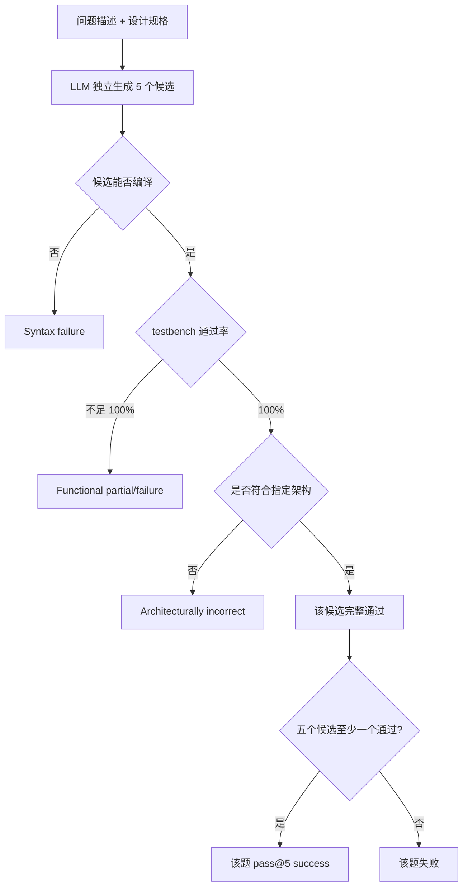

# ArchXBench 论文、代码与本地验证详解

> 论文：**ArchXBench: A Complex Digital Systems Benchmark Suite for LLM Driven RTL Synthesis**  
> 本地 PDF：[`2508.06047_ArchXBench.pdf`](./2508.06047_ArchXBench.pdf)  
> 代码：[`ArchXBench`](./)  
> 本地代码 commit：`f679fdb508bdab4e4150f1017ecb1ce7e416d61d`  
> 本地审计记录：[`runs/audit_20260802.json`](./runs/audit_20260802.json)  
> 核验日期：2026-08-02  
> 口径：论文结果与本地结果严格分开；当前没有重新调用论文中的四种闭源模型。

---

```text
┌─────────────────────────────────────────────────────────────────────────────┐
│ P1 任务定义                                                                   │
├─────────────────────────────────────────────────────────────────────────────┤
│ Input    │ 自然语言 problem-description + design-specs，部分题含 stimuli、  │
│          │ golden output、Python reference model                           │
├──────────┼────────────────────────────────────────────────────────────────┤
│ Output   │ 满足架构规格的 Verilog RTL，能通过 testbench 功能仿真            │
├──────────┼────────────────────────────────────────────────────────────────┤
│ Supervision │ 编译成功、testbench 100% 通过、人工/半自动 architecture check  │
├──────────┼────────────────────────────────────────────────────────────────┤
│ Why-hard │ 复杂数据通路、流水线 latency 对齐、浮点/定点角落、DSP/图像/ML    │
│          │ accelerator；公开仓库缺统一 runner、reference RTL、模型输出   │
│          │ 和可靠的 testbench/comparator 失败传播                        │
└─────────────────────────────────────────────────────────────────────────────┘
```

## 0. 先看结论

ArchXBench 最值得分享的，不是“又一个 VerilogEval”，而是它把 RTL 生成 benchmark 从小型组合逻辑，推进到分层、流水线、定点/浮点、DSP、图像处理和领域加速器。它公开了：

- 20 道辅助 Level 0 简单题；
- 51 道论文主表题，分布于 Level 1–6；
- 合计 71 份自然语言问题描述；
- 71 份接口与架构规格；
- 71 个 Verilog testbench；
- 部分高层任务的输入、golden output、Python comparator 和极少数 reference model。

论文用 Claude Sonnet 4、GPT-4.1、o4-mini-high 和 DeepSeek R1 做 zero-shot、每题五次生成。论文摘要报告 o4-mini-high 在所述 30 道范围内解决 16 道；论文的完整 Table II 则列出 51 道主任务，并把每个单元格写成 `(n,t)`：五次中 `n` 次语法正确，语法正确候选里最好一个通过 `t%` testbench。

本地审计后的核心结论是：

1. **题目分层很有价值。** Level 1–3 已能暴露结构约束、流水线对齐、浮点和迭代算法困难；Level 4–6 则出现明显复杂度悬崖。
2. **当前 GitHub 更像题目素材库，不是可一键运行的 benchmark harness。** 没有 LLM 调用器、统一编译器、结果聚合器、论文生成结果或机器可读论文成绩。
3. **公开仓库没有论文所述的 Level 1–3 reference RTL。** 当前只看到 71 个 testbench、两个 dummy RTL，没有正式参考 RTL，也没有作者的五次模型生成结果。
4. **自动判分不能只看进程返回码。** 71 个 testbench 中只有 2 个使用 `$fatal`；故意全错的 comparator 仍让 `vvp` 返回 0。
5. **多个 Python comparator 有假阳性风险。** 典型代码按 `min(len(ref), len(dut))` 比较，既不强制长度一致，也不在 mismatch 后 `sys.exit(1)`。
6. **仓库自带的空 DUT 输出能被判为 PASS。** `multich_conv2d` 的 golden 有 30,752 项、DUT 有 0 项，当前 comparator 输出 `PASS`、0 mismatch、退出码 0。
7. **论文的“功能通过”和“架构通过”是两层标准，但公开结果表没有单独给架构合规列。** 这使摘要中的 16/30 无法从 Table II 的 `(n,t)` 直接还原。

因此当前本地复现等级为：**R2（validator/core smoke）**。

可以说：

> 已完成论文—仓库逐项核对，并用正确/故意错误 RTL 及截断 JSON 验证了 testbench/comparator 的真实判分语义。

不能说：

> 已复现 ArchXBench 四模型 pass@5 排名。


---

## 1. 论文身份与版本

| 项目 | 核对结果 |
|---|---|
| 标题 | ArchXBench: A Complex Digital Systems Benchmark Suite for LLM Driven RTL Synthesis |
| 作者 | Suresh Purini、Siddhant Garg、Mudit Gaur、Sankalp Bhat、Sohan Mupparapu、Arun Ravindran |
| arXiv | `2508.06047v1`，PDF 页眉日期为 2025-08-08 |
| 会议 | MLCAD 2025 short paper；会议 program 可查到完整作者和题目 |
| 本地 PDF | 12 页 arXiv v1 |
| 代码仓库 | <https://github.com/sureshpurini/ArchXBench> |
| 本地 commit | `f679fdb508bdab4e4150f1017ecb1ce7e416d61d` |
| commit 日期 | 2025-08-08 11:47:29 +05:30 |
| 本地分支 | `main` |
| 许可证 | 当前 checkout 未见 `LICENSE` 文件，不能仅凭公开可访问就假设可任意再分发 |

稳定入口：

- arXiv 摘要：<https://arxiv.org/abs/2508.06047>
- arXiv PDF：<https://arxiv.org/pdf/2508.06047>
- DOI：<https://doi.org/10.1109/MLCAD65511.2025.11189156>
- 代码：<https://github.com/sureshpurini/ArchXBench>

### 1.1 README 引用信息要小心

仓库 README 顶部 BibTeX 写 MLCAD 2025，但仍保留：

```text
pages = {pp. xx--yy}
```

而且 README BibTeX 的作者列表没有 `Sohan Mupparapu`，论文 PDF 和会议 program 则有六位作者。引用时应以正式论文元数据为准，不要原样复制仓库中的占位 BibTeX。

---

## 2. 它到底解决什么问题

### 2.1 既有 RTL benchmark 的现实差距

VerilogEval、RTLLM 等基准对于标准化评价非常重要，但多数任务仍集中在：

- 小型组合逻辑；
- 简单计数器和状态机；
- 单模块算术；
- 数十至数百行以内的局部设计。

现代 SoC 数据通路更常见的难点则是：

- 多模块层次化组合；
- 多周期协议；
- 流水线 latency 对齐；
- 吞吐率约束；
- 定点缩放和溢出；
- IEEE-754 角落情况；
- 行缓存、帧缓存和滑窗；
- 加密、DSP、图像处理和 ML accelerator。

ArchXBench 的目的，就是把评价对象从“能否写一个语法正确的小模块”推向“能否按指定微架构写复杂数据通路”。

### 2.2 EDA 流程位置

```text
自然语言算法意图
       │
       ▼
problem-description.txt
       │
       ├──────────────┐
       ▼              ▼
design-specs.txt   LLM / Agent
       │              │
       └──────┬───────┘
              ▼
        候选 Verilog RTL
              │
        语法编译 / elaboration
              │
              ▼
        testbench 功能仿真
              │
              ▼
      人工检查架构是否合规
```

论文当前 baseline 主要做到规格到 RTL、语法、功能和人工架构检查。它**没有**在公开评价中完成统一综合、STA、面积、功耗或 P&R 排名。

这点很重要：论文动机强调 latency、area、throughput、power trade-off，但 Section IV 明确说 testbench 主要评价功能，性能指标留作未来工作。因此它当前首先是“复杂功能与架构约束 benchmark”，不是完整 PPA benchmark。

---

## 3. 71 道任务是怎样组成的

论文把 Level 1–6 称作六个主层级，Level 1 又拆成 1a、1b、1c；另有不计入主 51 题的辅助 Level 0。

| 层级 | 本地题数 | 论文定位 | 代表任务 |
|---|---:|---|---|
| Level 0 | 20 | 辅助简单题 | mux、decoder、encoder、counter、shift register |
| Level 1a | 6 | 简单组合/多周期算术 | RCA、CLA、barrel shifter、LFSR、GF(2⁸)、AES S-box |
| Level 1b | 5 | 参数化和层次化 | CLA block 组成的 RCA、carry skip/select、参数化乘法器、近似加法器 |
| Level 1c | 7 | 高级算术结构 | Kogge–Stone、Brent–Kung、Booth、Wallace、Dadda、restoring divider |
| Level 2 | 5 | 流水线算术与密码组件 | pipelined RCA/CLA/Wallace/Dadda、AES single round |
| Level 3 | 6 | 浮点与迭代算法 | FP add/mul、Gauss–Seidel、gradient descent、Newton–Raphson |
| Level 4 | 7 | 流水线浮点和 DSP | FP pipeline、FFT/IFFT、FIR |
| Level 5 | 6 | 流式图像/ML 模块 | 1D/2D convolution、unsharp mask、Harris、DCT/IDCT、systolic GEMM |
| Level 6 | 9 | 领域级加速器 | AES core、3D convolution、64-point FFT、FP FIR、quantized matmul |

计数关系：

```text
Level 1–6 主表：6 + 5 + 7 + 5 + 6 + 7 + 6 + 9 = 51
辅助 Level 0：20
仓库任务目录总数：51 + 20 = 71
```


### 3.1 Level 0：基本能力校准

Level 0 的意义不是难，而是提供 sanity check。若模型连 mux、decoder、counter 都无法稳定通过，则讨论高层 accelerator 没有意义。

但简单任务仍可以暴露：

- 接口名是否严格遵守；
- 组合/时序写法是否正确；
- X 值传播；
- reset 极性；
- hierarchy 要求；
- 随机样本稳定性。

### 3.2 Level 1：功能相同不等于架构相同

Level 1c 最能说明 ArchXBench 与普通功能题的差异。

例如 Dadda multiplier 的规格不只是要求：

```text
Y = A * B
```

而是要求：

- 64 个 partial products；
- 特定 Dadda column-height schedule；
- HA/CSA reduction；
- 五级结构化压缩；
- 最终加法。

一个直接写 `assign Y = A * B;` 的候选可能通过功能 testbench，却不满足指定微架构。论文因此增加“架构合规检查”。

### 3.3 Level 2：流水线问题

加入 pipeline 后，正确性不再只是数值相等，还包括：

- 输入在第几拍采样；
- 输出 latency；
- valid 对齐；
- reset 后 pipeline flush；
- back-to-back transaction；
- 每拍吞吐率；
- 不同 stage 的位宽和 carry。

论文也承认当前 testbench 以功能为主，throughput 等性能指标没有系统评价。

### 3.4 Level 3：数学脚手架的作用

论文观察到，带清晰公式的 iterative algorithm 比 Dadda 等依赖专门结构知识的任务更容易。

以 gradient descent 为例，规格直接给出：

```text
f(x)      = a*x^2 + b*x + c
f'(x)     = 2*a*x + b
x_next    = x - alpha*f'(x)
```

模型只需把明确的数学步骤映射为定点硬件；Dadda multiplier 则要求模型知道并正确展开结构化 reduction schedule。

这说明 benchmark 难度同时受两件事影响：

1. 电路本身复杂度；
2. 规格给出的 algorithmic scaffolding 是否充分。

### 3.5 Level 4–6：复杂度悬崖

高层任务开始要求：

- 深流水；
- 多模块；
- 流式协议；
- 缓存和窗口形成；
- 定点/浮点误差容忍；
- 大量输入输出；
- Python golden model 和 JSON 数据交换。

这是当前模型从“局部 RTL 代码生成”迈向“architecture synthesis”时的主要断层。

---

## 4. 每道题模型到底看到什么

### 4.1 基础三件套

每个任务目录都有：

```text
problem-description.txt
design-specs.txt
tb*.v 或 testbench.v
```

论文 baseline 给模型的是前两项：

```text
Prompt = problem-description.txt + design-specs.txt
```

模型不应看到 testbench 和 golden output，否则会产生测试泄漏。

### 4.2 `problem-description.txt`

它通常包含：

- Title；
- Objective；
- Background；
- Design Constraints；
- Performance Expectation；
- Deliverables。

它解决“为什么做、应该是什么架构”的问题。

### 4.3 `design-specs.txt`

它通常包含：

- Design Name；
- Module Name；
- Inputs/Outputs；
- Parameters；
- Design Signature；
- Submodules；
- Internal Structure；
- Design Notes。

它解决“模块必须怎样连接、具体接口是什么”的问题。

### 4.4 高层任务的附加目录

部分 Level 4–6 任务还包含：

```text
inputs/
outputs/
scripts/
ref_model/
```

理想流程是：

```text
Python stimulus generator
          │
          ▼
 inputs/stimuli.json 或 *.mem
          │
          ▼
      Verilog testbench
          │
          ▼
 outputs/dut_output.json
          │
          ├───────────────┐
          ▼               ▼
Python reference       golden_output.json
          │               │
          └───────┬───────┘
                  ▼
          compare_outputs.py
```


注意：Figure 1 描绘的是统一的理想结构；当前 checkout 中，只有少数任务真正同时具备 generator、reference model、Makefile 和 comparator。

---

## 5. 论文的 baseline 评价流程

### 5.1 四种模型

论文评价：

- Claude Sonnet 4；
- GPT-4.1；
- o4-mini-high；
- DeepSeek R1。

### 5.2 Zero-shot、非 Agent

论文明确把这轮实验定位成简单 baseline：

- zero-shot；
- 没有 in-context examples；
- 没有 iterative repair；
- 没有多 Agent；
- 每题独立生成 5 次。

因此结果回答的是：

> 仅靠当前模型一次性读规格并生成 RTL，复杂度能走到哪里？

它不回答：

> 若加入编译反馈、波形 trace、检索、规划和多轮修复，能提高多少？

后者正是 AutoChip、MAGE、VerilogCoder 可与 ArchXBench 结合的研究空间。

### 5.3 三层判定

论文描述的通过逻辑可还原为：



### 5.4 Table II 中 `(n,t)` 的精确定义

论文表格一个单元格不是普通的准确率，而是二元组：

```text
n = 5 次生成中语法正确的数量
t = 语法正确候选中，最好一个通过的 testbench 百分比
```

例如：

```text
(4, 38)
```

表示五次里四份语法正确，但最好的一份也只通过 38% 测试。

```text
(F, F)
```

表示论文记为完全失败。

这和代码生成文献常用的统计估计式 `pass@k` 不是同一个表格字段。论文另外用“至少一个候选完整通过”定义任务级 pass@5。

### 5.5 缺少的复现实验配置

论文和仓库没有给出足够的 API 重跑信息：

- temperature；
- top-p；
- seed；
- max tokens；
- system prompt；
- 输出提取规则；
- 具体 API snapshot/version；
- 编译命令；
- 统一超时；
- 人工架构审核表。

即使今天调用同名模型，也不能保证与 2025 年论文运行的是同一服务版本。

---

## 6. 论文报告了什么结果


### 6.1 Level 0

论文把 Level 0 视为简单题。四个模型总体都能产生功能正确候选，但有少量差异：

- `bitmanip-unit`：GPT-4.1 最好 70%，DeepSeek R1 最好 84%；
- 个别任务并非五次都成功，例如 binary encoder、comparator-8bit；
- “至少一份能过”和“五份都稳定能过”要分开。


### 6.2 Level 1a/1b

简单算术和层次化加法器总体表现较强。

难点包括：

- AES S-box 的 LUT 结构；
- 参数化 shift-and-add multiplier；
- 指定 submodule 和 block size 的层次约束。

### 6.3 Level 1c

复杂算术开始明显分化：

| 任务 | 论文主要观察 |
|---|---|
| Kogge–Stone / Brent–Kung | 多数模型能得到完整功能候选，DeepSeek 在 Brent–Kung 仅部分通过 |
| Booth multiplier | 只有 o4-mini-high 得到 100% testbench 候选 |
| Wallace multiplier | 只有 DeepSeek R1 得到 100% testbench 候选 |
| Dadda multiplier | 四个模型都没有完整功能通过 |
| Restoring divider | GPT-4.1、o4-mini-high 得到完整功能候选 |
| Constant divider | 四个模型都得到完整功能候选 |

### 6.4 Level 2

流水线使 syntax 和功能问题都增多。

论文表中 o4-mini-high 的完整 testbench 候选包括：

- AES single round；
- pipelined RCA；
- pipelined CLA；
- pipelined Wallace tree multiplier。

Pipelined Dadda 仍没有完整通过。

### 6.5 Level 3

浮点加法/乘法普遍只有部分测试通过；带清晰数学公式的 iterative designs 更好。

论文的解释是：模型对于明确算法步骤的推理能力强于对专门硬件结构细节的回忆和展开。

### 6.6 Level 4–6

总体趋势是大面积失败，但 Table II 仍有几个功能层面的例外：

- Sonnet 4 的 pipelined FP adder：最好 100%；
- Sonnet 4 的 pipelined FP multiplier：最好 100%；
- Sonnet 4 的 AES-128 encryption：最好 100%；
- 其他模型在两个 FP pipeline 上可达到较高但不足 100% 的测试比例；
- systolic GEMM 各模型最好约 50%，论文解释与简化输入有关。

### 6.7 结果表与摘要之间的报告歧义

本地从 Table II 逐行统计“最好 testbench 百分比显示为 100”的单元格：

| 模型 | Table II 中 `t=100` 的任务数 |
|---|---:|
| Sonnet 4 | 21 |
| GPT-4.1 | 15 |
| o4-mini-high | 23 |
| DeepSeek R1 | 14 |

但摘要报告 o4-mini-high “16 out of 30”。这两个数字不应直接互换。

最可能的解释是：

1. `t=100` 只表示功能 testbench 完整通过；
2. 最终成功还要求人工确认指定架构；
3. 一些功能正确候选因采用普通乘法器、迭代而非流水线等替代架构被剔除；
4. 摘要的 16 是进一步架构过滤后的任务数。

不过公开 Table II 没有单独提供 architecture-compliance 列，仓库也没有人工审核记录，所以当前无法从公开 artifact 严格重算 16。

还有一处应谨慎转述：摘要写“从 Level 4 起所有模型一致失败”，而 Table II/Section IV.E 同时列出上述 `t=100` 例外。合理口径应是：

> Level 4–6 整体出现显著复杂度悬崖；少数候选能在 testbench 上达到 100%，但是否满足完整架构要求未在结果表中独立展示。

不要简化成“Level 4 之后绝无任何功能通过”。

---

## 7. 当前仓库实际有什么

本地按 commit `f679fdb...` 统计：

| Artifact | 数量 | 说明 |
|---|---:|---|
| 任务目录 | 71 | 20 个 Level 0 + 51 个 Level 1–6 |
| `problem-description.txt` | 71 | 每题一份 |
| `design-specs.txt` | 71 | 每题一份 |
| testbench | 71 | 文件名不完全统一 |
| `compare_outputs.py` | 19 | 只在部分 Level 4–6 任务存在 |
| `ref_model/*.py` | 3 | conv3d、multi-channel conv2d、quantized matmul |
| golden output 文件 | 24 | 包含同任务的多个变体文件 |
| 预存 DUT output 文件 | 2 | AES encryption、multi-channel conv2d |
| Makefile | 2 | conv3d、multi-channel conv2d |
| 正式 reference RTL | 0 | 当前 checkout 未提供 |
| LLM 生成 RTL | 0 | 当前 checkout 未提供论文五次生成结果 |
| dummy RTL | 2 | `conv3d_dummy.v`、`dut_dummy.v` |
| 顶层评价 runner | 0 | 没有统一 compile/run/parse/aggregate 脚本 |
| LICENSE | 0 | 当前 checkout 未见许可证文件 |

### 7.1 这意味着什么

仓库公开程度可概括为：

```text
题目规格：高
testbench：高
统一执行框架：低
参考 RTL：当前 checkout 无
论文生成结果：无
模型/API 脚本：无
结果聚合：无
架构审核证据：无
```

因此它适合：

- 作为 Agent 的任务集；
- 手工选择代表题实验；
- 研究复杂度分层；
- 补建统一 harness。

当前不适合直接做：

```bash
python evaluate.py --model ...
```

因为仓库没有这个入口。

---

## 8. 从一个 Level 1 任务看代码路径

以 `level-1c/dadda_multiplier` 为例。

### 8.1 模型输入

```text
level-1c/dadda_multiplier/problem-description.txt
level-1c/dadda_multiplier/design-specs.txt
```

规格明确了：

- module `dadda_mult`；
- `A[7:0]`、`B[7:0]`；
- `Y[15:0]`；
- HA 和 CSA submodule；
- partial product matrix；
- 五阶段 Dadda reduction。

### 8.2 仿真输入

```text
level-1c/dadda_multiplier/tb.v
```

testbench 使用：

```verilog
expected_result = a_val * b_val;
```

它检查数值乘法结果，但不能检查候选内部是否真的用了 Dadda tree。

### 8.3 必须额外做架构审核

因此完整判定必须拆成：

```text
功能：Y 是否等于 A*B？
架构：是否确实为指定 Dadda reduction？
```

只运行 `tb.v` 最多能回答第一问。

---

## 9. 从一个 Level 6 任务看理想工作流与现实差异

以 `level-6/conv_3d` 为例。

### 9.1 目录中的工作流

```text
scripts/generate_stimuli.py
ref_model/conv3d_ref.py
tb_input.mem
tb_conv3d.v
scripts/compare_outputs.py
Makefile
```

Makefile 定义：

```text
generate stimuli
→ generate golden output
→ compile conv3d.v + tb_conv3d.v
→ vvp
→ compare outputs
```

### 9.2 clean checkout 不能直接 `make all`

Makefile 期待：

```text
conv3d.v
```

仓库实际只有：

```text
conv3d_dummy.v
```

同理，`level-6/multich_conv2d/Makefile` 期待 `dut.v`，仓库实际只有 `dut_dummy.v`。

这不是单纯文件名风格问题：它表示 Makefile 把“待评价候选 RTL”视为外部输入。用户需要先把模型输出按约定命名，才能运行。

README 没有说明这一步，也没有统一脚本自动写入候选。

---

## 10. Testbench 退出码审计

### 10.1 静态统计

71 个 testbench 中：

| 检查项 | 文件数 |
|---|---:|
| 包含 `$fatal` | 2 |
| 不包含 `$fatal` | 69 |
| 包含 `$finish(1)` | 13 |
| 包含 `$finish_and_return` | 0 |
| 包含 `$stop` | 1 |

只有：

```text
level-0/mux2to1/tb.v
level-0/mux4to1/tb.v
```

在失败时使用 `$fatal`。

### 10.2 `$finish(1)` 不是 shell exit code 1

Verilog/SystemVerilog 的 `$finish(1)` 参数通常控制仿真器输出诊断信息，并不等同于 C/Python 的 `exit(1)`。

本地 Icarus 12.0 的受控实验已经验证：

| DUT | testbench 自报 | compile exit | `vvp` exit |
|---|---|---:|---:|
| 正确 4-bit comparator | 5 passed / 0 failed | 0 | 0 |
| 故意全零 comparator | 0 passed / 5 failed | 0 | **0** |
| 正确 mux2to1 | 9 passed / 0 failed | 0 | 0 |
| 故意全零 mux2to1 | 4 passed / 5 failed | 0 | **1** |

对应文件：

- [`comparator_correct.v`](./runs/testbench_exit_semantics/comparator_correct.v)
- [`comparator_wrong.v`](./runs/testbench_exit_semantics/comparator_wrong.v)
- [`mux_correct.v`](./runs/testbench_exit_semantics/mux_correct.v)
- [`mux_wrong.v`](./runs/testbench_exit_semantics/mux_wrong.v)

故意错误 comparator 的关键输出是：

```text
Passed: 0, Failed: 5
$finish(1) called
RESULT comparator_wrong compile=0 run=0
```

故意错误 mux 的关键输出是：

```text
Passed: 4, Failed: 5
FATAL: Tests failed!
RESULT mux_wrong compile=0 run=1
```

### 10.3 正确的统一 harness 应怎样判

不能只写：

```python
passed = subprocess.run(["vvp", sim]).returncode == 0
```

至少要：

1. 优先要求 testbench 使用 `$fatal` 或 `$finish_and_return(nonzero)`；
2. 对历史 testbench 解析其结构化 JSON summary；
3. 无结构化 summary 时解析明确的 fail counter；
4. 遇到 timeout、X/Z、空输出、缺少 summary 一律失败；
5. 保存 stdout、stderr、compile command 和工具版本。

---

## 11. Python comparator 审计

### 11.1 典型实现

多个 comparator 使用类似逻辑：

```python
n = min(len(ref), len(dut))
mismatches = [
    (i, ref[i], dut[i])
    for i in range(n)
    if abs(ref[i] - dut[i]) > 1
]

if mismatches:
    print("[FAIL] ...")
else:
    print("[PASS] ...")
```

这里有两类独立问题。

### 11.2 问题一：打印 FAIL 但退出码仍为 0

以 `level-4/band_pass_fir/scripts/compare_outputs.py` 为例，本地构造三项数据，其中两项错误：

```text
golden = [0, 10, 20]
dut    = [0, 100, 200]
```

脚本输出：

```text
[FAIL] 2/3 mismatches
```

但进程退出码仍为：

```text
0
```

因此 Make、CI 或 Agent 若只看 return code，会把失败当成功。

### 11.3 问题二：截断输出被判 PASS

受控输入：

```text
golden = [0, 10, 20]
dut    = [0]
```

由于 `n = min(3,1) = 1`，脚本只比较第一项，输出：

```text
[PASS] All 1 samples match within ±1 tolerance
```

它没有检查 DUT 少了两项。

证据目录：

- [`mismatch`](./runs/comparator_exit_semantics/mismatch/)
- [`truncated_prefix`](./runs/comparator_exit_semantics/truncated_prefix/)

### 11.4 仓库自带的空输出假阳性

`level-6/multich_conv2d` 当前自带：

```text
golden C length = 30,752
dut C length    = 0
```

原 comparator 使用 `zip(g,d)`，空 DUT 导致循环一次也不执行，于是得到：

```json
{
  "status": "PASS",
  "total": 30752,
  "matches": 0,
  "mismatches": 0,
  "match_percent": 0.0
}
```

并返回 exit 0。

这是一个非常直观的 benchmark evaluator 漏洞：**0/30,752 matched 不能是 PASS。**

### 11.5 仓库自带的 AES 输出并不通过

`level-6/aes_encryption` 自带的 golden 和 DUT 均为 8 项。当前 comparator 结果：

```text
[FAIL] 8/8 mismatches
exit = 1
```

观察输出序列可见部分 DUT 值似乎相对 golden 有流水线错位，但本次不猜测根因；能确定的是它不是当前脚本下的通过 artifact。

### 11.6 路径不一致

还发现：

- `unsharp_mask/scripts/compare_outputs.py` 读取 `outputs/ref_output.json`，仓库实际提供 `outputs/golden_output.json`；
- `dct_idct_8pt_pipelined/scripts/compare_outputs.py` 读取 `golden_output.json`，仓库实际提供 `golden_dct.json` 和 `golden_idct.json`；
- 多数任务没有预存 `dut_output.json`，这是正常的候选输入缺失，但 README 没有统一生成说明。

### 11.7 统一 comparator 的最低要求

```python
assert len(dut) == len(ref)
assert len(dut) > 0

if any_invalid_or_mismatch:
    sys.exit(1)
else:
    sys.exit(0)
```

还应记录：

- absolute/relative tolerance；
- NaN/Inf 规则；
- 定点截断和饱和；
- latency 对齐；
- valid sample 数；
- 预期输出总数；
- 首个 mismatch；
- 总 mismatch；
- 最大误差和 RMSE。

---

## 12. 功能检查无法替代架构检查

ArchXBench 的核心创新之一是要求指定结构，但当前代码没有自动 architecture checker。

### 12.1 一个典型绕过

Dadda 题要求 Dadda tree，候选却写：

```verilog
assign Y = A * B;
```

功能 testbench 很可能全部通过。

类似绕过还包括：

- 规定 Kogge–Stone，实际写行为加法；
- 规定 Wallace/Dadda reduction，实际用 `*`；
- 规定 pipeline，实际组合计算后延迟 valid；
- 规定 hierarchy，实际单模块；
- 规定 one-output-per-cycle，实际串行多周期；
- 规定 LUT S-box，实际动态有限域计算；
- 规定 approximate adder，实际精确加法。

### 12.2 自动化架构检查可以怎样做

可以组合：

1. AST pattern：禁止/要求运算符、always 类型、generate、submodule；
2. elaborated hierarchy：检查实例类型和数量；
3. Yosys netlist：检查乘法单元、加法树、pipeline register；
4. latency/throughput assertion：连续送入 transaction；
5. formal property：检查协议和时序关系；
6. synthesis report：检查组合路径、寄存器数和资源；
7. 人工审核：对无法可靠编码的结构语义做最终确认。

当前论文说“我们检查了架构”，但仓库没有逐候选审核表，故外部研究者无法完全复核这一层。

---

## 13. 论文、README 与当前代码的差异

| 项目 | 论文/README 表述 | 当前 checkout | 影响 |
|---|---|---|---|
| 题目数 | 主 benchmark 51，另有 Level 0 | 71 个目录，数量吻合 | 需明确 51 与 71 的口径 |
| 基础三件套 | 每题 description/spec/testbench | 71/71/71 | 这一部分完整 |
| Level 1–3 reference RTL | 论文称提供 | 未见正式 reference RTL | 无法复核 Table II LoC 或用参考 RTL验证 testbench |
| Level 5–6 Python reference | 论文第 1 页概括为 Levels 5–6 提供 | 仅 3 个 `ref_model/*.py` | 多数任务只有预生成 golden，不可重生全部参考输出 |
| LLM 五次生成 | 论文做过 | 未公开生成 RTL | 无法 artifact-level 重算论文成绩 |
| 统一评价 | 论文呈现完整表格 | 无顶层 runner/aggregator | 需自行开发 harness |
| 架构检查 | 论文说人工/额外检查 | 无审核记录或 checker | 16/30 等最终成功数不可独立重构 |
| Makefile | 理想上可编排流程 | 只有 2 个，且候选源文件名缺失 | clean checkout 不能直接全跑 |
| testbench fail | 论文以功能正确率计 | 大量 testbench 不返回非零 | 自动化易误判 |
| comparator 长度 | 应完整比对 | 多数取最短前缀 | 截断/空输出可假通过 |
| README task 描述 | 提及 SRT、Montgomery、Needleman–Wunsch、IIR、ECC 等 | 当前任务表未实际包含其中多项 | 描述性例子不能当作已开放任务 |
| BibTeX | 会议引用 | 页码占位且少一位作者 | 不能直接复制引用 |
| License | 公开 GitHub | 无 LICENSE | 法律意义的开放许可不明确 |

### 13.1 关于“几十到上万行 RTL”

论文引言说设计规模可从几百行到数万行，但 Table II 展示的 reference LoC 最大仅数百行，带 `*` 的高层项还是 Python reference LoC；当前仓库又没有这些 reference RTL。

因此更稳妥的解释是：高层任务的**目标系统复杂度和潜在多模块实现规模**很大，不应把 Table II 的 Python LoC 当成 RTL 规模，也不能从当前仓库文件直接验证“数万行 reference RTL”。

---

## 14. 本地运行过程

### 14.1 环境

```text
Icarus Verilog 12.0 stable
Python 3
Matplotlib Agg backend（只用于无界面 comparator smoke）
```

### 14.2 正确 comparator RTL

```bash
iverilog -g2012 \
  -o comparator_correct.vvp \
  comparator_correct.v \
  ../../level-0/comparator-4bit/tb.v
vvp comparator_correct.vvp
```

结果：5/5，通过，exit 0。

### 14.3 故意错误 comparator RTL

命令只把 DUT 换成 `comparator_wrong.v`。

结果：0/5，testbench 明确打印失败，但 exit 0。

### 14.4 `$fatal` 对照组

对 mux2to1 重复同样实验：

- 正确实现：9/9，exit 0；
- 故意错误实现：4/9，`$fatal`，exit 1。

### 14.5 Python comparator

```bash
MPLBACKEND=Agg \
python3 ../../../level-4/band_pass_fir/scripts/compare_outputs.py
```

两组受控结果：

| fixture | 脚本输出 | exit |
|---|---|---:|
| 2/3 mismatch | FAIL 2/3 | 0 |
| 仅一项正确前缀 | PASS 1 sample | 0 |

### 14.6 证据文件

全部结构化结果见：

[`runs/audit_20260802.json`](./runs/audit_20260802.json)

该 JSON 明确区分：

- inventory audit；
- controlled Verilog runs；
- controlled Python comparator runs；
- bundled output checks；
- Makefile source audit；
- completed/not-completed boundary。

---

## 15. 复现等级与阻塞原因

### 15.1 已完成

- 原论文 PDF 与正式身份核对；
- commit 固定；
- 71 个任务目录和 artifact 数量核对；
- 论文 51 题与辅助 Level 0 的口径核对；
- testbench failure signaling 静态审计；
- 两道 Level 0 正确/错误 DUT 的编译与仿真；
- Python comparator mismatch/截断实验；
- 两个仓库预存 DUT output 的实际复核；
- 论文结果表和摘要口径差异分析；
- 论文原图截图归档。

### 15.2 尚未完成

- 四种论文模型每题五次生成；
- 51 题或 71 题统一编译仿真；
- 论文 API 版本和 sampling 参数复原；
- 作者生成结果 artifact 验证；
- 人工 architecture-compliance 重审；
- 综合、STA、面积、吞吐、功耗评价；
- 完整 Python reference/golden 再生成。

### 15.3 主要阻塞

1. 论文闭源模型/API snapshot 不可固定；
2. sampling 配置不完整；
3. 论文五次生成输出未公开；
4. reference RTL 当前 checkout 缺失；
5. 统一 evaluator/aggregator 缺失；
6. architecture reviewer 记录缺失；
7. 部分 comparator 和文件路径需要修复后才能安全批跑；
8. 无许可证文件，二次发布修改版需谨慎。

### 15.4 等级判定

当前：**R2 — validator/core smoke**。

若完成以下工作可升 R3：

- 实现统一、安全的 71 题 runner；
- 对一组固定模型输出全量编译、仿真和严格长度检查；
- 保存逐题结果、日志和失败类别；
- 至少对主 51 题完成人工或半自动架构审核。

只有在相同或可追溯模型配置下重新生成五候选，并重构论文主表，才接近 R4。

---

## 16. 与其他 benchmark 的关系

| Benchmark | 主要强项 | 与 ArchXBench 的差异 |
|---|---|---|
| VerilogEval | 标准化、人类/机器描述、成熟 Pass@k | 多数任务更小；ArchXBench 更强调指定微架构和复杂数据通路 |
| RTLLM | 语法、功能、设计质量；50 个设计 | ArchXBench 按 architecture complexity 分层更明确 |
| GenBen | generative design benchmark、执行与多目标评价 | ArchXBench 更像复杂题库，当前统一执行器较弱 |
| RealBench | 真实工程式规格和污染控制 | ArchXBench 的任务分级和 accelerator 覆盖更突出 |
| CVDP | 复杂数字设计问题、提示/推理 | ArchXBench 提供更多 Verilog testbench 和高层 golden 数据 |
| ResBench | FPGA 资源感知 | ArchXBench 当前不系统报告资源/PPA |

### 16.1 与 AutoChip/MAGE/VerilogCoder 的最佳组合

ArchXBench 自己只做 zero-shot baseline。更有研究价值的是把已有 Agent 放到它上面：

```text
ArchXBench 复杂规格
       │
       ├─ AutoChip：编译/仿真 feedback search
       ├─ MAGE：生成、review、testbench/repair 多 Agent
       └─ VerilogCoder：plan + task graph + AST-waveform debug
```

评价时必须固定：

- 每题总 token；
- LLM 调用次数；
- testbench 调用次数；
- wall-clock；
- 候选数；
- 是否看到了 testbench；
- 是否人工干预；
- architecture check 标准。

否则 Agent 的提升可能只是因为测试时计算预算更高。

---

## 17. 最值得做的后续实验

### 17.1 实验 A：先修 evaluator，不调用任何 LLM

目标：让 benchmark 本身可置信。

步骤：

1. 为 71 题建立 manifest；
2. 记录 module name、source name、language standard；
3. 统一 compile timeout；
4. 统一 simulation timeout；
5. testbench failure 必须非零；
6. comparator 强制非空和等长；
7. 输出逐题 JSON；
8. 对 comparator 做故意错误/截断/空输出单元测试。

这是最高优先级，因为 evaluator 不可靠时，任何模型排名都不可靠。

### 17.2 实验 B：Level 1c 架构约束对照

选择：

- Booth；
- Wallace；
- Dadda；
- Kogge–Stone；
- Brent–Kung。

对每题生成两类 prompt：

```text
P0：只给原规格
P1：额外给算法步骤、结构示意和禁止行为运算符规则
```

分别统计：

- compile pass；
- functional pass；
- architecture pass；
- token/cost；
- repair rounds。

这能直接验证论文提出的“数学脚手架是否弥补专门架构知识缺口”。

### 17.3 实验 C：zero-shot vs Agent

在每层选两题，固定相同总 token 预算：

- one-shot；
- self-reflection；
- AutoChip feedback；
- MAGE；
- VerilogCoder。

关键不是只看最终通过率，还要画：

```text
功能成功率 vs LLM tokens
功能成功率 vs 仿真次数
架构成功率 vs wall-clock
```

### 17.4 实验 D：流水线性质检查

为 Level 2、4、6 增加 assertion：

- 固定 latency；
- 连续 valid 输入；
- steady-state one-output-per-cycle；
- reset/flush；
- no dropped transaction；
- no reordering。

这样才能避免“数值偶尔正确，但不满足 pipeline architecture”的候选。

### 17.5 实验 E：PPA 扩展

对功能和架构通过的候选再进入：

```text
Yosys → OpenROAD → area / timing / power proxy
```

但必须固定：

- technology library；
- clock constraint；
- synthesis recipe；
- flatten/hierarchy 选项；
- optimization effort；
- timeout；
- failed synthesis 计分规则。

---

## 18. 组会怎么讲

### 18.1 15 分钟建议结构

| 时间 | 内容 |
|---:|---|
| 2 min | 为什么 VerilogEval 小题不足以代表 SoC datapath |
| 3 min | 20 + 51 题分层，重点讲 Level 1c、2、4–6 |
| 3 min | zero-shot pass@5 和 `(n,t)` 到底是什么 |
| 2 min | Table II 的复杂度悬崖与少数例外 |
| 3 min | 本地代码审计：退出码、截断输出、空输出假 PASS |
| 2 min | 如何与 AutoChip/MAGE/VerilogCoder 组合成下一步实验 |

### 18.2 三个最重要结论

1. **LLM 的 RTL 能力在复杂架构处出现断崖，不是语法小错可以完全解释。**
2. **功能等价不等于满足指定微架构。**
3. **benchmark evaluator 本身必须被验证；空输出也能 PASS 时，模型排名没有意义。**

### 18.3 两个最容易讲错的点

错误一：

> ArchXBench 只有 51 题。

更准确：

> 论文主表 Level 1–6 有 51 题，另有 20 道辅助 Level 0，当前仓库合计 71 个任务目录。

错误二：

> Table II 里绿色 100 就是最终 pass@5。

更准确：

> 绿色 100 表示该模型五个候选中最好候选的 testbench 通过率为 100%；最终完整通过还要满足架构要求。

### 18.4 一页总结话术

> ArchXBench 的贡献是把 RTL benchmark 从小模块推进到复杂数据通路，并把任务按微架构复杂度分层。论文 zero-shot 结果显示从结构化乘法器、流水线到高层 accelerator 出现明显能力悬崖。代码层面，当前仓库完整开放了 71 套规格和 testbench，但不是一键式 evaluator：参考 RTL、模型输出、统一 runner 和架构审核记录缺失，而且多个 testbench/comparator 的失败不会可靠传播。本地已用故意错误和空输出证明这些边界，因此下一步应先修 benchmark harness，再公平比较 AutoChip、MAGE 和 VerilogCoder。

---

## 19. 常见问题

### Q1：它是模型论文吗？

不是。它是 benchmark 论文，用四个闭源/外部模型建立 baseline，没有训练一个新的 ArchXBench 模型。

### Q2：为什么论文说六级，目录却有 Level 0–6？

六个主层级是 Level 1–6；Level 0 是辅助简单题。Level 1 还拆成 1a、1b、1c。

### Q3：能不能只跑 `iverilog` 看 return code？

不能。多数 testbench 失败时仍可能返回 0，必须解析 summary 或修 testbench。

### Q4：功能 testbench 全通过就算成功吗？

论文口径还要求 architecture compliance。Dadda 题用 `A*B` 虽可能功能正确，仍可能被判架构不合格。

### Q5：为什么高层任务要 Python comparator？

FFT、FIR、卷积等输出很多，且可能有定点容差。testbench 负责导出 DUT 输出，Python 负责与 golden 批量比较和可视化。

### Q6：当前能否一键重跑论文四模型结果？

不能。缺 LLM runner、完整 sampling 参数、生成结果、统一 evaluator 和架构审核记录。

### Q7：自带 DUT output 能作为官方成功结果吗？

不能。AES 当前是 8/8 mismatch；multi-channel conv2d 当前 DUT 是空数组，却被 comparator 假判 PASS。

### Q8：为什么复现等级不是 R3？

当前只跑了代表性 validator smoke 和 artifact audit，没有全量固定输出，也没有重跑模型生成。

---

## 20. 本地文件导航

### 20.1 核心材料

- [论文 PDF](./2508.06047_ArchXBench.pdf)
- [仓库 README](./README.md)
- [本地审计记录](./runs/audit_20260802.json)
- [原有短梳理](./模型梳理.md)

### 20.2 代表任务

- [Dadda problem](./level-1c/dadda_multiplier/problem-description.txt)
- [Dadda specs](./level-1c/dadda_multiplier/design-specs.txt)
- [Dadda testbench](./level-1c/dadda_multiplier/tb.v)
- [3D convolution Makefile](./level-6/conv_3d/Makefile)
- [3D convolution comparator](./level-6/conv_3d/scripts/compare_outputs.py)
- [Multi-channel Conv2D comparator](./level-6/multich_conv2d/scripts/compare_outputs.py)

### 20.3 本地受控实验

- [Testbench exit semantics](./runs/testbench_exit_semantics/)
- [Comparator mismatch fixture](./runs/comparator_exit_semantics/mismatch/)
- [Comparator truncated-prefix fixture](./runs/comparator_exit_semantics/truncated_prefix/)

### 20.4 论文截图

- [标题与摘要](./figures/paper-title-abstract.png)
- [Table I：层级](./figures/paper-table1-benchmark-levels.png)
- [Figure 1：目录结构](./figures/paper-fig1-directory-structure.png)
- [Table II：主结果](./figures/paper-table2-main-results.png)
- [Table III：Level 0](./figures/paper-table3-level0-results.png)

`figures/source-pages/` 保存相应论文整页渲染，便于核对裁剪上下文。

---

## 21. 最终专业判断

ArchXBench **值得下一轮组会分享**，而且建议放在 AutoChip 或 VerilogCoder 之后讲：前者提供工具反馈 Agent，后者提供规划和 AST-waveform debug，ArchXBench 则提供能真正拉开复杂度差距的任务场。

它当前的最大价值是：

- 任务设计覆盖真实数据通路难点；
- 规格明确区分功能与架构；
- 复杂度分层便于做 curriculum 和 failure analysis；
- 高层任务给出部分 golden data 与 comparator；
- 论文结果清楚显示一次性生成的能力边界。

它当前的最大不足是：

- 公开 artifact 不足以重建论文生成实验；
- evaluator 没有统一入口；
- failure signaling 不一致；
- 多个 comparator 不检查长度或不返回失败；
- 架构合规仍主要依赖未公开记录的人工检查；
- PPA/throughput 目标尚未进入系统评价。

最合理的研究动作不是直接引用论文的模型排名，而是：

> 先把 71 题修成可审计的统一 harness，再把 AutoChip、MAGE、VerilogCoder 或自己的 Agent 放上去，在固定 token、工具调用和时间预算下，分别报告 syntax、function、architecture 和 PPA 四级结果。

---

## P7 组件一句话角色

| 组件 | 一句话角色 |
|---|---|
| 71 个 task directories | 分层覆盖从 mux 到 3D convolution 的复杂度梯度，作为 LLM RTL 生成的任务场 |
| problem-description.txt | 描述设计背景、约束与性能期望的高层意图，用于激活模型对微架构的理解 |
| design-specs.txt | 规定模块名、端口、参数、子模块连接与内部结构的精确规格 |
| testbench | 用定向/随机向量判定候选 RTL 是否功能正确 |
| Python comparator | 对高层任务批量比较 golden 与 DUT 输出，并支持定点容差和可视化 |
| architecture checker | 在功能正确之外验证候选是否真正采用指定微架构（论文中主要依赖人工/额外检查） |

---

## 讨论问题

1. ArchXBench 为什么要区分“功能正确”和“架构合规”两层标准，而不是只看 testbench 是否通过？
2. 当前仓库多个 testbench 失败不返回非零退出码、comparator 截断输出可判 PASS，这些问题对模型排名可信度有什么影响？
3. 若把 AutoChip、MAGE、VerilogCoder 放到 ArchXBench 上统一比较，应该固定哪些实验预算（token、工具调用、wall-clock、repair round）才能避免不公平优势？

