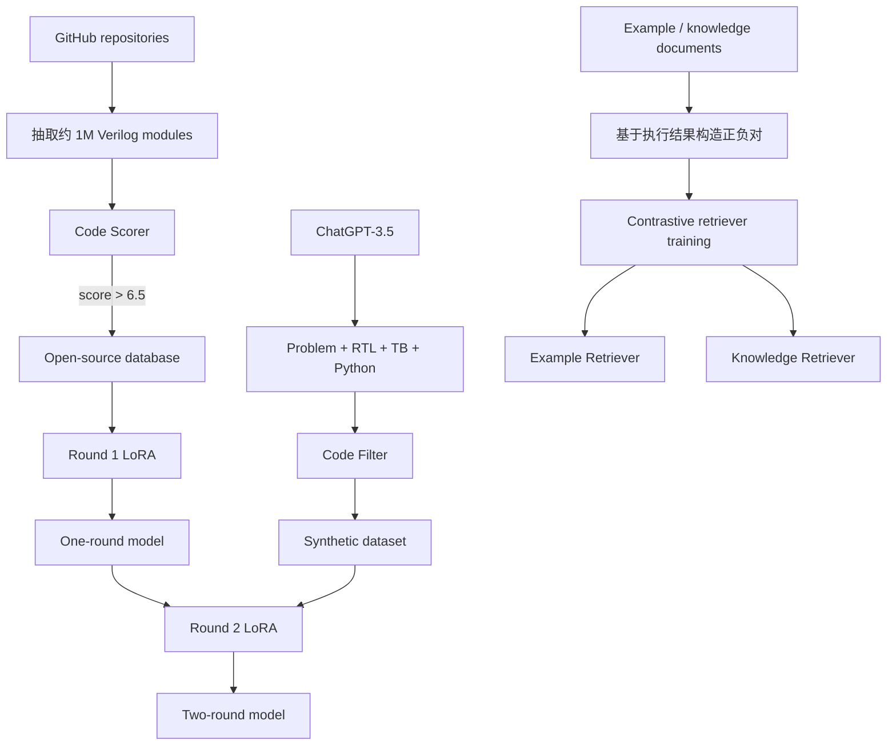
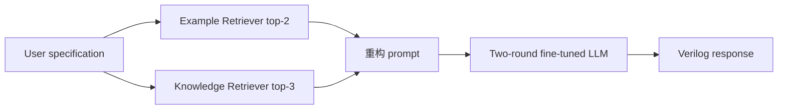

# AutoVCoder 论文与开源代码详解

> 论文：**AutoVCoder: A Systematic Framework for Automated Verilog Code Generation using LLMs**  
> 会议：IEEE International Conference on Computer Design（ICCD 2024）  
> arXiv：<https://arxiv.org/abs/2407.18333>  
> PDF 直链：<https://arxiv.org/pdf/2407.18333>  
> 官方代码：<https://github.com/sjtu-zhao-lab/AutoVCoder>  
> 本地论文：[2407.18333_AutoVCoder.pdf](2407.18333_AutoVCoder.pdf)  
> 本地代码版本：`7cbf320d68e6ea9f31bfd43829c2b6e89cb817b0`，提交时间 `2024-12-17T14:34:13+08:00`  
> 许可证：MIT  
> 核对日期：2026-08-02  
> 静态审计记录：[runs/static_audit_20260802.json](runs/static_audit_20260802.json)  
> 当前复现等级：**R1——论文、代码片段、两轮数据和 benchmark 可审阅，但权重、完整数据构造、RAG 推理和论文评价配置没有形成可直接运行的闭环**

```text
┌─────────────────────────────────────────────────────────────────────────┐
│ P1 任务定义                                                              │
├─────────────────────────────────────────────────────────────────────────┤
│ Input:  自然语言硬件规格 + 可选 example/knowledge 检索片段 + 7B 代码模型  │
│         （CodeLlama / DeepSeek-Coder / CodeQwen）                         │
│ Output: 完整 Verilog RTL、抽取的 module、Icarus 语法/功能评测结果         │
│         （pass@1 / pass@5）                                              │
│ Supervision: 第一轮用约 168k 真实 GitHub Verilog 做继续预训练（无标签    │
│              next-token）；第二轮用 22k 合成 problem-code 对做指令微调；   │
│              RAG 用执行结果构造 InfoNCE 对比正负样本                        │
│ Why-hard: 真实代码质量参差不齐需 scorer 过滤；合成数据可能规格-代码共错；│
│           RAG 需要 200k 对比对和可靠索引；训练权重未公开；测试脚本与论文   │
│           采样配置（n=10/temperature=0.8/top-p=0.95）不一致                 │
└─────────────────────────────────────────────────────────────────────────┘
```

---

## 0. 阅读约定：不要把论文方法、仓库代码和本地推理混在一起

本文使用四类标签：

| 标签 | 含义 |
|---|---|
| **[论文]** | 论文正文、图、表明确报告的内容 |
| **[代码]** | 当前本地 commit 中实际存在的实现与默认参数 |
| **[数据]** | 当前目录中实际存在的数据文件及静态统计 |
| **[判断]** | 由论文—代码—数据交叉核对后得到的结论 |

本文没有重新进行大模型推理或训练。

原因不是“没有分析模型”，而是当前任务是读清论文与开源代码；更重要的是，仓库没有发布论文使用的 AutoVCoder LoRA 权重与 retriever checkpoint，强行换一个基座模型运行不能代表 AutoVCoder。

本次完成的是：

```text
原论文 9 页逐节核对
    +
GitHub 数据发现、两轮训练、RAG、测试代码逐文件核对
    +
两个压缩训练集和四个 RAG 数据文件静态统计
    +
VerilogEval / RTLLM 评价入口与 pass@k 口径审计
    +
论文 Figure 2/4/5/6 和 Table I/II/III 图像归档
```

没有完成的是：

```text
重新调用 ChatGPT-3.5 或 gpt-4o-mini 生成训练集
重新训练三个 7B 基座的两轮 LoRA
重新训练 example/knowledge retriever
重新生成论文每题 10 个候选
重新计算论文 Table I/II/III
```

最关键的证据边界是：

```text
仓库中有 fine_tune_dataset.tar.gz
≠ 数据生成与过滤代码完整
≠ 发布数据能被当前训练脚本直接读取
≠ 作者训练权重已经公开
≠ 论文 pass@5 已经本地复现
```

---

## 1. 一页结论

### 1.1 论文到底做了什么

AutoVCoder 不是一个新 Transformer backbone，而是一个围绕 7B 代码模型搭建的三段式 RTL 生成框架：

1. 从 GitHub 收集约百万级 Verilog module，用轻量 code scorer 过滤低质量代码；
2. 先用真实开源 RTL 做领域继续训练，再用 ChatGPT-3.5 合成且经验证的“规格—RTL”数据做第二轮训练；
3. 训练 example retriever 与 knowledge retriever，在推理时分别找相似 RTL 例子和硬件知识，再拼入 prompt。

其论文叙事可以压缩为：

```text
真实代码解决“广度和 Verilog 分布”
合成问答解决“规格到代码的任务对齐”
RAG 解决“当前问题所需例子与知识”
```


### 1.2 最值得组会分享的三个点

第一，AutoVCoder 把“训练数据多样性”和“功能正确性”拆成两轮处理，而不是期待一个小规模 synthetic dataset 同时解决所有问题。

第二，它把 RAG 分成两种不同信息源：

- example retriever 回答“类似模块怎样实现”；
- knowledge retriever 回答“这个硬件概念和设计原则是什么”。

第三，也是开源审计最值得讲的一点：论文框架非常完整，但当前仓库公开的是若干组件和数据快照，不是端到端 artifact。尤其是：

- code scorer 的训练/推理代码和权重未公开；
- code filter 的核心验证流程未公开；
- 第二轮训练脚本与已发布第二轮数据字段不兼容；
- RAG 训练输入和 RAG 推理入口缺失；
- AutoVCoder LoRA/retriever 权重未公开；
- 测试脚本没有实现论文的随机采样与 `n=10, pass@5`。

### 1.3 当前能否称为“可复现”

不能称为论文实验可复现。

更准确的说法是：

> 当前仓库可用于理解 GitHub 仓库发现、LoRA 配置、synthetic prompt、BGE-M3 风格 retriever 和 VerilogEval/RTLLM 评价器；发布了两轮数据快照和两个检索文档库，但关键构造代码、权重、端到端 RAG 和论文采样配置不完整，因此当前为 R1。

---

## 2. 论文身份与版本


| 项目 | 内容 |
|---|---|
| 标题 | AutoVCoder: A Systematic Framework for Automated Verilog Code Generation using LLMs |
| 作者 | Mingzhe Gao、Jieru Zhao、Zhe Lin、Wenchao Ding、Xiaofeng Hou、Yu Feng、Chao Li、Minyi Guo |
| 机构 | 上海交通大学、中山大学、复旦大学 |
| 会议 | ICCD 2024 |
| 本地 PDF | arXiv `2407.18333v1` |
| arXiv 日期 | 2024-07-21 |
| 页数 | 9 |
| PDF SHA-256 | `fea8f9ede6cb2d10b2bb10dd13c60fdcb53aef53665cc423c9175895360de5a3` |
| GitHub commit | `7cbf320d68e6ea9f31bfd43829c2b6e89cb817b0` |
| commit 日期 | 2024-12-17 |
| 代码许可证 | MIT |

### 2.1 论文版本边界

本地 PDF 是 arXiv v1；仓库 README 声明论文发表于 ICCD 2024。

本文所有表格数字均按本地 v1 PDF 记录。若后续取得 IEEE camera-ready 版本，应重新核对：

- 数据规模；
- 超参数；
- Table I/II/III 数值；
- ChatGPT-3.5 与当前代码 `gpt-4o-mini` 的关系；
- 是否增加 artifact 或权重地址。

---

## 3. AutoVCoder 在芯片设计流程中的位置

AutoVCoder 位于数字前端的“自然语言规格到 RTL”环节。


论文和仓库主要覆盖 A 到 F。

它不直接完成：

- 形式等价验证；
- 逻辑综合优化；
- 时序收敛；
- floorplan、placement、routing；
- 功耗签核；
- PDK/标准单元映射。

因此论文中的“high-quality output”主要指代码生成的语法和给定 testbench 下的功能正确性，不等价于面积、频率和功耗已经优化。

---

## 4. 论文要解决的核心矛盾

### 4.1 真实 GitHub RTL：多样，但质量不稳定

大规模 GitHub 代码可以让模型见到真实工程写法、模块组织和 Verilog 习惯，但存在：

- 不完整 module；
- testbench、综合网表和 RTL 混杂；
- 重复代码；
- 生成代码和模板代码；
- 过时或不可综合语法；
- 许可证差异；
- 注释、格式和命名质量不一。

论文用 code scorer 自动筛选高教育价值样本。

### 4.2 Synthetic RTL：任务对齐强，但覆盖和正确性不足

ChatGPT 生成“问题—代码”对，天然适合 instruction tuning，但可能：

- 语法错误；
- testbench 与设计共同犯错；
- Python reference 与硬件时序语义不一致；
- 把模拟器通过误当成可综合；
- 只覆盖容易描述的短模块。

论文因此引入 code filter。

### 4.3 通用模型知识广，但硬件检索不够精准

一个问题可能需要两类上下文：

```text
“给我一个相似 FSM 的实现”       → example
“Booth multiplier 原理是什么”   → knowledge
```

论文把这两类信息分开建库和训练 retriever。

---

## 5. 总体方法流程

### 5.1 训练阶段



### 5.2 推理阶段



### 5.3 三块创新之间不是并列堆叠

它们各自解决不同误差来源：

| 组件 | 主要解决 | 不能单独解决 |
|---|---|---|
| 第一轮真实 RTL | Verilog 分布、写法多样性 | 规格—代码对齐与功能标签 |
| 第二轮 synthetic QA | 指令对齐、问题到 RTL 映射 | 长尾知识和运行时上下文 |
| Example RAG | 相似结构示范 | 概念解释和原则 |
| Knowledge RAG | 术语、规则和设计知识 | 给出完整可复用实现 |
| Icarus/testbench | 给定向量下功能检查 | 完整形式正确性和 PPA |

---

## 6. 第一部分：高质量开源硬件数据集

### 6.1 论文流程

**[论文]** 作者搜索最多约 20,000 个 GitHub repository，从中提取约 1,000,000 个 RTL module。

随后随机选择约 15,000 个 module，使用 ChatGPT-3.5 依据以下维度打分：

- readability；
- modular design；
- efficiency；
- scalability；
- robustness。

用这些分数训练一个轻量 code scorer，再给剩余约百万样本打分。

作者选择 `score > 6.5`，论文报告约 21.7% 样本被保留。

### 6.2 Code scorer 的模型结构


论文 Figure 4 表示：

```text
Verilog code
    → frozen sentence transformer
    → pooling
    → normalization
    → trainable MLP
    → scalar score
```

只有 MLP 可训练，Transformer、pooling 和 normalize 部分冻结。

这个选择的用意是降低百万规模打分成本：ChatGPT 只标 15k，轻量模型外推到其余样本。

### 6.3 代码真实开放到哪一步

**[代码]** [find_repos.py](src/first_round/build_dataset/find_repos.py) 实现了 GitHub repository 搜索：

```text
language = Verilog / SystemVerilog / VHDL / all
created  = 2010-01-01 .. 2023-01-01
stars    >= 1
```

GitHub Search API 单次最多返回约 1000 条，因此代码在 `totalCount == 1000` 时按日期区间递归二分。

**[代码]** [clone_repos.py](src/first_round/build_dataset/clone_repos.py) 使用 4 个线程执行 `git clone`。

但仓库没有公开：

- 从 repository 遍历 `.v` 文件的脚本；
- 从文件稳健切分 `module ... endmodule` 的脚本；
- 15k ChatGPT 标注生成脚本；
- sentence-transformer + MLP scorer 实现；
- scorer checkpoint；
- 用 scorer 批量打分和按 6.5 过滤的脚本；
- 去重、许可证过滤和 benchmark 污染检查。

所以当前开源链实际是：

```text
repository 搜索/克隆       已开放
module 抽取                未开放
15k ChatGPT 打分           未开放
code scorer 训练           未开放
百万 module 推理打分       未开放
最终 tar 数据快照          已开放
```

### 6.4 当前 repository CSV 的实际规模

**[数据]** [Verilog_2010-01-01_2023-01-01.csv](src/first_round/build_dataset/Verilog_2010-01-01_2023-01-01.csv) 静态统计为：

| 项目 | 当前文件 |
|---|---:|
| 行数 | 17,282 |
| 唯一 `full_name` | 16,846 |
| 最低 star | 1 |
| 记录字段 | id、clone_url、created_at、description、full_name、language、name、size、stars、updated_at、forks |

论文“最多 20k repo”与当前 17,282 行并不冲突，但当前文件本身不能证明最终约 1M module 如何产生。

### 6.5 第一轮压缩数据的实际规模

**[数据]** [fine_tune_dataset.tar.gz](data/first_round/dataset/fine_tune_dataset.tar.gz) 内只有一个 `fine_tune_dataset.jsonl`：

| 项目 | 数值 |
|---|---:|
| 样本行 | 168,906 |
| JSON 错行 | 0 |
| 字段 | `code`, `score` |
| 完全相同 code 的唯一数 | 131,560 |
| 完全重复行数 | 37,346 |
| 单一 code 最大重复次数 | 989 |
| code 字符长度中位数 | 410 |
| code 字符长度最大值 | 6,688 |
| score 最小值 | 6.5000035 |
| score 最大值 | 11.5034449 |
| score > 10 | 68 |

这里有两个重要发现。

第一，最小 score 略大于 6.5，与论文过滤阈值一致。

第二，论文给 ChatGPT 的评分范围是 0 到 10，但发布数据有 68 个分数超过 10，最大 11.5034。这说明轻量 MLP 输出没有被限制到 `[0,10]`；这个现象不一定影响 `>6.5` 过滤，却说明“预测分数”不能直接解释成严格的人类十分制。

第三，约 22.1% 行是完全重复代码：

```text
37,346 / 168,906 ≈ 22.1%
```

如果训练时不按 repository 或 exact code 去重，高频模板会被重复加权。

### 6.6 数据治理上仍缺什么

组会时应明确指出，代码质量分数和模型训练价值不是同一个量。

仍需检查：

- 同一 module 的不同 fork；
- vendor IP 或自动生成代码；
- 仿真 testbench 是否混入训练；
- 门级网表是否被当作 RTL；
- GPL/专有许可证传播风险；
- VerilogEval/HDLBits/RTLLM 相似题泄漏；
- module 级随机 split 是否让同一 repository 跨集合。

---

## 7. 第二部分：Synthetic dataset 与 code filter

### 7.1 论文的 synthetic prompt


**[论文]** prompt 用三个变量增加题目多样性：

```text
$level         = easy / normal / hard
$circuit type  = combinational / sequential
$problem type  = 从硬件问题类型表中选择
```

要求 ChatGPT-3.5 同时给出：

1. Verilog problem；
2. Verilog solution；
3. testbench；
4. 等价 Python code。

### 7.2 为什么组合逻辑与时序逻辑分开验证


**[论文]** 所有样本先经过 Icarus 语法检查。

之后分两类：

```text
Sequential:
    使用 ChatGPT 生成的 testbench 验证

Combinational:
    Python reference 生成随机输入和标准输出
    → 重构 Verilog testbench
    → 仿真比对
```

论文给出的理由是：LLM 对时序序列描述较强，而数值计算容易出错，因此组合逻辑用 Python 辅助生成 expected output。

### 7.3 这个验证逻辑的理论边界

即使完整实现，仍然只能证明：

```text
在生成的有限测试向量上
Verilog 与 Python / testbench 行为一致
```

它不能自动证明：

- 所有输入都正确；
- Python 模型本身正确；
- sequential testbench 与规格一致；
- reset、X/Z、阻塞/非阻塞赋值语义一致；
- 代码可综合；
- 综合后与 RTL 等价；
- PPA 良好。

尤其要警惕“同一个模型同时生成规格、RTL、testbench 和 Python”带来的共同错误。

### 7.4 当前生成脚本与论文的差异

**[代码]** 当前只有 [code_gen_by_gpt.py](src/second_round/build_dataset/code_gen_by_gpt.py)。它的实际行为是：

```text
模型             gpt-4o-mini
temperature      0.8
API base URL      https://a.fe8.cn/v1
并发线程          8
ID 范围           120001 .. 129999
输出              origin2.jsonl
```

这与论文有四个差异：

1. 论文写 ChatGPT-3.5，当前代码写 `gpt-4o-mini`；
2. 代码硬编码第三方 API base，而不是 OpenAI 官方默认 endpoint；
3. 当前 prompt 是五部分，额外要求 `<ct>` circuit type；
4. 当前文件只负责生成和正则解析，不执行论文 Figure 6 的完整过滤。

安全和可重复性上，第三方 base URL 尤其需要注意：API key 和未公开的设计规格不应在没有审查服务方的情况下发送。

### 7.5 当前 parser 的脆弱点

生成输出依赖以下标签：

```text
<ct> ... </ct>
<vp> ... </vp>
<v>  ... </v>
<tb> ... </tb>
<py> ... </py>
```

RTL 与 testbench 又使用：

```python
re.search(r'module.*?endmodule', ..., re.DOTALL)
```

因此以下情况会失败或截断：

- 模型漏标签；
- 一个答案含多个 module；
- interface/package 放在 module 前；
- `endmodule` 出现在字符串或注释；
- helper module 跟在主 module 后；
- Python fenced block格式变化。

异常只打印，不做重试；随机选择 level/problem type 也没有固定 seed。

### 7.6 Code filter 实现缺失

当前 `src/second_round/build_dataset/` 下没有：

- 执行 Python reference 的代码；
- 生成 testcase 文件的代码；
- 根据 Python 输出重构组合逻辑 testbench 的代码；
- Icarus 编译 synthetic RTL 的代码；
- sequential testbench 判定代码；
- 把通过样本转换成最终训练 JSONL 的代码。

所以发布 tar 可以作为数据快照阅读，但不能从当前仓库端到端再生。

### 7.7 第二轮压缩数据的实际规模与字段

**[数据]** [fine_tune_dataset.tar.gz](data/second_round/dataset/fine_tune_dataset.tar.gz) 中有 22,558 行：

```json
{
  "circuit_type": "sequential logic",
  "problem": "...",
  "verilog_code": "module ... endmodule",
  "verilog_testbench": "module ... endmodule",
  "python_code": "...",
  "id": 1,
  "level": "easy",
  "problem_type": "..."
}
```

静态统计：

| 项目 | 数值 |
|---|---:|
| 总行数 | 22,558 |
| 唯一 exact Verilog code | 21,841 |
| exact code 重复行 | 717 |
| 唯一 ID | 22,519 |
| ID 重复行 | 39 |
| easy | 7,568 |
| medium | 7,244 |
| hard | 7,746 |
| `sequential logic` | 15,738 |
| `combinational logic` | 6,790 |
| 其他不规范 circuit type | 30 |

论文 Figure 2 标注 synthetic code 约 50k，而当前 tar 为 22,558。不能确定这是论文数据的子集、更新后的过滤结果还是不完整发布；仓库没有 manifest 解释差异。

### 7.8 当前数据有 schema hygiene 问题

30 行 `circuit_type` 不是两个规范类别：

```text
sequential                                    27
power gating type, combinational logic         1
combinational                                  1
iir filter                                     1
```

这说明即使使用标签约束，生成数据仍需要显式枚举校验和清洗。

---

## 8. 第三部分：两轮 LoRA 微调

### 8.1 基座模型

论文与训练脚本都支持三种约 7B decoder-only 模型：

| CLI 名称 | Hugging Face ID |
|---|---|
| `codellama` | `codellama/CodeLlama-7b-hf` |
| `deepseek` | `deepseek-ai/deepseek-coder-6.7b-instruct` |
| `codeqwen` | `Qwen/CodeQwen1.5-7B` |

AutoVCoder 没有改变 attention block 或 MLP backbone；创新主要发生在数据、LoRA 顺序和 RAG。

### 8.2 LoRA 配置

当前两个训练脚本使用相同 LoRA：

```text
r                  32
lora_alpha         64
lora_dropout       0.05
bias               none
task_type          CAUSAL_LM
```

目标层：

```text
q_proj, k_proj, v_proj, o_proj,
gate_proj, up_proj, down_proj,
lm_head
```

低秩更新可以写作：

```text
W' = W + (alpha / r) · B · A
```

这里 `alpha/r = 2`。

### 8.3 第一轮的目标

第一轮输入只有 Verilog `code`，当前训练实现：

```python
text = example["code"]
labels = input_ids.copy()
```

也就是标准 causal language modeling：每个 token 预测下一个 token。

它不是自然语言规格到 RTL 的 supervised pair，因此主要学习 Verilog 分布，而不是明确的 instruction following。

### 8.4 第二轮的目标

**[论文]** 第二轮应对 synthetic 问题—代码对做 instruction tuning，使模型从 problem 生成对应 Verilog。

理想的训练文本应类似：

```text
<instruction>
{problem}
</instruction>
<answer>
{verilog_code}
</answer>
```

并根据训练目标决定是否 mask instruction token 的 loss。

### 8.5 当前第二轮脚本存在决定性字段错误

**[代码]** [second_round/train/train.py](src/second_round/train/train.py) 仍然写：

```python
def formatting_func(example):
    return example["code"]
```

但当前第二轮 tar 没有 `code` 字段，只有：

```text
problem
verilog_code
verilog_testbench
python_code
...
```

因此按 README 解压后直接运行会在 dataset map 阶段访问不存在的 `code`。

即使简单改成 `example["verilog_code"]`，也只会继续做纯 RTL language modeling，没有把 `problem` 放入输入，仍不等于论文所说的 instruction tuning。

正确修复至少要明确：

1. prompt template；
2. problem 与 answer 的分隔；
3. 是否只对 answer token 计算 loss；
4. 模型 chat template；
5. EOS 截断策略；
6. 2048 token 超长样本怎样处理。

### 8.6 论文超参数与代码默认值不一致

| 项目 | 论文 | 当前代码 |
|---|---:|---:|
| LLM learning rate | `2e-4` | `2.5e-5` |
| 第一轮 epoch | 1 | 1 |
| 第二轮 epoch | 3 | 1 |
| max sequence | 未在实验段单列 | 2048 |
| batch size | 未完整披露 | per-device 2 |
| optimizer | 未完整披露 | `paged_adamw_8bit` |
| precision | 未完整披露 | BF16 |

因此当前代码即使修复 schema，也不是论文报告的训练配置。

### 8.7 当前并不是真正的 QLoRA

代码调用：

```python
prepare_model_for_kbit_training(model)
```

但加载模型时明确：

```python
load_in_8bit=False
```

所以基础权重不是按当前代码进行 8-bit/4-bit 量化加载。

`paged_adamw_8bit` 是优化器状态配置，不等同于 QLoRA 的量化基座。

### 8.8 输出路径存在模型名错误

两个脚本都硬编码：

```python
base_model_name = "codellama"
output_dir = f"../../../models/{base_model_name}/{run_name}"
```

即使训练 DeepSeek 或 CodeQwen，checkpoint 也会被写入 `models/codellama/` 下，容易造成实验归档混淆。

### 8.9 训练数据默认还需要手动解压

脚本默认找：

```text
data/*/dataset/fine_tune_dataset.jsonl
```

仓库实际保存：

```text
fine_tune_dataset.tar.gz
```

README 没有明确给出解压命令和校验和。这个问题很小，但会让“克隆后直接运行”失败。

---

## 9. 第四部分：Domain-specific RAG

### 9.1 为什么有两个 retriever

Example retriever 的文档应是：

```text
规格 + 可靠的 Verilog 示例
```

Knowledge retriever 的文档应是：

```text
教材、博客或技术文档中的硬件知识片段
```

论文在推理中设置：

```text
example top-k   = 2
knowledge top-k = 3
```

### 9.2 正负样本怎样定义

论文先定义 RTL 质量函数：

```text
F(V) = 0   syntax incorrect
F(V) = 1   syntax correct, function incorrect
F(V) = 2   syntax correct, function correct
```

对同一 problem `P`：

```text
不加文档生成 V
加第 i 个 chunk 生成 Vi
```

标签规则：

```text
F(Vi) > F(V)    → (P, Ci) positive
F(Vi) <= F(V)   → (P, Ci) negative
```

论文称由此自动构造约 200,000 个对比学习样本。

### 9.3 InfoNCE 的作用

问题 embedding 为 `eP`，正样本为 `eC+`，负样本为 `eC-`。

优化目标是让：

```text
sim(P, C+) ↑
sim(P, C-) ↓
```

论文以温度参数 `τ` 缩放相似度后使用 InfoNCE。

### 9.4 当前 `modeling.py` 的实际结构

**[代码]** [modeling.py](src/rag/train/modeling.py) 是 BGE-M3 风格的三路表示：

```text
Dense:
    CLS / mean / last-token pooling

Sparse:
    hidden state → sparse_linear → ReLU token weights
    → scatter 到词表维度 → token-wise max

ColBERT:
    token hidden → colbert_linear
    → query token 对 passage token 做 max-sim
    → 对 query token 求和
```

默认集成打分：

```text
dense_score + 0.3 * sparse_score + colbert_score
```

### 9.5 `train.bash` 的当前配置

**[代码]** [train.bash](src/rag/train/train.bash) 写的是：

```text
base model                 BAAI/bge-m3
train group size           8
query max length           512
passage max length         512
learning rate              1e-5
epoch                      2
per-device batch           2
temperature                0.02
pooling                    cls
cross-device negatives     on
knowledge distillation     on
unified fine-tuning        on
self distillation          on
```

### 9.6 RAG 训练命令当前不能构成完整入口

命令依赖两个不存在的文件：

```text
./toy_finetune_data.jsonl
../ds_stage0.json
```

并且命令实际调用：

```text
-m FlagEmbedding.finetune.embedder.encoder_only.m3
```

不是仓库自己的：

```text
src.rag.train.__main__
```

所以本地 [modeling.py](src/rag/train/modeling.py)、[runner.py](src/rag/train/runner.py) 与 README 提供命令之间没有被明确连接。

### 9.7 论文与代码的 retriever 超参数差异

| 项目 | 论文 | `train.bash` |
|---|---:|---:|
| learning rate | `1e-5` | `1e-5` |
| epoch | 3 | 2 |
| base | FlagEmbedding | BAAI/bge-m3 |
| 训练样本 | 约 200k | 指向缺失 toy JSONL |

### 9.8 当前公开的 RAG 数据资产

| 文件 | 行数 | 实际角色 |
|---|---:|---|
| [example.csv](data/rag/example.csv) | 927 | example 文档 chunk |
| [knowledge.csv](data/rag/knowledge.csv) | 2,003 | knowledge 文档 chunk |
| [origin_example.jsonl](data/rag/origin_example.jsonl) | 599 | 带 syntax/function result 的生成记录 |
| [origin_knowledge.jsonl](data/rag/origin_knowledge.jsonl) | 767 | 带 syntax/function result 的生成记录 |

`origin_example.jsonl`：

```text
syntax True        467 / 599
function True      435 / 599
```

`origin_knowledge.jsonl`：

```text
syntax True        592 / 767
function True      545 / 767
```

这些文件不是 `train.bash` 所需的标准 query/positive/negative group JSONL，也不是论文约 200k 对比学习样本本身。

### 9.9 端到端 RAG 推理入口没有公开

当前仓库没有实现以下完整调用链：

```text
读取 example.csv / knowledge.csv
    → chunk embedding
    → 建立向量/稀疏/ColBERT 索引
    → query embedding
    → example top-2 + knowledge top-3
    → prompt reconstruction
    → 两轮模型生成
```

[tests/test.py](tests/test.py) 直接把 benchmark 描述送进生成模型，没有加载 retriever、没有检索、没有拼 chunk。

这意味着 Table III 的 ER/KR/ER&KR 不能从当前公开测试入口重算。

---

## 10. 论文推理与评价设置

### 10.1 论文设置

**[论文]**：

```text
top-p             0.95
temperature       0.8
n                 10 samples per problem
metrics           pass@1, pass@5
hardware          3 × Nvidia A100
```

pass@k 估计式：

```text
pass@k = E[1 - C(n-c, k) / C(n, k)]
```

其中：

- `n` 是每题生成数；
- `c` 是其中正确数；
- 论文设 `n=10`。

### 10.2 Benchmark

| Benchmark | 当前仓库任务数 | 论文用途 |
|---|---:|---|
| VerilogEval Machine | 143 | pass@1 / pass@5 |
| VerilogEval Human | 156 | pass@1 / pass@5 |
| RTLLM V1.1 | 29 | syntax/function pass@5 |

VerilogEval Human 与 Machine 使用同一批 task ID 的不同描述来源；当前 Machine 的 143 个 ID 是 Human 156 个 ID 的子集。

### 10.3 当前生成代码的实际设置

**[代码]** [tests/test.py](tests/test.py) 写的是：

```python
GenerationConfig(
    do_sample=False,
    max_new_tokens=500
)
```

所以当前代码：

- greedy decoding；
- 没有 temperature；
- 没有 top-p；
- 每题只生成 1 个 completion；
- 没有循环 10 次；
- 没有 RAG。

这不能复现论文 `n=10` 的 pass@5。

### 10.4 当前测试脚本的 checkpoint 路径

作者把第一轮 LoRA 写死为类似：

```text
../models/deepseek/deepseek-finetune-2024-11-26-10-55/checkpoint-84453
../models/codellama/codellama-finetune-2024-11-12-15-11/checkpoint-84453
../models/codeqwen/codeqwen-finetune-2024-11-26-10-46/checkpoint-84453
```

第二轮写死为类似：

```text
checkpoint-33828
```

这些目录不在仓库中，README 也没有给 LoRA adapter 下载链接。

仅下载三个基础模型不等于得到 AutoVCoder。

---

## 11. VerilogEval 评价代码调用链

### 11.1 Prompt 构造

`auto_test_verilogeval()`：

```text
VerilogDescription_{mode}.jsonl.detail_description
    +
VerilogEval_{mode}.jsonl.prompt
    +
"Please give me the whole Verilog code:"
```

模型输出后用：

```python
re.compile(r'module\s+.*?endmodule', re.DOTALL)
```

抽取第一个 module block。

如果正则没有匹配，原始模型文本仍会作为 completion 写出；代码没有把这种情况显式分类为 extraction failure。

### 11.2 Icarus 判分

评价器把：

```text
problem["test"] + completion
```

写入临时 `.sv`，然后执行：

```text
iverilog -Wall -Winfloop -Wno-timescale -g2012 -o test.vvp TASK.sv;
vvp -n test.vvp
```

通过条件是 stdout 匹配：

```text
Mismatches: 0 in N samples
```

### 11.3 评价器的几个边界

1. 任意 stderr 都可能被判成 compile error，即便只是 warning；
2. shell 命令用分号连接，不直接检查 Icarus return code；
3. 运行 model-generated HDL 不是安全 sandbox；
4. `clean_up_simulation()` 会全局执行 `pkill iverilog` 和 `pkill vvp`；
5. pass@k 只在所有题的样本数都不少于 k 时报告；
6. `tests/test.py` 当前每题只有一个样本，因此通常只能得到 pass@1。

不应在共享服务器上不加隔离地运行这一 evaluator。

---

## 12. RTLLM 评价代码调用链

### 12.1 当前数据

`tests/rtllm/` 下有 29 个任务目录，与论文 RTLLM V1.1 数量一致。

每题通常包含：

```text
design_description.txt
testbench.v
verified_*.v
makefile
```

### 12.2 当前测试方式

`auto_test_rtllm()`：

```text
读取 29 个 design_description
    → 每 8 题一批 greedy 生成
    → 正则抽取 module...endmodule
    → Pyverilog syntax parse
    → 生成 RTL + testbench.v
    → Icarus 编译与 vvp 仿真
    → stdout 含 Your Design Passed 才算功能通过
```

29 个 testbench 均含 `Your Design Passed` 标记。

### 12.3 论文 pass@5 与当前脚本不是同一口径

论文 RTLLM 列标为 pass@5。

当前脚本每题只生成一次，最后打印：

```text
Syntax Pass Rate
Function Pass Rate
```

没有对每题生成 5 或 10 个候选，也没有使用无偏 pass@5 估计式。

因此当前脚本最多重算单样本 syntax/function accuracy，不能重算 Table I 的 RTLLM pass@5。

### 12.4 当前实现还有共享文件风险

`functionality_analyse()` 固定在当前工作目录写：

```text
testbench.v
simulation
```

结束后再删除。

这会覆盖同名已有文件，也不适合并行多进程调用。更稳妥的实现应使用每题独立临时目录。

---

## 13. 论文主结果：Table I


### 13.1 三个 AutoVCoder 版本

| 模型 | Machine p@1 | Machine p@5 | Human p@1 | Human p@5 | RTLLM Syntax | RTLLM Function |
|---|---:|---:|---:|---:|---:|---:|
| AutoVCoder-CodeLlama | 63.7% | 72.9% | 44.5% | 52.8% | 93.1% | 48.3% |
| AutoVCoder-DeepSeek | **69.0%** | 79.3% | 46.9% | 53.7% | **100%** | **51.7%** |
| AutoVCoder-CodeQwen | 68.7% | **79.9%** | **48.5%** | **55.9%** | **100%** | **51.7%** |

### 13.2 论文摘要中的增益怎样得到

相对 BetterV-CodeQwen：

```text
EvalMachine pass@5:
79.9 - 79.4 = 0.5 percentage point

EvalHuman pass@5:
55.9 - 53.7 = 2.2 percentage points
```

相对 RTLCoder-Mistral：

```text
RTLLM syntax:
100.0 - 96.6 = 3.4 percentage points

RTLLM function:
51.7 - 48.3 = 3.4 percentage points
```

### 13.3 结果解读时要避免的两个误区

第一，`+0.5%` 在这里是百分点差，不是相对提升 `0.5/79.4`。

第二，论文在 RTLLM 上拿 CodeQwen/DeepSeek AutoVCoder 与 RTLCoder-Mistral 或 RTLCoder-DeepSeek 的最佳列比较，并不是完全相同基座和训练预算的控制变量实验。

---

## 14. 两轮训练消融：Table II


后缀定义：

```text
-1      only first-round fine-tuning
-2      only second-round fine-tuning
-1&2    sequential two-round fine-tuning
```

### 14.1 CodeLlama

| 设置 | Machine p@5 | Human p@5 | RTLLM Function |
|---|---:|---:|---:|
| Base | 41.3% | 24.5% | 10.3% |
| Round 1 | 46.7% | 31.3% | 14.0% |
| Round 2 | 59.9% | 43.5% | 37.9% |
| Round 1&2 | **66.6%** | **47.1%** | **44.8%** |

### 14.2 DeepSeek

| 设置 | Machine p@5 | Human p@5 | RTLLM Function |
|---|---:|---:|---:|
| Base | 56.4% | 34.2% | 34.5% |
| Round 1 | 67.7% | 38.4% | 34.5% |
| Round 2 | 74.3% | 51.8% | 44.8% |
| Round 1&2 | **77.8%** | **52.8%** | **51.7%** |

### 14.3 CodeQwen

| 设置 | Machine p@5 | Human p@5 | RTLLM Function |
|---|---:|---:|---:|
| Base | 52.8% | 28.1% | 27.6% |
| Round 1 | 65.4% | 36.1% | 34.5% |
| Round 2 | 75.1% | 51.2% | 44.8% |
| Round 1&2 | **78.3%** | **54.1%** | **51.7%** |

### 14.4 论文真正支持的结论

第二轮比第一轮单独使用时提升更大，说明 task-specific synthetic data 对 benchmark 直接有效。

但两轮串联通常最好，说明大规模真实 RTL 仍提供额外收益。

这个表不能单独证明第一轮提高了“泛化性”；要严格证明泛化，还需要 repository-disjoint、时间切分或未见架构测试。

---

## 15. RAG 消融：Table III


后缀定义：

```text
ER       Example Retriever
KR       Knowledge Retriever
ER&KR    两者同时使用
```

### 15.1 CodeQwen 的主要变化

| 设置 | Machine p@5 | Human p@1 | Human p@5 |
|---|---:|---:|---:|
| 无 RAG | 78.3% | 46.2% | 54.1% |
| ER | 79.1% | **48.5%** | 55.3% |
| KR | 79.3% | 46.5% | 54.0% |
| ER&KR | **79.9%** | 48.3% | **55.9%** |

ER&KR 在多数指标最好，但不是每个指标都最好：CodeQwen Human pass@1 中 ER 的 48.5% 高于组合的 48.3%。

### 15.2 Knowledge Retriever 的作用不是稳定单调

例如：

- CodeQwen Human pass@5：KR 54.0%，低于无 RAG 54.1%；
- DeepSeek Machine pass@1：KR 66.9%，低于无 RAG 67.1%；
- CodeLlama Human pass@1：KR 40.5%，低于无 RAG 41.6%。

因此更准确的结论是：

> Example retrieval 的增益更稳定；knowledge retrieval 单独使用可能引入噪声，但与 example 联合时多数配置有正收益。

### 15.3 RTLLM 上增益较小

论文解释为 example database 缺少与复杂 RTLLM 题匹配的大规模真实设计。

这也揭示了 RAG 的基本上限：retriever 再好，也无法从不存在的文档中检索出高质量例子。

---

## 16. 论文—代码逐模块对应表

| 论文组件 | 当前对应文件 | 开放程度 | 结论 |
|---|---|---|---|
| GitHub repository 搜索 | [find_repos.py](src/first_round/build_dataset/find_repos.py) | 部分 | 可看搜索逻辑 |
| 并发 clone | [clone_repos.py](src/first_round/build_dataset/clone_repos.py) | 部分 | 依赖缺失 project list |
| module 抽取 | 无 | 缺失 | 无法再生约 1M modules |
| 15k ChatGPT 评分 | 无 | 缺失 | prompt 只在论文图中 |
| code scorer 模型 | 无 | 缺失 | Figure 4 无对应实现/权重 |
| 第一轮最终数据 | [tar.gz](data/first_round/dataset/fine_tune_dataset.tar.gz) | 已发布 | 168,906 行 |
| 第一轮 LoRA | [train.py](src/first_round/train/train.py) | 部分 | 参数与论文不全一致 |
| Synthetic 生成 | [code_gen_by_gpt.py](src/second_round/build_dataset/code_gen_by_gpt.py) | 部分 | 当前是 gpt-4o-mini |
| Code filter | 无完整实现 | 缺失 | Figure 6 无端到端代码 |
| 第二轮最终数据 | [tar.gz](data/second_round/dataset/fine_tune_dataset.tar.gz) | 已发布 | 22,558 行 |
| 第二轮 LoRA | [train.py](src/second_round/train/train.py) | 不可直接用 | schema 与 epoch 不匹配 |
| Retriever model | [modeling.py](src/rag/train/modeling.py) | 部分 | BGE-M3 三路表示 |
| Retriever data construction | 无 | 缺失 | 约 200k 正负样本不可再生 |
| Retriever training | [train.bash](src/rag/train/train.bash) | 不完整 | 输入和 deepspeed 配置缺失 |
| RAG index/inference | 无 | 缺失 | Table III 无公开入口 |
| LLM checkpoint | [tests/test.py](tests/test.py) 中本地路径 | 缺失 | 无公开 LoRA adapter |
| VerilogEval 测试 | [verilog-eval](tests/verilog-eval/) | 已有 | evaluator 可审阅 |
| RTLLM 测试 | [rtllm](tests/rtllm/) | 已有 | 29 题 |
| 论文采样设置 | 无对应实现 | 不一致 | 当前 greedy one-sample |

---

## 17. 仓库目录应该怎样读

```text
AutoVCoder/
├── 2407.18333_AutoVCoder.pdf
├── README.md
├── requirements.txt
├── pics/
│   ├── 1.png                    Figure 2 总框架
│   ├── 2.png                    Figure 4 code scorer
│   ├── 3.png                    Figure 5 synthetic prompt
│   └── 4.png                    Figure 6 code filter
├── data/
│   ├── first_round/dataset/
│   │   └── fine_tune_dataset.tar.gz
│   ├── second_round/dataset/
│   │   └── fine_tune_dataset.tar.gz
│   └── rag/
│       ├── example.csv
│       ├── knowledge.csv
│       ├── origin_example.jsonl
│       └── origin_knowledge.jsonl
├── src/
│   ├── first_round/
│   │   ├── build_dataset/
│   │   └── train/
│   ├── second_round/
│   │   ├── build_dataset/
│   │   └── train/
│   └── rag/train/
└── tests/
    ├── test.py
    ├── rtllm/
    └── verilog-eval/
```

阅读顺序建议：

```text
论文 Figure 2
    → 两个 tar 的 schema
    → 两轮 train.py
    → code_gen_by_gpt.py
    → RAG train.bash + modeling.py
    → tests/test.py
    → VerilogEval execution.py/evaluation.py
```

---

## 18. requirements 与环境说明

README 建议：

```bash
pip3 install -r requirements.txt
```

但 [requirements.txt](requirements.txt) 使用的是类似 conda export 的格式：

```text
accelerate=1.0.1=pypi_0
python=3.8.20=he870216_0
...
```

这不是标准 pip requirement 的 `package==version` 语法。

因此正确做法应是：

1. 根据记录恢复 conda 环境，或手工转换真正需要的 pip 包；
2. 不要直接把整份混合 conda/pip export 喂给 pip；
3. 固定 PyTorch、CUDA、bitsandbytes、Transformers、PEFT 和 FlagEmbedding 的兼容组合；
4. 单独安装 Icarus 与 Pyverilog；
5. 在隔离容器中执行模型生成 HDL。

论文训练还需要 3 张 A100；当前训练脚本以 BF16、7B 模型和 bitsandbytes optimizer 为前提，不是合理的 CPU 重训练任务。

---

## 19. 当前权重与模型资产状态

| 资产 | 当前状态 |
|---|---|
| CodeLlama/DeepSeek/CodeQwen 基座 | 代码给出模型 ID，但不随仓库分发 |
| 第一轮 LoRA adapters | 未发布 |
| 第一轮 merge 后模型 | 未发布 |
| 第二轮 LoRA adapters | 未发布 |
| Example retriever checkpoint | 未发布 |
| Knowledge retriever checkpoint | 未发布 |
| Code scorer checkpoint | 未发布 |
| 论文模型生成 outputs | 未发布 |
| 第一轮训练数据快照 | 已发布 |
| 第二轮训练数据快照 | 已发布 |
| RAG 文档 CSV | 已发布 |
| VerilogEval/RTLLM copy | 已发布 |

这意味着当前最准确的说法是“数据和部分训练/评价代码开源”，不是“论文模型完整开源”。

---

## 20. 论文与当前代码的十项关键差异

### 20.1 Code scorer 只见论文图，不见实现

没有训练代码、权重和批量过滤入口。

### 20.2 Synthetic filter 只见论文流程，不见完整实现

当前生成脚本只生成原始 tuple。

### 20.3 ChatGPT 模型版本不同

论文 ChatGPT-3.5；当前代码 `gpt-4o-mini`。

### 20.4 第二轮 schema 不兼容

脚本要 `code`，数据给 `problem` + `verilog_code`。

### 20.5 第二轮 epoch 不一致

论文 3；代码 1。

### 20.6 LLM learning rate 不一致

论文 `2e-4`；代码 `2.5e-5`。

### 20.7 Retriever epoch 不一致

论文 3；脚本 2。

### 20.8 Retriever 训练输入缺失

`toy_finetune_data.jsonl` 和 `ds_stage0.json` 均不存在。

### 20.9 RAG inference 缺失

没有 index、search、top-k prompt reconstruction。

### 20.10 Pass@5 采样缺失

论文 `n=10`、temperature 0.8、top-p .95；当前测试是 greedy one-sample。

---

## 21. 可复现性分级

### 21.1 已经可以做的

- 核对论文方法和三张实验表；
- 读取两个训练数据 tar；
- 统计 GitHub repository、第一轮 code/score、第二轮 tuple；
- 阅读两轮 LoRA 配置；
- 阅读 BGE-M3 dense/sparse/ColBERT 实现；
- 阅读 VerilogEval 和 RTLLM 判分调用链；
- 使用 benchmark copy 评价用户自己已有的 completion，前提是做好安全隔离。

### 21.2 修少量代码后可以做的

- 用第一轮数据训练一个自定义 LoRA；
- 为第二轮定义明确 prompt template 并修复 schema；
- 把 RAG 文档换成通用 embedding 模型做无训练检索 baseline；
- 让测试脚本每题生成多样本并正确计算 pass@k。

这属于“基于 AutoVCoder 开源材料重建 baseline”，不是严格复现原论文。

### 21.3 当前无法严格做的

- 重新得到论文 code scorer 过滤结果；
- 再生论文约 50k synthetic 数据；
- 再生约 200k retriever 对比样本；
- 加载作者两轮 LoRA；
- 加载作者两个 domain retriever；
- 重算 Table I/II/III。

### 21.4 当前等级为什么是 R1

R2 要求至少有代表性模型推理或决定性核心环节的真实运行证据。

当前 AutoVCoder 没有作者权重，现有目录也没有可信的 AutoVCoder 推理记录；用别的模型生成一个 half-adder 不能证明 AutoVCoder。

因此保持 R1：代码、数据和评价路径已核对，但模型闭环未跑且开放资产不足。

---

## 22. 如果未来要严格复现，正确路线是什么

这部分是资产清单，不代表现在需要重复跑。

### 22.1 先冻结版本

必须记录：

```text
paper version
repository commit
dataset SHA-256
base-model revision
Transformers / PEFT / PyTorch / CUDA version
Icarus version
benchmark commit
```

### 22.2 重建第一轮

1. 解压 168,906 行数据；
2. 按 exact code 和 repository 去重；
3. 审计许可证与 benchmark 污染；
4. 使用论文 `lr=2e-4, epoch=1`；
5. 保存 LoRA、merge checkpoint、训练日志和数据 manifest。

若目标是严格论文复现，不应擅自以去重后数据替代原始数据；应同时做 original 与 cleaned 两个实验。

### 22.3 重建第二轮

先定义数据模板：

```text
problem → verilog_code
```

明确不把 testbench 和 Python 泄露到模型答案上下文。

然后：

1. 修复字段；
2. 从第一轮 merge model 出发；
3. 论文设置 epoch=3；
4. 固定 tokenizer/chat template；
5. 保存每条样本的过滤证据。

### 22.4 重建 RAG

至少需要：

- 927 example chunks 的来源/许可证；
- 2,003 knowledge chunks 的来源/许可证；
- query/positive/negative 数据文件；
- 训练好的两个 retriever；
- index 构建脚本；
- dense/sparse/ColBERT 的最终检索融合方式；
- top-2/top-3 prompt 模板；
- 防止 benchmark reference 泄漏的过滤。

### 22.5 重建评价

每题生成 10 个独立样本：

```text
do_sample=True
temperature=0.8
top_p=0.95
n=10
```

保存：

- prompt；
- retrieved chunk IDs；
- model revision；
- random seed；
- raw response；
- extracted Verilog；
- compile stderr；
- simulation stdout；
- per-sample pass/fail；
- per-task `n,c`；
- 最终 pass@1/pass@5。

---

## 23. 与相关工作的横向位置

### 23.1 与 VeriGen

VeriGen 更接近单阶段 Verilog 继续训练；AutoVCoder 强调两轮数据分工和 RAG。

### 23.2 与 RTLCoder

RTLCoder 也使用 synthetic problem/code 数据训练轻量开放模型；AutoVCoder 额外加入大规模真实 RTL 第一轮和两类 retriever。

### 23.3 与 OriGen

OriGen 更强调生成与修复、数据增强和训练好的模型；AutoVCoder 更强调“真实代码 + synthetic QA + RAG”的系统组合。

### 23.4 与 AutoChip

AutoChip 在推理阶段用 Icarus 错误反馈反复修复；AutoVCoder 的验证主要用于数据过滤和离线 benchmark，论文推理流程没有工具反馈循环。

### 23.5 与 VerilogCoder/MAGE

VerilogCoder/MAGE 把规划、生成、review、调试拆成多 Agent；AutoVCoder 仍是单生成模型，增强来自训练和检索。

### 23.6 与 BetterV

BetterV 使用判别器引导生成；AutoVCoder 不训练生成判别器，而用两轮 LoRA 和检索上下文提高输出。

---

## 24. 值得继续研究的方向

### 24.1 可执行的数据 lineage

把每条训练样本绑定到：

```text
source repo + commit + license
module extraction hash
score model/version
filter command
testbench/Python evidence
```

解决“有 tar 但不知道怎样来的”问题。

### 24.2 四值逻辑一致的 Python reference

Python 默认没有 Verilog 的 X/Z、位宽截断、signedness 和 nonblocking assignment 语义。

可以设计显式 bit-vector contract，避免 Python 与 RTL“看似等价”。

### 24.3 Retriever 增益的因果评价

除了 pass@k，还应报告：

- retrieved chunk relevance；
- chunk 是否含答案泄漏；
- random retrieval 对照；
- general BGE-M3 vs domain fine-tuned retriever；
- example-only/knowledge-only 的失败类型；
- 检索延迟和 prompt token cost。

### 24.4 从仿真过滤升级到形式过滤

小组合模块可用 SAT/SMT/形式等价代替有限随机向量；时序模块可用 assertion/property 覆盖关键协议。

### 24.5 数据去重与时间切分

当前第一轮 exact duplicate 已有 37,346 行。

应比较：

```text
原始数据
exact dedup
near dedup
repository-disjoint split
pre-benchmark temporal split
```

### 24.6 将 RAG 与工具反馈结合

AutoVCoder 的 RAG 是生成前增强，AutoChip 的 Icarus 是生成后反馈。

可组合成：

```text
检索 → 生成 → 编译/仿真 → 按错误再次检索 → 修复
```

---

## 25. 组会分享建议：12 页结构

### 第 1 页：问题

为什么通用代码模型写 Verilog 时语法和功能正确率都不够。

### 第 2 页：数据的“多样性—正确性”矛盾

GitHub 真实代码多但脏，synthetic QA 对齐强但可能错。

### 第 3 页：AutoVCoder 总图

使用论文 Figure 2，讲清三块组件。

### 第 4 页：Code scorer

使用 Figure 4：15k ChatGPT 标签、冻结 encoder、MLP 外推、阈值 6.5。

### 第 5 页：Code filter

使用 Figure 5/6，重点讲 combinational 与 sequential 的不同验证。

### 第 6 页：两轮 LoRA

真实 RTL 学分布，synthetic QA 学任务映射。

### 第 7 页：Example vs Knowledge RAG

一个给示例，一个给概念；讲 F(V)=0/1/2 如何构造正负对。

### 第 8 页：Table I

CodeQwen：Machine p@5 79.9%、Human p@5 55.9%、RTLLM Function 51.7%。

### 第 9 页：Table II

第二轮增益更大，但两轮串联最好。

### 第 10 页：Table III

ER 更稳定，KR 单独并非总是增益，联合多数最佳。

### 第 11 页：代码真实开放程度

展示论文组件—文件对应表，强调权重、scorer、filter、RAG inference 和 n=10 采样缺口。

### 第 12 页：结论与研究机会

“方法思想值得借鉴，公开 artifact 不足以直接重算论文表格”；提出 data lineage、形式过滤和检索—反馈闭环。

---

## 26. 组会上最容易被问到的问题

### 26.1 AutoVCoder 是一个新模型结构吗？

不是。它使用 CodeLlama、DeepSeek-Coder、CodeQwen 作为基座，主要创新是两轮 LoRA 数据策略和 domain-specific RAG。

### 26.2 两轮训练为什么不直接混在一起？

论文希望第一轮吸收真实 RTL 的广度，第二轮强化自然语言问题到正确代码的任务对齐。Table II 显示串联通常优于任一单轮。

### 26.3 Code scorer 能保证功能正确吗？

不能。它预测的是教育价值/代码质量分，不执行 testbench。功能过滤属于 synthetic code filter 的另一条链。

### 26.4 Python 与 Verilog 一致就一定正确吗？

不一定。二者可能共同偏离规格，且 Python 默认没有 Verilog 四值逻辑、位宽和时序语义。

### 26.5 当前仓库能直接训练第二轮吗？

不能直接。训练脚本读取 `code`，发布数据没有这个字段；而且脚本没有构造 problem-to-code instruction text。

### 26.6 当前仓库能直接跑 RAG 吗？

不能。缺 retriever 训练输入、checkpoint、index 构建和端到端检索/拼 prompt 入口。

### 26.7 当前仓库能直接重算 pass@5 吗？

不能按论文配置。测试脚本每题 greedy 生成一次，论文要求每题 10 次随机采样。

### 26.8 为什么不换一个本地模型跑一下？

换模型只能证明基础推理环境可用，不能证明 AutoVCoder。当前任务以论文—代码对应和开放边界为主，不重复无意义的替代模型推理。

### 26.9 第一轮 168,906 行是不是都独一无二？

不是。exact code 只有 131,560 个，37,346 行是完全重复代码。

### 26.10 论文说分数最大 10，为什么数据有 11.5？

ChatGPT 标签被限制到 0–10，但回归 MLP 输出没有边界约束，所以预测值可以超过 10。这是当前数据支持的最合理解释。

---

## 27. 可以直接引用的结论

### 27.1 论文方法结论

> AutoVCoder 通过真实 GitHub RTL、经验证的 synthetic problem-code 数据和 domain-specific RAG，分别解决 Verilog 分布学习、任务对齐和推理上下文问题。

### 27.2 论文实验结论

> 论文报告 AutoVCoder-CodeQwen 在 VerilogEval Machine/Human 上分别达到 79.9%/55.9% pass@5，在 RTLLM 上达到 100% syntax 与 51.7% function；这些是论文报告值，不是当前本地重算值。

### 27.3 代码开放结论

> 当前仓库开放了 repository 搜索、两轮 LoRA 脚本、synthetic 生成脚本、BGE-M3 风格 retriever 代码、数据快照和 benchmark copy，但缺 code scorer、完整 code filter、约 200k RAG 训练对、端到端 RAG 推理和作者权重。

### 27.4 可复现性结论

> 当前开源 artifact 适合方法与数据审计，不足以按论文设置直接重算 Table I/II/III，复现等级为 R1。

---

## 28. 关键文件索引

### 论文与图

- [论文 PDF](2407.18333_AutoVCoder.pdf)
- [总体框架 Figure 2](pics/1.png)
- [Code scorer Figure 4](pics/2.png)
- [Synthetic prompt Figure 5](pics/3.png)
- [Code filter Figure 6](pics/4.png)
- [Table I](figures/paper-table1-sota7.png)
- [Table II](figures/paper-table2-finetuning7.png)
- [Table III](figures/paper-table3-rag7.png)

### 数据构造

- [GitHub 搜索](src/first_round/build_dataset/find_repos.py)
- [GitHub clone](src/first_round/build_dataset/clone_repos.py)
- [Synthetic 生成](src/second_round/build_dataset/code_gen_by_gpt.py)

### 训练

- [第一轮训练](src/first_round/train/train.py)
- [第一轮 LoRA merge](src/first_round/train/save_lora_model.py)
- [第二轮训练](src/second_round/train/train.py)
- [第二轮 LoRA merge](src/second_round/train/save_lora_model.py)
- [RAG train config](src/rag/train/train.bash)
- [RAG modeling](src/rag/train/modeling.py)
- [RAG runner](src/rag/train/runner.py)

### 评价

- [模型测试入口](tests/test.py)
- [VerilogEval evaluator](tests/verilog-eval/verilog_eval/evaluation.py)
- [VerilogEval execution](tests/verilog-eval/verilog_eval/execution.py)
- [RTLLM 29 题](tests/rtllm/)

### 数据和审计

- [第一轮数据](data/first_round/dataset/fine_tune_dataset.tar.gz)
- [第二轮数据](data/second_round/dataset/fine_tune_dataset.tar.gz)
- [Example chunks](data/rag/example.csv)
- [Knowledge chunks](data/rag/knowledge.csv)
- [静态审计 JSON](runs/static_audit_20260802.json)

---

## 29. 图片来源说明

| 图片 | 来源 | 用途 |
|---|---|---|
| `figures/paper-title-abstract1.png` | 本地论文第 1 页裁图 | 标题、作者与摘要 |
| `pics/1.png` | 论文 Figure 2，官方仓库提供 | 总体训练与推理流程 |
| `pics/2.png` | 论文 Figure 4，官方仓库提供 | Code scorer 结构 |
| `pics/3.png` | 论文 Figure 5，官方仓库提供 | Synthetic prompt |
| `pics/4.png` | 论文 Figure 6，官方仓库提供 | Code filter |
| `figures/paper-table1-sota7.png` | 本地论文第 7 页裁图 | 端到端主结果 |
| `figures/paper-table2-finetuning7.png` | 本地论文第 7 页裁图 | 两轮训练消融 |
| `figures/paper-table3-rag7.png` | 本地论文第 7 页裁图 | RAG 消融 |

原始整页保存在：

- [论文第 1 页](figures/source-pages/page1.png)
- [论文第 7 页](figures/source-pages/page7.png)

---

## 30. 最终判断

### 30.1 方法价值

AutoVCoder 最值得保留的思想不是“某个 7B 模型比 GPT-4 强”，而是把 RTL 生成能力拆成三个可工程化来源：

```text
真实 RTL 分布
    +
经执行验证的任务对齐数据
    +
问题相关的示例与知识检索
```

### 30.2 代码价值

当前仓库对理解两轮 LoRA、synthetic prompt、BGE-M3 多路 embedding 和 benchmark evaluator 有价值，两个训练数据快照也有研究用途。

### 30.3 开放边界

当前仓库不是论文 Figure 2 的完整可执行实现。最关键的 scorer、filter、RAG data construction、RAG inference 和权重均缺失，第二轮训练与评价脚本还存在明确的不一致。

### 30.4 最准确的一句话

> **AutoVCoder 是一篇方法链完整、实验消融清楚的“数据—训练—检索”RTL 生成论文；当前开源仓库适合论文和组件级审计，但尚不足以直接复现论文端到端结果。**

---

## P7 关键组件一句话总结

| 组件 | 一句话总结 |
|---|---|
| code scorer | 用 15k ChatGPT 质量标签训练轻量 MLP，给百万 GitHub Verilog 模块打分并筛选高分样本。 |
| first-round LoRA | 在真实开源 Verilog 上做因果语言建模，学习 Verilog 分布与工程写法。 |
| synthetic data generator | 按 level/circuit type/problem type 用 GPT 生成问题、RTL、testbench、Python reference。 |
| code filter | 对组合逻辑用 Python reference 重构 testbench，对时序逻辑用生成 testbench 仿真验证。 |
| second-round LoRA | 在第一轮 merge 模型基础上用 synthetic problem-code 对做指令微调，对齐任务目标。 |
| example/knowledge RAG | 基于 BGE-M3 多路表示分别检索相似 RTL 示例和硬件知识片段，拼入生成 prompt。 |

---

## 讨论问题

1. Code scorer 预测的是“教育价值”而非功能正确性，如何保证被筛入训练集的真实代码不会把错误模式教给模型？
2. 论文用 ChatGPT-3.5 生成 synthetic 数据，仓库代码却用 gpt-4o-mini，且 filter 实现未公开；这对数据分布和复现性有何影响？
3. Example RAG 增益稳定而 Knowledge RAG 单独有时噪声更大，如何设计检索融合与消融来验证两者互补性？
