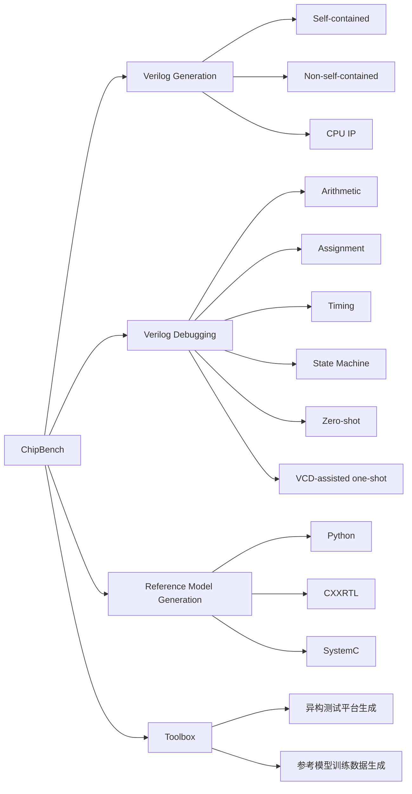
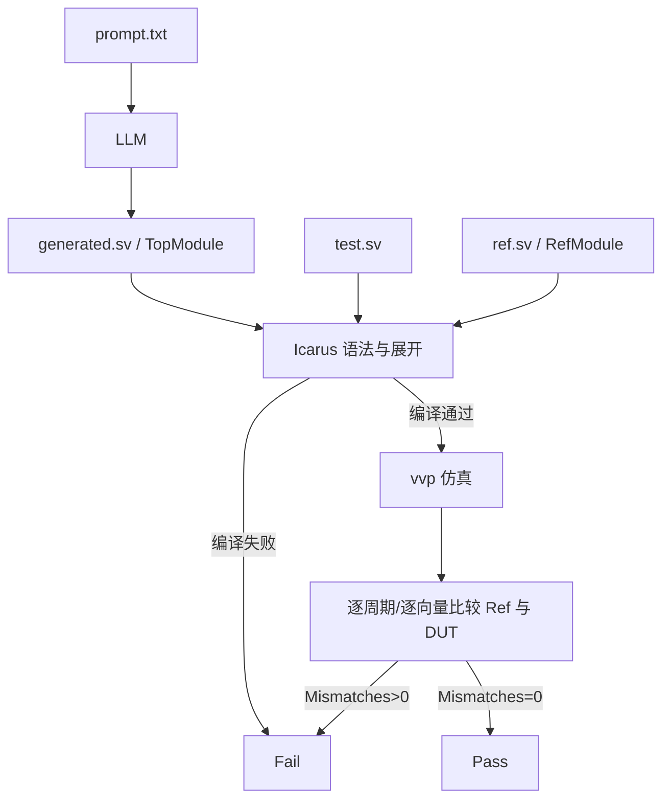
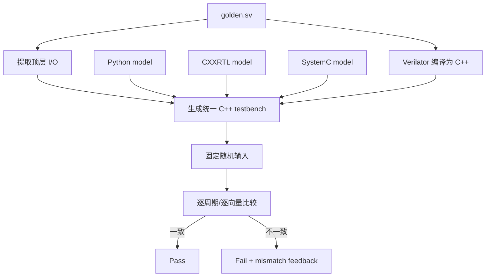
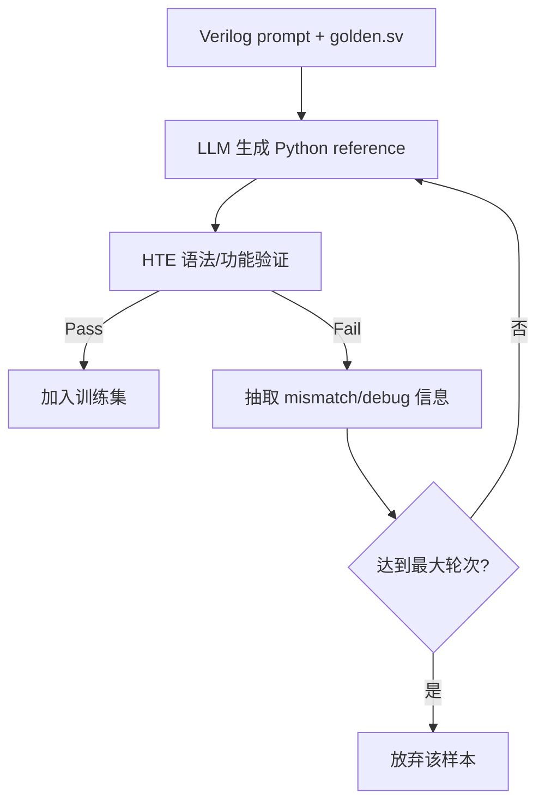

# ChipBench 论文、代码与本地复现详解

> 论文：**ChipBench: A Next-Step Benchmark for Evaluating LLM Performance in AI-Aided Chip Design**  
> arXiv：<https://arxiv.org/abs/2601.21448>  
> PDF 直链：<https://arxiv.org/pdf/2601.21448>  
> 官方代码：<https://github.com/zhongkaiyu/ChipBench>  
> 本地论文：[2601.21448_ChipBench.pdf](2601.21448_ChipBench.pdf)  
> 本地代码版本：`74fe7d283225ae030ef59326a06111c9d372b48e`，提交时间 `2026-05-12T23:09:11-07:00`  
> 核对日期：2026-08-02  
> 本地证据：Icarus Verilog 12.0；45 组生成题黄金自对拍；178 份调试题黄金自对拍；89 份错误起点代码验证  
> 当前复现等级：**R2——评测数据与 Icarus 判题链可离线审计，但论文商业模型结果和完整 HTE 尚未复现**

---

```text
┌─────────────────────────────────────────────────────────────────────────────┐
│ P1 任务定义                                                                   │
├─────────────────────────────────────────────────────────────────────────────┤
│ Input    │ 自然语言 prompt；调试题额外含注入 bug 的 RTL；参考模型题额外含  │
│          │ golden Verilog                                                  │
├──────────┼────────────────────────────────────────────────────────────────┤
│ Output   │ 生成的 TopModule、修复后的 Verilog，或 Python/CXXRTL/SystemC    │
│          │ 参考模型                                                        │
├──────────┼────────────────────────────────────────────────────────────────┤
│ Supervision │ Icarus 差分仿真（RefModule vs TopModule）、HTE 跨语言比较、   │
│          │ 论文 Table 2/3/4 的 pass@k 汇总                                │
├──────────┼────────────────────────────────────────────────────────────────┤
│ Why-hard │ 层次化/CPU IP 设计、四类人工 bug、跨语言语义鸿沟；官方入口     │
│          │ configure/Makefile/题单有空格和缺失问题，HTE parser 与 clock   │
│          │ 检测存在风险，且论文模型输出未公开                              │
└─────────────────────────────────────────────────────────────────────────────┘
```

## 0. 阅读约定：四类结论必须分开

本文使用四种标签，避免把论文报告、代码能力和本地结果混为一谈。

| 标签 | 含义 |
|---|---|
| **[论文]** | 论文正文、表格或附录明确写出的内容 |
| **[代码]** | 当前本地提交中真实存在的实现、文件或默认参数 |
| **[本地]** | 2026-08-02 在本机实际执行得到的结果 |
| **[推断]** | 根据论文数字、代码行为或文件结构推导出的结论 |

最重要的边界是：

```text
论文报告某模型达到 30.74%
≠ 当前仓库包含这次模型输出
≠ 当前仓库默认命令能重算出 30.74%
≠ 本地已经复现 30.74%
```

本地真正完成的是：

```text
论文原文核对
    +
仓库静态结构审计
    +
黄金 RTL 与测试平台离线自对拍
    +
错误起点 RTL 的批量判题
    +
HTE 代码生成路径和阻塞点核对
```

没有完成的是：

```text
13 个商业/闭源模型重新采样
MAGE 全流程重跑
论文 45×多模型×10 次采样结果重算
SystemC/CXXRTL/Python 的 132 个公开样本复算
DeepSeek V3.2 的 10,000 条训练数据生成实验
```

---

## 1. 一句话说清楚这篇论文

> ChipBench 不只考“根据规格写 Verilog”，而是同时考 **Verilog 生成、Verilog 调试、跨语言参考模型生成**，并提供一个把黄金 Verilog 与 Python/CXXRTL/SystemC 参考模型做异构对拍的工具设想；论文的核心价值是把评测范围从单一 RTL 生成扩展到更接近验证工作流的三个环节。

但从当前开源仓库看，更准确的结论是：

> **生成与调试数据已较完整公开，参考模型评测集和工具箱只公开了部分骨架；仓库存在数量、入口、测试平台和分析器契约不一致，使用前必须先做基准完整性审计。**


---

## 2. 论文基本信息与研究动机

### 2.1 基本信息

| 项目 | 内容 |
|---|---|
| 题目 | ChipBench: A Next-Step Benchmark for Evaluating LLM Performance in AI-Aided Chip Design |
| 作者 | Zhongkai Yu、Chenyang Zhou、Yichen Lin、Hejia Zhang、Haotian Ye、Junxia Cui、Zaifeng Pan、Jishen Zhao、Yufei Ding |
| 机构 | UC San Diego、Columbia University |
| 本地 PDF | arXiv v2，页眉日期 2026-02-01，正文标注 Preprint 2026-02-03 |
| 页数 | 13 页 |
| DOI 元数据 | `10.48550/arXiv.2601.21448` |
| PDF SHA-256 | `04747b50a01e273d76631d77fcb0e6445f0a29f38319c4f6fbcc2f701e8e5930` |
| 代码许可证 | MIT，但版权头主要沿用 NVIDIA/VerilogEval 代码 |

### 2.2 论文认为已有 benchmark 有三类不足

**[论文] 第一，已有 RTL 生成题过于简单。**

论文认为 VerilogEval、RTLLM 一类数据：

- 模块较短；
- 多为自包含题；
- 很少涉及真实层次结构；
- 当前强模型已经出现饱和。

**[论文] 第二，只考生成，不考调试。**

真实芯片开发中，LLM 直接写完整 RTL 的风险很高；辅助定位和修复已有设计，更容易进入工程流程。

**[论文] 第三，忽略参考模型。**

硬件验证中常用 Python、SystemC 或 CXXRTL 编写高层功能模型，与 RTL 对拍。论文认为这项工作同样耗费大量工程资源，却很少有 benchmark 单独评价。

### 2.3 三项任务的总览


论文 Figure 1 的逻辑可以重画成：



---

## 3. 先纠正最关键的数量矛盾：论文实际结果对应 45 题，不是 44 题

这是理解 ChipBench 时最容易被忽略、又最影响复现的地方。

### 3.1 论文叙述和 Table 1 写的是 44

**[论文]** 摘要、正文、Figure 1 和 Table 1 都写：

```text
29 个 self-contained
 6 个 non-self-contained
 9 个 CPU IP
------------------------
44 个 generation modules
```

附录 Table 7 也确实列出：

```text
29 + 6 + 9 = 44
```


### 3.2 当前仓库实际是 45

**[代码]** 当前三个生成目录中存在完整 `prompt/ref/test` 三元组：

| 目录 | 三元组数 |
|---|---:|
| `dataset_self_contain` | 30 |
| `dataset_not_self_contain` | 6 |
| `dataset_cpu_ip` | 9 |
| **合计** | **45** |

多出的题是：

```text
Prob000_Four-to-one_multiplexer
```

它存在于初始提交，也存在于自包含 `problems.txt`，但没有出现在论文附录 Table 7。

### 3.3 Table 2 的百分比反而证明实验用了 30 个自包含题

**[推断]** 论文 Table 2 的 self-contained 百分比以 `3.33%` 为步长：

```text
1 / 30 = 3.33%
3 / 30 = 10.00%
11 / 30 = 36.67%
```

因此 Table 2 的分母显然是 30，而不是 Table 1 写的 29。

例如 Claude 4.5 Opus：

```text
CPU IP pass@1             = 22.22% = 2/9
Non-self-contained       = 33.33% = 2/6
Self-contained           = 36.67% = 11/30
```

这三类总计：

```text
9 + 6 + 30 = 45 题
```

### 3.4 论文的 “Average” 是三类宏平均，不是所有题的加权平均

Claude 4.5 Opus 的论文平均值是：

```text
(22.22 + 33.33 + 36.67) / 3 = 30.74%
```

这就是 Table 2 和摘要中的 `30.74%`。

如果按 45 个题逐题加权：

```text
(2 + 2 + 11) / 45 = 33.33%
```

所以：

| 口径 | Claude 4.5 Opus pass@1 |
|---|---:|
| 论文三类别宏平均 | 30.74% |
| 45 题逐题加权 | 33.33% |

两个数字都可以计算，但含义不同。组会分享时必须注明论文使用宏平均，否则听众会误以为 `30.74%` 是 44 或 45 题的直接通过率。

### 3.5 数量问题的最终结论

```text
论文叙述：44 题、self-contained=29
论文 Table 2：实际分母 self-contained=30，即总计45题
当前仓库：45个完整三元组
附录 Table 7：只列44题，缺 Prob000
```

因此，本项目应同时保留两个口径：

- **论文叙述口径：44**；
- **实际实验/仓库口径：45**。

---

## 4. 任务一：Verilog Generation 的完整方法流程

### 4.1 一道题由什么组成

每道题有三个核心文件：

```text
ProbXXX_prompt.txt    自然语言规格，交给 LLM
ProbXXX_ref.sv       黄金参考模块 RefModule
ProbXXX_test.sv      对拍测试平台 tb
```

LLM 生成：

```text
TopModule
```

测试平台同时实例化：

```text
RefModule good1(...)
TopModule top_module1(...)
```

### 4.2 论文工作流



论文 Figure 3(a) 就是这条链：


### 4.3 三类生成题

#### 4.3.1 Self-contained

特点：

- 只需要一个 `TopModule`；
- 不依赖外部子模块；
- 包含组合逻辑、时序逻辑、FSM、FIFO、RAM、CDC 等；
- 当前仓库 30 题。

论文 Table 1 报告平均：

| 指标 | 数值 |
|---|---:|
| 代码行 | 47.8 |
| 电路 cells | 323.3 |
| 子模块数 | 0 |

#### 4.3.2 Non-self-contained

特点：

- 顶层模块需要实例化已有子模块；
- prompt 中给出子模块接口或实现；
- 论文称只要求生成 top module，因为要求完整层次化生成时所有模型都失败；
- 当前仓库 6 题。

论文平均：

| 指标 | 数值 |
|---|---:|
| 代码行 | 119.5 |
| cells | 361.2 |
| 子模块数 | 1.8 |

#### 4.3.3 CPU IP

包括：

- controller；
- ALU；
- RegFile；
- Branch Unit；
- ALU Controller；
- PC register；
- divider；
- pipeline control；
- CP0 register file。

论文平均：

| 指标 | 数值 |
|---|---:|
| 代码行 | 68.1 |
| cells | 862.3 |
| 题数 | 9 |

### 4.4 测试强度的论文表述与代码现实

**[论文]** 论文称每题结合 directed test 和超过 1,000 次 constrained random stimuli。

**[代码]** 当前测试平台并不统一：

- 有的确实使用数百或上千随机向量；
- 有的使用定向序列；
- 有的按时钟正负边沿累计样本；
- CPU 题的样本数量和结束格式各不相同；
- 不能用一个固定的 `>1000` 概括全部当前文件。

因此，应把“超过 1,000”视为论文设计目标，而不是当前 45 个 `test.sv` 已逐个满足的静态事实。

---

## 5. 任务二：Verilog Debugging 的完整方法流程

### 5.1 调试题怎样构造

**[论文]** 作者从黄金模块出发，人工注入四类 bug：

| 类型 | 题数 | 典型错误 |
|---|---:|---|
| Arithmetic | 24 | 运算符替换、算术表达式错误 |
| Assignment | 30 | 常量、wire/reg 赋值错误 |
| Timing | 29 | 周期错位、阻塞/非阻塞误用、时序敏感表错误 |
| State Machine | 6 | 状态转移目标或转移逻辑错误 |
| **合计** | **89** |  |


### 5.2 Zero-shot 输入

Zero-shot prompt 包含：

```text
自然语言规格
    +
明确告知“下面 TopModule 有 bug”
    +
错误 RTL
```

模型需要输出修正后的完整 Verilog。

### 5.3 论文所谓 One-shot 实际是 VCD 辅助，不是传统示例 one-shot

**[论文]** 正文定义 one-shot 为：

```text
Zero-shot 全部信息
    +
失败仿真的完整 VCD 文本
```

它不是通常意义上的：

```text
先给一个“问题—答案”示例，再做当前问题
```

更准确的术语是：

```text
waveform-augmented debugging
或 VCD-assisted debugging
```

### 5.4 当前 README 的说法与论文不一致

**[代码]** `Verilog Debugging/README.md` 把 one-shot 解释成“with one in-context example problem”。

但真实 prompt 中增加的是：

```text
======= VCD OUTPUT BEGIN =======
...
======= VCD OUTPUT END =======
```

因此以论文正文和文件实际内容为准：它是 VCD 上下文，不是一个已解示例。

### 5.5 当前 one-shot 数据并没有覆盖全部 89 题

**[本地]** 逐文件核对结果：

| bug 类别 | one-shot 题数 | 真正包含 VCD | 与 zero-shot prompt 完全相同 |
|---|---:|---:|---:|
| Arithmetic | 24 | 21 | 3 |
| Assignment | 30 | 26 | 4 |
| State Machine | 6 | 6 | 0 |
| Timing | 29 | 9 | 20 |
| **合计** | **89** | **62** | **27** |

也就是说：

```text
62/89 题真正增加了 VCD
27/89 题的 one-shot prompt 与 zero-shot 完全相同
```

这一点会影响 Figure 5 的解释：当前开源文件并不是 89 个问题都公平比较“无 VCD vs 有 VCD”。

### 5.6 Zero/One 两套目录实际存储量

仓库保存：

```text
89 个 zero-shot 三元组
89 个 one-shot 三元组
----------------------
178 份 prompt/ref/test 三元组
```

两种设置中的 `ref.sv` 和 `test.sv` 全部逐字节相同，差别只应该在 prompt。

---

## 6. 任务三：Reference Model Generation

### 6.1 参考模型是什么

参考模型不是“另一个 RTL 候选”，而是用高层语言描述相同行为：

```text
黄金 Verilog：硬件语义基准
Python/SystemC/CXXRTL：待验证的高层功能模型
```

理想情况下，同一输入序列下：

```text
Golden Verilog outputs
    == Python outputs
    == CXXRTL outputs
    == SystemC outputs
```

### 6.2 论文声称的规模

**[论文]** 44 个模块分别生成三种语言：

```text
44 × 3 = 132 samples
```

注意论文 Table 1 写成 `132+`，表示工具可扩展到更多 Verilog 数据。

### 6.3 HTE 的论文工作流

HTE 是 Heterogeneous Test Engine：



### 6.4 论文的复位策略

论文 Figure 4 强调：

```text
前 20 个周期：保持 reset active，不比较输出
后续周期：reset inactive，正常比较
```

目的：

- Verilog 可能在未初始化时输出 `X`；
- Python/C++ 通常没有四值逻辑；
- 先复位再比较可减少无意义的假失败。

### 6.5 代码中的随机与循环配置

**[代码]** 当前 `generate_testbench.py`：

| 项目 | 当前实现 |
|---|---:|
| 随机种子 | 12345 |
| 组合电路向量 | 1000 |
| 时序电路主循环 | 500 cycles |
| 有复位时 warmup | 20 cycles |
| 首批 mismatch 输出 | 每个 DUT 最多 10 条 |
| Python 执行 | 收集输入后一次子进程 batch 执行 |
| SV 执行 | Verilator inline |
| CXXRTL 执行 | C++ inline |

### 6.6 Valid 信号门控

代码会识别：

```text
valid
in_valid
valid_i
vld
data_vld
...
```

存在 valid 输入时：

```text
模型仍然推进状态
但 valid=0 时不比较输出
```

如果有多个 valid，当前逻辑要求全部为真才比较。

---

## 7. Tool 2：参考模型训练数据生成闭环

### 7.1 论文方法



### 7.2 论文的两个实验

**多轮趋势实验：**

- CodeV-R1 中抽 100 个样本；
- 最大轮次从 1 到 10；
- 通过率先升高，约在 50% 附近平台化；
- 轮次越多，总成本和每个成功样本成本越高。

**规模实验：**

- 10,000 条 Verilog；
- 最大迭代次数 1；
- 得到 2,206 条“验证通过”的 Python 参考模型；
- 即 22.06%。


### 7.3 当前仓库与论文实验的差距

**[代码]** 当前 `Ref Model Gen/data.jsonl`：

```text
100 行
100 个唯一 problem_id
```

它对应 100 样本趋势实验或其输入子集，不是 10,000 条规模实验全量数据，也不是 44×3 的 132 个 benchmark 参考模型样本。

---

## 8. 论文实验设置

### 8.1 单模型

论文评测：

- GPT-3.5 Turbo；
- GPT-4o；
- GPT-5；
- GPT-5.2；
- Claude 4.5 Haiku；
- Claude 4.5 Opus；
- Claude 4.5 Sonnet；
- Gemini 2.5 Pro；
- Gemini 3 Flash；
- Llama 3.1 8B；
- Llama 3.3 70B；
- DeepSeek Coder；
- DeepSeek R1。

### 8.2 多智能体

论文另外运行 MAGE，backbone 为 DeepSeek V3 系列。

MAGE 只报告 pass@1，因为内部本身包含：

```text
sampling
debugging
decision making
```

### 8.3 采样参数

| 参数 | 值 |
|---|---:|
| temperature | 0.85 |
| top_p | 0.95 |
| 报告指标 | pass@1 / pass@5 / pass@10 |

### 8.4 精确 API 版本

论文附录 Table 6 给出了快照名：


当前代码 `scripts/sv-generate` 中的大部分 API 名与 Table 6 对齐，这是复现实验时应优先采用的版本，而不是自动漂移的“latest”。

---

## 9. 论文主结果怎么读

### 9.1 Verilog generation


Table 2 的主要结论：

| 模型/流程 | 论文宏平均 pass@1 |
|---|---:|
| MAGE (DeepSeek-V3) | 37.41% |
| Claude 4.5 Opus | 30.74% |
| Gemini 3 Flash | 30.74% |
| DeepSeek-Coder | 29.26% |
| GPT-5.2 | 26.29% |
| GPT-5 | 24.81% |
| DeepSeek-R1 | 23.70% |
| GPT-4o | 10.37% |

论文强调：

- MAGE 在 VerilogEval 已超过 95%，在 ChipBench 只有 37.41%；
- CPU IP 最难，单模型 pass@1 都不超过 22.22%；
- 层次化 top-only 仍然很难。

### 9.2 Python reference model

Table 3 的 pass@1：

| 模型 | 论文宏平均 pass@1 |
|---|---:|
| Claude 4.5 Sonnet | 15.93% |
| Gemini 3 Flash | 14.81% |
| DeepSeek-R1 | 14.44% |
| GPT-5.2 | 14.44% |
| Claude 4.5 Opus | 13.33% |

论文主张：

- 自包含简单题上，Python 有时比 Verilog 高；
- CPU 和层次化设计上，Python 几乎全部失败；
- 强模型会写 Python 语法，不等于会建模时序硬件语义。

### 9.3 论文内部的模型名/数字矛盾

摘要写：

```text
Claude 4.5 Opus: generation 30.74%, Python 13.33%
```

这与 Table 2、Table 3 一致。

但贡献段写：

```text
Claude 4.5 Opus 在 Python 达到 15.93%
```

Table 3 中 `15.93%` 实际属于 Claude 4.5 Sonnet，不是 Opus。

因此应引用表格和摘要：

```text
Opus = 13.33%
Sonnet = 15.93%
```

### 9.4 Debugging

论文 Table 4 的宏平均 pass@1：

| 模型 | pass@1 |
|---|---:|
| Claude 4.5 Opus | 47.45% |
| DeepSeek-R1 | 44.22% |
| GPT-5 | 43.59% |
| DeepSeek-Coder V2.5 | 35.67% |
| Claude 4.5 Haiku | 34.84% |
| GPT-5.2 | 32.66% |

论文把 Opus 的：

```text
generation 30.74%
debugging  47.45%
```

作为“调试比从零生成更有希望”的例子。

### 9.5 Figure 5 的表述存在计数歧义

论文写：

```text
one-shot 对 8 个 models 更好，对 13 个更差
```

但论文只列出 13 个单模型，`8 + 13 = 21`，不可能同时是“模型数量”。

可能的解释是：

- 在若干“模型×bug 类别”比较点中 8 个提升、13 个下降；或
- 文本中的 models 应为 comparisons/tasks。

论文没有进一步澄清。组会中应表述为：

> Figure 5 显示 VCD 上下文的收益混合，多数模型没有稳定利用波形；论文正文的 8/13 计数对象不清晰。

### 9.6 Cost


论文给出的例子：

| 模型 | Cost | pass@1 | Cost/pass@1 |
|---|---:|---:|---:|
| DeepSeek-Coder | $0.010 | 29.26% | $0.033 |
| Claude 4.5 Opus | $2.793 | 30.74% | $9.085 |

论文称 Opus 的 cost/pass@1 高约 275 倍。

这里的 cost/pass@1 是：

```text
总调用成本 / 百分数值
```

不是“完整解出一个题的实际美元期望成本”，解释时不要混淆。

---

## 10. 仓库目录与代码职责

```text
ChipBench/
├── Verilog Gen/
│   ├── dataset_self_contain/
│   ├── dataset_not_self_contain/
│   └── dataset_cpu_ip/
├── Verilog Debugging/
│   ├── dataset_debug_zero_shot_*
│   └── dataset_debug_one_shot_*
├── Ref Model Gen/
│   ├── gen.py
│   ├── data.jsonl
│   ├── gen_python_prompt.txt
│   ├── gen_cxxrtl_prompt.txt
│   └── gen_systemc_prompt.txt
├── Tool_Box/
│   ├── crosslang_verify/
│   ├── verilog/
│   ├── python/
│   ├── cxxrtl/
│   └── systemc/
├── scripts/
│   ├── sv-generate
│   └── sv-iv-analyze
├── configure / configure.ac
├── Makefile.in
├── Dockerfile
└── requirements.txt
```

### 10.1 `sv-generate`

职责：

- 读取 prompt；
- 拼 system/user prompt；
- 调用 OpenAI、DeepSeek、Gemini、Claude、Together 或本地 vLLM；
- 从 `[BEGIN]...[DONE]` 或代码围栏中抽取 Verilog；
- 写入候选文件。

### 10.2 `Makefile.in`

每个题、每个 sample 的流程：

```text
prompt
  -> sv-generate
  -> candidate.sv
  -> iverilog candidate + test + ref
  -> timeout 30 vvp
  -> log
```

### 10.3 `sv-iv-analyze`

扫描每个 sample 的 log，识别：

- syntax error；
- unknown module；
- timeout；
- reset 敏感表问题；
- mismatch 数量。

成功判定依赖严格正则：

```text
^Mismatches: (\d+) in \d+ samples$
```

只有匹配到 `Mismatches: 0 in N samples` 才记为 `.`，即通过。

---

## 11. 官方 Quick Start 为什么不能直接跑

README 给出：

```bash
MODEL_NAME="gpt-5.2"
TASK_NAME="nowcoder"
./configure --with-model=$MODEL_NAME --with-task=$TASK_NAME
make
```

### 11.1 根目录不存在 `dataset_nowcoder`

`configure.ac` 默认：

```text
dataset_dir = ${srcdir}/dataset_${task}
```

所以 `task=nowcoder` 会寻找：

```text
ChipBench/dataset_nowcoder/problems.txt
```

仓库没有该目录。

**[本地]** 在 `/tmp` 执行官方配置：

```text
sed: can't read .../dataset_nowcoder/problems.txt
```

但 configure 最后仍返回成功并生成一个没有题目的 Makefile，容易让用户误以为配置完成。

### 11.2 实际数据目录名含空格，configure 又没有正确引用路径

真实路径是：

```text
Verilog Gen/dataset_self_contain
```

传入绝对路径后，生成的 configure 脚本内部对 `${problems_file}` 未加引号，`sed` 会把路径拆成：

```text
.../Verilog
Gen/dataset_self_contain/problems.txt
```

因此直接 `--with-dataset=".../Verilog Gen/..."` 仍失败。

### 11.3 可行的无空格路径绕行

在 Docker 或临时目录中创建无空格软链接：

```bash
ln -s "/workspace/verilogeval/Verilog Gen/dataset_self_contain" /tmp/chipbench_self
mkdir -p /tmp/chipbench_build
cd /tmp/chipbench_build
/workspace/verilogeval/configure \
  --with-model=gpt-5.2 \
  --with-task=spec-to-rtl \
  --with-dataset=/tmp/chipbench_self \
  --with-samples=10
make -j4
```

但这仍然没有解决后面的 `problems.txt` 完整性问题。

---

## 12. `problems.txt` 会让默认运行漏题

### 12.1 当前文件实际内容

| 数据目录 | 实际三元组 | `problems.txt` 条目 |
|---|---:|---:|
| self-contained | 30 | 30 |
| non-self-contained | 6 | 1：仅 `Prob006_cpu_top` |
| CPU IP | 9 | 1：仅 `Prob005_ALU_Controller` |

因此对后两类直接 configure：

```text
目录里有 6/9 题
但 Makefile 只会展开 1 题
```

### 12.2 三个列表都没有结尾换行

`configure.ac` 先用 `sed` 生成 `samples.mk`，再通过 `column -t` 对齐。

本地对 30 题列表执行时出现：

```text
column: line too long
```

最后一题 `Prob034` 没有写入 `samples.mk`。

Make 的副作用是：

- `problems.mk` 仍包含 Prob034；
- Prob034 的 `num_samples` 未定义；
- shell 的 `seq 1` 使它退化成 1 个 sample；
- 即使请求 `--with-samples=10`，最后一题仍可能只生成 1 个。

这会直接破坏 pass@5/pass@10 的统一采样数量。

### 12.3 重跑论文前应先冻结题单

建议明确制作三份无歧义列表：

```text
self-contained：30 题（对应 Table 2）
non-self-contained：6 题
CPU IP：9 题
```

每个文件必须有尾换行，并逐题核对三元组齐全。

如果要复现论文叙述的 44 题，应从 self-contained 排除 `Prob000`；如果要复现 Table 2，则必须保留它，使用 45 题。

---

## 13. 模型调用脚本的默认参数也不一致

### 13.1 文档头、argparse、configure 三套默认值

| 来源 | 默认模型 | temperature | max_tokens |
|---|---|---:|---:|
| `sv-generate` 注释头 | gpt-3.5-turbo | 0.85 | 1024 |
| `sv-generate` argparse | gpt-3.5-turbo | 1.0 | 16384 |
| `configure.ac` | gpt4-turbo | 0.85 | 未直接配置 |

### 13.2 两个默认模型名都不在支持列表

支持列表包含：

```text
gpt-3.5-turbo-0125
alias: gpt-3.5
```

但不包含：

```text
gpt-3.5-turbo
gpt4-turbo
```

所以必须显式传一个有效 alias 或快照名。

### 13.3 当前脚本没有 DeepSeek Reasoner

论文评测 DeepSeek-R1 / `deepseek-reasoner`，但当前 `deepseek_models` 只列：

```text
deepseek-coder
```

因此论文 DeepSeek-R1 结果不能由当前 `sv-generate` 原样重跑。

### 13.4 本地主机的依赖状态

**[本地]** 当前宿主机直接运行 `sv-generate --list-models`，在参数解析前就失败：

```text
ModuleNotFoundError: No module named 'langchain_nvidia_ai_endpoints'
```

这不是仓库 requirements 缺失，因为 requirements 中列了对应包；是当前宿主环境没有按 Dockerfile 安装全部依赖。

推荐把模型调用放入官方 Docker 环境，而 Icarus 数据审计可以直接在宿主机完成。

---

## 14. 45 组 Generation 黄金自对拍：本地实际结果

### 14.1 为什么要做黄金自对拍

一个 benchmark 在评价模型之前，应先通过最基本的完整性检查：

```text
把 RefModule 复制为 TopModule
    +
原 test.sv
    +
原 RefModule
    -> 必须得到零 mismatch
```

如果黄金对黄金都失败，模型分数就没有可靠含义。

### 14.2 本地审计方法

脚本：[runs/validate_dataset_references.py](runs/validate_dataset_references.py)

流程：

```text
1. 找出每个 *_ref.sv / *_test.sv
2. 提取 RefModule 顶层
3. 重命名为 TopModule
4. 用 Icarus 编译 test + golden-as-DUT + ref
5. 运行 vvp
6. 解析最终 mismatch 行
7. 每题保存 return code、样本数和日志尾部
```

### 14.3 结果

| 状态 | 数量 |
|---|---:|
| 完全通过 | 39 |
| compile error | 3 |
| 黄金对黄金 mismatch | 1 |
| 仿真零错但没有标准 summary | 2 |
| **合计** | **45** |

证据：[runs/reference_validation_generation_20260802.json](runs/reference_validation_generation_20260802.json)

### 14.4 LCM：完全相同的黄金 DUT 仍被判 389/399 错误

问题：

```text
dataset_self_contain/Prob013_least_common_multiple
```

黄金模型在 GCD 尚未有效时输出：

```verilog
assign lcm_out = (mcd_out_r1 == 0) ? 'hz : mult_reg / mcd_out_r1;
```

测试平台使用：

```verilog
lcm_out_ref !== (lcm_out_ref ^ lcm_out_dut ^ lcm_out_ref)
```

当两边都是 `Z` 时，异或表达式产生 `X`，于是：

```text
reference Z
DUT       Z
仍被统计为 mismatch
```

本地结果：

```text
Mismatches: 389 in 399 samples
mcd_out: no mismatch
vld_out: no mismatch
只有 lcm_out 的高阻态比较失败
```

这不是黄金 RTL 不一致，而是测试平台的四值逻辑比较公式不适合高阻输出。

### 14.5 三个 non-self-contained 题无法独立黄金自对拍

失败题：

```text
Prob002_full_subtractor...
Prob005_8_bit_alu
Prob006_cpu_top
```

#### Prob002 与 Prob005：黄金引用候选侧子模块

`RefModule` 分别实例化：

```text
decoder_38
bit_8_AND
bit_8_OR
bit_8_ADDER
mux_2X1
```

但 `ref.sv` 自己没有定义这些模块；定义只出现在 prompt，预期由模型候选重新输出。

这意味着：

```text
RefModule 的行为部分依赖 DUT candidate 提供的 helper module
```

如果候选把 helper 写错，RefModule 也可能共享这个错误 helper，黄金基准被候选污染。

安全做法应是：

```text
官方提供只读 helper_gold.sv
RefModule 实例化 gold helper
TopModule 实例化 DUT helper 或只实现 top
两套命名空间不能共享候选定义
```

#### Prob006：测试平台本身有 Icarus 语法错误

当前 `Prob006_cpu_top_test.sv` 包含：

```verilog
initial stats1 = '{default:0};
```

本地 Icarus 12.0 报 `Malformed statement`，因此无论模型输出什么都无法进入功能判定。

### 14.6 两个 CPU 题零错误，却会被官方分析器判为运行错误

题目：

```text
Prob008_chapter12_ctrl
Prob009_cp0_reg
```

黄金对黄金实际输出零错误，但 testbench 不打印：

```text
Mismatches: 0 in N samples
```

它们分别打印：

```text
Hint: No mismatched samples.
```

或：

```text
Hint: Total mismatched samples is 0 out of 283 samples.
```

而 `sv-iv-analyze` 只接受严格 `Mismatches:` 格式，所以会保留 `?`，最后转为 `R`。

结论：

```text
仿真功能通过
但当前官方 analyzer 不认
```

---

## 15. 178 份 Debugging 黄金自对拍

### 15.1 结果

| 状态 | 存储副本数 | 对应 89 题口径 |
|---|---:|---:|
| 通过 | 160 | 80 |
| compile error | 12 | 6 |
| 黄金 mismatch | 6 | 3 |
| **合计** | **178** | **89** |

证据：[runs/reference_validation_debugging_20260802.json](runs/reference_validation_debugging_20260802.json)

### 15.2 六个独立题的黄金引用候选 helper

主要涉及：

```text
decoder_38
dual_port_RAM
slave_mod
```

它们与生成题的层次化污染问题相同：黄金 ref 不能脱离候选侧 helper 独立展开。

### 15.3 三个 LCM bug 题继承同一个高阻比较问题

LCM 同时被注入到：

- Arithmetic；
- Assignment；
- Timing。

Zero/One 两套各一份，所以出现 6 个存储副本的黄金 mismatch。

### 15.4 错误起点代码是否真的被测试抓住

本地把 zero-shot prompt 中全部 Verilog 围栏拼成 DUT，运行 89 题：

| 状态 | 数量 |
|---|---:|
| 编译通过且产生 mismatch | 80 |
| 编译失败 | 9 |
| 错误代码意外通过 | 0 |

证据：[runs/buggy_prompt_baselines_20260802.json](runs/buggy_prompt_baselines_20260802.json)

这说明 89 份起点代码都不是“直接可通过”的假 bug；但 9 题属于编译级失败，不是纯功能 mismatch。

---

## 16. HTE 代码实现：真正做了什么

### 16.1 CLI

入口：

```text
Tool_Box/crosslang_verify/main.py
```

接受：

```text
ref.sv
--dut-sv dut.sv
--dut-cc dut.cc
--dut-py dut.py
--json ports.json
-w work_dir
```

### 16.2 生成 C++ testbench

`generate_testbench.py` 根据端口表生成：

- 随机输入；
- 复位 warmup；
- Verilator RefModule 驱动；
- SV/CXXRTL inline 比较；
- Python batch 输入输出；
- 逐语言 PASS/FAIL；
- 返回码 0/1。

### 16.3 构建链

```text
RefModule.sv
  -> verilator --cc --top-module RefModule
  -> VRefModule__ALL.a

TopModule.sv
  -> verilator --cc --top-module TopModule
  -> VTopModule__ALL.a

CXXRTL dut.cc
  -> 直接 include 到 testbench.cpp

Python dut.py
  -> C++ popen("python3 -c ...")

所有对象
  -> g++ link obj_dir/sim
  -> 运行并以 return code 判定
```

### 16.4 示例 Python 模型可以单独运行

本地对 `Tool_Box/python/dut.py` 的 LFSR 示例执行：

```text
输入：reset 1 次，然后 8 个正常周期
输出 Q：0, 8, 12, 14, 15, 7, 3, 1, 0
```

说明样例 Python 状态更新逻辑本身可执行。

### 16.5 完整 HTE 本地阻塞

当前宿主机：

| 工具 | 状态 |
|---|---|
| Icarus | 有，12.0 |
| vvp | 有 |
| Verilator | 无 |
| Yosys | 无 |

运行 HTE CLI 会先成功生成 `testbench.cpp`，随后：

```text
FileNotFoundError: verilator
```

Dockerfile 会安装 Verilator，并从源代码构建 Yosys 0.60 和 Icarus 12；因此完整 HTE 应在 Docker 内验证，而不能把当前宿主失败归因于算法本身。

---

## 17. HTE 当前代码的六个关键风险

### 17.1 端口提取器会提取文件中所有 module，不只顶层

样例 `ref.sv` 同时包含：

```text
lfsr_core
RefModule
```

当前 parser 得到：

```text
inputs : Q_in, clk, rst_n
outputs: Q_out, Q
```

但 `VRefModule` 顶层并没有 `Q_in/Q_out` 端口。

由此生成的 C++ 会出现：

```cpp
ref->Q_in
ref->Q_out
```

无法编译。

当前样例必须显式使用：

```text
--json Tool_Box/verilog/ports.json
```

README 中“不带 JSON 的 all-three-DUT 示例”对这个多模块样例并不成立。

### 17.2 `is_clk_signal()` 只看第一个输入

当前代码逻辑等价于：

```python
for input in inputs:
    if first_input_name does not contain clk:
        return False
    return True
```

因此：

```text
inputs=[clk,rst_n]       -> sequential
inputs=[rst_n,clk]       -> combinational（错误）
inputs=[Q_in,clk,rst_n]  -> combinational（错误）
```

正确实现应遍历全部输入后判断“是否存在 clock”，并明确多时钟策略。

### 17.3 端口 parser 不支持通用参数宽度

当前正则主要支持：

```verilog
input [7:0] data
```

对以下常见形式能力有限：

```verilog
input [WIDTH-1:0] data
input logic [A+B-1:0] data
input a, b, c
```

在复杂 CPU/层次化模块中，单靠当前正则不能可靠构建顶层接口。

### 17.4 Python 少返回 output key 不会计错

比较逻辑：

```cpp
auto it = py_outputs[i].find(name);
if (it != py_outputs[i].end()) {
    if (value mismatch) python_errors++;
}
```

缺少：

```cpp
else {
    python_errors++;
}
```

因此只要 Python 每个周期都返回一个空字典 `{}`，输出条数仍与输入条数相等，就可能绕过所有按 key 的比较并得到 PASS。

对参考模型 benchmark，这是高优先级正确性问题。

### 17.5 SystemC 当前没有接入

当前状态：

```text
Tool_Box/systemc/dut.cc = 0 bytes
README 明确写 SystemC planned, not wired
generate_testbench 参数有 dut_systemc_file，但不构建 SystemC DUT
```

所以论文所称 Python/CXXRTL/SystemC 三语言 HTE，在当前开源代码里只有 Python、CXXRTL、SV 的实质路径。

### 17.6 生成器依赖 shell/Python 子进程的脆弱 JSON 解析

Python 输出通过自制字符串扫描器解析 `{...}`，不是 C++ JSON 库。

风险包括：

- 模型多打印日志；
- 字符串中包含花括号；
- 输出不是扁平字典；
- Python 子进程输出超过固定读取假设；
- 宽位/负数/布尔值格式差异。

当前简单整数输出可用，但距离通用异构硬件语义还需更严格的协议。

---

## 18. `Ref Model Gen` 当前不是论文所述三语言统一生成器

### 18.1 README 的宣称

README 说支持：

- Python；
- CXXRTL；
- SystemC；
- iterative fixing；
- CSV/PDF 报告。

### 18.2 `gen.py` 的真实路径只有 Python

代码固定：

```text
MODEL_NAME = deepseek-reasoner
SYSTEM_PROMPT = gen_python_prompt.txt
extract_python_code()
检查 class TopModule
写 dut.py
```

它没有根据命令行选择 CXXRTL/SystemC 的分支。

三个 prompt 模板存在，不等于三个后端已接入生成器。

### 18.3 验证 helper 文件缺失

`gen.py` 的 `run_test_detailed()` 导入：

```python
from test_sft_python import generate_testbench_ref_vs_python
```

仓库没有 `test_sft_python.py`。

**[本地]** 用最小 entry 调用该函数，直接得到：

```text
ModuleNotFoundError: No module named 'test_sft_python'
```

因此当前 `gen.py` 即使有有效 DeepSeek key，也无法进入验证环节。

### 18.4 默认 key 文件只是占位符

```text
sk-1234567890
sk-0987654321
```

不能用于实际 API 调用。

### 18.5 当前没有论文 132 个参考模型 benchmark 文件

仓库中没有：

```text
44 个 Python 目标/输出
44 个 CXXRTL 目标/输出
44 个 SystemC 目标/输出
13 个模型的生成结果
Table 3 的逐题日志
```

因此 Table 3 目前只能作为论文报告引用，不能由开源文件直接重算。

---

## 19. pass@k 与当前 analyzer 的边界

### 19.1 论文报告 pass@1/5/10

标准代码生成 benchmark 常用无偏 pass@k：

```text
pass@k = 1 - C(n-c, k) / C(n, k)
```

其中：

- `n`：每题采样数；
- `c`：通过样本数；
- `k`：1、5 或 10。

### 19.2 当前 `sv-iv-analyze` 没有实现 pass@5/pass@10

它对每题计算：

```text
npass / nsamples
```

再平均各题百分比，输出名是 `pass_rate`。

它没有：

- 组合数 estimator；
- pass@5；
- pass@10；
- 论文三类宏平均汇总。

因此论文表格生成还依赖未公开脚本、外部统计步骤或另一个版本。

### 19.3 复现时正确做法

必须保存每题每个 sample 的二值结果，然后单独计算：

```text
每类别 pass@k
三类别宏平均
全题加权平均
```

并同时报告题数口径是 44 还是 45。

---

## 20. 当前可以怎样安全复现

### 20.1 Level A：完全离线、无需模型 API

运行仓库审计：

```bash
cd /mnt/d/AI4eda/ChipBench
PYTHONDONTWRITEBYTECODE=1 python3 runs/audit_repository.py
```

运行 45 题黄金自对拍：

```bash
PYTHONDONTWRITEBYTECODE=1 python3 runs/validate_dataset_references.py \
  --suite generation \
  --output runs/reference_validation_generation_20260802.json
```

运行 178 份调试黄金自对拍：

```bash
PYTHONDONTWRITEBYTECODE=1 python3 runs/validate_dataset_references.py \
  --suite debugging \
  --output runs/reference_validation_debugging_20260802.json
```

验证 89 个错误起点：

```bash
PYTHONDONTWRITEBYTECODE=1 python3 runs/validate_buggy_prompt_baselines.py
```

### 20.2 Level B：已有候选 RTL，不调用 API

对某题：

```bash
iverilog -Wall -Winfloop -Wno-timescale -g2012 -s tb \
  -o /tmp/chipbench_sim \
  candidate.sv \
  "Verilog Gen/dataset_self_contain/Prob001_continuous_input_sequence_detect_test.sv" \
  "Verilog Gen/dataset_self_contain/Prob001_continuous_input_sequence_detect_ref.sv"

vvp /tmp/chipbench_sim
```

必须人工确认最后有：

```text
Mismatches: 0 in N samples
```

### 20.3 Level C：模型生成

需要：

- 按 Dockerfile 构建环境；
- 配置真实 API key；
- 修正/绕开 dataset 路径空格；
- 重建完整问题列表；
- 固定每模型快照；
- 固定采样数、temperature 和 top_p；
- 保存原始响应和抽取后 Verilog；
- 重新实现 pass@k 汇总。

### 20.4 Level D：完整 HTE

至少还需：

- Verilator；
- Yosys CXXRTL headers/runtime；
- 修复 clock 检测；
- 使用顶层 JSON 或可靠 HDL parser；
- 对 missing Python output 计错；
- 接入 SystemC；
- 补齐 `test_sft_python.py` 或统一使用现有 crosslang verifier。

---

## 21. 本地证据文件说明

### 21.1 总审计

[runs/audit_20260802.json](runs/audit_20260802.json) 包含：

- commit 与 remote；
- 45 个生成三元组；
- 178 个调试三元组；
- one-shot VCD 覆盖；
- `problems.txt` 内容；
- terminal 格式覆盖；
- HTE 端口/clock 静态 smoke；
- SystemC 文件大小；
- 三组本地运行汇总。

### 21.2 Generation 逐题结果

[runs/reference_validation_generation_20260802.json](runs/reference_validation_generation_20260802.json)：

- 每题 compile return code；
- 仿真 return code；
- mismatch/sample 数；
- 输出尾部；
- 工具版本。

### 21.3 Debugging 逐题结果

[runs/reference_validation_debugging_20260802.json](runs/reference_validation_debugging_20260802.json)。

### 21.4 错误起点结果

[runs/buggy_prompt_baselines_20260802.json](runs/buggy_prompt_baselines_20260802.json)。

这些文件使本文的本地数字可以机器复核，不需要相信手工统计。

---

## 22. 与 VerilogEval、ArchXBench、RealBench、CVDP 的关系

### 22.1 与 VerilogEval

ChipBench 直接复用 VerilogEval 风格的：

- `prompt/ref/test`；
- Makefile 模板；
- `sv-generate`；
- `sv-iv-analyze`；
- Icarus 差分仿真。

新增：

- 层次化题；
- CPU IP；
- 调试题；
- VCD 上下文；
- 参考模型与 HTE。

### 22.2 与 ArchXBench

ArchXBench 更强调跨抽象层的架构任务和层级难度；ChipBench 更强调：

```text
RTL generation
    + debugging
    + reference model generation
```

两者共同问题是：benchmark 不应只看题目数量，还必须审计判题器是否会假通过/假失败。

### 22.3 与 RealBench

RealBench 更靠近大规模真实 IP 和长规格，难度更高；ChipBench 模块规模较适中，更适合：

- 多模型批量比较；
- 调试研究；
- 异构参考模型研究。

### 22.4 与 CVDP

CVDP 的任务类型更多，覆盖修改、补全、理解等；ChipBench 在：

- 系统化 bug 注入；
- VCD 调试；
- 参考模型验证；

三个方面更集中。

---

## 23. 这篇论文真正值得分享的五个贡献

### 23.1 把 debugging 变成一等评测任务

很多 RTL LLM 工作只报告“从规格生成”。ChipBench 把已有错误代码修复单独量化，更贴近工程落地。

### 23.2 把 waveform 放进 LLM 上下文

即使当前结果不稳定，它提出了一个重要问题：

```text
LLM 能否像验证工程师一样使用波形，而不只是读代码？
```

### 23.3 把 reference model 从 testbench 子步骤中拆出来单独评价

过去常把 Python predictor 当作生成 testbench 的中间件，却很少验证 predictor 自己是否正确。ChipBench 正面指出这个盲区。

### 23.4 引入层次化和 CPU IP

即使规模离 10,000 行工业 RTL 还有差距，也比纯 contest 小模块更接近模块复用和真实接口。

### 23.5 给出训练数据生成闭环

```text
生成参考模型
  -> HTE 验证
  -> 错误反馈
  -> 重试
  -> 只收通过样本
```

这是可扩展的数据工程方向，不只是一次 benchmark 排名。

---

## 24. 这篇论文和代码最需要警惕的八个问题

1. 论文 44 与实际 45 冲突；
2. Table 1 的 29 与 Table 2 的 30 冲突；
3. `Average` 是类别宏平均，容易被理解成逐题平均；
4. Opus/Sonnet 的 13.33/15.93 在贡献段写反；
5. one-shot 开源文件只有 62/89 真正包含 VCD；
6. 当前 `problems.txt` 使 6 题和 9 题目录各只跑 1 题；
7. 若干 test/ref 无法黄金自对拍或 analyzer 不认零错输出；
8. 132 个参考模型评测集、SystemC 路径和训练验证 helper 未完整公开。

这些问题不意味着论文方向没有价值，而是说明：

> ChipBench 更适合作为“值得修复和继续建设的 benchmark 原型”，不适合在不审计代码的情况下直接把论文表格当成完全可复现基准。

---

## 25. 可以基于 ChipBench 做的研究方向

### 25.1 Benchmark linter

为 RTL benchmark 自动执行：

```text
三元组完整性
黄金对黄金
错误起点必须失败
terminal 格式一致
timeout/exit code 一致
helper 隔离
题单/论文计数一致
```

### 25.2 Waveform agent

不要把完整 VCD 数十万字符直接塞给模型，而是：

```text
VCD
 -> 关键输出首次分歧周期
 -> backward cone signals
 -> 边沿/状态转移摘要
 -> 局部波形表
 -> LLM debug agent
```

这比 raw VCD 更节省上下文，也更接近工程调试。

### 25.3 四值逻辑感知的 Python reference contract

高层参考模型应明确：

- `X/Z` 如何表示；
- reset 前是否比较；
- valid 时机；
- signed/unsigned；
- 固定位宽溢出；
- 多时钟推进；
- NBA 语义。

### 25.4 层次化黄金隔离

候选子模块不能被黄金模块共享。可以：

- helper 模块统一加 `Golden_` 前缀；
- 对黄金层次整体重命名；
- 或用两个独立 Verilator model 编译单元。

### 25.5 测试充分性与 mutation score

人工注入 bug 后，不只验证“这个 bug 会失败”，还可统计：

```text
同一测试平台能杀死多少额外 mutation
```

用 mutation score 衡量 benchmark 判题强度。

### 25.6 公平的宏平均与微平均双报告

建议同时给：

```text
Macro across categories
Micro across all tasks
Per-category pass@k
```

避免类别题数不同造成排名歧义。

---

## 26. 组会分享建议：12 页结构

### 第 1 页：问题

```text
VerilogEval 已接近饱和，但工业流程不只有从零生成
```

### 第 2 页：ChipBench 三项任务

使用 Figure 1。

### 第 3 页：45 题 generation 分类

同时指出论文写 44、实际结果 45。

### 第 4 页：89 题 debugging

使用 Figure 2，解释四类 bug。

### 第 5 页：Zero vs VCD-assisted

强调当前开源只有 62/89 含 VCD。

### 第 6 页：HTE

使用 Figure 3/4，解释 20-cycle reset 和异构对拍。

### 第 7 页：主结果

使用 Table 2/3，强调 generation 与 Python 都远未解决。

### 第 8 页：Debugging 结果

使用 Table 4/Figure 5，说明调试高于生成但波形收益不稳定。

### 第 9 页：成本

使用 Table 5，讨论 accuracy/cost trade-off。

### 第 10 页：代码真实可跑程度

```text
Icarus 数据审计：可跑
商业模型表格：无输出，未复现
HTE：当前宿主缺工具，仓库实现也有缺口
```

### 第 11 页：本地发现的 benchmark integrity 问题

展示：

- 39/45 黄金自对拍；
- LCM Z 比较假失败；
- helper 污染；
- analyzer terminal 契约；
- 62/89 VCD。

### 第 12 页：研究机会

```text
benchmark linter
waveform agent
四值逻辑 reference model
层次化隔离
mutation testing
```

---

## 27. 最容易被问到的问题

### 27.1 所以 ChipBench 到底是 44 还是 45？

论文叙述和附录是 44；论文 Table 2 分母和当前仓库是 45。复现 Table 2 用 45，复述摘要需注明论文写 44。

### 27.2 为什么 Opus 30.74，不是 15/45=33.33？

因为论文先算 CPU、层次化、自包含三类百分比，再对三类等权平均。

### 27.3 One-shot 真的是 one example 吗？

不是。论文和文件实际是增加失败仿真的 VCD 文本。

### 27.4 当前能直接运行 README Quick Start 吗？

不能。默认 `dataset_nowcoder` 不存在；真实目录有空格，configure 又未正确 quote；后两类题单还不完整。

### 27.5 当前能重算论文 Table 2 吗？

不能直接重算。仓库没有论文模型输出，入口和题单需修复，还缺 pass@5/10 汇总脚本。

### 27.6 当前能验证某个自己的 RTL 吗？

可以。对大多数题可直接用 Icarus 编译 candidate + test + ref；但应避开或先修复本文列出的异常题。

### 27.7 132 个参考模型文件在哪里？

当前仓库未公开成 44×3 的完整评测集。只有模板、100 条 CodeV-R1 JSONL、一个 Python/CXXRTL 示例和空 SystemC 示例。

### 27.8 论文的 Python 结果可信吗？

只能作为论文报告引用。当前开源代码不足以独立重算，且 Python missing-output 比较存在假通过风险，需要修复后再做严格复验。

---

## 28. 最终结论

### 28.1 论文层面的结论

ChipBench 最有价值的思想不是某个模型具体领先几分，而是把 AI for RTL 的评价扩展为：

```text
生成能力
    +
调试能力
    +
参考模型能力
```

其中 waveform-aware debugging 和 heterogeneous reference modeling 都值得继续研究。

### 28.2 代码层面的结论

当前仓库：

| 部分 | 评价 |
|---|---|
| 生成数据三元组 | 基本完整，实际 45 题 |
| 调试数据三元组 | 89×2 基本完整，但仅 62 one-shot 真含 VCD |
| Icarus 判题框架 | 可用，但入口和 terminal 契约有问题 |
| 黄金/测试完整性 | 需要先排除异常题 |
| HTE | 有实质 Python/CXXRTL/SV 框架，但存在 parser/clock/output-key 风险 |
| SystemC | 未接入，样例为空 |
| Ref Model Gen | 只有 Python 路径，验证 helper 缺失 |
| 论文模型输出 | 未公开 |

### 28.3 本地复现层面的结论

截至 2026-08-02：

```text
已完成：论文核对、代码流程拆解、题量审计、Icarus 全量黄金自对拍、错误起点验证、论文截图
未完成：商业模型重新调用、论文 pass@k 表复算、完整 HTE Docker 闭环、SystemC
```

因此把当前状态定为：

> **R2：代码与数据具备局部可运行、可验证证据，但不等于论文主实验完整复现。**

最适合的组会主线是：

> **ChipBench 提出了比“只考 Verilog 生成”更完整的评测方向；而我们的代码级复核进一步说明，下一代 benchmark 不仅要题更难，还必须把黄金隔离、判题契约、波形覆盖、计数口径和跨语言语义本身做成可验证对象。**

---

## 29. 关键链接与文件

- 论文页面：<https://arxiv.org/abs/2601.21448>
- PDF：<https://arxiv.org/pdf/2601.21448>
- 官方仓库：<https://github.com/zhongkaiyu/ChipBench>
- 本地 PDF：[2601.21448_ChipBench.pdf](2601.21448_ChipBench.pdf)
- 官方说明：[README.md](README.md)
- 生成 Makefile：[Makefile.in](Makefile.in)
- 配置模板：[configure.ac](configure.ac)
- 模型调用：[scripts/sv-generate](scripts/sv-generate)
- 日志分析：[scripts/sv-iv-analyze](scripts/sv-iv-analyze)
- HTE 入口：[Tool_Box/crosslang_verify/main.py](Tool_Box/crosslang_verify/main.py)
- HTE testbench 生成：[Tool_Box/crosslang_verify/src/generate_testbench.py](Tool_Box/crosslang_verify/src/generate_testbench.py)
- HTE 构建执行：[Tool_Box/crosslang_verify/src/run_verification.py](Tool_Box/crosslang_verify/src/run_verification.py)
- 参考模型生成：[Ref Model Gen/gen.py](<Ref Model Gen/gen.py>)
- 总审计：[runs/audit_20260802.json](runs/audit_20260802.json)
- Generation 自对拍：[runs/reference_validation_generation_20260802.json](runs/reference_validation_generation_20260802.json)
- Debugging 自对拍：[runs/reference_validation_debugging_20260802.json](runs/reference_validation_debugging_20260802.json)
- Buggy baseline：[runs/buggy_prompt_baselines_20260802.json](runs/buggy_prompt_baselines_20260802.json)

## 30. 图片来源说明

本文所有 `paper-*` 图片均由本地 arXiv v2 PDF 在 2× 分辨率渲染后裁剪；对应完整来源页保存在：

```text
figures/source-pages/page1.png
figures/source-pages/page2.png
figures/source-pages/page4.png
figures/source-pages/page5.png
figures/source-pages/page6.png
figures/source-pages/page7.png
figures/source-pages/page8.png
figures/source-pages/page12.png
figures/source-pages/page13.png
```

裁图只用于定位论文原始证据，数值核对仍以 PDF 表格与本文逐项计算为准。

---

## P7 组件一句话角色

| 组件 | 一句话角色 |
|---|---|
| Verilog Generation | 从自然语言规格生成 TopModule，并用 Icarus 与 RefModule 差分仿真验证 |
| Verilog Debugging | 对注入算术/赋值/时序/状态机四类 bug 的起点代码做 VCD 辅助修复 |
| Reference Model Generation | 为 golden Verilog 生成高层 Python/CXXRTL/SystemC 功能模型 |
| HTE (Tool_Box/crosslang_verify) | 用 Verilator/C++ 把 Verilog 与高层模型统一对拍的异构测试引擎 |
| Makefile/configure | 官方 Quick Start 入口，但空格路径与题单缺失导致默认无法跑通 |
| sv-generate / sv-iv-analyze | 模型调用与日志解析脚本，当前未完整实现 pass@5/pass@10 无偏估计 |

---

## 讨论问题

1. ChipBench 把 debugging 和 reference model generation 与 generation 并列评测，这对 AI-for-RTL 研究的实际落地有什么启示？
2. 论文写 44 题、仓库 45 题、Table 2 实际分母 30 题，这些数量口径如何影响 Claude 4.5 Opus 30.74% 的解读？
3. HTE 当前代码存在端口解析、clock 检测、Python missing output 等风险，怎样建立可信赖的跨语言参考模型验证流程？
