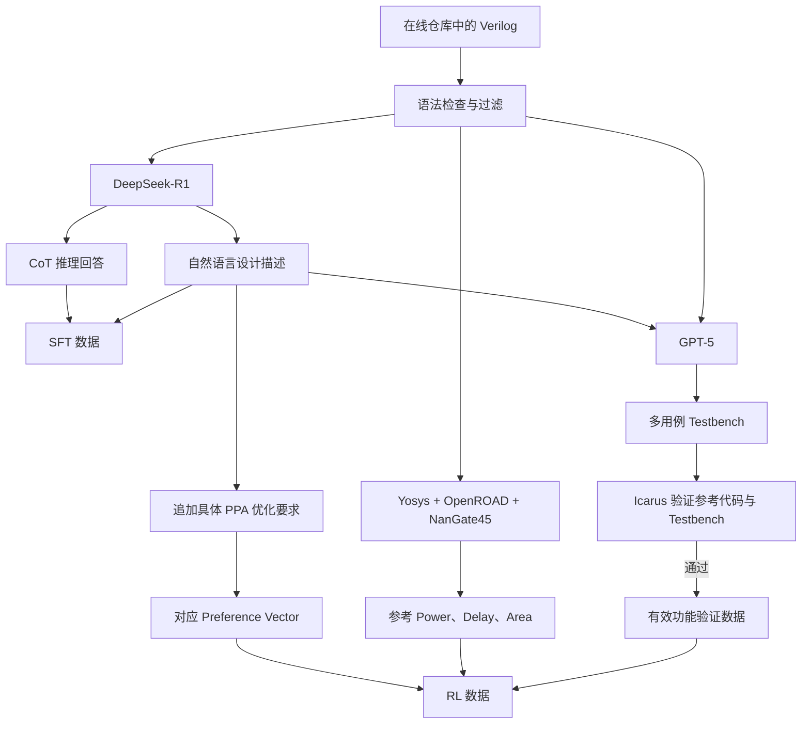
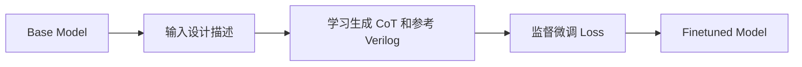
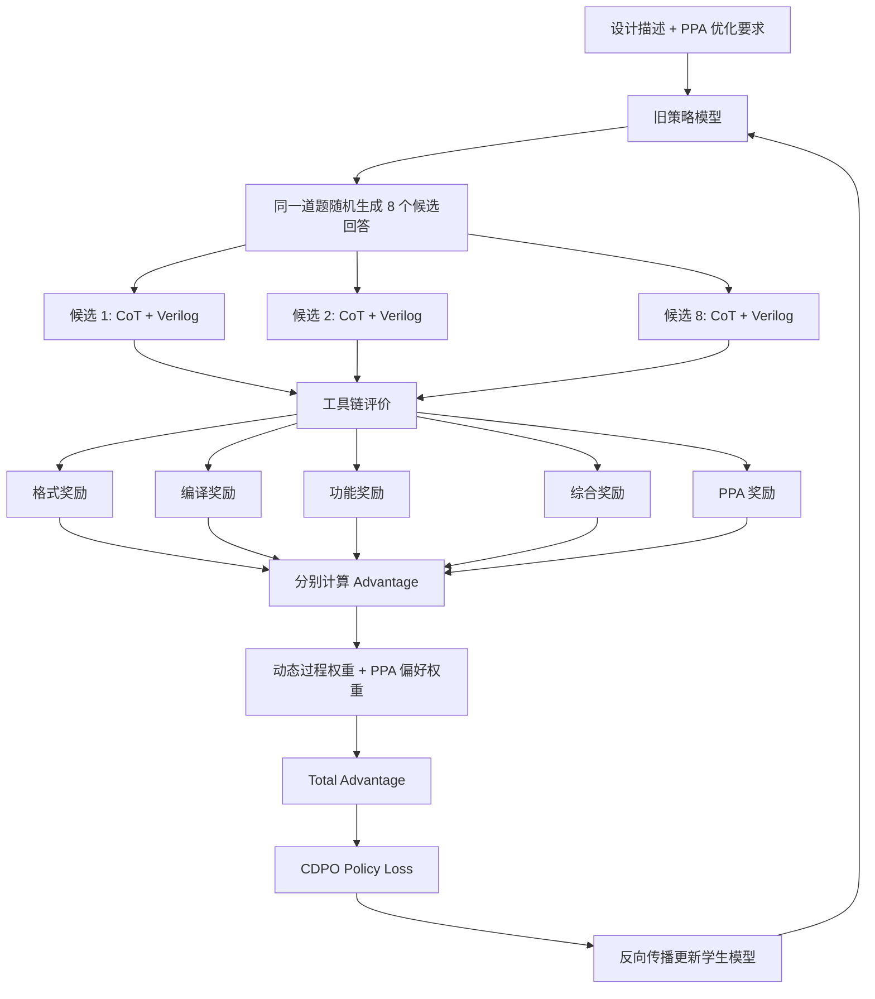

# ChipSeek 闭环训练流程：原论文核对版

```text
+----------------------------------------------------------+
|  ChipSeek 三阶段流水线（原论文 Figure 2 拆析）            |
|                                                          |
|   [离线构造 SFT 数据]                                    |
|    DeepSeek-R1 把裸 Verilog → 设计描述 + CoT 答案        |
|           ↓                                              |
|   [SFT 冷启动]                                           |
|    学生模型学习生成 CoT + Verilog                         |
|           ↓                                              |
|   [CDPO 强化学习]                                        |
|    同一题 8 候选 × EDA 评分 → Advantage → Policy Loss     |
|           ↓                                              |
|        ChipSeek                                          |
+----------------------------------------------------------+
```

> 原论文：`D:\AI4eda\chipseek\2507.04736v2.pdf`  
> 重点依据：正文第 3 节、Figure 2、公式 (1)～(10)、附录 Algorithm 1、附录 B、附录 I.1。  
> 本地实现核对：`data/.../data.parquet`、`reward_verilog.py`、`dapo_verilog.py`、`cdpo_ray_trainer.py`、`core_algos.py` 和 Qwen CDPO 启动脚本。  
> 表述约定：✅ 为“论文明确写出”；⚠️ 为“实现推断或标准做法”，需继续核对代码。  
> 公式显示：全文用纯文本代码块，避免 LaTeX 定界符不兼容问题。

---

## P1. 为什么需要强化学习而不止是 SFT？

SFT 让模型“模仿”参考 Verilog，但它不告诉模型：

- 这段代码面积比参考大还是小；
- 这条路径延迟是否更差；
- 同样功能的不同写法，哪一种 PPA 更优。

```text
SFT 教会：看到题目 → 写出“像参考答案”的 Verilog
RL 教会：看到题目 + 优化目标 → 写出“功能对且 PPA 好”的 Verilog
```

⚠️ 论文 Table 7 显示，部分模型 SFT 后功能指标提升，PPA 反而变差；加入 CDPO 后 PPA 才明显改善。

---

## 1. 先区分论文中出现的三个模型角色

| 角色 | 使用的模型 | 实际工作 | 是否最终成为 ChipSeek |
|---|---|---|---|
| SFT 数据构造模型 | DeepSeek-R1 | 根据已有 Verilog 补充自然语言设计描述和 CoT 推理回答 | 否 |
| Testbench 构造模型 | GPT-5 | 根据设计描述和参考 Verilog 生成多用例 Testbench | 否 |
| 被训练的学生模型 | CodeLlama、CodeQwen、DeepSeek-Coder、Qwen2.5-Coder 等 | 先做 SFT，再做 CDPO 强化学习 | 是 |

```text
DeepSeek-R1：制作 SFT 教材
GPT-5：     制作功能验证程序
学生模型：  真正被梯度更新，最终成为 ChipSeek

Base Model
    ↓ SFT
Finetuned Model
    ↓ CDPO 强化学习
ChipSeek
```

---

## 2. 原论文闭环流程的正确拆分

原论文 Figure 2 把数据构造、SFT 和 RL 画在一张图里，容易误以为所有内容同时输入模型。实际拆成三部分。

### 2.1 训练前：离线构造数据



### 2.2 第一阶段：SFT 冷启动



### 2.3 第二阶段：CDPO 强化学习



---

## 3. DeepSeek-R1 构造的 SFT 数据是什么

✅ 论文第 3.4 节：从在线仓库收集 Verilog → 语法检查 → 用 DeepSeek-R1 补充自然语言描述和 CoT 推理链。

输入一段裸 Verilog（如两输入 XOR），输出包含两部分：

```text
设计描述：
  请实现一个名为 top_module 的两输入异或门。
  输入为 a 和 b，输出为 y。
  当两个输入不同时，y 为 1；否则为 0。

推理回答：
  该模块属于组合逻辑，不需要时钟和寄存器。
  异或功能可以直接用 Verilog 的 ^ 运算符实现。
  <answer>参考 Verilog 代码</answer>
```

两个阶段视角：

```text
数据构造：DeepSeek-R1 输入已有 Verilog → 输出设计描述和 CoT 回答
学生 SFT：  学生模型输入设计描述 → 监督目标为 CoT 回答 + 参考 Verilog
```

---

## 4. GPT-5 在论文中到底做什么

✅ 论文第 3.4 节：

```text
We use GPT-5 to generate multi-case testbenches for our Verilog codes.
```

✅ 附录 I.1 给出 Testbench Generation Prompt。GPT-5 接收：

```text
Verilog description: {instruction}
Verilog code:        {output}
```

- `instruction` 是设计描述；
- `output` 是参考 Verilog；
- GPT-5 输出完整 Testbench。

模板要求：根据复杂度设置测试数量，至少 10 个用例，通过时打印 `Design passed`，失败时打印错误数量，最后调用 `$finish`。

```text
GPT-5 根据题目描述和参考 Verilog，自动生成多用例 Testbench。
```

它不是根据 PPA 生成 Testbench，也不参加学生模型的反向传播。

### 4.1 为什么需要 GPT-5

参考 Verilog 能计算“给定输入的正确输出”，但不会自动决定测试哪些输入、边界场景、时钟/复位时序、运行周期、错误统计与仿真结束时机。GPT-5 主要负责生成激励、时序外壳和判定逻辑。

### 4.2 GPT-5 是不是多余的

不是算法上不可替代。可替代方案：题库自带 Testbench、人工编写、reference module 对拍、随机/约束随机测试、cocotb、assertion、形式验证、小规模组合逻辑穷举。

✅ 论文用 GPT-5 的价值：在线仓库大量 Verilog 没有配套 Testbench，自动生成显著降低数据准备成本。

### 4.3 GPT-5 生成错误 Testbench 怎么办

✅ 论文有 verification pipeline，只保留参考 Verilog 能通过的“代码-Testbench 对”：

```text
GPT-5 生成 Testbench
        ↓
参考 Verilog + Testbench 编译、仿真
        ↓
参考代码通过全部测试
        ↓
该数据才进入 RL 数据集
```

⚠️ 这能排除明显错误，但不能证明覆盖率充分。测试过弱仍可能放过错误候选。

---

## 5. 参考 Verilog 和参考 PPA 分别有什么作用

参考 Verilog 三项用途：SFT 参考回答中的代码、验证 GPT-5 生成的 Testbench、通过 EDA 工具得到参考 PPA。

```text
参考 Verilog → Yosys 综合 → OpenROAD 后端分析 → NanGate45 标准单元库
                ↓
        参考功耗、参考延迟、参考面积
```

参考 PPA 是候选设计的比较基准，不是学生模型的回答内容。

---

## 6. SFT 阶段的完整输入、目标和输出

✅ 论文报告 SFT 使用 29,127 条数据。本地主 SFT JSON 为 10,000 条，可能是子集或单独导出。

一条 SFT 记录：

```text
输入：  System Prompt + Design Description
目标：  <thinking>设计推理过程</thinking>
        <answer>参考 Verilog</answer>
```

SFT Loss 标准 decoder-only 负对数似然：

```text
L_SFT(theta) = -(1/N_response) * sum_t log P_theta(
    reference_response[t] | prompt, reference_response[0:t]
)
```

训练目标：给定设计描述，提高生成参考回答的整体概率。推理时模型只看到新题目。

---

## 7. RL 数据中哪些内容给模型看，哪些不给模型看

✅ 论文报告 RL 使用 8,453 条数据，与本地 `data.parquet` 的 8,453 行一致。

### 7.1 学生模型真正看到的输入

✅ 附录 I.4 给出最终 Prompt 组成：

```text
System Thinking Prompt
+ Code Guiding Prompt
+ Design Description
+ Design Priority Prompt
```

例如：

```text
请按照 <thinking>/<answer> 格式回答。
使用 Verilog 实现 barrel_shifter。
请重点优化面积。
```

### 7.2 学生模型看不到的隐藏判卷材料

Testbench、参考 Verilog、参考 PPA、结构化 Preference Vector、工具运行结果。模型主要通过 Prompt 中的自然语言优化要求知道要优化面积、功耗还是延迟。

### 7.3 一条本地 RL 数据怎样分给模型和判卷器

主文件：`data/verilog_reasoning_data_cdpo_ppa_with_preferences/data.parquet`，8,453 行。

| 字段 | 内容 | 使用者 |
|---|---|---|
| `prompt` | System Prompt、功能描述、PPA 自然语言要求 | 学生模型 |
| `gold_standard_solution` | 参考 Verilog | 离线数据构造与核对；RL 不把它当监督标签 |
| `verification_info.testbench` | 功能仿真 Testbench | Reward Manager |
| `verification_info.top_module` | 综合顶层模块名 | Reward Manager |
| `ppa_metrics` | 参考 Verilog 的功耗、面积、延迟 | Reward Manager |
| `preference_vector` | Power、Area、Delay 的数值权重 | CDPO Trainer |
| `problem_id` | 标识同一道题及其候选组 | 数据分组与日志 |

三类信息分工：

```text
自然语言偏好：告诉模型应该优化什么
结构化偏好：   告诉训练器怎样组合三个 PPA Advantage
参考 PPA：     告诉 Reward Manager 用什么基准评价生成设计
```

Prompt 写“优化面积”但结构化向量给 Power 最大权重，会发出冲突信号，因此必须保持一致。

---

## 8. 为什么同一个模型能够生成多个候选

Decoder-only 模型每步给出下一段内容的概率分布。随机 sampling 时，同一 Prompt 每次按分布抽样，早期差异会让整份 Verilog 结构不同。

### 8.1 论文的实际采样参数

✅ 附录 B：

```text
Batch Size：             32 个 Prompt
每个 Prompt 候选数：      8 个 Responses
Training Temperature：    1.0
Training top_p：          1.0
Validation top_p：        0.7
Max Prompt Length：      2048
Max Response Length：    8192
```

一次 RL Step 约产生：

```text
32 道题 × 每题 8 个候选 = 256 个 Rollouts
```

vLLM 是运行学生模型的高性能推理引擎，不是另一个语言模型。学生模型决定生成内容，vLLM 负责批量执行与 KV Cache 管理。

### 8.2 为什么必须有多个候选

CDPO 需要比较同一道题的不同实现：

```text
候选 A：语法错误
候选 B：功能错误
候选 C：功能正确，但 PPA 一般
候选 D：功能正确，且 PPA 更好
```

✅ 论文附录 B 说明：全候选同奖励的样本会被过滤。

---

## 9. 每个候选怎样经过奖励工具链

### 9.1 Reward Vector

每个候选得到七维奖励：

```text
r_fmt    格式奖励
r_syn    Icarus 编译奖励
r_func   Testbench 功能奖励
r_sys    Yosys/OpenROAD 综合奖励
r_power  功耗奖励
r_delay  延迟奖励
r_area   面积奖励
```

### 9.2 七个奖励的分类与 IC 环节对应

```text
过程奖励 R_process：format、syntax、synth
核心奖励 R_core：    function、power、area、delay
```

| 奖励 | 检查内容 | 工具或实现 | 对应环节 | CDPO 分类 |
|---|---|---|---|---|
| `format` | 回答是否满足 `<thinking>...<answer>...</answer>` 结构 | 正则格式检查器 | 模型输出协议检查 | 过程奖励 |
| `syntax` | 候选 Verilog 与 Testbench 能否成功编译 | Icarus Verilog | RTL 前端编译检查 | 过程奖励 |
| `function` | 候选在 Testbench 所有用例中行为是否正确 | Icarus `vvp` 仿真 | RTL 功能验证 | 核心奖励 |
| `synth` | 候选 RTL 能否转为有效门级实现 | Yosys/OpenROAD | 逻辑综合 | 过程奖励 |
| `power` | 相对参考设计的功耗表现 | OpenROAD 报告 | 综合后 PPA | 核心奖励 |
| `area` | 相对参考设计的标准单元面积 | Yosys/OpenROAD | 综合后 PPA | 核心奖励 |
| `delay` | 相对参考设计的关键路径延迟 | OpenROAD STA | 综合后时序 | 核心奖励 |

评价链：

```text
模型完整回答
  ├─→ format：独立检查回答协议
  │
  └─→ 提取候选 RTL
        ↓ syntax
      RTL 编译成功
        ↓ function
      RTL 功能仿真正确
        ↓ synth
      逻辑综合成功
        ↓ power / area / delay
      PPA 质量评价
```

### 9.3 二值奖励与层级门控

```text
格式符合要求：r_format = 1，否则 0
编译成功：    r_syntax = 1，否则 0
全部测试通过：r_function = 1，否则 0
能够综合：    r_synth = 1，否则 0
```

✅ 论文层级门控：

```text
Syntax → Function → Synthesis → PPA
```

- 编译失败：后续奖励全 0；
- 功能失败：不再运行综合和 PPA；
- 综合失败：不计算 PPA。

| 候选情况 | `syntax` | `function` | `synth` | PPA |
|---|---:|---:|---:|---:|
| 编译失败 | 0 | 0 | 0 | 0 |
| 编译成功但功能失败 | 1 | 0 | 0 | 0 |
| 功能正确但综合失败 | 1 | 1 | 0 | 0 |
| 功能正确且综合成功 | 1 | 1 | 1 | 继续计算 |

综合成功率 = 成功综合候选数 / 全部 B*G 候选（不是条件成功率）。

### 9.4 PPA Reward

✅ 原论文定义：

```text
对于 m ∈ {power, delay, area}：

reward_m = reference_metric_m / generated_metric_m
```

```text
reward_m > 1：候选优于参考
reward_m = 1：候选与参考相当
reward_m < 1：候选差于参考
```

功能错误的设计在 Function 阶段被拦截，不会拿到 PPA 高分。

⚠️ 本地实现上限截断：

```text
power_reward = min(3.0, reference_power / generated_power)
area_reward  = min(3.0, reference_area  / generated_area)
delay_reward = min(3.0, reference_delay / generated_delay)
```

### 9.5 PPA 具体口径

| 指标 | 本地字段 | 含义 |
|---|---|---|
| Power | `power.total_power_W` | OpenROAD `report_power` 总功耗 |
| Area | `area.design_area_um2` | NanGate45 映射后标准单元面积之和 |
| Delay | `performance.max_path_delay_ns` | OpenROAD STA 最大路径延迟 |

参考与生成 Verilog 必须在相同顶层、Liberty/LEF、Yosys 流程、时钟/活动率假设和 OpenROAD 口径下比较。

⚠️ 当前流程是快速统一工具估计，不是完整 Signoff，未完整执行 floorplan、placement、CTS、routing。

### 9.6 参考 PPA 和生成 PPA 为什么都需要

```text
参考 PPA：  建立这道题自己的基准（离线计算一次）
生成 PPA：  测量本轮候选的实际工具结果
二者比值： 把不同量级的题转换为“相对参考改善多少”
```

例如候选面积同为 `500 um^2`：参考面积 1000 时 reward=2，参考面积 10 时 reward=0.02。

---

## 10. Reward 怎样变成 Advantage

### 10.1 比较范围：同一道题的 8 个候选

第 `i` 个候选得到七维 Reward Vector：

```text
r_i = [r_format(i), r_function(i), r_syntax(i),
       r_synth(i), r_power(i), r_area(i), r_delay(i)]
```

CDPO 比较单位是“同一个 Prompt 下的 8 个候选互相比较”，不能直接把 XOR 和 FIFO 的绝对面积混排。

### 10.2 分量标准化

对第 `k` 个奖励分量，收集同题 8 个候选的值，计算均值和标准差：

```text
mean_k = mean over i of r_k(i)
std_k  = std  over i of r_k(i)

A_hat_k(i) = (r_k(i) - mean_k) / (std_k + epsilon)
```

每个候选得到七个分量 Advantage：

```text
A_vector(i) = [A_format, A_function, A_syntax,
               A_synth, A_power, A_area, A_delay]
```

### 10.3 Advantage 是相对信号

```text
Reward：  候选相对参考设计的结果
Advantage：候选相对同组平均水平的结果
```

即使 `reward_area < 1`，只要比同组其他候选好，`A_area` 仍可能为正；反之亦然。如果某列 8 个候选完全相同，该列 Advantage 全 0，不产生区分信号。

---

## 11. 过程奖励的动态课程权重

✅ 本节对应原论文第 3.3.2 节公式 (2)～(5)、附录 Algorithm 1 第 9～18 行；本地实现见 `RayCDPOTrainer._update_curriculum_weights`、`_build_weight_tensor`。

过程奖励：format、syntax、synth，决定模型是否具备进入功能和 PPA 优化的基本能力。

### 11.1 全批成功率

设 `B` = Prompt 数，`G` = 每 Prompt 候选数（论文 `G=8`）。第 `k` 项过程奖励为二值 `r_k(j,i) ∈ {0,1}`，则：

```text
success_rate_k = [sum over j,i r_k(j,i)] / (B*G)
```

分母是候选总数 `B*G`，不是 `B`。

### 11.2 即时课程信号

```text
alpha_instant_k = max(0, 1 - success_rate_k)
```

即当前 Batch 的失败率。

### 11.3 EMA 平滑

```text
alpha_k(current) = beta * alpha_k(previous) + (1 - beta) * alpha_instant_k
```

⚠️ 本地配置 `beta = 0.9`：

```text
当前课程权重 = 90% 历史权重 + 10% 当前 Batch 失败率
```

⚠️ 本地初始化：`alpha_format(0) = alpha_syntax(0) = alpha_synth(0) = 1.0`。

### 11.4 进入 Total Advantage

```text
A_process(i) = alpha_format * A_format(i)
             + alpha_syntax * A_syntax(i)
             + alpha_synth  * A_synth(i)
```

随着训练推进，成功率接近 100% 的过程项 `alpha` 会自然衰减，但功能权重和 PPA 偏好权重始终保留。

---

## 12. 功能奖励、PPA 偏好与 Total Advantage

✅ 本节对应原论文第 3.3.2 节公式 (6)～(7)、附录 Algorithm 1 第 16～18 行。

### 12.1 A_core 与 A_total

```text
A_core(i) = function_weight   * A_function(i)
          + power_preference  * A_power(i)
          + area_preference   * A_area(i)
          + delay_preference  * A_delay(i)

A_total(i) = A_process(i) + A_core(i)
```

其中：

```text
power_preference + area_preference + delay_preference = 1
```

⚠️ 本地 `function_weight = 1.0`，直接消费数据中的 Preference Vector，缺失时回退到 `(1/3, 1/3, 1/3)`。

### 12.2 为什么 Preference 和为 1

把“优化方向”与“奖励总强度”分离。`(0.8, 0.1, 0.1)` 与 `(8.0, 1.0, 1.0)` 相对比例相同，但后者会整体放大 10 倍 PPA 信号。归一化后，不同偏好 Prompt 只改变方向，不改变 PPA 部分的名义尺度。

功能正确性单独保留固定权重，表达“首先必须功能正确，再在 PPA 内部做取舍”。

### 12.3 同一批候选在不同偏好下会得到相反结论

| 候选 | Power Advantage | Area Advantage |
|---|---:|---:|
| X | +1 | -1 |
| Y | -1 | +1 |

面积偏好 `(0.1, 0.8, 0.1)`：`A_PPA(X) = -0.7`，`A_PPA(Y) = +0.7`。
功耗偏好 `(0.8, 0.1, 0.1)`：`A_PPA(X) = +0.7`，`A_PPA(Y) = -0.7`。

Preference Vector 就是在明确多目标冲突下的权衡。

---

## 13. Total Advantage 怎样进入 CDPO Policy Loss

✅ 本节对应原论文公式 (8)～(10) 和附录 Algorithm 1 第 19～23 行；本地 Loss 还包含 VeRL 数值稳定性处理与 Dual-Clip PPO 负 Advantage 裁剪。

### 13.1 Policy 是什么

Policy 就是学生模型在给定上下文时对下一个 Token 的概率分布：

```text
pi_theta(token_t | prompt, token_0, ..., token_(t-1))
```

Policy Loss 根据 Advantage 调整已采样 Token 的概率：

```text
正 Advantage：提高该生成路径的概率
负 Advantage：降低该生成路径的概率
```

### 13.2 old 与 current 是同一模型的两个角色

```text
old：     生成本轮候选时的固定策略；log_prob 停止梯度
current： 当前正在被优化的可训练策略；第一次 Loss 前参数与 old 相同
```

时间线：`theta_k` → 作为 old 生成 8 候选 → 固定 logP_old → EDA 计算 A_total → current 从 `theta_k` 算 Loss → backward → `theta_(k+1)` → 下一轮作为新的 old。

### 13.3 每个 Token 的新旧策略概率比

```text
P_old(i,t)     = pi_old(    y_(i,t) | prompt, y_(i,<t) )
P_current(i,t) = pi_theta( y_(i,t) | prompt, y_(i,<t) )

rho(i,t) = P_current(i,t) / P_old(i,t)
         = exp( logP_current(i,t) - logP_old(i,t) )
```

⚠️ 本地先把 `delta_logP` 限制在 `[-20, 20]` 再取指数，防止数值溢出。

### 13.4 第一次 old 等于 current，为什么仍能训练

第一次 `theta_current = theta_old`，`rho = 1`。但 `logP_old` 停止梯度，`logP_current` 可微：

```text
d rho / d logP_current = rho

d L / d logP_current = -A_total(i) * rho(i,t)
```

只要 `A_total != 0`，即使 `rho = 1` 梯度也不为 0。

### 13.5 论文的 Clipped Objective

⚠️ 本地训练参数：

```text
clip_ratio_low  = 0.20   → 下界 0.80
clip_ratio_high = 0.28   → 上界 1.28
```

论文目标（代码取负后最小化）：

```text
loss_1(i,t) = -A_total(i) * rho(i,t)
loss_2(i,t) = -A_total(i) * clip(rho(i,t), 0.80, 1.28)
loss_ppo(i,t) = max(loss_1, loss_2)
```

正 Advantage 时，`rho > 1.28` 不再额外收益，限制单次更新幅度。

### 13.6 本地负 Advantage 非对称裁剪

⚠️ 本地还设置 `clip_ratio_c = 10.0`：

```text
如果 A_total(i) >= 0：
    loss_token(i,t) = loss_ppo(i,t)

如果 A_total(i) < 0：
    loss_token(i,t) = min( -A_total(i) * 10, loss_ppo(i,t) )
```

给负 Advantage 样本的极端惩罚加以上限。

### 13.7 完整 Batch 聚合

```text
L_prompt = sum over i=1..8, t mask(i,t)*loss_token(i,t)
           / sum over i=1..8, t mask(i,t)
```

⚠️ 本地 `loss_agg_mode = token-mean`。

概念上全批 256 条回答做 Token 平均后 `backward + optimizer.step`。实际训练再拆成 PPO Mini-batch/Micro-batch 以节省显存。

### 13.8 完整数值例子（从成功率到 Token Loss）

```text
[全批统计]  B=2, G=8, 总候选 16
format 通过 15, syntax 通过 12, synth 通过 7
success_rate  = [0.9375, 0.7500, 0.4375]
alpha_instant = [0.0625, 0.2500, 0.5625]

假设上一轮 EMA alpha = [0.10, 0.30, 0.60], beta=0.9
本轮 alpha = 0.9*prev + 0.1*instant = [0.09625, 0.29500, 0.59625]

[同题组内标准化：第一个 Prompt 的候选 i]
A_format   = +0.3536  (7/8 通过)
A_syntax   = +0.5401  (6/8 通过)
A_function = +0.9354  (4/8 通过)
A_synth    = +1.2076  (3/8 通过)

[过程 Advantage]
A_process = 0.09625*0.3536 + 0.29500*0.5401 + 0.59625*1.2076
          ≈ 0.9134

[核心 Advantage，面积偏好 (0.1, 0.8, 0.1)]
A_power=-0.4, A_area=+0.8, A_delay=+0.2
A_core = 1.0*0.9354 + 0.1*(-0.4) + 0.8*(+0.8) + 0.1*(+0.2)
       = 1.5554

[Total Advantage]
A_total = A_process + A_core = 2.4688

[Token 概率比]  P_old=0.20, P_current=0.22 → rho=1.10

[Clipped Loss，rho 在 [0.80, 1.28] 内]
loss_token = -A_total * rho = -2.4688 * 1.10 ≈ -2.7157

[Batch 聚合]
L_batch = 所有有效 Token 的 loss_token 之和 / 有效 Token 数
backward + optimizer.step
```

链路压缩：

```text
全批 0/1 Reward → success_rate → alpha_instant → EMA alpha
同题各维 Reward → 各维组内 Advantage → A_process + A_core → A_total
old/current Log Probability → rho → clipped loss_token → token-mean L_batch → backward
```

---

## 14. Policy Loss 怎样回传到模型参数

### 14.1 可微路径与不可微路径

```text
L_CDPO
  ↓
rho：current/old 概率比
  ↓
current 对已生成 Token 的 Log Probability
  ↓
模型输出分布
  ↓
Transformer 参数 theta
```

EDA 工具不在计算图中：

```text
候选 Verilog → Icarus/Yosys/OpenROAD → Reward → Advantage（停止梯度常数）
```

### 14.2 整条回答使用同一个 Advantage

候选 D 的 `A_total(D)=+1.47` 会广播到所有有效输出 Token。模型不知道“哪一行减少了面积”，只能通过大量候选的统计相关性学习生成倾向。

### 14.3 一次完整更新

```text
1. 读取 32 个 Prompt
2. old 每题采样 8 个候选
3. 工具链产生七维 Reward Vector
4. 各奖励分量在同题 8 候选内标准化
5. 动态过程权重 + Preference 合成 A_total
6. current 对每个已生成 Token 重算 Log Probability
7. 每 Token rho 和 Clipped Policy Loss
8. 所有有效输出 Token 平均
9. backward + optimizer.step
10. 下一轮把更新后的 current 作为新的 old
```

### 14.4 工艺信息是否应该进入 Prompt

当前训练固定 NanGate45，模型通过大量 EDA Reward 隐式学习。若需跨工艺、跨时钟约束，Prompt 至少应包含 Technology/Corner、目标时钟周期、功耗活动率、允许延迟/吞吐、Preference Vector、允许/禁止单元类别、综合与时序约束摘要。不建议把整个 Liberty 文件塞进 Prompt。

---

## 15. SFT 与 RL 的输入输出总表

| 阶段 | 该模型的输入 | 该模型的输出 | 怎样训练或验证 |
|---|---|---|---|
| DeepSeek-R1 数据构造 | 已有 Verilog | 设计描述、CoT 回答 | 离线生成，不更新学生模型 |
| GPT-5 数据构造 | 设计描述、参考 Verilog | Testbench | 用参考代码仿真验证 |
| 学生模型 SFT | 设计描述 | CoT + 参考 Verilog | 参考回答负对数似然 |
| 学生模型 RL Rollout | 设计描述 + PPA 优化要求 | 8 个不同 CoT + 候选 Verilog | 随机 Sampling |
| Reward Manager | 候选代码、Testbench、顶层模块、参考 PPA | 七维 Reward Vector | Icarus/Yosys/OpenROAD |
| CDPO Advantage | 同题 8 个七维 Reward、课程权重、Preference Vector | 每个候选的 `A_total` | 分量标准化后加权 |
| CDPO Actor Update | 固定候选、`old_log_prob`、`current_log_prob`、`A_total` | 更新后的学生模型参数 | 每 Token Clipped Policy Loss |

---

## 16. 一条样本怎样走完整流程

以 Barrel Shifter 为例。

### 16.1 离线构造

```text
参考 Verilog
    ↓ DeepSeek-R1
设计描述 + CoT 回答
    ↓ GPT-5
多用例 Testbench
    ↓ Icarus
确认参考代码通过
    ↓ Yosys/OpenROAD
参考 Power、Delay、Area
    ↓
追加“请重点优化面积”
```

### 16.2 SFT

```text
输入：Barrel Shifter 设计描述
监督目标：CoT + 参考 Verilog
结果：学生模型具备基本 RTL 生成能力
```

### 16.3 RL

同一题生成 8 个候选。某个候选写成三级条件移位：

```verilog
assign shift_4 = ctrl[2] ? (in >> 4) : in;
assign shift_2 = ctrl[1] ? (shift_4 >> 2) : shift_4;
assign shift_1 = ctrl[0] ? (shift_2 >> 1) : shift_2;
```

该候选格式正确、编译成功、功能通过、可综合、面积更小，得到较高面积 Advantage。✅ 论文 Case Study 报告该设计代码规模减少 63.9%，面积降低 13.3%。

---

## 17. 原论文明确写了什么，哪些属于实现解释

### 17.1 ✅ 论文明确写明

DeepSeek-R1 补充设计描述和 CoT；GPT-5 生成 multi-case Testbench；GPT-5 Prompt 同时包含设计描述和参考 Verilog；SFT 使用 29,127 条数据；RL 使用 8,453 条数据；每个 Prompt 生成 8 个 Response；RL Batch Size 为 32；Temperature 1.0，top_p 1.0；奖励包括格式、编译、功能、综合和 PPA；使用分量 Advantage、动态过程权重和 PPA Preference；使用新旧策略概率比和非对称 Clipping；最小化负的 Clipped Objective 更新模型参数。

### 17.2 ⚠️ 论文没有完全展开、需结合代码理解

SFT 是否只对 Assistant 区域计算 Loss Mask；GPT-5 Testbench 的覆盖率评价方法；每个工具错误类型的具体 Reward 细节；Reward 异常值和 PPA 分母接近 0 时的处理；是否针对不同电路类型使用额外约束；实际代码中的梯度累积、优化器更新周期等细节。

---

## 18. 当前本地数据与论文的对应关系

| 论文概念 | 本地字段 |
|---|---|
| 设计描述 | SFT `instruction`；RL `prompt` 的 user content |
| CoT + 参考回答 | SFT `output` |
| 参考 Verilog | `gold_standard_solution` |
| Testbench | `verification_info.testbench` |
| 顶层模块 | `verification_info.top_module` |
| 参考 PPA | `ppa_metrics` |
| PPA 偏好 | `preference_vector` |

数量关系：

```text
论文 SFT：29,127 条      当前本地主 SFT：10,000 条
论文 RL：  8,453 条      当前本地主 RL Parquet：8,453 条
```

本地 RL 数据与论文数量一致，SFT 更像子集或单独导出。

### 18.1 当前本地偏好数据的配对情况

```text
RL 记录总数：8,453
唯一 problem_id：7,050
出现重复记录的 problem_id：1,276
同一 problem_id 对应多种 preference_type：0
```

说明本地数据包含 `area`、`power`、`delay`、两两组合和均衡等多种偏好，但同一道题没有系统构造多偏好配对。若需更严格训练可控 PPA 权衡，建议对同一道题构造多条 Preference Vector 记录。

---

## 19. 最容易混淆的几个结论

| 误区 | 正确理解 |
|---|---|
| GPT-5 参与最终推理 | ❌ 不参与部署，只用于训练前制作 Testbench |
| Testbench 和 PPA 是模型回答 | ❌ 是 Reward Manager 的判卷材料 |
| RL 是选最好候选再做 SFT | ❌ CDPO 同时用正负 Advantage 更新策略分布 |
| Reward 直接反向传播 | ❌ EDA 不可微；Reward 只决定梯度方向和强度 |
| SFT 提高功能就会让 PPA 变好 | ❌ SFT 后 PPA 可能变差，CDPO 才改善 PPA |
| vLLM 是学生模型 | ❌ vLLM 是推理引擎，学生模型决定生成内容 |
| old 和 current 是两个不同模型 | ❌ 是同一模型在一次更新中的两个角色，第一次参数相同但梯度属性不同 |
| 8 个候选各算一个序列 rho | ❌ 每个候选只有一个 `A_total`，每个 Token 有自己的 `rho` 和 `loss` |
| PPA 三项一开始就混成一个值 | ❌ Power/Area/Delay 先分别标准化成 Advantage，再按 Preference 合成 `A_total` |

---

## 20. 最终完整闭环

```text
在线 Verilog
  ↓
语法过滤
  ↓
DeepSeek-R1 生成设计描述和 CoT
  ↓
构造 SFT 数据
  ↓
Base Model 做监督微调
  ↓
得到 Finetuned Model

同时：
参考 Verilog + 设计描述
  ↓
GPT-5 生成 Testbench
  ↓
参考代码验证 Testbench

参考 Verilog
  ↓
Yosys/OpenROAD 提取参考 PPA

设计描述
  ↓
加入 PPA 优化 Prompt 和 Preference Vector
  ↓
形成 RL 数据

Finetuned Model 作为本轮 old
  ↓
模型只读取设计描述 + PPA 自然语言要求
  ↓
每题随机生成 8 个候选并固定 old_log_prob
  ↓
格式 → 编译 → 功能 → 综合 → PPA
  ↓
每个奖励分量分别计算 Advantage
  ↓
过程奖励动态权重 + PPA 偏好权重
  ↓
Total Advantage
  ↓
current 对每个候选 Token 重算 current_log_prob
  ↓
每 Token 计算 rho 和 Clipped Policy Loss
  ↓
对有效输出 Token 求平均
  ↓
按 Mini-batch 反向传播更新 current
  ↓
下一轮把更新后的 current 作为新的 old
  ↓
ChipSeek
```

一句话总结：

> DeepSeek-R1 把在线 Verilog 变成可用于监督学习的题目和参考回答，GPT-5 生成自动功能验证所需的 Testbench，EDA 工具给候选设计打分；学生模型先通过 SFT 学会基本 RTL 生成，再在 RL 中对同一道题采样多个候选，用工具奖励形成 Advantage 和 Policy Loss，最终通过普通反向传播更新 Transformer 参数。

---

## 组会讨论问题

1. **SFT 与 RL 的边界**：ChipSeek 先用 SFT 做冷启动，再用 CDPO 做强化学习。如果直接跳过 SFT、用随机初始化模型做 CDPO，训练会面临哪些额外困难？过程奖励的课程权重能否弥补这些困难？

2. **Preference Vector 的设计空间**：论文让 Power/Area/Delay 权重和为 1，但功能权重固定为 1.0。如果让你把“功能正确性”也纳入同一个可调配权重向量，训练动态会出现什么风险？工艺约束（如 NanGate45）是否也应该显式进入 Prompt？

3. **Reward 的信用分配限制**：CDPO 只给出整条回答级 Advantage，模型无法知道“哪一行 RTL 减少了面积”。在这种情况下，模型如何学到具体的 PPA 友好写法？如果未来希望把 OpenROAD 的详细报告（关键路径、单元类型、面积分解）反馈给模型，闭环架构需要怎样修改？
