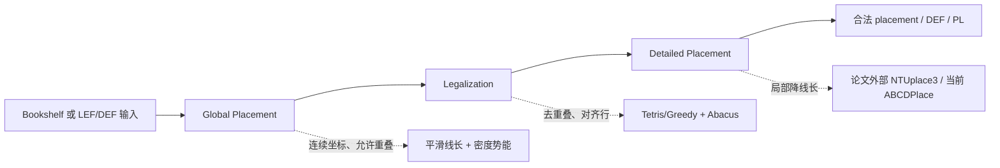
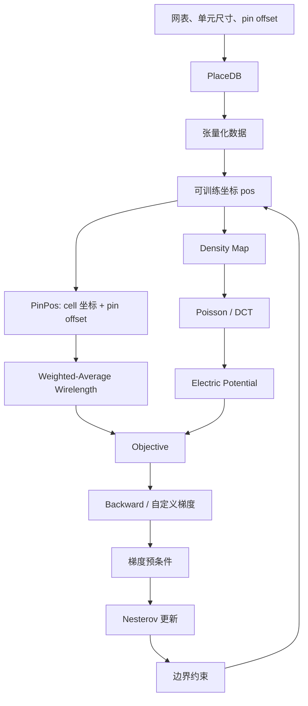
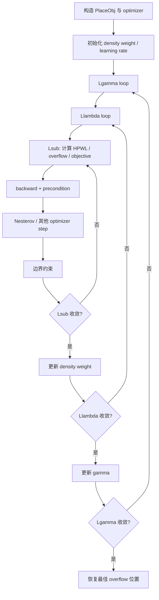
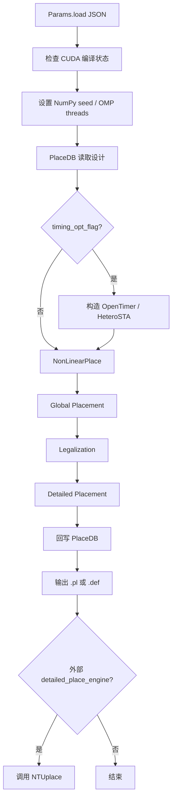
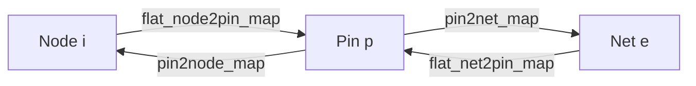
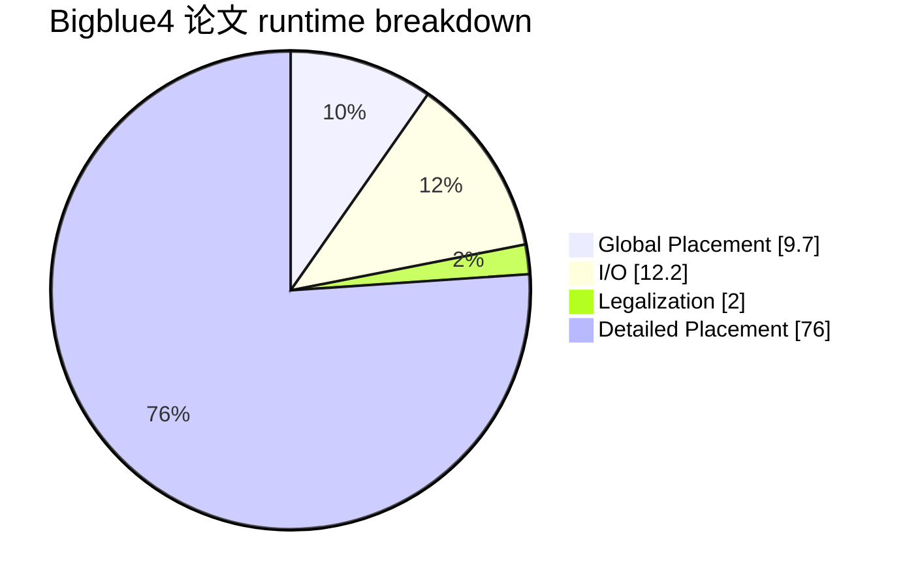

# DREAMPlace：DAC 2019 原论文、当前源码与复现状态详解

> 论文：**DREAMPlace: Deep Learning Toolkit-Enabled GPU Acceleration for Modern VLSI Placement**  
> 会议：56th ACM/IEEE Design Automation Conference（DAC 2019）  
> 本地原文：[DAC2019_DREAMPlace.pdf](DAC2019_DREAMPlace.pdf)  
> 官方 PDF：<https://yibolin.com/publications/papers/PLACE_DAC2019_Lin.pdf>  
> DOI：<https://doi.org/10.1145/3316781.3317803>  
> 官方代码：<https://github.com/limbo018/DREAMPlace>  
> 本地代码：DREAMPlace `4.3.1`，commit `6627f3327e6cc17db7782c0b90073a498531ca3c`  
> 核对日期：2026-08-02  
> 静态审计：[runs/static_audit_20260802.json](runs/static_audit_20260802.json)

```text
┌──────────────────────────────────────────────────────────────┐
│ P1 任务定义                                                   │
├──────────────────────────────────────────────────────────────┤
│ Input：芯片网表超图（节点尺寸、pin offset、placement region、   │
│ rows/sites），以 Bookshelf 或 LEF/DEF 形式输入；外加 target   │
│ density、bin 数、优化配置等超参数。                           │
├──────────────────────────────────────────────────────────────┤
│ Output：每个可移动单元的合法 (x,y) 坐标，以及 HPWL、overflow、 │
│ max density、各阶段 runtime 等指标。                        │
├──────────────────────────────────────────────────────────────┤
│ Supervision：不是监督学习，无标注样本；优化目标是可微的平滑线  │
│ 长（WA）与电势密度惩罚，最终由 HPWL 和合法化约束验证。        │
├──────────────────────────────────────────────────────────────┤
│ Why-hard：百万到千万级单元连续-离散混合优化；HPWL 不可微需    │
│ WA 近似；密度消除重叠需 Poisson/DCT；结果必须合法化到 row/site；│
│ 版本演进快，必须严格区分 DAC 2019 与当前 4.3.1 的边界。       │
└──────────────────────────────────────────────────────────────┘
```

## 0. 先给结论

DREAMPlace 的核心不是训练一个“预测布局的神经网络”，而是：

```text
把所有可移动单元的 x/y 坐标视为 PyTorch 可训练参数，
把平滑线长和密度势能视为 loss，
借助 autograd、CUDA、自定义算子和 Nesterov 优化器求坐标。
```

因此它与常见深度学习任务的区别是：

| 常见深度学习 | DREAMPlace |
|---|---|
| 训练对象是网络权重 | 优化对象是单元坐标 |
| 数据集提供大量样本 | 一个芯片网表本身就是一个优化实例 |
| 得到可迁移的模型 checkpoint | 得到该设计的一份 placement |
| 推理时固定权重做预测 | 不存在论文意义上的“加载模型推理” |
| loss 衡量预测误差 | objective 衡量线长与密度冲突 |

这也解释了为什么本目录没有 `模型推理.md`、checkpoint 或权重文件：

```text
这不是缺了一个神经网络模型；
它本来就是每个设计单独求解的解析布局器。
```

本次没有重新构建、没有重新跑 placement，也没有把“能 import”冒充“已复现”。本目录未找到此前保留的运行日志，因此当前证据状态是：

| 层级 | 状态 | 说明 |
|---|---|---|
| 原论文 | 已归档 | 6 页 PDF，哈希已记录 |
| 源码 | 已逐层核对 | 入口、目标、梯度、CUDA 算子、合法化和详细布局均已定位 |
| 编译产物 | 不存在 | 无 `build/`、`install/` |
| benchmark 数据 | 不存在 | 只有下载脚本和 JSON 配置，没有 ISPD 2005 数据本体 |
| 子模块 | 未初始化 | Limbo、OpenTimer、CUB、munkres-cpp、pybind11 均为空 |
| 历史运行记录 | 未找到 | 无结果目录、HPWL/overflow 曲线和 runtime 日志 |
| 新运行 | 未执行 | 遵守“参考现有记录，不重复推理/运行”的要求 |

## 1. 论文身份与文件校验

### 1.1 论文元数据

| 字段 | 内容 |
|---|---|
| 标题 | DREAMPlace: Deep Learning Toolkit-Enabled GPU Acceleration for Modern VLSI Placement |
| 作者 | Yibo Lin, Shounak Dhar, Wuxi Li, Haoxing Ren, Brucek Khailany, David Z. Pan |
| 会议 | DAC 2019 |
| DOI | `10.1145/3316781.3317803` |
| 页数 | 6 |
| 本地文件 | `DAC2019_DREAMPlace.pdf` |
| 文件大小 | 3,294,945 bytes |
| SHA-256 | `334d1334bc5df6012bdf4f3030345003afe79161569907131a46a5ce63580e38` |

### 1.2 正确下载地址

论文与代码地址均来自作者主页或官方仓库：

```text
论文 PDF
https://yibolin.com/publications/papers/PLACE_DAC2019_Lin.pdf

DOI
https://doi.org/10.1145/3316781.3317803

代码
https://github.com/limbo018/DREAMPlace
```

### 1.3 证据标记约定

本文所有结论按四种来源区分：

| 标记 | 含义 |
|---|---|
| **论文报告** | DAC 2019 正文、公式、表格或实验中的结论 |
| **源码确认** | 本地 commit `6627f3327e6c` 中可以直接读出的实现 |
| **资产确认** | 本地文件、哈希、目录、子模块和数据存在性 |
| **运行确认** | 由本地已保留日志直接支持的结果 |

本目录没有运行确认数据。所以文中的论文 HPWL、runtime 和 speedup 均写作“论文报告”，不能写成“本机复现”。

## 2. 这篇论文到底解决什么问题

### 2.1 Placement 的输入

布局问题的输入可抽象为超图：

```text
H = (V, E)

V：需要放置的标准单元、宏单元和固定对象
E：连接这些对象的 nets
```

实际工具还要读取：

- 单元宽高；
- pin 相对单元的 offset；
- 芯片可放置区域；
- 固定单元和 I/O 位置；
- row/site 信息；
- 目标利用率；
- Bookshelf 或 LEF/DEF/netlist 文件；
- 运行配置 JSON。

### 2.2 Placement 的输出

主要输出是每个可移动单元的合法坐标：

```text
(x_i, y_i), i = 1 ... N_movable
```

并希望同时满足：

1. 总线长尽可能短；
2. 单元不重叠；
3. 单元在芯片边界内；
4. 标准单元对齐 row/site；
5. 后续版本还考虑区域、拥塞、时序、宏单元等约束。

### 2.3 三阶段放置流程



三者不可混为一谈：

| 阶段 | 坐标性质 | 主要目标 | DAC 2019 实现 |
|---|---|---|---|
| Global Placement | 连续 | 找到低线长、低拥塞的整体分布 | DREAMPlace GPU |
| Legalization | 离散、合法 | 消除重叠并对齐 rows | Tetris-like + Abacus |
| Detailed Placement | 离散、合法 | 局部交换/重排继续降 HPWL | 外部 NTUplace3 |

当前 4.3.1 源码已经内置 ABCDPlace 风格详细布局，这不是 DAC 2019 原论文声称实现的部分。

## 3. 为什么论文标题里有“Deep Learning Toolkit”

论文创新点是把解析布局计算映射到深度学习训练框架，而不是让神经网络学习布局规律。

### 3.1 类比关系

| 深度学习训练概念 | DREAMPlace 中的对应项 |
|---|---|
| trainable parameters `w` | 单元位置向量 `(x, y)` |
| data instances | nets / cells / pins 构成的设计实例 |
| prediction error | 平滑线长代价 |
| regularization | 密度势能惩罚 |
| forward | 计算线长与密度 objective |
| backward | 计算每个坐标的梯度/电场力 |
| optimizer step | 更新单元坐标 |
| GPU tensor kernels | 线长、密度、DCT 等并行算子 |

### 3.2 正确的数据流



### 3.3 不存在的环节

DAC 2019 流程中没有：

- 神经网络层；
- 训练集/验证集/测试集划分；
- 模型 checkpoint；
- 预训练权重；
- 跨设计一次前向推理；
- supervised label；
- accuracy、F1 等机器学习指标。

所以介绍时最好说：

> DREAMPlace 是“深度学习工具包赋能的解析布局器”，不是“用深度神经网络预测布局的模型”。

## 4. 数学目标：线长与密度的权衡

论文把 global placement 写成如下形式：

```text
minimize over x,y:

    Σ_e WL(e; x, y) + λ · D(x, y)
```

其中：

| 符号 | 含义 |
|---|---|
| `x, y` | 所有单元的水平、垂直坐标 |
| `e` | 一条 net |
| `WL` | 可微的线长近似 |
| `D` | 密度惩罚/电势能 |
| `λ` | 密度权重，优化过程中逐步调整 |

这个形式直观地表达冲突：

```text
只最小化线长：所有相关单元会挤在一起。
只最小化密度：单元会均匀摊开，但连线可能很长。
两项共同优化：在短线长与可合法化密度之间折中。
```

### 4.1 当前源码中的目标函数

当前 `dreamplace/PlaceObj.py` 的 `obj_fn()` 先计算：

```python
self.wirelength = self.op_collections.wirelength_op(pos)
self.density = self.op_collections.density_op(pos)
```

无 fence region 的基本目标仍是：

```python
result = wirelength + density_weight * density
```

有 fence region 时则变成多区域密度向量与权重向量的点积；当前版本还支持二次密度惩罚。这是论文基本式的扩展。

### 4.2 优化变量在源码中的真实形态

`dreamplace/BasicPlace.py` 将位置存成长度为 `2 * num_nodes` 的一维数组：

```text
pos[0 : num_nodes]                 = 所有节点的 x
pos[num_nodes : 2 * num_nodes]     = 所有节点的 y
```

随后转成：

```python
self.pos = nn.ParameterList([
    nn.Parameter(torch.from_numpy(self.init_pos).to(self.device))
])
```

这里的 `nn.Parameter` 容易让人误认为存在神经网络。实际只是借 PyTorch 的参数和梯度管理机制保存坐标。

## 5. 初始化：论文与当前代码完全对得上

### 5.1 论文方法

论文不用传统线性规划初始布局，而是把可移动单元放到版图中心附近，并加很小的高斯噪声：

```text
x_i ~ Normal(center_x, 0.001 × layout_width)
y_i ~ Normal(center_y, 0.001 × layout_height)
```

论文报告：

- 相比传统初始布局，最终质量差异小于约 `0.04%`；
- 初始布局阶段 runtime 节省约 `21.1%`。

注意：这是论文报告，不是本地重测。

### 5.2 源码对应

当前 `dreamplace/BasicPlace.py` 仍然保留相同逻辑：

```python
np.random.normal(
    loc=(xl + xh) / 2,
    scale=(xh - xl) * 0.001,
    size=num_movable_nodes,
)
```

Y 方向同理。

### 5.3 不要混淆两种 noise

当前配置还有：

```json
"gp_noise_ratio": 0.025
```

这对应 `NonLinearPlace.py` 在优化开始时调用 `noise_op()`，噪声量与**单元自身尺寸**相关：

```text
(uniform_random - 0.5) × node_size × gp_noise_ratio
```

它与中心初始化的 `0.001 × layout span` 不是同一件事：

| 噪声 | 分布尺度 | 作用时机 |
|---|---|---|
| random center init | 版图宽高的 0.1% | 构造初始坐标 |
| `gp_noise_ratio` | 单元尺寸的 2.5%（当前默认） | global placement 开始前扰动 |

## 6. 平滑线长：Weighted-Average Wirelength

### 6.1 为什么不能直接优化 HPWL

HPWL 对每条 net 取 pin 坐标的最大值和最小值：

```text
HPWL(e) = max(x_i) - min(x_i) + max(y_i) - min(y_i)
```

`max/min` 在 pin 身份切换处不光滑，不利于连续梯度优化。因此论文使用 weighted-average（WA）近似。

### 6.2 WA 的一维形式

对一条 net 的 x 坐标：

```text
WA_x(e) =
    Σ_i x_i exp(x_i / γ) / Σ_i exp(x_i / γ)
  - Σ_i x_i exp(-x_i / γ) / Σ_i exp(-x_i / γ)
```

Y 方向同理：

```text
WA(e) = WA_x(e) + WA_y(e)
```

`γ` 越小越接近 HPWL，但数值更尖锐、优化更难；`γ` 较大则更平滑。

### 6.3 数值稳定化

直接计算 `exp(x/γ)` 可能溢出。论文对每条 net 的坐标先减去对应的极值，再进入指数：

```text
exp((x_i - max_x) / γ)
exp((min_x - x_i) / γ)
```

这样指数项不超过 1，数学比值不变，但显著降低 overflow 风险。

### 6.4 当前源码映射

路径：

```text
PlaceObj.build_weighted_average_wl()
    ↓
ops/weighted_average_wirelength/weighted_average_wirelength.py
    ↓
CPU C++ 或 CUDA 扩展
```

Python 包装器提供三类实现：

| 类别 | 思路 | 论文关系 |
|---|---|---|
| regular/net-by-net | 每条 net 处理 | 基线 |
| atomic | pin 级并行并用 atomic 聚合 | 论文重点优化 |
| merged | 前后向融合，减少中间量/调度 | 当前默认，属于后续工程演进 |

当前 `PlaceObj.py` 明确构造：

```python
WeightedAverageWirelength(..., algorithm="merged")
```

因此不能把当前 `merged` 默认直接说成 DAC 2019 论文当年的六 kernel atomic 实现。

## 7. WA CUDA 并行为什么能加速

### 7.1 传统 net-by-net 的问题

不同 net 的 pin 数差异巨大：

```text
net A：2 pins
net B：4 pins
net C：几百 pins
```

如果一个线程块或一个任务对应一条 net，负载会严重不均衡。

### 7.2 论文的 pin-level 并行

论文把工作拆到 pin 粒度：

```text
每个 pin 并行计算指数、乘积和梯度中间量
        ↓
通过 atomic add 聚合到所属 net
```

论文描述前向和反向合计使用六个 kernel，并把 X/Y 方向放到不同 GPU stream 中并发。

### 7.3 论文消融结果

论文报告 WA atomic 实现：

- 相比 net-by-net 约 `1.9×`；
- 相比 sparse-matrix 实现约 `1.4×`。

这是算子微基准，不等于端到端 placement 一定获得相同比例。

### 7.4 当前代码的 forward/backward

`WeightedAverageWirelengthMergedFunction`：

1. 根据 `pos.is_cuda` 选择 C++ 或 CUDA；
2. forward 返回 wirelength 和反向所需中间量；
3. `ctx` 保存拓扑映射、权重、mask 和中间量；
4. backward 调用自定义扩展；
5. 对 fixed macro 的 pin gradient 置零。

也就是说，autograd 图仍由 PyTorch 管理，但重计算密集部分不是纯 Python tensor 表达式，而是手写扩展。

## 8. 密度建模：把单元视为电荷

### 8.1 直觉

解析布局最难的是消除重叠。ePlace/DREAMPlace 将单元面积看成电荷：

```text
单元挤得越密 → 局部电荷密度越高
              → 电势能越高
              → 电场力把单元推开
```

密度项不是简单的“某 bin 超了就罚一次”，而是借全局电场形成平滑、长程的排斥力。

### 8.2 连续形式

用 `ρ(x,y)` 表示密度分布，电势 `ψ(x,y)` 满足 Poisson 方程：

```text
∇²ψ(x,y) = -ρ(x,y)
```

电场为：

```text
E(x,y) = -∇ψ(x,y)
```

密度势能可写成电荷与电势的积分/离散求和。对单元位置求导后得到电场力方向。

### 8.3 离散计算路径


### 8.4 当前源码映射

| 功能 | 当前源码 |
|---|---|
| 构造密度算子 | `PlaceObj.build_electric_potential()` |
| 密度图/overflow | `ops/electric_potential/electric_overflow.py` |
| 电势 forward/backward | `ops/electric_potential/electric_potential.py` |
| CPU 电场力 | `electric_potential.cpp` 等 |
| GPU 电场力 | `electric_potential_cuda*` |
| DCT/IDCT/IDXST | `ops/dct/` |

### 8.5 forward 与 backward 不是同一套重复计算

当前 `ElectricPotentialFunction.forward()`：

1. 取得 density map；
2. 归一化 bin 面积；
3. 用 DCT 得到频域系数；
4. 求 X/Y 电场的频域项；
5. 用 `idxst_idct`、`idct_idxst` 得到电场图；
6. 非 fast mode 下再算 potential map 和 energy；
7. 保存 field maps 到 `ctx`。

`backward()` 不靠 PyTorch 对整个 Poisson 求解过程逐项反传，而是直接调用 CPU/CUDA 的 `electric_force`，由保存的电场图计算单元受力。

## 9. DCT 加速的真实作用

### 9.1 为什么需要频域

在空间域直接求全局 Poisson 方程成本很高。规则 bin 网格允许用离散余弦变换把微分方程转到频域，近似变成逐频率除法：

```text
ρ(x,y) --DCT--> ρ̂(u,v)

ψ̂(u,v) = ρ̂(u,v) / (ω_u² + ω_v²)

ψ̂ / Ê --inverse transforms--> ψ(x,y), E_x(x,y), E_y(x,y)
```

零频项单独设为零，避免除零并固定电势基准。

### 9.2 论文的 N-point 实现

论文指出常规 DCT 可通过 `2N` 点 FFT 实现，但 DREAMPlace 推导了使用 `N` 点 real FFT/IFFT 的实现，减少计算和数据规模。

二维变换按两个维度分步：

```text
先对列做一维变换
再对行做一维变换
```

论文在 `512` 到 `4096` 的 map size 上报告：N-point DCT/IDCT 相比 2N 实现约 `1.4×`。

### 9.3 当前实现

当前 `electric_potential.py` 使用：

```python
import dreamplace.ops.dct.dct2_fft2 as dct
```

并构造：

```text
dct2
idct2
idxst_idct
idct_idxst
```

这与论文“DCT 解 Poisson、电场由混合逆变换得到”的方法主线一致；具体 kernel 和接口已随版本演化。

## 10. 梯度、预条件与 Nesterov 更新

### 10.1 梯度从哪里来

目标：

```text
f(pos) = wirelength(pos) + λ · density(pos)
```

`PlaceObj.obj_and_grad_fn()`：

```python
if pos.grad is not None:
    pos.grad.zero_()
obj = self.obj_fn(pos)
obj.backward()
self.op_collections.precondition_op(pos.grad, ...)
return obj, pos.grad
```

`obj.backward()` 会进入 WA 和 electric potential 的自定义 backward。

### 10.2 梯度预条件

线长梯度与密度梯度的尺度会随 pin 数、单元面积和密度权重变化。`PreconditionOp` 按每个节点的 pin 权重与面积项缩放梯度，避免高连接度或大单元主导更新。

概念形式：

```text
preconditioner_i ≈ pin_weight_i + α · density_weight · area_i

grad_i ← grad_i / max(preconditioner_i, 1)
```

当前版本还包含多区域密度和 fixed-node mask 的处理。

### 10.3 初始学习率估计

源码 `estimate_initial_learning_rate()` 先试走一个小步：

```text
x₁ = x₀ - lr · g₀
```

然后用：

```text
||x₀ - x₁||₂ / ||g₀ - g₁||₂
```

估计局部 Lipschitz 倒数，作为实际学习率。

### 10.4 Nesterov 状态

`NesterovAcceleratedGradientOptimizer.py` 保存：

| 状态 | 含义 |
|---|---|
| `u_k` | 主解 |
| `v_k` | 参考/外推解 |
| `g_k` | `v_k` 处梯度 |
| `a_k` | Nesterov 动量参数 |
| `alpha_k` | 步长 |
| `v_k_1`, `g_k_1` | 前一参考点与梯度 |

非 BB 分支会用局部 Lipschitz 关系回溯更新步长；当前新增的 BB 分支使用 Barzilai–Borwein 长/短步信息，属于后续版本演进。

### 10.5 边界约束

优化步后会调用 `move_boundary`，把可移动对象限制回 placement region。固定对象不会作为自由变量移动，fixed macro pin gradient 也会被 mask。

## 11. 三层迭代结构

当前 `NonLinearPlace.py` 对 global placement 解释为三层问题：

```text
f_gamma(g_density(h(x); density_weight); gamma)

Lgamma   ：外层，调整平滑参数 gamma
Llambda  ：中层，调整 density weight
Lsub     ：内层，固定外层参数时更新坐标
```

流程可概括为：



当前版本支持很多非论文默认 optimizer，但 README/参数说明明确提醒：除 Nesterov 外不保证收敛。

## 12. Density weight 与 gamma 如何动态变化

### 12.1 初始 density weight

当前无 fence region 时，源码计算线长梯度和密度梯度的 L1 norm：

```text
λ_initial = density_weight_config × ||∇WL||₁ / ||∇D||₁
```

这样配置里的 `8e-5` 不是最终直接乘在原始 density 上，而是还经过梯度尺度匹配。

### 12.2 Density weight 更新

无 region 的当前代码沿用基于 HPWL 变化的 RePlAce 风格更新；多 region/二次 penalty 可按 overflow 更新。

关键目的：

```text
早期允许线长主导，形成合理拓扑；
后期逐步加强密度力，把单元摊开到可合法化状态。
```

### 12.3 Gamma 更新

当前代码的基础值：

```text
base_gamma = params.gamma × (bin_size_x + bin_size_y)
```

再根据 overflow 计算系数：

```text
coef = 10 ^ ((overflow - 0.1) × 20/9 - 1)
gamma = base_gamma × coef
```

因此 gamma 是随拥挤程度变化的，不应把 JSON 中的 `gamma: 4.0` 理解成运行时始终固定为 4。

## 13. Legalization：从连续坐标变成合法坐标

### 13.1 DAC 2019 论文流程

论文 global placement 后使用：

```text
Tetris-like legalization
        ↓
Abacus legalization
```

第一步快速把单元分配到行并去重叠；第二步以聚类/动态调整进一步降低位移和线长。

### 13.2 当前源码

`BasicPlace.build_legalization()` 当前组合：

```text
MacroLegalize
    ↓
GreedyLegalize
    ↓ legality_check
AbacusLegalize（若配置开启）
    ↓ legality_check
```

它包含了后续 mixed-size/macro 处理，比原始 DAC 2019 描述更完整。

### 13.3 失败处理

源码不是无条件接受结果：

1. Greedy 之后做 legality check；
2. 若失败，返回 Greedy 的非法结果并记 error；
3. Abacus 后再次检查；
4. 若 Abacus 结果非法，则退回 Greedy 的合法结果。

因此日志中的 legality flag 是判定是否跑通的重要证据，不能只看程序退出码。

## 14. Detailed Placement：论文与当前仓库差异最大

### 14.1 DAC 2019

论文实验的 detailed placement 使用外部 CPU 工具 NTUplace3。论文自己加速的是 global placement 与 legalization。

### 14.2 当前 4.3.1

当前 `BasicPlace.build_detailed_placement()` 构造：

- `GlobalSwap`；
- `KReorder`，当前 `K=4`；
- `IndependentSetMatching`；
- batch/concurrent CPU/GPU 路径。

日志会写：

```text
Start ABCDPlace for refinement
```

这来自后续 ABCDPlace/DREAMPlace 2.0 演进，不属于 2019 原论文的贡献边界。

### 14.3 正确的组会表述

```text
DAC 2019：GPU global placement + legalization，detailed placement 仍由 NTUplace3 完成。

当前仓库：已集成后续 GPU/并发 detailed placement、宏单元、区域、拥塞、时序等能力。
```

## 15. 当前源码的端到端调用链

### 15.1 顶层入口

运行入口是：

```text
python dreamplace/Placer.py <config.json>
```

`Placer.py` 的主函数依次完成：



### 15.2 `PlaceDB.py`

职责：

- 调用 C++ parser 读取 Bookshelf 或 LEF/DEF；
- 建立 node、pin、net 的双向映射；
- 保存单元尺寸、位置、pin offset；
- 计算 movable/fixed/filler 数目；
- 计算 layout boundary、rows、routing grids；
- 建立 fence region 数据；
- 确定目标 density、bin 数和缩放；
- 输出 `.pl` 或 `.def`。

当前 4.3.1 还会根据是否存在 movable macro 自动解析：

```text
macro_place_flag = auto
use_bb = auto
```

这正是当前 commit 的新增行为，不是论文时期参数。

### 15.3 `BasicPlace.py`

职责：

- 生成初始坐标；
- 把 NumPy 数据复制到 CPU/GPU tensor；
- 将坐标注册为 `nn.Parameter`；
- 构造 pin position、HPWL、边界、合法性等公共算子；
- 构造 legalization 和 detailed placement 算子；
- 提供绘图、验证接口。

### 15.4 `PlaceObj.py`

职责：

- 选择 WA 或 log-sum-exp 线长模型；
- 构造电势/overflow；
- 计算 objective；
- 调用 backward；
- 预条件梯度；
- 初始化/更新 density weight；
- 初始化/更新 gamma；
- 构造 noise、拥塞和面积调整算子。

### 15.5 `NonLinearPlace.py`

职责：

- 运行 global placement 三层迭代；
- 选择 optimizer；
- 记录每次 HPWL、overflow、density、objective；
- 执行收敛与发散检测；
- 记录并恢复 best-overflow position；
- 执行 timing/routability 反馈；
- 调用 legalization、detailed placement；
- 输出最终 metrics。

### 15.6 `NesterovAcceleratedGradientOptimizer.py`

职责：

- 实现 ePlace 风格 Nesterov；
- 根据相邻坐标/梯度估计步长；
- 外推参考点；
- 执行边界 constraint；
- 当前版本额外提供 BB step 分支。

## 16. 文件级代码地图

| 层级 | 文件/目录 | 读代码时关注什么 |
|---|---|---|
| 参数 | `dreamplace/Params.py` | JSON schema、默认值、design name、输入格式 |
| 参数定义 | `dreamplace/params.json` | 当前所有开关和说明 |
| 主入口 | `dreamplace/Placer.py` | 数据读取、solver、输出、外部 DP |
| 数据库 | `dreamplace/PlaceDB.py` | parser 结果如何变为 NumPy arrays |
| 公共张量/算子 | `dreamplace/BasicPlace.py` | `pos`、pin map、legalize、detailed place |
| 全局优化循环 | `dreamplace/NonLinearPlace.py` | 三层 loop、metric、stop、optimizer |
| 目标函数 | `dreamplace/PlaceObj.py` | WL、density、lambda、gamma、precondition |
| Nesterov | `dreamplace/NesterovAcceleratedGradientOptimizer.py` | 步长、动量和 constraint |
| 位置到 pin | `dreamplace/ops/pin_pos/` | `pin_pos = node_pos + offset` |
| HPWL | `dreamplace/ops/hpwl/` | 仅评估，不作平滑训练目标 |
| 平滑线长 | `dreamplace/ops/weighted_average_wirelength/` | 自定义 autograd、C++/CUDA |
| 另一线长模型 | `dreamplace/ops/logsumexp_wirelength/` | 可选 LSE |
| 密度/电场 | `dreamplace/ops/electric_potential/` | density map、Poisson、force |
| 频域变换 | `dreamplace/ops/dct/` | DCT/IDCT/混合逆变换 |
| 边界 | `dreamplace/ops/move_boundary/` | 坐标裁剪 |
| 合法性 | `dreamplace/ops/legality_check/` | overlap、row/site、boundary |
| 合法化 | `macro_legalize/`、`greedy_legalize/`、`abacus_legalize/` | 连续到合法离散位置 |
| 当前详细布局 | `global_swap/`、`k_reorder/`、`independent_set_matching/` | ABCDPlace 后续能力 |
| 拥塞 | `rudy/`、`pinrudy/`、`nctugr_binary/` | 后续 routability mode |
| 时序 | `timing/`、`timing_heterosta/` | 后续 timing-driven mode |
| 编译 | `CMakeLists.txt`、`cmake/TorchExtension.cmake` | PyTorch/CUDA 扩展构建 |
| 单元测试 | `unittest/` | 算子级数值测试 |
| 运行配置 | `test/**/*.json` | benchmark 路径与参数 |

## 17. 当前仓库规模与结构审计

本地静态统计：

| 项目 | 数量 |
|---|---:|
| Git tracked files | 665 |
| 仓库体积 | 77 MiB |
| Python 文件 | 111 |
| Python 行数 | 20,665 |
| C++/CUDA/header 文件 | 250 |
| C++/CUDA/header 行数 | 54,941 |
| `dreamplace/ops` 一级算子目录 | 33 |
| `test/**/*.json` | 114 |
| `unittest` 文件 | 116 |

行数是仓库范围的物理行统计，用来说明工程规模，不代表全部代码均属于 DAC 2019。

### 17.1 33 个算子目录

```text
abacus_legalize
adjust_node_area
dct
density_map
density_overflow
density_potential
draw_place
electric_potential
fence_region
gift_init
global_swap
greedy_legalize
hpwl
independent_set_matching
k_reorder
legality_check
logsumexp_wirelength
macro_legalize
move_boundary
nctugr_binary
pin_pos
pin_utilization
pin_weight_sum
pinrudy
place_io
rmst_wl
rudy
timing
timing_heterosta
utility
weighted_average_wirelength
```

其中不少目录来自 2.0–4.3 的后续论文。目录数量不能当作 DAC 2019 贡献数量。

## 18. 输入格式、配置与输出

### 18.1 Bookshelf 输入

核心入口：

```json
{
  "aux_input": "benchmarks/ispd2005/adaptec1/adaptec1.aux"
}
```

`.aux` 再引用：

- `.nodes`：节点及尺寸；
- `.nets`：net/pin；
- `.pl`：初始位置；
- `.scl`：rows；
- `.wts`：可选权重。

### 18.2 LEF/DEF 输入

```json
{
  "lef_input": ["tech.lef", "cells.lef"],
  "def_input": "design.def",
  "verilog_input": "design.v"
}
```

当前 timing-driven mode 还需要 liberty、SDC、单位线阻/线容等参数。

### 18.3 ISPD 2005 当前样例配置

以 `test/ispd2005/adaptec1.json` 为例，核心字段可读为：

```json
{
  "aux_input": "benchmarks/ispd2005/adaptec1/adaptec1.aux",
  "gpu": 1,
  "num_bins_x": 512,
  "num_bins_y": 512,
  "global_place_stages": [
    {
      "iteration": 1000,
      "learning_rate": 0.01,
      "wirelength": "weighted_average",
      "optimizer": "nesterov"
    }
  ],
  "target_density": 1.0,
  "density_weight": 0.00008,
  "gamma": 4.0,
  "random_seed": 1000,
  "ignore_net_degree": 100,
  "gp_noise_ratio": 0.025,
  "random_center_init_flag": 1,
  "enable_fillers": 1,
  "global_place_flag": 1,
  "legalize_flag": 1,
  "detailed_place_flag": 1,
  "stop_overflow": 0.07,
  "dtype": "float32",
  "deterministic_flag": 1
}
```

解释：

| 字段 | 作用 | 易错点 |
|---|---|---|
| `gpu` | 选择 CUDA tensor | 必须构建时检测到 CUDA，否则入口 assert |
| `num_bins_x/y` | 密度网格 | 当前可由 heuristic 自动计算，样例固定 512 |
| `iteration` | 外层 stage 迭代预算 | 不代表必然执行满 1000 次 |
| `learning_rate` | 初始估计用的小步 | 实际会重新估计 |
| `wirelength` | WA 或 LSE | 论文主线为 WA |
| `optimizer` | 优化器 | 论文/官方主线为 Nesterov |
| `density_weight` | λ 的基础系数 | 运行时按梯度 norm 初始化/更新 |
| `gamma` | base gamma 相对系数 | 实际随 bin 和 overflow 更新 |
| `ignore_net_degree` | 忽略超大 net | HPWL 评估 mask 与 objective mask可能不同 |
| `gp_noise_ratio` | 起始位置微扰 | 不是中心初始化的 0.1% 高斯噪声 |
| `stop_overflow` | 收敛阈值 | 还结合 HPWL、max density 和发散检查 |
| `deterministic_flag` | 更确定的累加/执行 | 可能付出性能代价 |

### 18.4 输出

`Placer.py` 写入：

```text
<result_dir>/<design_name>/<design_name>.gp.pl
```

或 LEF/DEF 流程中的 `.gp.def`。如果指定外部 detailed placer，还会调用外部二进制并移动其结果文件。

`metrics` 内可包含：

- HPWL；
- density overflow；
- max density；
- objective；
- gamma；
- density weight；
- timing mode 下的 WNS/TNS；
- routability mode 下的 utilization map。

## 19. 数据结构如何连接到算子

### 19.1 Node、Pin、Net 三层映射



为什么同时保存正反两套映射：

- pin position 按 node 聚合更高效；
- wirelength 按 net 聚合；
- gradient 从 pin 回传 node；
- 不同 CPU/GPU kernel 需要不同连续访问方式。

### 19.2 Pin position

每个 pin 的绝对位置：

```text
pin_x[p] = node_x[pin2node[p]] + pin_offset_x[p]
pin_y[p] = node_y[pin2node[p]] + pin_offset_y[p]
```

`ops/pin_pos/` 的 backward 再把 pin gradient 累加回所属 node。

### 19.3 Net mask

当前代码建立：

```text
net_mask_all：degree >= 2 的所有有效 net
net_mask_ignore_large_degrees：再要求 degree < ignore_net_degree
```

因此：

- HPWL 评估通常用 `net_mask_all`；
- 平滑 objective 可以忽略超大 net；
- 两者数值口径可能不同。

这不是 bug，而是避免时钟/电源等高扇出网络让优化计算失衡的工程选择。

### 19.4 Filler cells

Filler 没有逻辑连接，主要补足目标利用率：

```text
真实 movable cell + filler charge
        ↓
密度优化趋近 target density
```

初始化时 filler 在区域内均匀分布；有 fence region 时按各子区域面积比例分配。

## 20. 编译与运行架构

### 20.1 为什么不能直接 `python Placer.py`

Python 文件会 import 多个编译扩展，例如：

```text
weighted_average_wirelength_cpp
weighted_average_wirelength_cuda
electric_potential_cpp
electric_potential_cuda
place_io_cpp
```

没有 CMake 构建和 install 目录时，这些模块不存在。

### 20.2 CMake 关键依赖

根 `CMakeLists.txt` 当前要求/探测：

- CMake >= 3.14；
- C++17；
- PyTorch extension；
- OpenMP；
- Zlib；
- Boost >= 1.55；
- Limbo parser；
- 可选 CUDA；
- Cairo；
- munkres-cpp、OpenTimer、HeteroSTA 等后续依赖。

### 20.3 GPU 构建

如果找到 CUDA，CMake 会：

1. 生成 CUDA architecture flags；
2. 设置 PIC；
3. 构建各算子的 CUDA extension；
4. 在生成的 `configure.py` 中记录 `CUDA_FOUND`。

运行时 `Placer.place()` 检查：

```python
assert (not params.gpu) or CUDA_FOUND == "TRUE"
```

所以将 JSON 的 `gpu` 改成 1 并不能使 CPU build 自动支持 GPU。

### 20.4 当前本地为什么不能判为可运行

资产确认：

```text
build/       不存在
install/     不存在
results/     不存在
benchmarks/  没有 benchmark payload
5 个必要 git submodule 未初始化
```

因此当前状态是“源码完整度较高但依赖/数据未落盘”，不是“已经有可执行环境只差一条命令”。

## 21. 子模块审计

`git submodule status` 的每行以 `-` 开头，表示未初始化：

| 子模块 | 固定 commit | 用途 |
|---|---|---|
| `thirdparty/Limbo` | `6c115b...` | Bookshelf/LEF/DEF parser 与工具库 |
| `thirdparty/OpenTimer` | `10dfd9...` | timing-driven 模式 |
| `thirdparty/cub` | `c3ccea...` | 老 CUDA 版本的并行 primitives |
| `thirdparty/munkres-cpp` | `61086f...` | Hungarian/matching 相关 |
| `thirdparty/pybind11` | `0bd889...` | C++/Python binding |

本地 `thirdparty/flute` 和 NCTUgr 相关内容存在，但不能替代上述缺失子模块。

## 22. Benchmark 数据审计

### 22.1 配置文件不等于数据集

仓库有 114 个测试 JSON，覆盖：

- ISPD 2005；
- DAC 2012；
- ICCAD 2014；
- ICCAD 2015；
- ISPD 2015；
- ISPD 2019；
- MMS；
- 不同 optimizer 变体。

但 `benchmarks/` 当前只有脚本和少量 metadata：

```text
benchmarks/ispd2005_2015.py
benchmarks/ispd2019.py
benchmarks/iccad2015.hs.md
benchmarks/iccad2015.ot.md
```

例如配置引用：

```text
benchmarks/ispd2005/adaptec1/adaptec1.aux
```

该路径实际不存在。

### 22.2 下载脚本做什么

`benchmarks/ispd2005_2015.py` 会从脚本内地址下载压缩包、解压，再删除压缩包。它需要：

- 网络；
- `pyunpack`；
- `patool`/系统解压工具；
- 数据源仍然在线；
- 用户接受对应 benchmark 的许可条件。

本次未执行下载。

### 22.3 `test/simple.json` 不是可靠 smoke test

当前 `test/simple.json`：

- 指向缺失的 `benchmarks/simple/simple.aux`；
- 使用旧式 `opt_num_bins` 配置形态；
- 与当前 `global_place_stages` schema 不一致。

所以不能仅因为文件名叫 `simple` 就把它当作当前 4.3.1 的已验证最小复现实例。

## 23. 版本演进：为什么必须区分论文与当前源码

| 版本 | 时间/论文 | 主要能力 |
|---|---|---|
| `0.0.0` | 2019-03 | 首个 global placement + greedy legalization |
| `0.0.2` | 2019-06 | DAC 后最近 tag，Parallel CPU OpenMP |
| `1.0.0` | 2019-09 | TCAD 扩展 |
| `2.0.0` | 2019-12 | GPU detailed placement / macro 等 |
| `3.0.0` | 2021 前后 | 多电势、区域约束等 |
| `4.0.0` | 2023 前后 | timing-driven net weighting |
| `4.1` | ICCAD 2023 | mixed-size、二阶/BB 思路 |
| `4.3.1` | 2026-07 | 当前 commit，HeteroSTA、auto macro/use_bb 等 |

### 23.1 规模漂移

论文后最近的 `0.0.2` tag tree 有 304 个文件；当前有 665 个 tracked files，已经不再是同一实现快照。

### 23.2 历史 diff 的证据边界

本地仓库是 partial clone。部分历史 blob 需要从 promisor remote 补取，但本地配置的远端无法提供，因此无法可靠生成完整 `0.0.2..HEAD` 内容 diff。

本文只使用：

- tag/commit/tree 元数据；
- 当前 4.3.1 完整可读源码；
- 论文原文。

没有伪造一个不完整的历史源码对照。

## 24. 当前 4.3.1 中哪些属于后续工作

| 当前功能 | 是否 DAC 2019 主体 | 对应演进 |
|---|---|---|
| WA wirelength + electrostatic density | 是 | 原始 DREAMPlace |
| Nesterov global placement | 是 | 原始 DREAMPlace/ePlace 基础 |
| GPU legalization | 是 | DAC 2019 |
| 内置 global swap / K-reorder / ISM | 否 | ABCDPlace / DREAMPlace 2.0 |
| Fence region multi-electrostatics | 否 | DREAMPlace 3.0 |
| RUDY/NCTUgr cell inflation | 否 | routability extensions |
| Timing net weighting | 否 | DREAMPlace 4.0 |
| BB step / stronger mixed-size | 否 | DREAMPlace 4.1 方向 |
| HeteroSTA | 否 | DREAMPlace 4.3 / ASPDAC 2026 |
| GiFt initialization | 否 | 后续初始化功能 |
| auto macro place / auto use_bb | 否 | 当前 4.3.1 merge |

这张表是阅读当前源码时最重要的“防串代”索引。

## 25. DAC 2019 论文实验设置

### 25.1 对比对象

论文主要与 RePlAce 对比。二者属于同一类解析布局思想，这使对比重点落在：

- 深度学习 toolkit 的 tensor/autograd 表达；
- GPU 并行 WA；
- GPU DCT/密度；
- GPU legalization；
- 初始布局与工程实现。

### 25.2 Benchmark

论文使用：

- ISPD 2005 placement contest 公开 benchmark；
- 6 个工业设计；
- 最大工业设计约 10.5M cells。

### 25.3 指标

| 指标 | 含义 |
|---|---|
| HPWL | 最终半周长线长，越低越好 |
| GP runtime | Global Placement 时间 |
| LG runtime | Legalization 时间 |
| DP runtime | Detailed Placement 时间 |
| I/O runtime | 数据读取、写出及其他开销 |
| Total runtime | 完整流程时间 |

不同工具若 detailed placer 不同，HPWL 与 total runtime 都可能受 DP 影响，所以要同时看分阶段时间。

## 26. 论文 Table 2：ISPD 2005 结果

下面完整整理论文表格。单位以论文为准；数字均为**论文报告**，不是本地运行结果。

### 26.1 RePlAce 与 DREAMPlace 总览

| Design | RePlAce HPWL | RePlAce Total | DREAMPlace HPWL | DREAM GP | DREAM LG | DREAM DP | DREAM I/O | DREAM Total |
|---|---:|---:|---:|---:|---:|---:|---:|---:|
| adaptec1 | 73.26 | 139 | 73.30 | 5 | 0.5 | 25 | 5 | 37 |
| adaptec2 | 81.87 | 236 | 82.19 | 6 | 0.6 | 32 | 6 | 47 |
| adaptec3 | 193.20 | 466 | 194.12 | 12 | 1.3 | 57 | 11 | 82 |
| adaptec4 | 175.23 | 524 | 174.43 | 14 | 1.4 | 63 | 13 | 92 |
| bigblue1 | 89.85 | 206 | 89.43 | 6 | 0.6 | 36 | 8 | 51 |
| bigblue2 | 138.09 | 505 | 136.69 | 13 | 1.8 | 92 | 18 | 125 |
| bigblue3 | 304.83 | 1171 | 303.99 | 27 | 2.8 | 142 | 26 | 198 |
| bigblue4 | 743.73 | 2463 | 743.75 | 43 | 8.9 | 339 | 54 | 446 |

### 26.2 论文汇总比例

| 汇总项 | 论文报告 |
|---|---:|
| DREAMPlace / RePlAce HPWL ratio | 1.002 |
| GP speedup | 34.8× |
| LG speedup | 10.6× |
| DP speedup | 0.9× |
| Total speedup | 5.0× |

解释：

```text
GP + LG 的加速很大；
但论文时代 DP 仍用外部 CPU NTUplace3，成为端到端瓶颈；
所以 total speedup 只有约 5×，远低于 GP 的 34.8×。
```

这也是后续 ABCDPlace/DREAMPlace 2.0 要解决的问题。

## 27. 论文 Table 3：工业设计结果

| Design | Cells | RePlAce HPWL | RePlAce GP | RePlAce Total | DREAM HPWL | DREAM GP | DREAM LG | DREAM DP | DREAM I/O | DREAM Total |
|---|---:|---:|---:|---:|---:|---:|---:|---:|---:|---:|
| design1 | 约百万级 | 340.42 | — | 1216 | 340.87 | — | — | — | — | 244 |
| design2 | 约百万级 | 275.46 | — | 1238 | 275.76 | — | — | — | — | 244 |
| design3 | 约百万级 | 524.35 | — | 2189 | 522.79 | — | — | — | — | 414 |
| design4 | 约百万级 | 455.22 | — | 1424 | 454.38 | — | — | — | — | 281 |
| design5 | 约百万级 | 287.24 | — | 1193 | 288.41 | — | — | — | — | 248 |
| design6 | 10.504M | 未完成 | >9100 | crash | 2356.88 | 282 | 73 | 1681 | 276 | 2323 |

前五行的阶段数字未在此处凭记忆补齐，只保留已核对的 HPWL/Total；第六行完整保留论文给出的 DREAMPlace 分阶段结果。

论文汇总：

| 汇总项 | 论文报告 |
|---|---:|
| HPWL ratio | 1.000 |
| RePlAce GP / DREAM GP | 43.1× |
| LG speedup | 9.5× |
| DP speedup | 0.9× |
| Total speedup | 5.0× |

### 27.1 最大工业设计说明什么

对约 10.5M cells 的 design6：

- RePlAce global placement 超过 9,100 秒并最终 crash；
- DREAMPlace GP 为 282 秒；
- 但 DP 为 1,681 秒；
- I/O 为 276 秒；
- 总时间 2,323 秒。

这说明 GPU global placement 的扩展性很强，同时也揭示端到端 Amdahl 瓶颈已经移到 DP 与 I/O。

## 28. 论文 runtime breakdown

### 28.1 Bigblue4 端到端占比

论文给出的 DREAMPlace bigblue4 分解：

| 阶段 | 占比 |
|---|---:|
| Global Placement | 9.7% |
| I/O | 12.2% |
| Legalization | 2.0% |
| Detailed Placement | 76.0% |

图示：



### 28.2 Global Placement 内部占比

在 GP 的 forward/backward 内部：

| 算子 | 占比 |
|---|---:|
| Density | 67.8% |
| Wirelength | 32.2% |

因此论文同时优化 WA 和 DCT/电势；只加速线长无法得到整体 30× 级收益。

### 28.3 正确理解“30×”

README 的 “over 30×” 主要对应：

```text
Global Placement + Legalization 相对 RePlAce CPU 实现
```

不是：

- 任意机器上端到端固定 30×；
- 当前 4.3.1 对任意 benchmark 固定 30×；
- 含外部 detailed placement 的 total runtime 固定 30×；
- 相对所有现代 placer 都有 30×。

## 29. 论文主要贡献的准确归纳

### 29.1 贡献一：统一到深度学习 toolkit

论文把坐标、objective、gradient、optimizer 组织在 PyTorch 风格框架中，兼得：

- Python 级组合灵活性；
- CPU/GPU tensor 管理；
- autograd 接口；
- 自定义高性能 C++/CUDA 算子；
- optimizer 复用。

### 29.2 贡献二：GPU 平滑线长

- pin-level parallelism；
- atomic 聚合；
- X/Y stream 并行；
- 数值稳定化；
- 自定义 backward。

### 29.3 贡献三：GPU 电势密度

- bin density map；
- DCT 解 Poisson；
- N-point FFT 形式；
- 电场力自定义 backward；
- GPU kernel 加速。

### 29.4 贡献四：GPU legalization 与大规模扩展

- Tetris-like 与 Abacus 的并行实现；
- GP+LG 超过 30×；
- 约百万 cells 在论文平台上约一分钟 GP 量级；
- 扩展到约 10M cells 工业设计。

### 29.5 贡献五：揭示工具链瓶颈迁移

GP 加速后，DP 和 I/O 成为主要占比。这不是失败，而是典型的系统加速规律：优化一个阶段会暴露下一个瓶颈。

## 30. 论文没有声称什么

为避免组会中过度解释：

| 常见误读 | 正确说法 |
|---|---|
| DREAMPlace 学到了布局策略 | 它对每个设计直接数值优化坐标 |
| 可把一个 design 的权重迁移到另一个 design | 没有这种神经网络权重 |
| 论文解决了完整 placement 所有阶段 | 原论文 DP 依赖 NTUplace3 |
| 论文已经做 timing-driven | Timing 是 4.0 等后续工作 |
| 论文已经做 fence region | 多电势 region 是 3.0 后续工作 |
| 当前 README 的所有功能都由 DAC 2019 提出 | README 是多代论文合集 |
| 当前代码结果就是论文结果 | 当前已是 4.3.1，配置/算法均有漂移 |

## 31. 本地复现状态：四级判定

### 31.1 Level A：论文归档——完成

- PDF 在项目根目录；
- 页数、大小、SHA-256 已记录；
- 官方地址、DOI、代码地址已核对。

### 31.2 Level B：源码静态核对——完成

已经核对：

- `Placer` 顶层流程；
- `PlaceDB` 数据路径；
- `BasicPlace` 坐标与公共 op；
- `PlaceObj` 线长、密度、梯度、lambda、gamma；
- `NonLinearPlace` 三层 loop；
- Nesterov/BB；
- WA C++/CUDA autograd wrapper；
- electric potential/DCT；
- legalization/current DP；
- CMake 和依赖；
- benchmark/config 资产。

### 31.3 Level C：可构建性——当前不成立

缺少：

- 五个 submodule；
- build/install；
- 完整工具链确认；
- 兼容的 PyTorch/CUDA/GCC 组合。

### 31.4 Level D：论文结果复现——当前不成立

缺少：

- ISPD 2005 数据；
- 论文时代代码快照的完整依赖；
- 论文硬件或等价平台；
- NTUplace3；
- 本地 retained logs；
- RePlAce 同口径基线。

因此最终标签应写：

```text
论文已归档 + 方法/源码已复核 + 当前工程资产不满足运行复现
```

而不是：

```text
已跑通 / 已复现论文 30×
```

## 32. 如果以后要补跑，最小证据链应该是什么

本节是复现规范，不表示本次已执行。

### 32.1 第一步：固定版本

有两个合理目标，必须二选一：

| 目标 | 版本 | 回答的问题 |
|---|---|---|
| 论文复现 | 接近 `0.0.2` 的论文时代代码 | DAC 2019 方法/结果能否重现 |
| 当前工具验证 | `4.3.1` | 今天的 DREAMPlace 能否运行 |

不能用 4.3.1 的结果直接声称“复现 DAC 2019 原始实现”。

### 32.2 第二步：记录环境

至少保存：

```text
OS / kernel
CPU model / core count
RAM
GPU model / VRAM
NVIDIA driver
CUDA toolkit
GCC/G++
CMake
Python
PyTorch
Boost
Git commit + submodule commits
```

### 32.3 第三步：记录构建

保留：

- 完整 CMake configure 输出；
- `CUDA_FOUND`；
- architecture flags；
- build log；
- install tree manifest；
- 失败时第一个根因，而不是只截最后一行。

### 32.4 第四步：固定 benchmark

保存：

- 数据源 URL；
- 下载日期；
- archive hash；
- 解压后的文件数；
- benchmark license；
- `.aux`/LEF/DEF 输入 hash。

### 32.5 第五步：最小 smoke test

选择真实存在的小 Bookshelf design，先 CPU，再 GPU。成功判据不仅是退出码，还应包括：

```text
parser 成功
objective 为有限数
HPWL 为有限数
overflow 下降或进入合理区间
legal flag = true
输出 .pl/.def 存在
```

### 32.6 第六步：论文 benchmark

对 ISPD 2005 八个设计至少记录：

| 设计 | GP HPWL | Legal HPWL | Final HPWL | Overflow | GP s | LG s | DP s | I/O s | Total s | Legal? |
|---|---:|---:|---:|---:|---:|---:|---:|---:|---:|---|
| adaptec1 | | | | | | | | | | |
| adaptec2 | | | | | | | | | | |
| adaptec3 | | | | | | | | | | |
| adaptec4 | | | | | | | | | | |
| bigblue1 | | | | | | | | | | |
| bigblue2 | | | | | | | | | | |
| bigblue3 | | | | | | | | | | |
| bigblue4 | | | | | | | | | | |

### 32.7 第七步：同口径比较

论文 speedup 复现必须固定：

- 相同 design；
- 相同 target density；
- 相同 detailed placer；
- 相同 CPU thread 数；
- 相同 GPU；
- 相同 I/O 计时边界；
- 相同 HPWL 缩放/单位；
- warm-up 与重复次数。

否则只能报告绝对 runtime，不能声称复现论文 speedup。

## 33. 当前仓库的可复现性风险清单

### 33.1 依赖版本陈旧与现代化并存

README 同时出现：

- Python 3.5–3.9；
- PyTorch 1.6–2.0；
- 推荐 GCC 7.5；
- 当前 C++17；
- CUDA 9.1 到 CUDA 12/Blackwell 条件分支；
- 2026 HeteroSTA。

这说明 README 是长期累积文档，不是一套严格冻结且全部组合都测试过的环境矩阵。

### 33.2 当前依赖中有外部 optimizer 包

`NonLinearPlace.py` 顶层 import：

```text
torch_optimizer
ncg_optimizer
```

即使只想用 Nesterov，模块级 import 也要求这些包可导入。`requirements.txt` 固定：

```text
torch_optimizer==0.3.0
ncg_optimizer==0.2.2
```

### 33.3 外部 detailed placer

论文结果依赖 NTUplace3，而它不是当前仓库自带的自由可执行文件。没有相同 DP 工具，就不能完全对齐论文 total runtime 和 final HPWL。

### 33.4 Determinism

即使设置：

```text
random_seed = 1000
deterministic_flag = 1
```

仍需考虑：

- GPU atomic 顺序；
- CUDA/PyTorch 版本；
- 编译 flags；
- CPU OpenMP 调度；
- current merged kernel 与 paper atomic kernel 差异。

所以“同 seed”不等于“跨平台 bitwise identical”。

### 33.5 当前自动宏单元行为

`macro_place_flag` 与 `use_bb` 的默认值现在是 `auto`。相同 JSON 在当前 commit 与旧版本上可能走不同分支，这是版本复现实验必须固定 commit 的又一原因。

## 34. 代码阅读中值得注意的工程细节

### 34.1 GPU assert 很早发生

如果 config 写 `gpu: 1`，但 build 没 CUDA，程序会在读 benchmark 前直接 assert。这类失败不是数据问题。

### 34.2 `os.system` 外部命令缺少强校验

当前 `Placer.py` 用 `os.system`：

- 创建目录；
- 调用 NTUplace；
- 移动外部结果。

代码未统一检查每条 shell command 的 return code。因此外部 DP 阶段需要结合日志和结果文件判断，不能只看 Python 最后是否退出。

### 34.3 最佳位置按 overflow 保存

global placement 会保存 best-overflow metric 和 position，用于发散或结束时恢复。这意味着最后一次迭代不一定是最终采用的位置。

### 34.4 Stop criterion 不是单一阈值

当前逻辑综合：

- 迭代数；
- overflow；
- HPWL 是否反弹；
- max density；
- moving average objective；
- 与 best metric 的发散比例；
- 多 region update mask。

只把 `stop_overflow` 写成“达到就停”会过度简化。

### 34.5 Plot 是可选的

`plot_flag` 默认关闭。没有 placement 图片不能证明没运行；反过来，有仓库自带 GIF 也不能证明本地运行过。

## 35. 项目自带图像：能证明什么、不能证明什么

### 35.1 Bigblue4 动画


这是上游仓库自带演示资产，可以说明迭代中单元从中心附近向全局分散的视觉过程；不能作为本机运行结果。

### 35.2 Density map


密度图应这样解读：

- 高密度区域表示单元面积相对 bin 容量过高；
- 优化过程中高密度峰值应逐渐缓和；
- 它是目标/约束状态，不是布线拥塞的同义词。

### 35.3 Electric potential


电势是 Poisson 解；其梯度决定电场。不能直接把颜色值理解为某个单元的 loss。

### 35.4 Electric field


电场给出密度排斥力的方向与强度，最终通过 backward 映射到单元坐标梯度。

### 35.5 DREAMPlace 2.0 流程图


注意：这是后续 DREAMPlace 2.0 图，不是 DAC 2019 原论文 Figure。它已经将 detailed placement 画为本地流程的一部分。

图中阶段包括：

```text
Input
  ↓
Initialization
  ↓
Objective / Gradient / Update / Convergence
  ↓
Macro legalization / Tetris / Abacus
  ↓
Local Reordering / Independent Set Matching / Global Swap
  ↓
Output
```

### 35.6 DREAMPlace 4.1 流程图


这张图属于 4.1 的 mixed-size/二阶段宏单元演进，展示 macro fixing、位置 reset 和第二阶段 global placement。不能拿来当 DAC 2019 原始 architecture 图。

### 35.7 论文截图状态

本地 PDF 已归档，但当前环境没有 `pdftoppm`、`pdftocairo`、MuPDF、Ghostscript 或浏览器渲染器，论文图又是矢量对象，无法无损抽取为独立位图。因此本文使用：

- 原论文 PDF 直接链接；
- Mermaid 重画方法流程；
- 仓库自带动画/版本流程图，并明确标注版本。

没有把后续图片伪装为论文截图。

## 36. 组会推荐讲法：10–15 分钟

### 36.1 第一页：问题与一句话创新

```text
问题：百万到千万规模 VLSI placement 的解析优化太慢。

创新：把 cell 坐标优化映射到 PyTorch training abstraction，
用自定义 CUDA 加速 wirelength、density 和 legalization。
```

### 36.2 第二页：澄清“不是神经网络”

用本文件第 3.1 节映射表。重点说：

```text
parameter = 坐标
loss = 线长 + 密度
backward = 物理/解析梯度
optimizer = Nesterov
```

### 36.3 第三页：global placement 闭环

讲第 3.2 节流程图：

```text
坐标 → pin 坐标 → WA 线长
坐标 → density map → DCT/Poisson → 电势
两项相加 → backward → Nesterov → 新坐标
```

### 36.4 第四页：两个 GPU kernel 重点

1. WA：pin-level + atomic，解决 net degree 不均衡；
2. Density：N-point DCT，快速解 Poisson。

### 36.5 第五页：结果与 Amdahl 瓶颈

用：

- GP `34.8×`；
- LG `10.6×`；
- Total `5.0×`；
- bigblue4 DP 占 `76%`。

结论：核心阶段加速后，瓶颈迁移到 detailed placement。

### 36.6 第六页：源码验证

展示调用链：

```text
Placer.py
  → PlaceDB.py
  → BasicPlace.py
  → NonLinearPlace.py
  → PlaceObj.py
  → weighted_average_wirelength / electric_potential / dct
```

### 36.7 第七页：复现边界

明确：

```text
论文和源码已核对；
本地没有 benchmark、submodules、build 和历史日志；
因此没有声称本机复现 30×。
```

## 37. 组会常见问题与答案

### Q1：它到底算 AI4EDA 吗？

算广义 AI4EDA/ML-system-enabled EDA，但不是 data-driven neural model。它的“AI”成分主要是复用深度学习系统的软件抽象与硬件加速能力。

### Q2：为什么不直接用 PyTorch 的纯 tensor 算子？

placement 的 net/pin 稀疏拓扑、不规则聚合、密度累加和电场力需要专门并行策略。纯通用 tensor composition 会产生额外中间量和调度开销，所以实现了 C++/CUDA extension。

### Q3：autograd 真的自动推了所有公式吗？

没有。外层图和接口由 autograd 管理，但 WA 与 electric potential 注册了自定义 `Function`，forward/backward 内调用手写 C++/CUDA。

### Q4：为什么用 WA，不直接用 HPWL？

HPWL 的 max/min 不光滑；WA 提供可微近似，并通过 gamma 在平滑性和近似精度间折中。

### Q5：Density 为什么用电场？

电场把局部密度冲突变成平滑、全局的排斥力，梯度方向自然地推动单元离开拥挤区域。

### Q6：DCT 为什么是核心？

它把规则网格上的 Poisson 方程转到频域，复杂的全局求解变成变换和逐频率运算，适合 GPU。

### Q7：为什么 global placement 结果还不合法？

连续优化允许重叠以获得光滑目标；legalization 再投影到 row/site 合法且无重叠的位置。

### Q8：论文为什么 total 只有 5×？

因为 GP 加速后，外部 CPU detailed placement 占据主要时间。bigblue4 中 DP 为 76%。

### Q9：现在代码为什么有时序和拥塞？

仓库持续演进到 4.3.1，合入 DREAMPlace 3.0/4.0/4.1/4.3 等后续研究；不是 DAC 2019 一篇论文的全部内容。

### Q10：当前文件夹为什么没有“模型推理”？

因为没有可加载推理的模型权重。正确记录应是 placement 运行与 benchmark 结果，而不是语言模型式 inference。

### Q11：只跑一个小 design 能叫复现吗？

只能叫 smoke test 或可运行性验证。要复现论文结果，至少要在论文 benchmark、同口径 DP 和明确硬件下比较 HPWL/runtime。

### Q12：当前 4.3.1 跑通能证明 DAC 2019 吗？

能证明项目今天仍具可运行性，但不能单独证明论文时代实现和结果，因为代码、默认参数、算子及详细布局已变化。

## 38. 可直接引用的准确摘要

### 38.1 50 字版

DREAMPlace 将 VLSI placement 的单元坐标视为 PyTorch 参数，以平滑线长和电势密度为目标，通过自定义 CUDA 与 Nesterov 优化，实现 GPU 加速解析布局；它不是训练神经网络。

### 38.2 150 字版

DREAMPlace 把非线性 VLSI placement 映射到深度学习训练抽象：单元坐标是可优化参数，weighted-average 线长对应误差，电势密度对应正则项，PyTorch 管理计算图和设备，自定义 C++/CUDA 实现线长、DCT/Poisson 和电场梯度，再由 Nesterov 更新位置。DAC 2019 在 ISPD 2005 上报告 global placement 约 34.8×、legalization 约 10.6× 加速，HPWL 基本持平；但原论文 detailed placement 仍依赖 NTUplace3，故端到端约 5×。

### 38.3 一句话复现状态

本地已完成论文归档和 commit `6627f3327e6c` 源码静态复核，但缺 submodules、benchmark、build/install 与历史运行日志，故不声称已本机复现论文性能。

## 39. 论文方法伪代码

下面的伪代码按 DAC 2019 方法和当前代码主线整理，不是直接复制论文代码：

```text
input:
    netlist, cell sizes, pin offsets, placement region
    target density, bins, stopping thresholds

initialize:
    read design into PlaceDB
    place movable cells near layout center with 0.1% Gaussian noise
    uniformly initialize filler cells
    pos <- trainable tensor [x_all, y_all]

global placement:
    build pin-position op
    build weighted-average wirelength op
    build electrostatic density op
    initialize learning rate and density weight

    repeat:
        pin_pos <- node_pos + pin_offset
        wl <- WA(pin_pos, gamma)
        density_map <- rasterize cell areas into bins
        potential, field <- solve Poisson by DCT
        density <- electrostatic energy
        objective <- wl + lambda * density

        grad <- backward(objective, pos)
        grad <- precondition(grad)
        pos <- nesterov_step(pos, grad)
        pos <- move_inside_boundary(pos)

        measure HPWL, overflow, max_density
        update lambda
        update gamma
        retain best-overflow position
    until convergence or divergence condition

legalization:
    pos <- tetris_or_greedy(pos)
    pos <- abacus(pos)
    assert legal or report failure

detailed placement:
    DAC 2019: call NTUplace3
    current repo: optional ABCDPlace operators / external engine

output:
    legal .pl or .def
    HPWL, overflow, runtime metrics
```

## 40. 论文、源码和本地资产三方对照

| 检查项 | DAC 2019 论文 | 当前 4.3.1 源码 | 本地资产 |
|---|---|---|---|
| 中心随机初始化 | 有 | `BasicPlace.py` 有 | 可静态确认 |
| WA 线长 | 有 | C++/CUDA merged 默认 | 可静态确认 |
| Atomic WA | 重点 | 代码仍保留 atomic 类 | 可静态确认，未测速 |
| Electrostatic density | 有 | `electric_potential/` | 可静态确认 |
| N-point DCT | 有 | `dct2_fft2` 路径 | 可静态确认，未测速 |
| Nesterov | 有 | 自定义 optimizer | 可静态确认 |
| GPU legalization | 有 | macro/greedy/abacus | 可静态确认 |
| NTUplace3 DP | 实验使用 | 仍支持外部 engine | 二进制不存在 |
| ABCDPlace DP | 无 | 已内置 | 可静态确认，未运行 |
| Fence regions | 无 | 有 | 可静态确认 |
| Timing-driven | 无 | OpenTimer/HeteroSTA | submodule 缺失 |
| ISPD 2005 | 有 | JSON 有 | 数据本体缺失 |
| 30×/34.8× | 论文报告 | README 引用 | 无本机 run evidence |

## 41. 进一步研究价值

DREAMPlace 值得分享，不只是因为“GPU 快”，还因为它展示了一个通用研究范式：

```text
把传统 EDA 数值优化拆成可微算子
        +
用现代 ML runtime 做设备、梯度和模块编排
        +
对真正的热点写领域专用 kernel
```

后续可讨论的研究问题：

- 多 GPU 或分布式超大规模 placement；
- GPU global routing/detailed routing 与 placement 真正闭环；
- mixed-size/macro 与标准单元的统一二阶优化；
- timing、routability、thermal、IR drop 多目标协同；
- 3D IC、chiplet、先进封装的多层约束；
- 可重复 benchmark 和跨硬件公平性；
- differentiable placement 如何与 learned prior/RL/LLM 结合；
- kernel fusion、memory traffic 和新 GPU 架构适配。

## 42. 与“学习式 placement”的边界

可把 placement 方法分三类：

| 类型 | 典型思路 | DREAMPlace 属于哪类 |
|---|---|---|
| 解析优化 | 显式目标 + 梯度/数值优化 | **是** |
| 学习预测 | GNN/CNN/Transformer 预测位置或策略 | 否 |
| 强化学习 | agent 逐个/分层放置 macro | 否 |

DREAMPlace 可作为后两类的底层 evaluator 或 refinement engine，但这不改变它自身是解析 placer 的事实。

## 43. 与 RePlAce/ePlace 的关系

### 43.1 继承的算法思想

- 平滑线长；
- 电势密度；
- Nesterov；
- density weight/gamma 动态更新；
- global placement 后合法化。

### 43.2 DREAMPlace 的新增系统贡献

- 将流程组织成 PyTorch 风格模块；
- 自定义 CPU/GPU autograd op；
- pin-level CUDA WA；
- N-point DCT GPU 实现；
- GPU legalization；
- 以开源工程形式支持 CPU/GPU。

所以准确说法不是“DREAMPlace 发明了 electrostatic placement”，而是“它把成熟解析布局思想系统映射并优化到深度学习 toolkit/GPU 上”。

## 44. 阅读论文时建议对应的代码入口

| 论文内容 | 代码入口 |
|---|---|
| Figure 1 类比 | `BasicPlace.py` 的 `nn.ParameterList`、`PlaceObj.py` |
| Global placement flow | `NonLinearPlace.__call__()` |
| 随机中心初始化 | `BasicPlace.__init__()` |
| WA Eq. (2) | `ops/weighted_average_wirelength/` |
| 数值稳定 WA | WA C++/CUDA source |
| Electrostatic density | `ops/electric_potential/` |
| DCT | `ops/dct/` |
| Nesterov | `NesterovAcceleratedGradientOptimizer.py` |
| Legalization | `BasicPlace.build_legalization()` |
| 论文外部 DP | `Placer.py` external detailed engine 分支 |
| 当前内部 DP | `BasicPlace.build_detailed_placement()` |

## 45. 本地文件清单

### 45.1 核心新增整理文件

```text
DAC2019_DREAMPlace.pdf
DREAMPlace论文与代码复现详解.md
模型梳理.md
runs/static_audit_20260802.json
```

### 45.2 上游图片

```text
images/DREAMPlace2_flow.png
images/DREAMPlace4.1_flow.png
images/bigblue4-nofiller_SLD.gif
images/density_map_SLD.gif
images/potential_map_SLD.gif
images/field_map_SLD.gif
```

### 45.3 不存在但复现需要的资产

```text
benchmarks/ispd2005/* 数据本体
build/
install/
results/
NTUplace3 executable
五个 initialized submodules
```

## 46. 最终判定

### 方法价值

高。它是“传统 EDA 算法 + 深度学习系统 + GPU kernel”结合的代表作，适合用来讲清 AI4EDA 不等于神经网络。

### 代码价值

高。当前仓库长期演进，包含从原始 global placement 到 DP、region、timing、mixed-size、HeteroSTA 的多代实现。但也正因如此，阅读时必须做版本切分。

### 当前可复现程度

```text
论文：已归档
代码：已静态复核
方法：已对齐
运行：无历史证据且未新跑
构建：依赖不完整
数据：benchmark payload 缺失
论文 speedup：仅论文报告，未本机复现
```

### 最适合的分享主题

```text
“DREAMPlace 如何把解析布局翻译成深度学习训练系统，
以及为什么 GPU global placement 加速后 detailed placement 会成为新瓶颈。”
```

## 47. 参考资料

1. Yibo Lin et al., *DREAMPlace: Deep Learning Toolkit-Enabled GPU Acceleration for Modern VLSI Placement*, DAC 2019.  
   <https://yibolin.com/publications/papers/PLACE_DAC2019_Lin.pdf>
2. DOI 页面：<https://doi.org/10.1145/3316781.3317803>
3. 官方代码：<https://github.com/limbo018/DREAMPlace>
4. 本地论文：[DAC2019_DREAMPlace.pdf](DAC2019_DREAMPlace.pdf)
5. 本地静态审计：[runs/static_audit_20260802.json](runs/static_audit_20260802.json)

## P7 组件一句话总结

| 组件 | 一句话角色 |
|---|---|
| Placer.py | 顶层入口，读取配置与 PlaceDB，串接 global placement / legalization / detailed placement。 |
| PlaceDB.py | 解析 Bookshelf/LEF/DEF，建立 node/pin/net 双向映射与 placement 区域数据。 |
| BasicPlace.py | 生成初始坐标、转 tensor、将 pos 注册为 nn.Parameter、构造公共算子。 |
| PlaceObj.py | 构建 WA 线长与电势密度算子，计算 objective、预条件梯度、更新 lambda/gamma。 |
| NonLinearPlace.py | 执行 global placement 三层迭代，调用 optimizer 与收敛/发散检测。 |
| NesterovAcceleratedGradientOptimizer.py | ePlace 风格 Nesterov，估计步长、外推参考点并施加边界约束。 |
| weighted_average_wirelength/ | 自定义 autograd 的 WA 线长 C++/CUDA 实现。 |
| electric_potential/ | density map、Poisson/DCT、电场力的 forward/backward。 |
| dct/ | N-point DCT/IDCT 及混合逆变换支持。 |
| legalization/ | Tetris-like / Greedy / Abacus 连续到合法离散位置。 |
| global_swap/ / k_reorder/ / independent_set_matching/ | ABCDPlace 后续详细布局能力。 |

## 讨论问题

1. DREAMPlace 把坐标当作可训练参数而非学习神经网络权重，这种“深度学习 toolkit 赋能的解析优化”范式对 AI4EDA 的定义有什么启示？
2. 论文中 GP 加速 34.8× 但端到端只有 5×，因为 detailed placement 成为瓶颈；如果要在当前 4.3.1 上复现 DAC 2019 结果，应如何严格控制版本、DP 工具和计时边界？
3. DREAMPlace 的自定义 CUDA kernel（WA atomic、DCT/Poisson）是性能核心；若用 Triton 或新一代 GPU 重写，哪些算子最值得优先重构？

