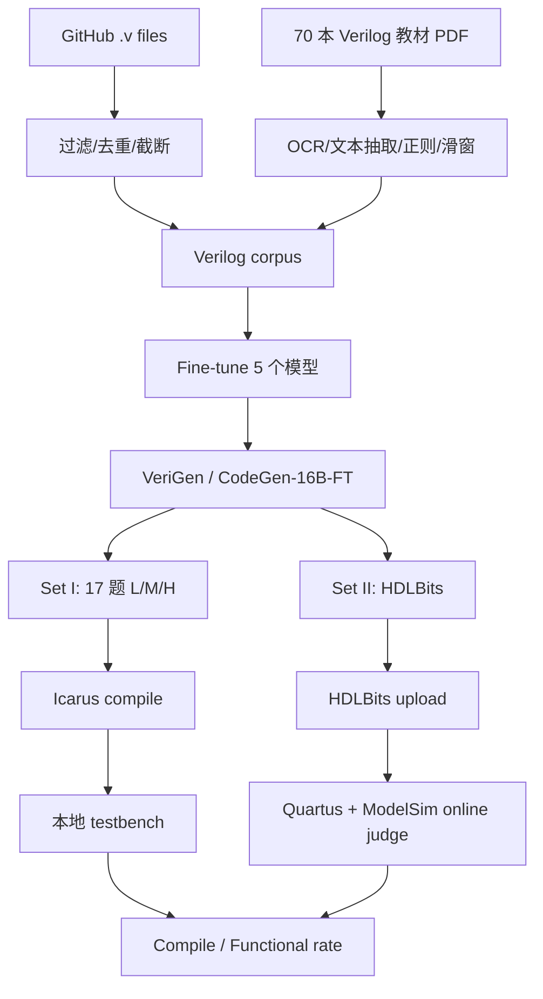

# VeriGen 扩展论文：原论文、训练数据、Set I/II、模型与代码复现详解

> 论文：**VeriGen: A Large Language Model for Verilog Code Generation**  
> 关系：DATE 2023《Benchmarking Large Language Models for Automated Verilog RTL Code Generation》的扩展稿  
> 本地 PDF：[2308.00708v1.pdf](2308.00708v1.pdf)  
> arXiv：<https://arxiv.org/abs/2308.00708>  
> 官方 PDF：<https://arxiv.org/pdf/2308.00708>  
> 共享代码：<https://github.com/shailja-thakur/VGen>  
> 本地 commit：`81710f872caf5c52440a455718d2c555c2d02d10`  
> 本篇静态审计：[runs/static_audit_2308.00708_20260803.json](runs/static_audit_2308.00708_20260803.json)  
> DATE 前版详解：[VeriGen论文与代码复现详解.md](VeriGen论文与代码复现详解.md)  
> 核对日期：2026-08-03

```text
┌─────────────────────────────────────────────────────────────────┐
│ P1 任务定义                                                        │
├─────────────────────────────────────────────────────────────────┤
│ Input      │ Set I：自然语言 Verilog 规格（L/M/H 三档）+ 模块头；       │
│            │ Set II：HDLBits 在线题目描述                              │
├─────────────────────────────────────────────────────────────────┤
│ Output     │ 可编译且通过功能 testbench/在线 judge 的 Verilog module   │
├─────────────────────────────────────────────────────────────────┤
│ Supervision│ Set I：Icarus 编译 + stdout pass marker；                   │
│            │ Set II：HDLBits 在线 Quartus/ModelSim judge 返回状态      │
├─────────────────────────────────────────────────────────────────┤
│ Why-hard   │ 通用代码模型几乎不掌握 Verilog 语法与位级语义；需要专门领域 │
│            │ 微调和大规模可执行评测，且跨模型规模/prompt/闭源 API 比较 │
│            │ 的协议必须严格控制                                          │
└─────────────────────────────────────────────────────────────────┘
```

## 0. 先给结论

这篇 29 页扩展稿不是把 7 页 DATE 论文简单换了标题，而是在原有“Verilog 语料微调 + 17 题 testbench”上新增了四条重要证据：

1. 将对比模型扩展到 GPT-3.5-turbo、GPT-4、PaLM2，并讨论 Claude；
2. 增加基于 HDLBits 的大规模 Problem Set II；
3. 增加 GPT-3.5 system prompt、教材语料和推理时间消融；
4. 增加复杂失败、Game of Life 和 8-bit MUX bug-fixing 案例。

论文主张可概括为：

```text
通用代码模型
  + 约 300 MB GitHub Verilog
  + 70 本教材提取内容
  + 领域微调
        ↓
VeriGen / CodeGen-16B-FT
        ↓
Set I：17 题 × L/M/H × 本地 Icarus testbench
Set II：HDLBits 大规模题集 × 在线 Quartus/ModelSim judge
```

但当前本地仓库仍不能重算扩展论文：

| 所需资产 | 本地状态 |
|---|---|
| Set I 的 17 题、51 prompts、17 testbenches | 有 |
| Set II 的完整 HDLBits 题目清单/提交脚本 | 无 |
| 300/400 MB corpus | 无 |
| 完整训练脚本 | 只有外部仓库链接，本目录无 |
| 模型 checkpoint | 本地无，仅 README/Hugging Face 名称 |
| GPT-3.5/GPT-4/PaLM2 原始 completions | 无 |
| 论文 Table/Figure 原始 CSV | 无 |
| 2023 扩展论文同版 evaluator | 无；当前 zip 是 2024-04 后加的 |
| 历史推理日志 | 两个 notebook 有有限内嵌输出，不是扩展论文全表 |

本次没有重新加载 2B/6B/16B 模型，没有调用闭源 API，没有提交 HDLBits，也没有重新跑 Icarus。复现等级：**R1**。

## 1. 论文身份

### 1.1 元数据

| 字段 | 值 |
|---|---|
| 标题 | VeriGen: A Large Language Model for Verilog Code Generation |
| 作者 | Shailja Thakur, Baleegh Ahmad, Hammond Pearce, Benjamin Tan, Brendan Dolan-Gavitt, Ramesh Karri, Siddharth Garg |
| arXiv | `2308.00708v1` |
| PDF 创建时间 | 2023-08-03 00:43:55 UTC |
| 页数 | 29 |
| 文件大小 | 2,636,063 bytes |
| SHA-256 | `36882b35330ea304f0d4c29dd147561543a68aa8961d019f5ce3335c39df7d5e` |

### 1.2 引用版本警告

本地 v1 PDF 的 ACM Reference Format 写有：

```text
ACM Trans. Des. Autom. Electron. Syst. 37, 4, Article 111
DOI: XXXXXXX.XXXXXXX
```

这是草稿模板信息，DOI 仍是 placeholder。本文只把本地文件称为 `arXiv:2308.00708v1`，不根据草稿字段声称它就是最终出版排版。

### 1.3 与 DATE 前版的关系

PDF 首页脚注明确说明：

```text
This manuscript extends work presented at DATE 2023.
```

因此两篇应这样组织：

```text
2212.11140 / DATE 2023
《Benchmarking Large Language Models for Automated Verilog RTL Code Generation》
        ↓ 扩展
2308.00708v1
《VeriGen: A Large Language Model for Verilog Code Generation》
```

它们共享数据、模型、Set I 和代码仓库，但研究问题和实验范围不同，应有两份独立 MD。

## 2. 前版与扩展版差异总表

| 维度 | DATE 前版 | VeriGen 扩展稿 |
|---|---|---|
| 篇幅 | 7 页 | 29 页 |
| 自定义 Set I | 17 题 | 保留 |
| Prompt | L/M/H | 保留 |
| Open-source fine-tuned models | 355M、2B、6B、7B、16B | 保留 |
| 商业基线 | code-davinci-002 | 增加 GPT-3.5、GPT-4、PaLM2；正文还提 Claude |
| Set II | 无 | HDLBits 大规模题集 |
| RQ 数量 | RQ1–RQ4 | RQ1–RQ7 |
| System prompt 消融 | 无 | GPT-3.5 unguided/guided |
| 教材数据消融 | 简略 | books-only / GitHub-only / combined |
| 推理时间 | 有限 | 单独 Section 6.1/Figure 14 |
| Bug fixing | 无系统展示 | 8-bit MUX 案例 |
| 复杂失败 | LFSR/shift/truth table | 再加 Game of Life 等 |

## 3. 扩展论文整体流程



论文 Figure 1 的本地项目图：


> 来源：仓库 `fig/system_overview.png`；它展示训练语料、预训练模型、fine-tuning、prompt、completion 和 testbench accepted/rejected。该文件在 2024-01 才加入仓库，内容与论文 Figure 1 同源，但不能作为 2023 本地运行证据。

## 4. 模型本质

VeriGen 仍是 decoder-only causal language model 微调，不是后来的 Agent：

```text
prompt tokens x_1...x_t
        ↓
P(x_{t+1} | x_1...x_t)
        ↓ autoregressive sampling
Verilog completion
```

训练目标仍是 next-token cross entropy：

```text
L = -Σ_t log Pθ(x_t | x_<t)
```

论文没有：

- compiler-in-the-loop training；
- testbench reward；
- RL；
- repair Agent；
- AST/VCD 定位；
- PPA objective；
- formal equivalence；
- 多 Agent 分工。

Icarus、HDLBits、Quartus 和 ModelSim 只用于训练后评价。

## 5. GitHub 训练语料

### 5.1 来源

论文通过 Google BigQuery 的 GitHub snapshot 搜索 `.v` 文件和 Verilog 关键词，snapshot 覆盖超过 280 万 repositories。

### 5.2 过滤流程

```text
GitHub files
  → .v / Verilog keyword
  → 至少一对 module/endmodule
  → MinHash + Jaccard 近重复过滤
  → 删除字符数 >= 20K 的文件
  → 约 50K files / 约 300 MB
```

### 5.3 论文中的两个规模

论文先说初步抓取约 50K 文件、1 GB；继续过滤大文件后得到约 50K 文件、300 MB。文件数近似不变、体积下降，说明主要删除/截短的是少数大文件。

### 5.4 当前代码

`verilog-fetch-big-query.ipynb` 的 SQL 主线确实检查：

```sql
f.path LIKE '%.v'
AND c.content LIKE '%endmodule%'
```

但本地缺少：

- 最终 query snapshot；
- 50K 文件 manifest；
- commit/license/provenance；
- 完整 MinHash/Jaccard pipeline；
- 300 MB corpus；
- train/validation split；
- benchmark contamination report。

## 6. 70 本教材语料

### 6.1 论文流程

```text
70 textbooks
  → PyMuPDF/OCR
  → 清除 index/preface/acknowledgment 等
  → 正则识别 prose + Verilog block
  → overlapping sliding windows
  → 与 GitHub corpus 合并
  → 约 400 MB
```

### 6.2 为什么教材可能有帮助

GitHub code 提供真实代码形态；教材额外提供：

- 自然语言解释；
- 小而完整的示例；
- 语法概念；
- 正确/惯用写法；
- 规格到实现的语义桥梁。

### 6.3 当前脚本边界

`pdf_extractor.py` 与 `pdf_extraction_instance.py` 只能证明抽取思路，不能直接重建 70 本语料：

- 教材清单为空/未公开；
- 多处 import/变量依赖外部 notebook 状态；
- 旧 PyPDF2 API；
- `toLower=False` 仍执行 lower；
- `Speller` 未导入；
- page range 需人工填；
- 无统一 manifest/hash/license。

### 6.4 版权边界

论文称教材来自 online e-library，但未列出 70 本书和再分发授权。训练研究可以描述数据来源，不等于 corpus 可合法重新发布。

## 7. 模型清单

论文 Table 1：

| 模型 | 参数 | 预训练数据 | Layers | Heads | Head/Embed 字段 | Context |
|---|---:|---|---:|---:|---:|---:|
| MegatronLM | 355M | Natural language | 24 | 16 | 64 | 1024 |
| J1-Large | 7B | Natural language | 32 | 32 | 128 | 4096 |
| CodeGen | 2B | NL + code | 32 | 32 | 80 | 2048 |
| CodeGen | 6B | NL + code | 33 | 16 | 256 | 2048 |
| CodeGen | 16B | NL + code | 34 | 24 | 256 | 2048 |
| code-davinci-002 | 未公开 | NL + code | NA | NA | NA | 8001 |
| GPT-3.5-turbo | 未公开 | NL + code | NA | NA | NA | 4096 |
| GPT-4 | 未公开 | NL + code | NA | NA | NA | 8000 |
| PaLM2 | 未公开 | NL + code | NA | NA | NA | 8000 |

注意：表中的商业模型 context/参数是论文时间点描述，不能作为 2026 API 规格。

## 8. Fine-tuning 设置

### 8.1 CodeGen

| 模型 | 训练硬件 | Epoch | 论文时间 |
|---|---|---:|---:|
| CodeGen-2B | 2 × RTX8000 | 1 | 2 天 |
| CodeGen-6B | 4 × RTX8000 | 1 | 4 天 |
| CodeGen-16B | 3 × A100 | 1 | 6 天 |

论文称 16B 在 FP16 下参数约 30 GB，连同 activation/optimizer state 总需求约 250 GB，使用 model/data parallel 和 ZeRO/DeepSpeed 风格 optimizer-state sharding。

### 8.2 MegatronLM

```text
1 × RTX8000
9 epochs
15 hours
default configuration
```

### 8.3 J1-Large

通过 AI21 Studio API 微调，权重和训练内部不透明。

### 8.4 复现缺口

论文没有在本仓库固定：

- optimizer 超参数完整值；
- exact DeepSpeed config；
- random seeds；
- tokenizer revision；
- batch/gradient accumulation；
- training/validation split；
- loss curves；
- checkpoint hashes。

## 9. Problem Set I

### 9.1 17 题

| # | 难度 | 题目 |
|---:|---|---|
| 1 | Basic | Simple wire |
| 2 | Basic | 2-input AND |
| 3 | Basic | 3-bit priority encoder |
| 4 | Basic | 2-input multiplexer |
| 5 | Intermediate | Half adder |
| 6 | Intermediate | 1-to-12 counter |
| 7 | Intermediate | LFSR taps 3 and 5 |
| 8 | Intermediate | Two-state FSM |
| 9 | Intermediate | Shift-left and rotate |
| 10 | Intermediate | RAM |
| 11 | Intermediate | Permutation |
| 12 | Intermediate | Truth table |
| 13 | Advanced | Signed 8-bit adder with overflow |
| 14 | Advanced | Counter with enable |
| 15 | Advanced | FSM recognizing `101` |
| 16 | Advanced | 64-bit arithmetic shift register |
| 17 | Advanced | ABRO FSM |

本地目录正好有：

```text
4 basic + 8 intermediate + 5 advanced = 17 task directories
17 × 3 = 51 prompt*.v
17 tb_*.v
```

### 9.2 三档 prompt

```text
L：功能注释 + module header + internal signals
M：L + 使用 signal names 描述行为
H：M + 更接近 pseudo-code 的详细步骤
```

论文 Figure 2 的 high-detail FSM prompt：


> 来源：扩展论文第 7 页 Figure 2 的内嵌原图。黄色部分从 L 增加到 M，灰色部分从 M 增加到 H。

### 9.3 当前 prompt 异常

当前 repo 的 `advanced3`：

- `prompt1_advfsm.v` 与 `prompt2_advfsm.v` 完全相同；
- `prompt3_advfsm.v` 包含完整 implementation 和 `endmodule`；
- 它已经泄漏答案，不再是正常 completion prompt。

因此当前 51 文件不能不经修复就作为论文原始 Set I 输入。

## 10. Set I 采样协议

| 参数 | 论文设置 |
|---|---|
| Temperature | `0.1, 0.3, 0.5, 0.7, 1.0` |
| Completions `n` | `1, 10, 25` |
| Autocomplete max tokens | 300 |
| J1 max tokens | 256 |
| Chat models max tokens | 900 |
| top_p | 默认/1.0 口径 |
| GPT-4 | web interface，temperature 0.2，`n=1` |

如果把所有 Set I 组合完整生成：

```text
17 tasks × 3 prompts × 5 temperatures × (1 + 10 + 25)
= 9,180 completions / model
```

Table 4/5 主要展示 `n=10`，并对各 model/scenario 选最成功的 temperature。它不是统一固定 temperature 的公平横向表。

## 11. Set I 评价

### 11.1 Compile

论文使用 Icarus Verilog 11.0 检查能否编译。

### 11.2 Functional

将 candidate 与题目 testbench 一起编译/仿真。Basic 和部分 intermediate 可较穷举；复杂题只覆盖 prompt 完整规定的行为。

### 11.3 规格歧义

论文主动承认：reset 没说明 synchronous/asynchronous 时，多种实现都可能合理；testbench 只检查 active-high reset 的输出值，不全面检查同步性和其他 corner cases。

因此“未通过作者 testbench”有两种可能：

1. candidate 功能确实错；
2. prompt/testbench 对某个未明确语义做了隐含选择。

## 12. Problem Set II

### 12.1 新增目的

Set I 只有 17 题且 testbench 自建。Set II 引入 HDLBits，希望扩大：

- 题量；
- Verilog 语法范围；
- 组合/时序复杂度；
- bug fixing；
- online judge 的测试覆盖。

### 12.2 题数出现三种口径

| 位置 | 数字 |
|---|---:|
| Section 4.1 叙述 | 181 problems |
| Table 3 caption | Set II 164 problems |
| Table 3 打印 category counts 求和 | 163 |

一种可能解释：

```text
17 Set I + 164 claimed Set II = 181 total
```

但 Table 3 的可见计数本身只有 163，仍差 1。本文不擅自替作者决定哪个数字正确。

### 12.3 Table 3 类别

| Difficulty | Category | 论文打印 count |
|---|---|---:|
| Getting Started | Getting Started | 2 |
| Verilog | Basics | 8 |
| Verilog | Vectors | 9 |
| Verilog | Module Hierarchy | 9 |
| Verilog | Procedures | 8 |
| Verilog | More Features | 7 |
| Circuits/Combinational | Basic | 17 |
| Circuits/Combinational | Multiplexers | 5 |
| Circuits/Combinational | Arithmetic Circuits | 7 |
| Circuits/Combinational | K-Map to Circuit | 8 |
| Circuits/Sequential | Latches and Flip-Flops | 18 |
| Circuits/Sequential | Counters | 8 |
| Circuits/Sequential | Shift Registers | 9 |
| Circuits/Sequential | Cellular Automata | 3 |
| Circuits/Sequential | FSM | 33 |
| Circuits/Sequential | Larger Circuits | 7 |
| Verify Bugs | Read Simulations & Find Bugs | 5 |

### 12.4 HDLBits prompt 示例


> 来源：论文第 8 页 Figure 3。错误 completion 在 `vibrate_mode=1` 时错误地开启 ringer，说明“代码看起来简洁”不代表真值表正确。

### 12.5 在线 judge

论文描述：

```text
upload candidate
  → Quartus synthesis
  → ModelSim simulation
  → Success / Compile Error / Simulation Error / Incorrect
```

局限：

- testbench 不公开；
- online judge 版本不可冻结；
- Quartus/ModelSim 配置不可追溯；
- 大规模自动提交可能受服务策略限制；
- 本仓库没有 Set II submitter 和原始返回日志。

## 13. Set II 采样协议

论文对 CodeGen-16B-FT、GPT-3.5-turbo 和 PaLM2：

```text
temperature = 0.2
n = 5 completions/problem
```

GPT-4 因访问和成本未纳入 Set II。

这个协议与 Set I 的 `5 temperatures × n={1,10,25}` 不同，两组结果不能直接合并成一个总体 pass rate。

## 14. 七个研究问题到底在问什么

扩展论文把 DATE 前版的四个问题扩成七个。按“变量—对照—证据”整理如下。

| RQ | 问题 | 主要对照 | 论文证据 | 当前代码能否独立复算 |
|---|---|---|---|---|
| RQ1 | 通用预训练模型能否直接生成 Verilog | PT 各模型 | Table 4、Table 5 | 不能；无原始 completions |
| RQ2 | Verilog fine-tuning 是否有效 | PT vs FT | Table 4、Table 5 | 不能；无训练脚本、语料和 checkpoint |
| RQ3 | 参数量是否影响正确率 | 355M/2B/6B/7B/16B/闭源模型 | Figure 7 | 不能；只保留两个 demo notebook |
| RQ4 | prompt 详细程度和难度怎样影响输出 | L/M/H，Basic/Intermediate/Advanced | Figure 7 | 只能审查 Set I prompt 文件，不能重算图 |
| RQ5 | 领域微调小模型与 GPT-4、GPT-3.5、Claude、PaLM2 怎样比较 | CodeGen-16B-FT vs 大模型 | Figure 8 | 不能；仓库无闭源模型返回和请求日志 |
| RQ6 | 大模型在哪种难度更强/更弱 | 三种难度、三档描述 | Figure 8、Set II | 不能；同上 |
| RQ7 | 教材等多源语料是否有益 | books-only、GitHub-only、combined | Figure 12、Figure 13 | 不能；没有训练集快照、权重和 ablation 输出 |

这里最重要的逻辑是：

```text
RQ1/RQ2：有没有领域微调收益
RQ3/RQ4：收益怎样随模型规模、prompt、题目难度变化
RQ5/RQ6：面对新一代闭源大模型是否仍有竞争力
RQ7：收益能否由更丰富的训练来源继续提升
```

论文确实形成了完整的研究叙事，但开源仓库只足以支持其中一部分“实验输入和评测实现审查”，不等于七个 RQ 都可本地复算。

## 15. Table 4：Set I 编译通过率

### 15.1 原表完整转录

Table 4 使用 `n=10`，对每个 scenario 选择该模型表现最好的 temperature，指标是生成 completion 中能编译的比例。

| Model | Type | Basic | Intermediate | Advanced |
|---|---|---:|---:|---:|
| MegatronLM-345M | PT | 0.000 | 0.000 | 0.000 |
| MegatronLM-345M | FT | 0.730 | 0.391 | 0.165 |
| CodeGen-2B | PT | 0.080 | 0.065 | 0.176 |
| CodeGen-2B | FT | 0.902 | 0.612 | 0.592 |
| CodeGen-6B | PT | 0.052 | 0.152 | 0.187 |
| CodeGen-6B | FT | 0.987 | 0.689 | 0.599 |
| J1-Large-7B | PT | 0.182 | 0.176 | 0.108 |
| J1-Large-7B | FT | 0.882 | 0.635 | 0.588 |
| CodeGen-16B | PT | 0.132 | 0.203 | 0.240 |
| CodeGen-16B | FT | 0.942 | 0.728 | 0.596 |
| code-davinci-002 | PT | 0.847 | 0.452 | 0.569 |

> `MegatronLM-345M` 是 Table 4 的原始写法；论文其他位置多写 `355M`。本文保留原表，不擅自统一。

### 15.2 应怎样读这张表

- fine-tuning 后五个可比较模型在三种难度上都显著提升；
- 编译通过不等于功能正确；
- FT 模型在高级题仍有约 0.59 的编译率，但下一张表的功能率明显更低；
- CodeGen-6B-FT 的 Basic 编译率 `0.987` 高于 CodeGen-16B-FT 的 `0.942`，说明参数更大不是每个局部切片都单调更好；
- 表中使用“每个 scenario 最优 temperature”，不能把它理解成固定统一 temperature 下的公平单次比较。

### 15.3 论文的聚合结论

Discussion 进一步称，使用最佳 `Pass@(scenario*10)`：

| 组别 | 能编译的 completion 比例 |
|---|---:|
| pretrained | 11.9% |
| fine-tuned | 64.6% |

这是论文报告值，不是本地 evaluator 重算值。

## 16. Table 5：Set I 功能通过率

### 16.1 表题存在明显错误

Table 5 caption 印成了 `Problem Set II`，但它具有以下特征：

- 使用 Basic/Intermediate/Advanced；
- 每种难度使用 L/M/H prompt；
- 紧接 Section 5.2 的 Set I 讨论；
- `n=10`，而真正 Set II 使用 `n=5, temperature=0.2`。

因此从上下文判断，这张表实际对应 **Problem Set I**。这是基于论文结构的明确推断，文档不直接修改原表 caption。

### 16.2 原表完整转录

| Model | Type | Time(s) | Basic L | Basic M | Basic H | Inter. L | Inter. M | Inter. H | Adv. L | Adv. M | Adv. H |
|---|---|---:|---:|---:|---:|---:|---:|---:|---:|---:|---:|
| MegatronLM-355M | PT | 3.628 | 0.000 | 0.000 | 0.000 | 0.000 | 0.000 | 0.000 | 0.000 | 0.000 | 0.000 |
| MegatronLM-355M | FT | 0.175 | 0.170 | 0.591 | 0.245 | 0.043 | 0.018 | 0.025 | 0.000 | 0.000 | 0.000 |
| CodeGen-2B | PT | 1.478 | 0.000 | 0.000 | 0.000 | 0.000 | 0.000 | 0.000 | 0.000 | 0.016 | 0.020 |
| CodeGen-2B | FT | 0.665 | 0.835 | 0.350 | 0.630 | 0.130 | 0.092 | 0.163 | 0.132 | 0.048 | 0.068 |
| CodeGen-6B | PT | 2.332 | 0.000 | 0.000 | 0.000 | 0.000 | 0.000 | 0.013 | 0.000 | 0.000 | 0.000 |
| CodeGen-6B | FT | 0.710 | 1.000 | 0.500 | 0.760 | 0.135 | 0.150 | 0.168 | 0.284 | 0.164 | 0.164 |
| J1-Large-7B | PT | 7.146 | 0.044 | 0.058 | 0.067 | 0.000 | 0.000 | 0.021 | 0.000 | 0.000 | 0.000 |
| J1-Large-7B | FT | 2.029 | 0.388 | 0.283 | 0.342 | 0.125 | 0.075 | 0.200 | 0.000 | 0.000 | 0.000 |
| CodeGen-16B | PT | 2.835 | 0.000 | 0.085 | 0.055 | 0.035 | 0.003 | 0.045 | 0.012 | 0.000 | 0.016 |
| CodeGen-16B | FT | 1.994 | 0.745 | 0.720 | 0.745 | 0.213 | 0.270 | 0.255 | 0.246 | 0.290 | 0.294 |
| code-davinci-002 | PT | 3.885 | 0.520 | 0.685 | 0.775 | 0.175 | 0.200 | 0.150 | 0.156 | 0.184 | 0.344 |

### 16.3 功能正确率暴露的真实问题

以 CodeGen-16B-FT 为例：

```text
Advanced compile ≈ 0.596
Advanced functional = 0.246 / 0.290 / 0.294
```

也就是说，相当一部分代码可以被编译器接受，却没有满足 testbench。Verilog 生成尤其不能只报 syntax success。

Basic 档位中也没有严格的 `L < M < H` 单调关系。例如 CodeGen-6B-FT 是 `1.000 / 0.500 / 0.760`。可能原因包括：

- prompt 变长会改变生成分布；
- 额外文字可能引入歧义；
- 每个 scenario 选的是最佳 temperature；
- 每题只有有限样本；
- evaluator 和 prompt 资产本身存在实现问题。

### 16.4 前版继承的总体结果

论文结论部分报告：

| 口径 | 功能正确率 |
|---|---:|
| 所有 pretrained LLM completions | 1.09% |
| 所有 fine-tuned LLM completions | 27.0% |
| CodeGen-16B-FT | 41.9% |
| code-davinci-002 | 35.4% |

这些数字来自 DATE 前版实验线，不能与后文 GPT-3.5/4 的 `n=1` 比较或 Set II 的 `n=5` 直接拼成统一排行榜。

## 17. `Pass@(scenario*n)` 不是通常的 HumanEval `pass@k`

论文在 Section 5.2 的定义是：

```text
scenario = 某一难度或类别下的一组题
k = scenario 中题数 × 每题 completion 数 n
Pass@k = 这 k 份代码中编译或通过功能测试的比例
```

可写成：

```text
paper_score = successful_completions / total_completions_in_scenario
```

它不是通常 HumanEval 中“从 n 个候选抽 k 个，至少一个正确”的无偏估计：

```text
standard pass@k = 1 - C(n-c, k) / C(n, k)
```

因此：

- 论文的 `Pass@(scenario*10)` 更接近 macro/micro 分组成功比例；
- `n` 增大后分母也增大，值不必随候选数单调上升；
- 不能拿这里的 `Pass@10` 与 VerilogEval/HumanEval 的 `pass@10` 按名称直接比较；
- 复现报告必须写出该论文自己的定义。

## 18. temperature、候选数和模型规模

### 18.1 Temperature

论文 Figure 7 报告 `temperature=0.1` 的总体表现最好，temperature 增大后通过率下降。

对 RTL 任务这并不意外：

- 目标通常是唯一或少量等价实现；
- 位宽、端口、时序和 reset 极其敏感；
- 更高随机性容易破坏 begin/end、条件覆盖和索引；
- 多样性并不自动转化为可综合且功能正确的多样性。

但这只是论文当前 17 题、当前模型和当前采样设置下的观察，不是所有 RTL LLM 的普遍常数。

### 18.2 Completion 数量

论文文字一方面说 `Pass@(scenario*1)` 优于 `Pass@(scenario*10)`，另一方面又说候选增加会增加通过 testbench 的 completion，并认为 `n=10` 对各难度较好。

这段话容易混淆两个问题：

1. “至少找到一个正确候选”的概率；
2. “所有候选中正确样本的比例”。

用第 17 节的定义看，两者不是同一指标，因此组会中不能简化成“n 越大，pass rate 越高”。

### 18.3 模型规模

论文总体判断是 16B 和 code-davinci-002 优于 355M/2B，但局部表格并不严格单调。合理结论应是：

> 在论文实验范围内，更大模型总体有优势；领域微调带来的跃迁比单纯扩大少量参数档位更稳定，且难题功能正确仍远未解决。

## 19. GPT-3.5 system prompt 实验

### 19.1 两种 system prompt

论文比较：

| 版本 | 作用 |
|---|---|
| GPT-3.5-turbo-v0 | 泛化的 programming assistant，只要求按用户描述补代码 |
| GPT-3.5-turbo-v1 | 明确要求作为 Verilog autocomplete engine，补完整模块并遵循输出格式 |

这项实验说明 chat 模型与 completion 模型不能只使用相同的 user prompt；system instruction 是实验配置的一部分。

### 19.2 论文报告的提升

- Low description：guided 比 unguided 约高 41%；
- High description：guided 比 unguided 约高 34.3%；
- 论文总体解释是更具体的 Verilog 指令更好。

### 19.3 原文内部矛盾

Section 5.3.1 同一段先写：

```text
minimal prompt model surpasses the detailed prompt model by 53%
```

随后又写：

```text
detailed prompt version consistently outperformed the minimal prompt version
```

后一句与 Figure 8 的讨论以及 41%/34.3% 提升口径一致，前一句很可能是主客体写反，但没有作者勘误时不能擅自改成确定事实。

## 20. CodeGen-16B-FT 与新一代大模型

### 20.1 协议边界

GPT-4 当时通过第三方 web-interface library 访问，论文称设置 temperature 0.2，但只能得到 `n=1`。因此 Figure 8 不是 Table 5 的完全同协议复测。

还要注意：

- 论文没有记录可冻结的 GPT-4/GPT-3.5 具体 snapshot；
- 第三方接口会引入额外版本和格式不确定性；
- Claude 出现在 RQ5 表述，但当前 PDF 没有形成与其他模型等量、可核验的主结果表；
- 闭源模型能力会随服务端更新，2023 年的结果不能代表 2026 年服务。

### 20.2 论文给出的主要数值

| 比较口径 | CodeGen-16B-FT | GPT-4 | GPT-3.5-turbo | PaLM2 |
|---|---:|---:|---:|---:|
| medium-description score | 0.436 | 0.39 | 0.40 | 未在该句给精确值 |
| approximate average score | 0.40 | 0.53 | 0.41 | 0.30 |

论文还称：

- CodeGen-16B-FT 对 medium complexity 最高约 74%；
- GPT-3.5/GPT-4 约 75%；
- GPT-4 在 advanced 各 prompt detail 约 0.6；
- GPT-4 的总体平均分最高，但 CodeGen-16B-FT 在特定 medium-description 切片略高。

正确的组会表述不是“VeriGen 打败 GPT-4”，而是：

> 一个 16B 领域微调模型在部分切片可接近甚至超过当时的闭源大模型，但 GPT-4 的跨题平均表现更高；同时比较协议、访问方式和样本数并不完全统一。

### 20.3 摘要中的两种提升不要混用

摘要称 CodeGen-16B-FT：

- 对 GPT-3.5-turbo 总体高 1.1 个百分点；
- 相比 pretrained 模型，syntactic correctness 提升 41%。

这和 `41.9% vs 35.4%` 不是同一对照：后者比较的是 CodeGen-16B-FT 与 `code-davinci-002` 的功能正确率。

## 21. Set II 的类别结果

Figure 9 没有把每个柱子的原始数值作为 CSV 发布，论文文字可直接确认的结果如下。

### 21.1 Multiplexers

| Model | Pass@(scenario*n) |
|---|---:|
| CodeGen-16B-FT | 0.653 |
| GPT-3.5-turbo | 0.540 |
| PaLM2 | 0.483 |

这是 CodeGen-16B-FT 在复杂 circuit 类别中最明确的优势例子。

### 21.2 Getting Started

GPT-3.5-turbo 在 `Step_one` 与 `Zero` 两个入门类别均为 1.0。论文称 CodeGen-16B-FT 接近，PaLM2 明显落后，但没有在正文给出后二者的精确值。

### 21.3 Read Simulations & Find Bugs

| 结论 | 论文报告 |
|---|---:|
| GPT-3.5-turbo 类别最高 | 0.60 |
| PaLM2 | 0.42 |
| CodeGen-16B-FT | 在 BugMux2 上有明显优势 |

### 21.4 Verilog Language

论文定性结论：

- CodeGen-16B-FT 在 Basics、Vectors 接近 GPT-3.5；
- 在 More Verilog Features 高于 PaLM2；
- 不同类别不存在单一模型全胜。

### 21.5 可复现边界

当前仓库没有：

- 163/164 个 HDLBits prompt 快照；
- 每题五份 completion；
- HDLBits submitter；
- 在线判分返回日志；
- Figure 9 的原始统计表。

所以现阶段只能准确解读论文，不能从当前仓库重新画 Figure 9。

## 22. 多源语料消融：books、GitHub 与 combined

### 22.1 三个模型含义

论文 Section 6 的定义是：

| 名称 | 训练来源 |
|---|---|
| CodeGen-2B-FT* | 只使用 textbook/book corpus |
| CodeGen-2B-FT | 只使用 GitHub Verilog corpus |
| CodeGen-2B-FT++ | 先/结合 Verilog，再引入 textbook corpus |

其意图不是证明教材语料能单独替代真实代码，而是检验“代码 + 教材解释/示例”的互补性。

### 22.2 论文报告数值

| 切片 | books-only FT* | GitHub-only FT | combined FT++ |
|---|---:|---:|---:|
| Low description | 0.083 | 基准 | 相比 FT 提升约 10% |
| Basic difficulty | 0.077 | 0.547 | 0.548 |

结论边界：

- books-only 明显不足；
- combined 在总体切片上更稳定；
- Basic 的 `0.548 vs 0.547` 只差 0.001，不能把这一格夸大成显著提升；
- 论文没有给出置信区间或多随机种子统计。

### 22.3 原论文 Figure 13


图中 1-to-12 counter 显示：

- books-only 版本引入不合适的 `initial`，且没有 12→1 回绕；
- GitHub-only 版本使用正确的时序结构，但仍遗漏回绕；
- combined 版本加入 `q==12` 条件和复位到 1。

### 22.4 2B/16B 标注不一致

Section 6 开头和 Figure 10 明确以 **CodeGen-2B** 定义 FT*/FT/FT++，但 Figure 12 caption、Figure 13 和对应正文又写 **CodeGen-16B**。

可能是：

- 消融实际换成了 16B，但前文未同步；或
- 图 caption/正文从另一版本复制时未统一。

当前仓库没有 ablation config、checkpoint 或 logs，无法从代码裁决。本文把它列为原文内部不一致，不替作者选择。

## 23. 推理时间

### 23.1 Section 6.1 / Figure 14 数值

| Model | 论文报告 inference time (s) |
|---|---:|
| CodeGen-2B-FT | 0.92 |
| CodeGen-6B-FT | 1.14 |
| CodeGen-16B-FT | 2.02 |
| J1-Large-7B-FT | 2.12 |
| PaLM2 | 5.76 |
| GPT-3.5-turbo | 6.32 |
| GPT-4 | 10.00 |

论文把远程通信时间也计入 API 模型，因此它不是纯模型 forward latency。

### 23.2 Table 5 与正文不一致

| Model | Table 5 FT (s) | Section 6.1 (s) |
|---|---:|---:|
| CodeGen-2B | 0.665 | 0.92 |
| CodeGen-6B | 0.710 | 1.14 |
| CodeGen-16B | 1.994 | 2.02 |

这可能来自不同测量批次、硬件、生成长度或取整方式；论文没有提供足够信息统一它们。

另外，Figure 14/正文称 CodeGen-2B-PT 为 `0.000 s`，更像计时精度、缺失值或记录异常，不应解释成真正零延迟。

### 23.3 为什么不能把它当硬件效率排行榜

缺少以下控制变量：

- GPU 型号和显存；
- batch size；
- 输入/输出 token 数；
- dtype 与量化；
- warm-up 次数；
- 本地模型是否包含加载时间；
- API 网络位置与排队时间。

因此推理时间只适合说明“论文观察到领域模型在当时环境中响应较快”，不能跨平台作严格吞吐比较。

## 24. 失败案例：为什么 compile 不够

### 24.1 Basic：priority encoder


论文 Figure 4 的重点是优先级/位置偏移错误。代码语法可以成立，错误却存在于编码语义。

### 24.2 Intermediate：1-to-12 counter


Figure 5 的 completion 没有在 12 停止或回绕。它说明“会写 always block”与“理解状态范围”是两件事。

### 24.3 Advanced：ABRO 状态机


Figure 6 中输出没有赋给 `SAB` 状态。这类漏状态错误通常能编译，却会在特定序列上失败。

### 24.4 Set I 三个极难点

论文称 CodeGen-16B-FT 每道 Set I 题一共生成 540 份 completion：

| 问题 | 论文结果 | 主要错误 |
|---|---:|---|
| Problem 7, LFSR | 0/540 通过 | 没有正确拼接高位与 feedback |
| Problem 12, truth table | 0/540 通过 | 用到了输入，但布尔表达式关系错误 |
| Problem 9, shift/rotate | 1/540 通过 | shift 值覆盖不全或 bit position 错 |


这些例子支持的结论不是“模型不会 Verilog”，而是：模型已经能生成结构相似的 RTL 骨架，但在位级关系、完整 case 覆盖和精确状态语义上脆弱。

### 24.5 Conway's Game of Life


论文称 GPT-3.5、PaLM2、CodeGen-16B-FT 都没有完全通过。图中可见的两类问题：

- GPT-3.5 方案同时修改 `next_state` 和 `current_state`，且把 wire 放进 always 更新，形成类型/时序冲突；
- CodeGen 方案的规则判定不符合 Conway 规则；
- neighbor counting 没处理环面边界；
- 还可能把 cell 自身算作 neighbor。

这类二维局部更新同时需要：索引、边界条件、组合/时序分离和完整规则，远高于单个门或 mux 的模式匹配。

### 24.6 8-bit 2-to-1 mux bug fixing


论文分析：

| Model | 结果 |
|---|---|
| CodeGen-16B-FT | 正确定位并修复 |
| PaLM2 | 使用 ternary 做了部分修复，但漏改 output width |
| GPT-3.5-turbo | 识别不同位宽的 bitwise 问题，但没有正确完成修复 |

这里真正困难的是错误没有用显眼标记定位，模型必须联合理解端口宽度和运算语义，而不是只做局部 token 替换。

## 25. 当前仓库与论文时间线

### 25.1 版本身份

| 项 | 当前本地值 |
|---|---|
| upstream | `https://github.com/shailja-thakur/VGen.git` |
| commit | `81710f872caf5c52440a455718d2c555c2d02d10` |
| commit date | 2024-10-17 |
| license file | `LICENCE` |
| license | Apache-2.0 |
| tracked files | 119 |

### 25.2 关键提交时间

| Artifact | 仓库时间 |
|---|---|
| Set I prompts/testbenches | 2023-07-05 |
| 扩展论文 arXiv v1 PDF 创建 | 2023-08-03 |
| system overview image | 2024-01 |
| evaluation scripts | 2024-04-08 |
| BigQuery notebook | 2024-04-09 |
| textbook/PDF extraction scripts | 2024-04-30 |
| 当前 commit | 2024-10-17 |

由此可知：Set I 输入资产早于扩展稿；但当前公开的 evaluator 和数据提取脚本晚于扩展稿约八个月。它们可以帮助理解作者后续整理出的流程，却不能无证据地认定为论文实验当时的精确代码快照。

## 26. 当前本地资产地图

```text
VGen/
├── 2212.11140_VeriGen.pdf                  # DATE 前版预印本
├── 2308.00708v1.pdf                        # 本文：VeriGen 扩展稿
├── VeriGen论文与代码复现详解.md             # 前版独立详解
├── VeriGen扩展论文_2308.00708_论文与代码复现详解.md
├── 模型梳理.md
├── README.md / LICENCE
├── VGen_Demo.ipynb                         # 2B demo，保存过历史输出
├── VGen_Demo_notebook.ipynb                # 6B demo，保存过历史输出
├── verilog-fetch-big-query.ipynb           # GitHub 代码入口
├── pdf_extractor.py
├── pdf_extraction_instance.py              # 教材/PDF 提取入口
├── prompts-and-testbenches/
│   ├── basic1..4/
│   ├── intermediate1..8/
│   └── advanced1..5/
├── evaluation_scripts.zip
├── fig/2308_00708/                          # 从原论文抽出的 16 张原图
└── runs/
    ├── static_audit_20260802.json           # DATE 前版/代码静态审计
    └── static_audit_2308.00708_20260803.json
```

### 26.1 数量核对

| 资产 | 数量 |
|---|---:|
| Set I task directories | 17 |
| L/M/H prompt files | 51 |
| testbench files | 17 |
| demo notebooks | 2 |
| paper embedded images extracted | 16 |
| zip entries including directory/macOS metadata | 12 |

### 26.2 明确缺失

- 论文所用约 300 MB GitHub 清洗语料；
- 约 400 MB combined corpus 快照；
- 70 本教材的书目、原 PDF 和许可记录；
- 完整 training scripts/configs；
- 论文训练产生的全套 checkpoint；
- 9180 completions/model 的 Set I 原始输出；
- Set II prompt、completion、judge logs；
- Figure 7/8/9/12/14 的 source CSV；
- 实验环境锁文件和随机种子；
- GPT/PaLM 请求—响应原始记录。

## 27. 两个 notebook 到底做了什么

### 27.1 `VGen_Demo.ipynb`

核心链：

```python
AutoTokenizer.from_pretrained(...)
AutoModelForCausalLM.from_pretrained(
    "shailja/fine-tuned-codegen-2B-Verilog"
).to(device)
input_ids = tokenizer(prompt, return_tensors="pt").input_ids.to(device)
sample = model.generate(
    input_ids,
    max_length=128,
    temperature=0.5,
    top_p=0.9,
)
```

默认示例是 half adder，也保留 mux prompt 注释。Notebook 的定位是单 prompt 演示，不是论文批量 runner。

### 27.2 `VGen_Demo_notebook.ipynb`

结构近似，但加载 `fine-tuned-codegen-6B-Verilog`，并包含逐 token 采样示意。保存输出证明该 notebook 历史上曾执行，不证明当前机器、当前依赖、当前远程权重仍完成了同一运行。

### 27.3 与论文采样的差异

| 项 | Demo | 论文 Set I |
|---|---|---|
| temperature | 0.5 | 0.1/0.3/0.5/0.7/1.0 |
| top_p | 0.9 | 论文主协议未用同一表明确报告 |
| length | `max_length=128` | autocomplete 300；J1 256；chat 900 |
| prompt | half-adder 简短例 | 17×L/M/H |
| samples | 单次演示 | n=1/10/25 |
| compiler/testbench | notebook 不构成批量评测 | Icarus 11 + 17 testbenches |

因此，已有 notebook 输出应记录成“历史 demo 证据”，不能替代论文主实验复现。

## 28. `evaluation_scripts.zip` 调用链

压缩包真正业务脚本包括：

```text
gen_examples.py
gen_examples_all.py
evaluate_examples.py
run_evaluation.sh
get_results.py
run_eval.sh
copy_results.py
remove_all.py
misc.txt
```

另有目录项和两个 macOS `__MACOSX` metadata，所以 `unzip -l` 共显示 12 entries。

### 28.1 设计意图

```text
prompt file
  ↓ gen_examples*.py
model completions
  ↓ 文本补齐/写入 .v
candidate Verilog
  ↓ run_evaluation.sh / iverilog
compiled simulation
  ↓ evaluate_examples.py
stdout marker / stderr
  ↓ get_results.py
aggregate result
```

### 28.2 各脚本角色

| 文件 | 作用 | 审计关注点 |
|---|---|---|
| `gen_examples.py` | 单组 prompt 生成 candidates | 模型种类参数未真正控制不同后端；文本式 module 修补 |
| `gen_examples_all.py` | 遍历题目/温度/候选数 | L/M/H 输出目录冲突 |
| `run_evaluation.sh` | 编译、仿真候选 | 没有 timeout；依赖固定输出约定 |
| `evaluate_examples.py` | 整理编译/功能状态 | success 判断脆弱 |
| `get_results.py` | 汇总题目结果 | tasks 列表被覆盖成 advanced5 |
| `run_eval.sh` | 外层实验 sweep | n 使用 1/10/20，不是 1/10/25 |
| `copy_results.py` | 复制/归集结果 | 属辅助操作，不补足协议缺失 |
| `remove_all.py` | 清理生成目录 | 执行前需严格核对路径，不作为本文复现步骤运行 |

## 29. 评测实现的九个关键问题

### 29.1 L/M/H 输出碰撞

三档 prompt 对同题写入相同输出目录；脚本看到输出已存在后跳过。因此先执行的 prompt 可能占据目录，后两档没有真正生成。

影响：Figure 7/Table 5 的 L/M/H 对比不能用当前默认 runner 直接重建。

### 29.2 advanced3 prompt 泄漏/重复

- `prompt1_advfsm.v` 与 `prompt2_advfsm.v` 完全相同；
- `prompt3_advfsm.v` 含完整解答并出现 `endmodule`。

影响：三档难度不再只差规格详细程度，高档 prompt 可能直接泄漏答案。

### 29.3 “修复 completion”不是 Verilog parser

生成后处理通过统计 `begin`/`end` 子串、检查 `endmodule` 等方式补文本。

风险：

- 单词子串、注释和标识符可能误计；
- generate/case/function 等结构不等于 begin/end 平衡；
- 文本修补可能掩盖原始模型 syntax failure；
- 修补后的成功不应算成未经后处理的模型成功。

### 29.4 `examples.json` 不是规范 JSON

脚本写出的内容不是稳定 JSON serialization。后续若按标准 JSON parser 读取会失败或出现非可移植行为。

### 29.5 编译成功只看 stderr

当前实现以 stderr 是否为空推断 compilation success，而不是检查 process return code。

正确判据至少应联合：

```text
returncode == 0
and expected binary exists
and compile command completed before timeout
```

### 29.6 功能通过依赖 stdout 尾部精确字符串

脚本读取输出最后 17 个字符与固定 marker 比较。日志多一个换行、warning 或 testbench 文案变化都可能误判。

### 29.7 没有 timeout

恶意或错误 RTL 可能让 simulation 卡死。批量评测必须为编译和仿真分别设置 timeout，并记录 timeout 类别。

### 29.8 `get_results.py` 最终只统计 advanced5

脚本先定义多题列表，随后又被赋值为只含 `advanced5`。最终汇总不是论文 17 题。

### 29.9 `n=20` 与论文 `n=25` 漂移

`run_eval.sh` sweep 使用 `1, 10, 20`，论文 Set I 使用 `1, 10, 25`。即使其余问题修好，默认脚本也不对应论文协议。

## 30. 论文—代码逐项对应

| 论文环节 | 当前代码/文件 | 能确认什么 | 不能确认什么 |
|---|---|---|---|
| GitHub 搜索 | `verilog-fetch-big-query.ipynb` | BigQuery 收集入口存在 | 论文 50K 文件精确清单和 300 MB 快照 |
| 教材抽取 | `pdf_extractor.py`、`pdf_extraction_instance.py` | PyMuPDF/OCR 类入口存在 | 70 本书、combined 400 MB、许可与清洗结果 |
| Set I prompt | `prompts-and-testbenches/*/prompt*.v` | 17×3 文件存在，可逐题阅读 | 论文运行时是否使用完全相同 revision |
| Set I reference | `answer_*.v` | 每题参考实现存在 | reference 是否唯一正确、测试覆盖是否完备 |
| Set I testbench | `tb_*.v` | 17 个本地 testbench 存在 | 论文所有边界条件和版本环境 |
| 模型前向 | `VGen_Demo*.ipynb` | 2B/6B HF demo 与保存输出 | 五模型训练及完整 sweep |
| batch generation | `evaluation_scripts.zip` | 后续公开的生成框架 | 论文时点精确 runner；脚本当前还有缺陷 |
| compile/function | zip + testbenches | 设计意图是 Icarus + marker | Table 4/5 可无修改重算 |
| Set II | 论文 PDF | 类别、judge 和部分数值 | 当前仓库没有对应资产/执行器 |
| GPT/PaLM | 论文 PDF | 作者报告的比较 | model snapshot、请求、原始返回、计费/延迟日志 |
| corpus ablation | PDF Figure 12/13 | 作者报告的趋势与示例 | 2B/16B 冲突的裁决、checkpoint、重复训练稳定性 |

## 31. 当前能够证明与不能证明的内容

### 31.1 能证明

- 本地 PDF 确为 arXiv `2308.00708v1`，共 29 页；
- 它明确引用 DATE 2023 前版并扩展研究范围；
- 当前仓库确有 17 个 Set I 题目录、51 个 prompt、17 个 testbench；
- 确有两个 Hugging Face demo notebook 和保存输出；
- 确有 BigQuery/PDF extraction 入口和 evaluator zip；
- 论文的 Set I/Set II 方法、表格数值、失败图和内部不一致已逐页核对；
- 当前 evaluator 存在足以影响论文复算的实现问题；
- 当前仓库不包含 Set II 和完整训练/结果资产。

### 31.2 不能证明

- 当前机器已重新跑通 CodeGen 2B/6B/16B 推理；
- 已重训五种 FT 模型；
- 已重新生成论文数万份 completion；
- 已用 Icarus 重新得到 Table 4/Table 5；
- 已向 HDLBits 提交完整 Set II；
- Figure 8/9 的闭源模型结果可重复；
- combined corpus 提升在多随机种子下显著；
- 当前 evaluator 未修复即可复算论文。

## 32. 为什么本次没有再跑模型

这是任务边界和证据条件共同决定的：

1. 用户明确要求“查看每一个开源项目代码，再根据论文完善 MD”，并指出已有模型推理记录，不要求重复推理；
2. 新增扩展论文没有带来新的本地模型 checkpoint、原始 completion 或 Set II 数据；
3. 当前 evaluator 默认实现不能忠实执行 L/M/H 和论文 n 值；
4. 重新下载权重或调用闭源 API 会引入与论文不同的模型版本；
5. 在没有修复 runner、冻结数据和模型 revision 前，新的零散结果反而容易被误写成论文复现。

所以本次完成的是：

```text
论文逐页核对
+ 当前 repo 静态代码审计
+ 已有 notebook/旧审计证据复用
+ 原论文图片抽取与讲解
+ 复现缺口和正确复现路线
```

而不是重复做一轮无法对齐论文的推理 smoke test。

## 33. 若以后做严格复现，正确顺序

### 阶段 A：冻结 artifact

1. 固定 Git commit；
2. 固定 PDF v1 与论文表格口径；
3. 记录 Hugging Face model id、revision、文件 hash 和 license；
4. 保存 Python、PyTorch、Transformers、CUDA、Icarus 版本；
5. 保存 GPU、dtype、batch size 和随机种子。

### 阶段 B：修 evaluator

1. 为每个 `task/prompt_level/temperature/n/seed` 建独立目录；
2. 删除答案泄漏，重新定义 advanced3 L/M/H；
3. 使用标准 JSONL 保存原始 prompt、raw completion、repaired completion；
4. 原始与后处理结果分开计分；
5. 用 return code 判断编译；
6. 编译/仿真均增加 timeout；
7. testbench 输出结构化 marker 或直接读取退出码；
8. 修正 17 题汇总和 `n=25`；
9. 加单元测试验证每个统计分母。

建议每条记录至少包含：

```json
{
  "paper": "2308.00708v1",
  "task_id": "intermediate3_lfsr",
  "prompt_level": "H",
  "temperature": 0.1,
  "sample_index": 0,
  "model_id": "...",
  "model_revision": "...",
  "raw_completion_sha256": "...",
  "postprocessed": false,
  "compile_returncode": 0,
  "compile_timeout": false,
  "simulation_returncode": 0,
  "simulation_timeout": false,
  "functional_pass": true
}
```

### 阶段 C：先复现 Set I

1. 先用 reference answers 验证 17 个 testbench；
2. 用一个小模型和一题验证目录/计分；
3. 再跑 17×3×5×n；
4. 分别保存 compile、functional 和 repair 后得分；
5. 重算 Table 4、Table 5 和 Figure 7，并给置信区间。

### 阶段 D：谨慎处理 Set II

1. 先从作者或版本化来源确认 163/164/181 的真实题目清单；
2. 固定 HDLBits 页面版本与 prompt 文本；
3. 遵守站点自动提交策略；
4. 保存每次 submission id、返回状态、时间和 completion hash；
5. 如无法冻结 hidden testbench，应明确写成 remote benchmark reproduction，而非完全本地复现。

### 阶段 E：语料消融

1. 发布可追溯的 GitHub file manifest；
2. 保留许可证、仓库、commit、path 和 MinHash group；
3. 列出 70 本书的许可和抽取页；
4. 从训练集排除 Set I/II 及近重复；
5. 确认消融到底是 2B 还是 16B；
6. 每个条件至少多 seed 重复，报告均值与方差。

## 34. 适合组会的讲法

### 34.1 一句话主线

> VeriGen 证明早期 Verilog 领域微调可以把通用代码模型从“几乎不会功能正确”提升到“能生成相当多可编译骨架，并在部分题上功能通过”，扩展稿又用 HDLBits、闭源大模型和教材消融展示边界；但复杂状态、位级关系和严格复现仍是短板。

### 34.2 建议 12 页结构

1. 论文身份：DATE 前版 vs arXiv 扩展稿；
2. 系统流程：GitHub + books → FT → Set I/II；
3. 五种 fine-tuned 模型与训练成本；
4. 17 题 Set I 与 L/M/H prompt；
5. Table 4：compile 大幅提升；
6. Table 5：functional 仍明显落后；
7. `Pass@(scenario*n)` 与标准 pass@k 的区别；
8. GPT-3.5/4/PaLM2 比较及协议限制；
9. HDLBits Set II 与 181/164/163 问题；
10. books/GitHub/combined 消融与 2B/16B 冲突；
11. LFSR、Game of Life、mux repair 失败图；
12. 开源代码能复现什么、当前 evaluator 为什么不能直接重画论文图。

### 34.3 最值得放大的三张图

1. Figure 2：L/M/H prompt 如何逐层增加信息；
2. Figure 13：book/GitHub/combined 在 counter 上的行为差异；
3. Figure 18/19：复杂生成失败与 bug fixing 的能力分化。

### 34.4 不建议使用的夸张表述

- “VeriGen 已完全复现”；
- “16B 全面超过 GPT-4”；
- “教材让性能显著提高 10%”而不说明切片和 Basic 仅差 0.001；
- “Set II 有 181 道”而不披露三种计数；
- “pass@10”而不解释该论文自定义分母；
- “代码已开源，所以训练和论文表格可一键复现”。

## 35. 常见问题

### Q1：VeriGen 是新模型架构吗？

不是。核心是对现有 decoder-only LLM（尤其 CodeGen）进行 Verilog 领域 fine-tuning，再用 compiler/testbench 评价。

### Q2：最核心贡献是什么？

在早期阶段系统量化 Verilog 领域微调的收益，并把 prompt detail、模型规模、采样、HDLBits、大模型比较和多源语料放入同一研究框架。

### Q3：为什么编译率很高但功能率低？

语言模型容易学到 Verilog 语法和常见骨架，但精确布尔关系、位宽、状态转移、时序语义和边界条件需要更强的规格理解与验证反馈。

### Q4：为什么 books-only 很差，combined 仍可能有用？

教材解释能补充概念和规范，但真实代码提供大量可执行结构。论文结果更支持互补，不支持用教材替代代码。

### Q5：当前代码能跑一份 completion 吗？

Notebook 展示了 Hugging Face 推理入口并保存过历史输出；是否在当前机器即时运行还取决于权重、显存、依赖和远程可用性。本次按用户要求没有重复加载模型。

### Q6：为什么等级仍是 R1？

因为本次完成的是论文、输入资产、notebook 和 evaluator 的静态核验。没有新训练、主模型推理、17 题批量 Icarus、Set II 在线提交或论文表格重算。

### Q7：旧文档还需要吗？

需要。`2212.11140` 是 DATE 前版的独立论文，本文是 `2308.00708v1` 扩展稿。两篇共享项目脉络但研究范围和结果不同，不应合并成一篇后丢失版本信息。

## 36. 最终证据结论

### 36.1 本次已完成

- 扩展论文 PDF 身份、页数、hash 和版本核对；
- 前版—扩展版关系与新增贡献整理；
- GitHub/教材语料、五类 FT 模型和训练资源还原；
- Set I 17 题、L/M/H、采样与评价协议还原；
- Table 4、Table 5 完整转录和语义分析；
- Set II 类别、协议、关键结果和题数矛盾整理；
- GPT system prompt、闭源模型比较、语料消融与时间结果整理；
- 七个原论文失败案例图嵌入讲解；
- 当前 repo、notebook、evaluation zip 调用链和缺陷核验；
- 论文—代码—缺失 artifact 一一对应；
- 独立机器可读审计记录落盘。

### 36.2 当前复现等级

**R1：论文与 artifact 静态核验完成。**

严格措辞是：

> 已核对 VeriGen 扩展论文、共享代码仓、Set I 输入资产、demo notebook、数据抽取入口和 evaluator；未重新训练/推理、未运行新的 Icarus/HDLBits 评测、未重算论文表格。

### 36.3 本文直接入口

- 扩展论文：[2308.00708v1.pdf](./2308.00708v1.pdf)
- DATE 前版：[2212.11140_VeriGen.pdf](./2212.11140_VeriGen.pdf)
- 前版详解：[VeriGen论文与代码复现详解.md](./VeriGen论文与代码复现详解.md)
- 扩展稿静态审计：[static_audit_2308.00708_20260803.json](./runs/static_audit_2308.00708_20260803.json)
- 前版/代码审计：[static_audit_20260802.json](./runs/static_audit_20260802.json)
- 上游仓库：<https://github.com/shailja-thakur/VGen>
- arXiv 摘要：<https://arxiv.org/abs/2308.00708>
- arXiv PDF：<https://arxiv.org/pdf/2308.00708>

> 最终判断：扩展论文现在已作为独立论文完成“原文—方法—数值—代码—评测—失败案例—开放边界”的详细整理；它不是一次新的模型运行记录，也不应把论文报告值冒充本地复现值。

---

## 37. P7 组件一句话角色

| 组件 | 一句话角色 |
|---|---|
| `verilog-fetch-big-query.ipynb` | 通过 Google BigQuery 检索含 `module`/`endmodule` 的 `.v` 文件，构建 GitHub Verilog 训练语料入口。 |
| `pdf_extractor.py` / `pdf_extraction_instance.py` | 从 70 本 Verilog 教材 PDF 中清洗文本并构造重叠滑窗训练样本。 |
| `VGen_Demo*.ipynb` | 加载 Hugging Face 上微调后的 CodeGen-2B/6B 模型，演示单 prompt Verilog 补全。 |
| `prompts-and-testbenches/` | 存放 Set I 的 17 题、51 个 L/M/H prompt、17 个 testbench 与参考实现。 |
| `evaluation_scripts.zip` | 提供生成 candidates、Icarus 编译仿真、结果汇总的批量 evaluator 脚本链。 |

---

## 38. 讨论问题

1. 论文的 `Pass@(scenario*n)` 把 scenario 内所有 completion 的成功比例当作指标，而非常见 HumanEval pass@k；这对“模型能力”与“候选多样性”分别传递了什么信息？
2. Set II 题数在正文、表注和类别求和之间出现 181/164/163 三种口径，且当前仓库没有 HDLBits submitter；应如何设计可审计的在线 benchmark 提交流程来避免这种不确定性？
3. 扩展论文在 Section 6 的语料消融中先以 CodeGen-2B 定义 FT*/FT/FT++，但 Figure 12/13 又写 CodeGen-16B，这种内部不一致对“教材语料是否有益”的结论可信度有何影响？

