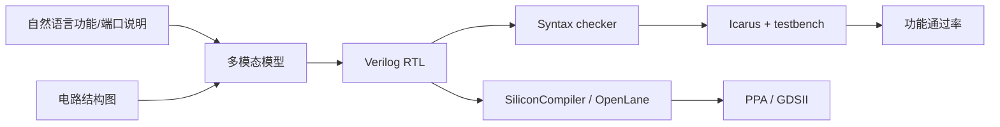
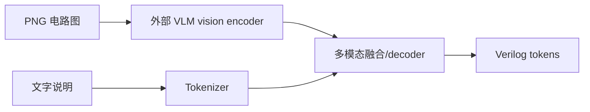
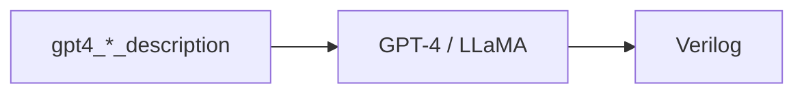
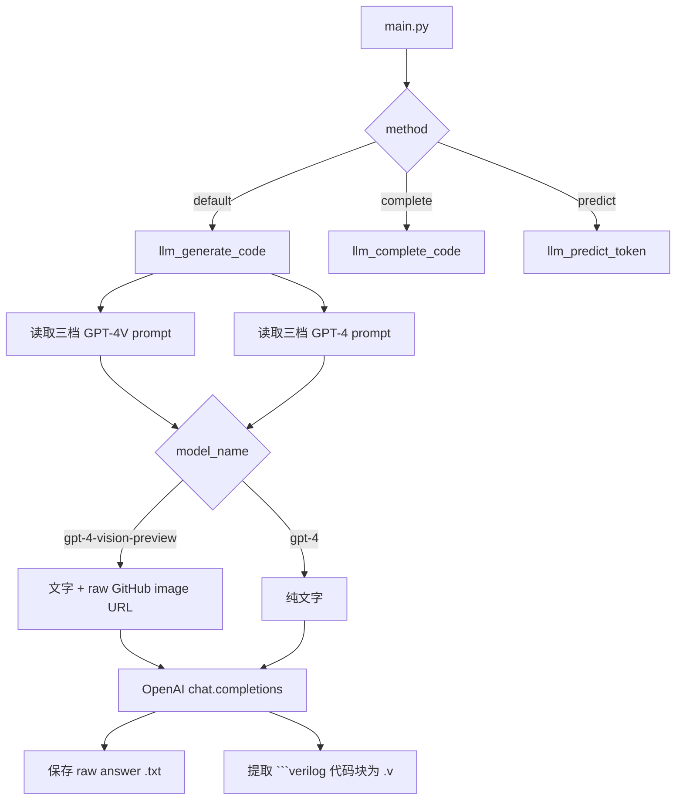
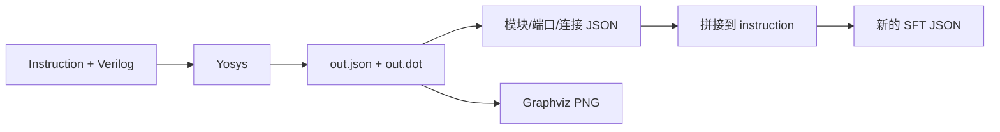

# ChipGPT-V：多模态 Verilog Benchmark、VLMQL、代码实现与复现边界详解

> 论文：**Natural language is not enough: Benchmarking multi-modal generative AI for Verilog generation**  
> 作者：Kaiyan Chang、Zhirong Chen、Yunhao Zhou、Wenlong Zhu、Kun Wang、Haobo Xu、Cangyuan Li、Mengdi Wang、Shengwen Liang、Huawei Li、Yinhe Han、Ying Wang  
> 会议：ICCAD 2024  
> DOI：10.1145/3676536.3676679  
> arXiv：2407.08473 v1，2024-07-11  
> 原论文：[2407.08473_ChipGPT-V.pdf](./2407.08473_ChipGPT-V.pdf)  
> 官方论文页：<https://arxiv.org/abs/2407.08473>  
> 官方 PDF：<https://arxiv.org/pdf/2407.08473>  
> DOI 页面：<https://doi.org/10.1145/3676536.3676679>  
> 官方代码：<https://github.com/aichipdesign/chipgptv>  
> 本地代码 commit：`52ef98d7138fa27ff556aba6b430a7e434ce12e7`  
> commit 时间：2025-06-17 09:11:53 +0000  
> 本次核验日期：2026-08-02  
> 静态审计：[runs/static_audit_20260802.json](./runs/static_audit_20260802.json)

---

```text
┌─────────────────────────────────────────────────────────────────────────────┐
│ P1 任务定义                                                                   │
├─────────────────────────────────────────────────────────────────────────────┤
│ Input    │ 电路结构图 PNG + 自然语言设计说明（simple/medium/complex）；    │
│          │ 补全任务额外含 RTL prefix；全部输入不含 golden RTL              │
├──────────┼────────────────────────────────────────────────────────────────┤
│ Output   │ Verilog RTL、代码补全后续片段、或 next-token 预测               │
├──────────┼────────────────────────────────────────────────────────────────┤
│ Supervision │ Icarus 语法/功能 testbench；论文自定义 syntax/function/        │
│          │ next-token 三类指标；每个设计采样 5 次                          │
├──────────┼────────────────────────────────────────────────────────────────┤
│ Why-hard │ 多模态融合、空间拓扑与文字语义互补、VLM 旧 API 型号下线风险、  │
│          │ temperature/seed/model revision 未记录、当前 evaluator 与论文   │
│          │ 细粒度指标（best-candidate testcase ratio、BPE token）不一致 │
└─────────────────────────────────────────────────────────────────────────────┘
```

## 0. 先给结论

ChipGPT-V 不是一个带自研权重、下载 checkpoint 后即可推理的视觉语言模型。

这篇论文的主体是：

1. 说明纯自然语言难以无歧义表达多模块连接、二维空间结构和状态转移；
2. 构造一套“电路图 + 分层文字说明 + reference RTL + testbench”的多模态 Verilog benchmark；
3. 用 GPT-4V / GPT-4 与 LLaVA / LLaMA 比较“图像 + 文本”“纯文本”“纯图像”三种输入；
4. 提出 VLMQL，用一组 Python 风格声明把图、模块功能、端口、EDA 工具和输出约束编译成 prompt；
5. 用 syntax、functionality 和 next-token 三类指标评价生成结果。

最重要的论文结果是：

| 模型系列 | 输入 | syntax success | functionality |
|---|---:|---:|---:|
| GPT-4 系列 | 文本 | 68.75% | 46.88% |
| GPT-4 系列 | 图像 + 文本 | 84.38% | 71.81% |
| LLaMA 系列 | 文本 | 21.88% | 13.41% |
| LLaMA 系列 | 图像 + 文本 | 34.38% | 25.88% |

论文还报告：

- GPT 系列 next-token 平均成功率从 63.64% 提高到 71.72%；
- LLaMA/LLaVA 系列从 20.20% 提高到 28.28%；
- GPT-4V 的 simple / medium / complex prompt 功能成功率为 40.63% / 59.38% / 71.81%；
- LLaVA 对应为 9.38% / 16.25% / 25.88%；
- FSM 状态数从 2 增至 9 时，transition success 从 100% 降至 0%。

这些数值全部是**论文报告**，不是本次本机重新调用闭源 API 得到的结果。

当前仓库的真实定位是：

```text
benchmark 数据 + GPT-4/GPT-4V 调用脚本 + Icarus 判分草稿
+ 一个只打印 prompt 的 VLMQL 原型
+ 一个交互式 Graphviz 画图工具
+ 后续“图/表/波形投影到文本 IR”项目的部分合并代码
```

当前仓库不包含：

- GPT-4V 权重；
- LLaVA 权重；
- LLaMA 权重；
- 论文生成结果全集；
- 论文 Table 3/5/6 的原始逐样本日志；
- 可直接复算 98%、34%、50% 等细粒度功能分数的 evaluator；
- README 后半部分所引用的 `projector/`、`finetune/`、`dpo/` 目录；
- LoRA / DPO adapter；
- 根目录许可证。

本地也没有 `模型推理.md`、`generated_code/`、checkpoint 或本机运行日志。

仓库中确实有 21 份 `gptv_*.v`、2 个 Icarus `a.out` 和 2 个 VCD，但它们是上游随 benchmark 一起提交的历史 artifact，没有本机执行时间、模型参数、prompt、API response 和统一结果记录，不能当成本次本地模型复现。

因此当前最准确的复现等级是：

| 层级 | 状态 |
|---|---|
| 论文原文 | 已归档、标题/作者/DOI/arXiv 已核对 |
| benchmark | 45 个当前目录、958 个文件，已静态盘点 |
| 论文主链源码 | 11 个 `benchmark_exp` 脚本已逐项审阅 |
| VLMQL | 原型已核对，但不是完整 compiler / runtime |
| 现有模型推理记录 | 不存在 |
| 新模型推理 | 本次未执行 |
| 论文表格复算 | 不能由当前公开输出直接复算 |
| 综合等级 | **R1：论文—代码—数据路径已核对，论文实验未本地复现** |

本次没有重复调用 GPT-4V，也没有拿随机模型输出冒充复现。

原因不是“还需要再跑一遍才懂代码”，而是：

```text
闭源/外部模型 + 旧 API 型号下线风险 + 无原始输出日志
+ 当前 evaluator 与论文指标不一致
= 新调用不能证明 2024 年论文结果被复现
```

本次重点是把论文方法、当前代码、当前数据和已有证据边界拆开。

---

## 1. 证据边界

本文使用四类证据。

| 标记 | 来源 | 能说明什么 |
|---|---|---|
| `[论文]` | 原论文正文、图、表 | 作者定义的方法和作者报告结果 |
| `[代码]` | commit `52ef98d` 的源码 | 当前 checkout 实际实现 |
| `[本地资产]` | PDF、benchmark、文件数量、哈希 | 文件是否真实存在 |
| `[已有运行]` | `模型推理.md`、record、log、生成目录 | 某条路径是否在本机执行过 |

ChipGPT-V 当前没有可用的 `[已有运行]` 证据。

所以本文会写：

- `[论文]` GPT-4V 图文输入功能成功率 71.81%；
- `[代码]` `main.py` 对每个完整生成样例调用 5 次；
- `[本地资产]` `generated_code/` 不存在；
- 不能写成 `[已有运行]` 本机得到 71.81%。

### 1.1 本次做了什么

- 核对论文身份、会议、DOI、arXiv 和本地 PDF；
- 阅读论文 motivation、benchmark、VLMQL、评价和消融；
- 阅读完整生成、补全、next-token 三条调用链；
- 阅读 prompt 生成脚本和数据目录；
- 阅读 function / syntax / next-token evaluator；
- 阅读 `vlmql.py` 和交互式画图工具；
- 阅读后续合并进仓库的 Yosys→JSON→图/IR 路径；
- 阅读 GPT-4、Llama、RTL-Coder、DPO adapter 的后续评测脚本；
- 统计 benchmark 的目录数、文件数、图片、reference、testbench；
- 核对论文表格、`main.py` 样例清单和当前目录三套口径；
- 检查 checkpoint、生成结果、日志、模型推理文档和许可证；
- 定位会阻断 fresh run 或改变指标的源码问题；
- 形成机器可读静态审计。

### 1.2 本次没有做什么

- 没有重新请求 GPT-4 / GPT-4V；
- 没有下载或加载 LLaVA / LLaMA / RTL-Coder；
- 没有执行 165 次或更多付费 API 调用；
- 没有重新编译 45 个当前 benchmark；
- 没有修改 benchmark oracle；
- 没有训练 LoRA / DPO；
- 没有把上游保存的 `gptv_*.v` 写成本地推理；
- 没有重算论文 Table 3、5、6；
- 没有把后续投影框架误算成 2024 ICCAD 论文的方法。

---

## 2. 论文身份与代码快照

### 2.1 论文信息

| 字段 | 内容 |
|---|---|
| 标题 | Natural language is not enough: Benchmarking multi-modal generative AI for Verilog generation |
| 作者 | Kaiyan Chang 等 12 位作者 |
| 会议 | IEEE/ACM ICCAD 2024 |
| DOI | 10.1145/3676536.3676679 |
| arXiv | 2407.08473 v1 |
| 提交日期 | 2024-07-11 |
| 页数 | 9 |
| 本地 PDF | `2407.08473_ChipGPT-V.pdf` |
| 文件大小 | 1,046,607 bytes |
| SHA-256 | `63c0a8fe0ee249e0f276cbef195fe3184a4cea49546f77b7c025b499b98fa337` |

### 2.2 代码快照

| 字段 | 内容 |
|---|---|
| remote | `https://github.com/aichipdesign/chipgptv.git` |
| branch | `main` |
| commit | `52ef98d7138fa27ff556aba6b430a7e434ce12e7` |
| commit 时间 | 2025-06-17 09:11:53 +0000 |
| commit subject | `merge repo` |
| Git 历史 | 当前 clone 为 grafted/shallow 单提交，无法从本地恢复合并前版本 |
| tracked files | 987 |
| tracked Python | 23 个，2380 行 |
| benchmark files | 958 |
| 根 LICENSE | 未发现 |

### 2.3 为什么 commit 时间很重要

论文在 2024 年发表；当前 commit 是 2025 年的 `merge repo`。

README 同时出现两个标题：

1. `Natural language is not enough...`；
2. `From Diagrams to Code: A Portable Multi-Modal Data Projection Framework for LLM-based Verilog Generation`。

因此当前仓库不是严格冻结的 ICCAD 2024 artifact，而是后续相关工作合并后的快照。

这会造成三类漂移：

- `benchmark/advanced` 与后来拆出的 `benchmark/fsm`、`benchmark/multimodule` 并存；
- README 引用后续训练/投影目录，但当前提交又没有完整合入；
- `test_benchmark` 和 `verilog_check` 使用新目录结构，`benchmark_exp` 仍使用原论文目录结构。

本文把两条工作分开：

```text
2407.08473 / ICCAD 2024
    → 图像 + 文本 benchmark
    → VLMQL
    → GPT-4V / GPT-4 / LLaVA / LLaMA 对照

后续 merged work
    → RTL 派生图/结构 IR
    → projector text
    → Llama/RTL-Coder SFT、DPO 和 testbench generation
```

### 2.4 许可证边界

根目录未发现 `LICENSE`、`COPYING` 或 SPDX 总声明。

论文版权页允许个人/教学目的复制，不等于代码仓库自动采用开源软件许可证。

因此准确说法是：

> 仓库公开可访问，但当前 checkout 没有明确覆盖整仓库的代码许可证；再分发、改作训练集或商业使用前要向作者确认。

---

## 3. 它位于 EDA 流程的哪一段

论文把前端和后端放在一张流程图中。



但当前公开代码真正覆盖的深度不同：

| 环节 | 论文 | 当前代码 |
|---|---|---|
| 图文 prompt | 核心 | 有 benchmark 和 API wrapper |
| VLM 生成 | GPT-4V/LLaVA | 只有 GPT-4/GPT-4V API wrapper；无 LLaVA 原论文 runner |
| syntax/function | 核心评价 | 有 Icarus 草稿，但口径与论文不一致 |
| next-token | 细粒度评价 | 有生成与比较脚本，但路径不对称 |
| VLMQL | query language | 有 62 行打印式原型 |
| SiliconCompiler/OpenLane | 后端愿景 | 没有实际调用实现 |
| PPA/GDSII | 流程输出 | 没有结果、脚本和论文评价表 |

所以它的已开源主体应定位为：

> **spec/diagram-to-RTL benchmark 与 prompt/evaluator 原型**，不是完整 spec-to-GDS 闭环。

---

## 4. 论文为什么认为自然语言不够

### 4.1 嵌套空间结构难线性表达

论文认为 accelerator、pipeline 和多层模块的二维嵌套关系很难只用“上方、下方、相邻、包围”等词稳定表达。

自然语言可以描述功能，却不擅长高密度携带拓扑。

### 4.2 多模块连接描述成本可能达到 O(n²)

将硬件视为多重图：

```text
G = (V, E)
V：模块
E：端口/线网连接
```

若 n 个模块可能两两互连，文字枚举连接会接近 O(n²)。

图则能在二维空间中直接给出模块与边。

### 4.3 端口对齐容易错

文字只说“把控制器接到 PE”并不足以确定：

- 哪个 output 接哪个 input；
- 位宽是多少；
- 是 data、clock、reset 还是 control；
- 一对一、扇出还是总线连接。

论文把图中模块名、端口名、边和位宽看作消除歧义的视觉锚点。

### 4.4 图像也不够

论文并没有说“只看图就够”。

电路图擅长：

- 模块层次；
- 空间位置；
- 连接关系；
- 端口和位宽标注。

自然语言擅长：

- 模块内部功能；
- 时序语义；
- reset 极性；
- clock edge；
- 具体运算规则。

所以目标输入是：

```text
visual structure + natural-language semantics
```

而不是 image-only。

---

## 5. 视觉—语言协同表示

### 5.1 Word Notations

论文把图中文字定义为连接视觉与语言的接口。

包括：

| 标注 | 作用 |
|---|---|
| Module name | 让文字能引用具体 block |
| Wire width | 指明 bit width / bandwidth |
| Wire function | 区分 data、control、clock 等 |
| Block function | 指明 ALU、MUX、register file 等角色 |
| Port | 指明外部接口名称与方向 |

### 5.2 Relations

论文把图中的箭头和连线分为：

- one-to-one；
- one-to-many；
- many-to-many。

这分别对应单 wire、bus/fanout 和 crossbar 一类结构。

### 5.3 自然语言的两部分

自然语言说明被拆成：

1. module function description；
2. module port description。

例如：

```text
功能：3-to-8 decoder 接收 3 bit 输入，输出 one-hot 8 bit。
端口：输入名 innum，位宽 3。
```

### 5.4 一个 benchmark 样本的四元组

论文定义的基础单位是：

```text
Prompt_list.txt
+ Circuit_Structure.png
+ TestBench.v
+ reference.v
```

当前仓库将 `Prompt_list.txt` 细化成多份 prompt 文件。

---

## 6. Benchmark 的两个层次轴

论文不是只按“简单/复杂”分一次，而是同时区分 output workload 和 input prompt。

### 6.1 输出电路复杂度

| 层级 | 论文定义 | 例子 |
|---|---|---|
| Arithmetic | 基本数值运算 | adder、divider、multiplier、accumulator |
| Logic / digital circuit | 控制和常用逻辑 | edge detect、pulse detect、counter、MUX |
| Advanced | CPU/阵列/多模块/状态机 | pipeline、systolic、GEMM、FSM、MAC PE |

### 6.2 输入 prompt 复杂度

| Prompt | 图像 | 文字信息 |
|---|---|---|
| simple | 有 | 很少，主要依赖图 |
| medium | 有 | 简洁核心功能 |
| complex | 有 | 寄存器、时钟边沿、端口等完整细节 |

纯文本对照使用对应的：

```text
gpt4_simple_design_description.txt
gpt4_medium_design_description.txt
gpt4_design_description.txt
```

图文输入使用：

```text
simple_design_description.txt
medium_design_description.txt
design_description.txt
```

### 6.3 论文 Table 2、Table 3、代码三套样例数不一致

这是阅读论文时必须明确的地方。

| 来源 | Arithmetic | Logic | Advanced | 合计 |
|---|---:|---:|---:|---:|
| 论文 Table 2 | 10 | 8 | 12 | 30 |
| 论文 Table 3 | 10 | 10 | 12 | 32 |
| `benchmark_exp/main.py` | 11 | 10 | 12 | 33 |
| 当前 `benchmark/` 所有目录 | 11 | 10 | 12 + 4 FSM + 4 multimodule + 4 testbench | 45 |

主要差异：

- Table 2 没列 `serial2parallel`、`width_8to16`；
- Table 3 没列 `multi_16bit`；
- `main.py` 包含 `multi_16bit`，所以是 33 个；
- Table 3 写 `statemachine`，代码目录对应关系不明确，最可能是 `2state_fsm`；
- 当前仓库又复制/改写了 FSM 和 multimodule 目录，并新增 testbench generation 题。

因此不能简单写“论文 benchmark 就是当前 45 题”。

---

## 7. 当前 benchmark 真实结构

### 7.1 文件和目录总量

`benchmark/` 当前有：

| 类别 | 设计目录 | 文件数 |
|---|---:|---:|
| advanced | 12 | 266 |
| arithmetic | 11 | 250 |
| digital_circuit | 10 | 230 |
| fsm | 4 | 104 |
| multimodule | 4 | 96 |
| testbench | 4 | 12 |
| 合计 | **45** | **958** |

另有：

- 41 张 benchmark PNG；
- 41 份 `reference.v` / `verified_*.v` / 拼错的 `reeference.v`；
- 45 份 `testbench.v`；
- 12 份 `projector_description.txt`；
- 4 份 `design_description_no_table.txt`；
- 4 份 `testbench_description.txt`；
- 4 份 `testbench_description_with_timeseries.txt`。

testbench 类题目本身没有 PNG/reference，因为目标变成生成 testbench。

### 7.2 原论文设计目录的一般文件

典型目录包含：

```text
<design>.png
reference.v 或 verified_<design>.v
testbench.v

simple_design_description.txt
medium_design_description.txt
design_description.txt

gpt4_simple_design_description.txt
gpt4_medium_design_description.txt
gpt4_design_description.txt

gptv_next_token_1..3.txt
gpt4_next_token_1..3.txt

code_completion_1..3.txt
gpt4_code_completion_1..3.txt
```

### 7.3 视觉样例一：5-stage pipeline


这张图表达：

```text
Fetch → Decoder → Executor → Memory Access → Write back
```

结构清楚，但没有完整表达每一级内部寄存器、hazard、forwarding、stall、数据位宽和时序语义；这些必须由文字补充。

### 7.4 视觉样例二：序列检测 FSM


图直接给出 6 个状态、输入为 0/1 时的边和 `MATCH` 输出。

这正是论文的核心案例：纯文本容易写错远距离状态转移，图能直接呈现拓扑。

### 7.5 视觉样例三：4×4 spatial accelerator


这张图展示 16 个 PE 及一个放大的 PE 内部结构。

但当前图中部分 weight 标注重复为 `weight[0][0]` / `weight[0][1]` 一类，未完整呈现标准矩阵索引，说明图本身也可能携带模糊或错误信息。

### 7.6 后续目录不是简单软链接

`benchmark/fsm/*` 与 `benchmark/advanced/*state_fsm` 并非完全相同。

例如：

- `design_description` 可能改变；
- reference/testbench 可能改变；
- 新目录增加 projector、no-table、response、testbench description；
- `multimodule` 把 `reference.v` 改为 `verified_*.v` 并增加 projector/response。

所以统计时不能把它们当同一文件的两个路径，也不能全部算进原论文 Table 3。

---

## 8. 这里到底有没有“ChipGPT-V 模型”

### 8.1 没有唯一自研 backbone

论文比较的是外部基础模型：

| 模态 | 论文角色 | 仓库资产 |
|---|---|---|
| GPT-4V | 图像 + 文本、图像 only | API 调用代码，无权重 |
| GPT-4 | 纯文本 | API 调用代码，无权重 |
| LLaVA | 图像 + 文本、图像 only | 原论文结果，无对应原论文 runner/权重 |
| LLaMA | 纯文本 | 原论文结果，无对应原论文 runner/权重 |

因此“ChipGPT-V 参数量”没有单一答案。

### 8.2 原生 VLM 路径



vision encoder、fusion、decoder 层数都在外部模型中，不在仓库中。

### 8.3 纯文本对照



为了公平，纯文本文件需要把图中必要信息改写成文字，而不是简单删除图片。

但这也带来一个方法学问题：

> 纯文本对照到底获得多少由人工从图转写的信息，会显著影响“视觉增益”。

当前仓库的 prompt pair 并不总是只差一句“shown in picture”；在 code completion 中，两个模态的 RTL prefix 甚至可能不同。

---

## 9. 完整 Verilog 生成代码路径

入口：[benchmark_exp/main.py](./benchmark_exp/main.py)

### 9.1 调用链



### 9.2 迭代次数

代码定义：

```python
iter = {"default": 5, "complete": 3, "predict": 3}
```

对 33 个 `instance_list`：

| 任务 | 每题请求 | 总请求数/模型/prompt 档 |
|---|---:|---:|
| 完整生成 | 5 | 165 |
| 补全 | 3 | 99 |
| next-token | 3 | 99 |

若完整复现 simple/medium/complex × GPT-4/GPT-4V，仅完整生成就是：

```text
33 × 5 × 3 × 2 = 990 次 API 请求
```

这还不含 LLaVA/LLaMA、image-only 和 sensitivity/ablation 的额外实验。

### 9.3 图片不是从本地 benchmark 读取

代码构造：

```python
img_url = (
  "https://raw.githubusercontent.com/"
  "rong-hash/chipgptv_img/main/{instance}.png"
)
```

也就是说：

- 本地 PNG 存在；
- API wrapper 却依赖另一个 GitHub 仓库的 raw URL；
- 代码没有校验 HTTP 状态、图片哈希或本地/远程一致性；
- 离线环境即使 benchmark 齐全，VLM 调用仍不能按当前代码工作。

### 9.4 只支持两个旧模型字符串

允许：

```text
gpt-4-vision-preview
gpt-4
```

其他模型直接 `ValueError`。

`gpt-4-vision-preview` 是历史 API 型号；即使 2026 年重新请求，也不能假设服务端行为等于论文时期。

### 9.5 API 参数不完整

代码仅固定：

```python
max_tokens=3000
```

没有保存或固定：

- temperature；
- top_p；
- seed；
- API/model revision；
- response usage；
- latency；
- finish_reason；
- request ID。

因此即使输出目录存在，也不足以做严格可重复性审计。

### 9.6 API key 轮换

代码内置：

```python
api_keys = ['API_KEY1', 'API_KEY2']
```

失败时循环 rotate。

这不是凭据加载方案；正确实现应从环境变量/secret manager 读取，并区分：

- authentication error；
- rate limit；
- transient network error；
- invalid model；
- content filter。

当前代码会把所有异常都当作“换 key 再试”，最后丢失结构化错误信息。

### 9.7 Verilog 提取器

提取器寻找：

~~~text
```verilog
...
```
~~~

风险：

- 模型输出 ` ```systemverilog ` 时提取不到；
- 模型不带 fence 时 `.v` 为空；
- 大小写/空格变化时提取不到；
- 多块代码直接拼接，块间不主动补换行；
- `end` 第一次查找没有从 `begin` 起定位，复杂回答可能错配 fence。

raw `.txt` 保留是对的，但仓库没有统一的 parse status 或失败原因记录。

---

## 10. Code completion 任务

入口：[benchmark_exp/llm_complete_code.py](./benchmark_exp/llm_complete_code.py)

### 10.1 任务定义

输入包含：

```text
功能说明
+ 可选图片
+ reference RTL 的一个 prefix
```

模型应补完整后续 RTL。

### 10.2 prefix 怎样生成

[generate_code_completion.py](./benchmark_exp/generate_code_completion.py) 做的是：

1. 读取 `medium_design_description.txt`；
2. 把 `Implement` 换成 `Complete`；
3. 只保留前三个换行段；
4. 从 reference Verilog 随机选一个**字符位置**；
5. 向后走到下一个 token 边界；
6. 保存三个随机 prefix。

### 10.3 随机性没有 seed

代码直接使用：

```python
random.randint(...)
```

没有固定 seed，也没有记录切分位置。

这意味着重新生成 prompt 会改变：

- prefix 长度；
- 补全难度；
- 目标 next token；
- 两模型的比较基础。

### 10.4 多模态与纯文本 prefix 不总是相同

以 `advanced/2state_fsm` 第 1 个补全为例：

- `code_completion_1.txt` 截止到 `parameter`；
- `gpt4_code_completion_1.txt` 已包含两个 parameter 和大段 always/case。

两题难度明显不同。

这不是“同一 RTL prefix，只差图片”。

因此现有 completion prompt 不能直接作为严格的 modality ablation。

### 10.5 生成脚本不完整

`generate_code_completion.py` 只写：

```text
code_completion_1..3.txt
```

没有生成：

```text
gpt4_code_completion_1..3.txt
```

后者如何产生、如何保证与前者使用相同 prefix，当前源码没有给出。

---

## 11. Next-token 任务

### 11.1 论文定义

论文写：

```text
success^N = Σ_i 1[token'_i = token_i]
```

意图是把完整程序评价拆成细粒度 token 预测。

### 11.2 当前 prompt 生成

[generate_next_token_prediction.py](./benchmark_exp/generate_next_token_prediction.py) 与 completion 类似：

- 从 reference 随机取字符位置；
- 扩到空白边界；
- 写入代码 prefix；
- 请求“give me the next token”。

同样没有 seed。

脚本只生成 `gpt4_next_token_*.txt`，没有生成 `gptv_next_token_*.txt` 的对应逻辑。

### 11.3 评价器的 token 不是模型 tokenizer

[next_token_correctness.py](./benchmark_exp/next_token_correctness.py) 使用：

```python
tokens = code.split()
```

这只是 Python whitespace token，不是 GPT/LLaMA BPE token。

例如：

```verilog
assign y=a+b;
```

可能被视为一个 whitespace token，却会被模型 tokenizer 分成多个 token。

所以论文“token”与代码“token”并未严格对齐。

### 11.4 GPT-4V 与 GPT-4 读取路径不对称

评价器读取：

```python
GPT-4V → generated_code/.../<case>.v
GPT-4  → generated_code/.../<case>.txt
```

但 next-token 模型正常可能只回复一个裸 token，不会包在 ` ```verilog ` 中。

此时生成器会：

- `.txt` 保存裸 token；
- `.v` 因找不到 fence 而为空。

结果是：

- GPT-4 从 raw `.txt` 还能取到 token；
- GPT-4V 从空 `.v` 取不到。

这条不对称足以阻断当前代码复算论文 Table 6。

### 11.5 其他实现问题

- `tokens[token_length] == '\n'` 永远没有意义，因为 `.split()` 已删除换行；
- reference 查找依赖 `os.listdir` 顺序；
- `advanced/fsm` 的 reference 拼成 `reeference.v`，查找器不会识别；
- 当 prefix 已到文件末尾时返回 `None`，但没有把该样本从分母中结构化标出；
- 当前输出按 3 次试验计算 0/33.33/66.67/100%，与论文 Table 6 步长一致，但没有论文原始 prediction 文件。

---

## 12. VLMQL：论文概念

VLMQL 全称：

```text
Verilog Large Model Query Language
```

论文把它定义为可控 prompt engineering/query framework。

### 12.1 三种视觉抽象层级

| mode | 含义 |
|---|---|
| gate-level | 逻辑门级图 |
| algorithm-level | add、multiply 等算法 block |
| function-block-level | 更大的自定义功能 block |

### 12.2 模型与输入声明

论文示例：

```python
vlmql.set_mode("func_block")
vlmql.lvm("gpt4v")
vlmql.llm("gpt4v")
vlmql.image_path("5stage.png")
```

### 12.3 功能声明

以多条自然语言分别说明：

- 整体模块功能；
- 子模块功能；
- 端口和数据流。

### 12.4 EDA flow 声明

论文示例：

```python
vlmql.eda_tool("siliconcompiler")
vlmql.eda_flow("the area should large than (1000,1000)")
```

其意图是让模型同时生成 EDA script。

### 12.5 输出约束

论文用：

```python
vlmql.module_constraint("execute stage")
```

只请求 5-stage pipeline 中的 execute stage，减少无关输出 token。

---

## 13. VLMQL：当前代码真实实现

入口：[benchmark_exp/vlmql.py](./benchmark_exp/vlmql.py)

### 13.1 它实际只打印 prompt

`run()` 做的是一组 `print()`：

```text
Please act as a Verilog programmer...
Generate the following hardware...
Please provides the eda script...
...</img>
```

它没有：

- parser；
- AST；
- compiler IR；
- OpenAI/LLaVA 调用；
- image encoding；
- EDA tool execution；
- output parser；
- constraint checker。

因此准确表述是：

> 当前 `vlmql.py` 是论文语法概念的 62 行 prompt printer / decorator demo。

### 13.2 论文与代码 API 名不一致

| 论文 | 当前代码 |
|---|---|
| `@vlmql.function` | `@vlmql` |
| `module_constraint` | `module_constrain` |

照论文 Figure 7 抄写不能直接调用当前类。

### 13.3 类方法会覆盖自己

例如：

```python
def lvm(lmtype):
    vlmql.lvm = lmtype
```

第一次调用后，`vlmql.lvm` 从方法变成字符串。

同一 Python 进程第二次再调用：

```python
vlmql.lvm("...")
```

会因为字符串不可调用而失败。

`llm` 也有相同问题。

### 13.4 状态全部存在 class attribute

mode、func、img_path、tooltype、edaarg、constrain 都不是实例隔离状态。

这意味着：

- 多个 VLMQL program 会相互污染；
- 并发不可用；
- 可选字段未设置时可能 `AttributeError`；
- 没有 program object 可序列化。

### 13.5 import 有副作用

文件末尾直接：

```python
pipeline_5stage()
```

因此 import 模块就打印示例 prompt。

它不适合作为无副作用 library。

### 13.6 `lvm` 检查无效

代码写：

```python
if vlmql.lvm == None and not vlmql.img_path == None:
    raise Exception("Type error")
```

在未调用 `lvm()` 前，`vlmql.lvm` 本来就是 method object，不是 `None`。

所以“有图但未配置视觉模型”的检查不会按预期工作。

### 13.7 EDA flow 没闭环

`eda_tool("siliconcompiler")` 只把名字放进 prompt。

当前代码不会：

- 安装/导入 SiliconCompiler；
- 生成可执行脚本；
- 调用 OpenLane；
- 读取 PPA；
- 检查 area constraint。

---

## 14. 交互式 Chip drawing tool

入口：[chip_draw_tool/chip_graph.py](./chip_draw_tool/chip_graph.py)

### 14.1 数据结构

```text
Graph
 ├─ name
 ├─ nodes: Node[]
 └─ edges: (nodeA, nodeB, portA, portB)[]

Node
 ├─ name
 ├─ ports: (name, width, type)[]
 ├─ connected_ports
 └─ signal_connected_ports
```

port type：

```text
0 = input
1 = output
```

### 14.2 添加模块和连接

交互菜单支持：

1. Add submodule；
2. Add connections between submodules；
3. Connect signal to a port；
4. Done。

`add_edge` 检查：

- 两端 port 存在；
- 位宽相同；
- 方向类型不同。

### 14.3 Graphviz 输出

每个模块用 HTML table label 展示输入、模块名和输出。

边标注 width，布局方向为 LR。

### 14.4 `all_ports_connected` 只检查第一个 node

当前代码：

```python
def all_ports_connected(self):
    for node in self.nodes:
        return len(node.ports) == len(node._connected_ports)
```

`return` 在循环内部。

因此只要第一个模块的端口接完，后续模块即使未连接也会返回 True。

### 14.5 删除 signal port 时修改正在迭代的 set

`disconnect_port` 在：

```python
for port in self.signal_connected_ports:
    self.signal_connected_ports.remove(port)
```

这可能触发 `Set changed size during iteration`。

### 14.6 signal node ID 不一致

代码创建：

```python
dot.node(signal, ...)
```

但连边使用：

```python
signal_id = f"signal_{signal}"
dot.edge(signal_id, ...)
```

会产生一个额外未显式定义的 node。

### 14.7 工程边界

工具没有：

- 保存/加载 graph JSON；
- module hierarchy；
- bus slicing；
- one-to-many net 对象；
- clock/reset 语义；
- Verilog export；
- 与 benchmark prompt 自动同步；
- headless render 配置。

`dot.render(view=True)` 还会尝试启动 GUI viewer。

---

## 15. 论文评价协议

### 15.1 生成次数

每个模型、每个设计生成 5 次。

### 15.2 Syntax

Table 3 的 syntax 列表示 5 次中有 syntax error 的生成数量。

因此 summary syntax success 以 32 个设计为单位。

例如 GPT-4V V+T：

```text
84.38% = 27 / 32
```

### 15.3 Functionality

论文 caption 写：

> 取 pass@5 中表现最好的 Verilog，报告其 testbench pass rate。

这不是简单的“5 个候选中只要一个完全通过就记 100%”。

因为 Table 3 出现：

```text
98%、97%、50%、34%、10%
```

这些值需要 testbench 内部 testcase-level 计数。

### 15.4 Next-token

每题 3 个 prefix，所以 Table 6 的结果是：

```text
0%、33%、67%、100%
```

### 15.5 三类指标不能互换

```text
syntax pass
≠ testbench compile/run success
≠ 部分 testcase pass ratio
≠ 完整功能 pass@5
≠ next-token exact match
```

---

## 16. 论文 Table 3 结果

### 16.1 汇总

| 模型/输入 | Syntax success | Function |
|---|---:|---:|
| GPT-4V，V+T | 84.38% | 71.81% |
| GPT-4，T | 68.75% | 46.88% |
| GPT-4V，V | 25.00% | 33.90% |
| LLaVA，V+T | 34.38% | 25.88% |
| LLaMA，T | 21.88% | 13.41% |
| LLaVA，V | 25.00% | 3.13% |

### 16.2 最关键的对照

GPT 系列加入图像：

```text
syntax: 68.75 → 84.38，+15.63 percentage points
function: 46.88 → 71.81，+24.93 percentage points
```

LLaMA/LLaVA 系列加入图像：

```text
syntax: 21.88 → 34.38，+12.50 percentage points
function: 13.41 → 25.88，+12.47 percentage points
```

### 16.3 图像 only 不是最好

GPT-4V：

```text
V+T function = 71.81%
V-only function = 33.90%
```

LLaVA：

```text
V+T function = 25.88%
V-only function = 3.13%
```

因此论文结论不是“图片替代文字”，而是图文互补。

### 16.4 代表性 case

| Case | GPT-4V V+T | GPT-4 T | 观察 |
|---|---:|---:|---|
| ALU | 100% | 0% | 图文显著改善 |
| freq_div | 100% | 0% | 图文显著改善 |
| pulse_detect | 100% | 0% | 图文显著改善 |
| 2x2 systolic | 100% | 0% | 空间结构受益 |
| FSM | 100% | 0% | 状态图受益 |
| 5-state FSM | 100% | 0% | 状态图受益 |
| 4-state FSM | 0% | 100% | 并非每题都受益 |
| multi_pipe_4bit | 50% | 100% | 文本对照更好 |
| parallel2serial | 0% | 0% | 两者均失败 |
| 5-stage pipeline | 0% | 0% | 图仍不足以解决复杂设计 |

因此不能只用平均数宣称“每一题视觉都更好”。

---

## 17. Prompt sensitivity

论文 Table 5 的总体结果：

| 模型 | simple | medium | complex |
|---|---:|---:|---:|
| GPT-4V | 40.63% | 59.38% | 71.81% |
| LLaVA | 9.38% | 16.25% | 25.88% |

### 17.1 结论

更多文字细节总体能提高成功率。

这说明图像并没有让详细规格变得不重要。

### 17.2 并非单调

逐 case 仍有反例：

- `1x4systolic` 的 GPT-4V：60% → 20% → 100%；
- `fsm`：0% → 100% → 60%；
- `5state_fsm`：100% → 100% → 60%；
- `4state_fsm`：40% → 100% → 80%。

所以“prompt 越长越好”不是逐题定律。

可能原因包括：

- 文字和图不完全一致；
- 更长 prompt 引入歧义；
- 采样波动；
- 5 次样本量较小；
- testbench/oracle 本身不稳。

---

## 18. FSM 状态数敏感性

论文 Table 4：

| State number | 2 | 3 | 4 | 5 | 6 | 7 | 8 | 9 |
|---|---:|---:|---:|---:|---:|---:|---:|---:|
| Transition | 100% | 100% | 80% | 60% | 60% | 20% | 0% | 0% |
| State declaration | 100% | 100% | 100% | 100% | 100% | 100% | 100% | 100% |
| Output | 100% | 100% | 100% | 100% | 100% | 100% | 80% | 80% |

这里最有价值的观察是：

> 模型能声明所有状态，不代表能写对所有转移。

错误主要集中在长距离依赖和多边转移，而不是简单的 parameter/register 声明。

当前仓库只保留 2–5 state 的标准目录和一个 6-state sequence detector，没有论文 Table 4 所需的完整 2–9 state 输出与评分记录。

---

## 19. Next-token 论文结果

Table 6 平均值：

| 系列 | 图文协同 | 纯文本 | 增益 |
|---|---:|---:|---:|
| GPT | 71.72% | 63.64% | +8.08 pp |
| LLaVA/LLaMA | 28.28% | 20.20% | +8.08 pp |

### 19.1 为什么它不能替代功能评价

一个模型可以正确预测：

```text
endmodule
```

或：

```text
begin
```

但整个状态机仍然错误。

next-token 更接近编辑器补全能力，不等于完整 RTL 正确。

### 19.2 表中也有反例

例如 GPT 系列：

- `3state_fsm`：图文 0%，纯文本 100%；
- `adder_16bit`：图文 100%，纯文本 33%；
- `alu`：图文 100%，纯文本 0%；
- `serial2parallel`：图文 33%，纯文本 67%。

平均增益不能掩盖 case-level 波动。

---

## 20. 当前 function evaluator 为什么不能复算论文表

入口：[benchmark_exp/function_correctness.py](./benchmark_exp/function_correctness.py)

### 20.1 fresh run 先因目录失败

脚本 `chdir` 到仓库根后定义：

```python
design_dirs = ['advanced', 'arithmetic', 'digital_circuit']
```

随后调用：

```python
os.listdir(design_base_path)
```

但真实目录是：

```text
benchmark/advanced
benchmark/arithmetic
benchmark/digital_circuit
```

根目录不存在 `advanced/`。

### 20.2 `generated_code/` 当前不存在

脚本启动时先：

```python
os.listdir('generated_code')
```

当前本地没有该目录。

### 20.3 只评 medium

脚本硬编码：

```python
if situation != 'gpt-4-vision-preview-medium':
    continue
```

不能评价 complex、simple、GPT-4、image-only 或 LLaVA。

### 20.4 功能判定只有 stdout 包含 `pass`

```python
if 'pass' in result.stdout.lower():
    return True
```

问题：

- `not passed` 也含 `pass`；
- `$error` 可能写 stderr 或影响 return code；
- 没检查 `result.returncode`；
- 没解析 error count；
- 没计算 testcase-level pass ratio。

### 20.5 输出只可能是 20% 的倍数

它按 5 个候选中多少个 stdout 含 pass 计算：

```text
0%、20%、40%、60%、80%、100%
```

论文 Table 3 却有：

```text
98%、97%、50%、34%、10%
```

当前 evaluator 显然不是生成论文表格所用版本。

### 20.6 这还不是 pass@5

严格 pass@5 常见含义是 5 个候选中至少一个完整通过。

当前脚本输出“通过候选比例”，不是至少一个通过的 binary pass@5，也不是论文的 best-candidate testcase ratio。

### 20.7 shell 与临时文件

脚本使用：

```python
cmd = f"iverilog -o test.vvp {testbench} {design_file} && vvp test.vvp"
subprocess.run(cmd, shell=True, ...)
```

风险：

- 路径未 quote；
- shell injection；
- 所有 case 共用 `test.vvp`；
- 并发会互相覆盖；
- timeout 只有 2 秒；
- 没杀掉进程组。

---

## 21. Benchmark oracle 的静态问题

这里不运行，只根据当前 testbench 源码审计。

### 21.1 `adder_32bit` 永远累加 error

当前代码：

```verilog
error = condition ? error+1 : error+1;
```

无论 DUT 对错，100 个向量后 error 都是 100。

所以当前 oracle 不可能输出 `Your Design Passed`。

### 21.2 `parallel2serial` 没有任何检查

它只施加输入并 `$finish`：

- 不比较 `dout`；
- 不检查 `valid_in`；
- 不输出 `pass`。

旧 evaluator 会把任何实现都判为 function false；更糟的是其他只看 return code 的 evaluator 可能把它判为成功。

### 21.3 `4x4spatialacc` / `2x2systolic` 缺分号

当前 testbench 中：

```verilog
$display("===========Your Design passed===========")
```

末尾没有 `;`。

这会造成 syntax/compile 阻断。

### 21.4 `advanced/fsm` reference 拼写和模块名不一致

文件名：

```text
reeference.v
```

模块名：

```verilog
module verified_fsm(...)
```

testbench 实例化：

```verilog
fsm DUT(...)
```

直接把 `reeference.v` 当 DUT 会找不到 `fsm`。

prompt 生成器也只识别 `reference.v` 或 `verified*`，所以该 case 的 completion/next-token prefix 实际为空。

### 21.5 一些 testbench 无论 `$error` 是否发生都打印 pass

4×4 testbench 在多条 `$error` 后无条件执行：

```verilog
$display("...passed...")
```

如果 evaluator 只搜 stdout 的 `pass`，错误 DUT 也可能被判 True。

### 21.6 时序设计的 latency 假设固定

`multi_pipe_8bit` testbench 明确写死 4-stage delay。

功能等价但 pipeline latency 不同的实现会被判错。

这说明 benchmark 测的不是纯组合/序列功能等价，而是带微架构约束的行为。

### 21.7 paper result 与当前 oracle 不能直接绑定

论文 Table 3 可能使用：

- 另一个 commit；
- 修订过的 testbench；
- 单独 testcase parser；
- 手工统计。

由于当前 shallow clone 没有历史，也没有原始日志，不能从当前代码反推唯一答案。

---

## 22. 上游历史 artifact

当前 benchmark 中发现：

- 21 份 `gptv_*.v`；
- `advanced/fsm` 的 `chatgpt4_generate_fsm.v`、`chatgpt_generate_fsm.v`、`gpt4_fsm.v`；
- 2 个 Icarus `a.out`；
- 2 个 pipeline VCD；
- `serial2parallel/output_file` 的 golden/test 输出。

它们能说明：

> 作者开发过程中曾生成/编译过部分 case。

它们不能说明：

- 这些文件对应 Table 3 的哪一次 seed；
- API model revision；
- simple/medium/complex 哪一档；
- 是五次候选中的哪一次；
- 是否是 GPT-4V、人工修改或别的模型；
- 当前本机运行过；
- 全 benchmark 指标是多少。

因此本文把它们标为“上游历史 artifact”，不标为 `[已有运行]`。

---

## 23. 后续合并工作：从图到文本 IR

README 后半部分属于另一条相关工作。

### 23.1 README 给出的训练图


图中流程是：

```text
description-Verilog pairs
→ multi-modal data synthesis
→ LoRA finetune
→ preference dataset
→ DPO
→ model
```

### 23.2 README 给出的推理图


图中将：

- chip diagram；
- waveform；
- port table；
- design description

转换成文本 IR，再交给纯文本 Transformer。

### 23.3 这些图不能当 2407.08473 的论文图

两张图明确包含：

- VQVAE；
- HTAL；
- Wave Projector；
- Table Projector；
- LoRA；
- DPO；
- Verilator。

这些概念不属于 ICCAD 2024 论文主方法。

所以本文只在“仓库后续漂移”一节引用，并明确标注来源边界。

---

## 24. `verilog_parse` 的真实路径

### 24.1 目标

从 instruction-Verilog pair 出发：



### 24.2 `yosys_script.py`

主要步骤：

1. `read_verilog -sv` 获取模块列表；
2. 逐模块当 top，生成临时 JSON；
3. 以包含模块数最多者为 top；
4. `proc; opt; fsm; memory; techmap`；
5. 输出 JSON 和 DOT。

### 24.3 `verilog_parser.py`

将 Yosys JSON 转为：

```json
{
  "module": {
    "name": "...",
    "ports": {"...": {"direction": "input", "width": 8}},
    "submodules": ["..."],
    "connections": {"cell": {"port": "signal[7:0]"}}
  }
}
```

### 24.4 `mmdata_generation.py`

对数据集每条记录：

- 取 `Instruction`；
- 取 `Response[0]`；
- 写临时 Verilog；
- 跑 Yosys；
- 生成非 leaf module 图；
- 生成 module info JSON；
- 把 JSON 文本附到 instruction；
- output 仍是原 RTL。

### 24.5 这不是“从真实图片识别图结构”

当前已存在的代码方向是：

```text
Verilog → Yosys → graph/JSON
```

README 声称的 projector 方向是：

```text
arbitrary image → OCR/edge/node detection → IR
```

真正的 `projector/` 目录当前不存在。

所以不能写“图像 projector 已开源完整可跑”。

---

## 25. `verilog_parse` 的关键实现问题

### 25.1 `verilog_parser.py` 自带 main 调用参数错误

函数定义：

```python
extract_module_info(json_data, leaf_modules)
```

文件 main 却调用：

```python
extract_module_info(json_data)
```

直接运行该文件会 `TypeError`。

### 25.2 输入 schema 假设过强

```python
response = item['Response'][0]
```

若 `Response` 是字符串而不是 list，第 0 项只会得到第一个字符。

没有 schema validation。

### 25.3 Yosys 常量 bit 可能不是 int

Yosys JSON 中常量可能是字符串 `"0"`、`"1"`、`"x"`、`"z"`。

代码使用：

```python
f"{bit:b}"
```

字符串会触发格式化异常。

### 25.4 alias 被覆盖

`bit_to_signal[bit] = ...` 对同一 bit 的多个 net alias 只保留最后一个。

生成的 IR 不一定保留用户原始信号名。

### 25.5 多 bit 混合常量/信号处理会覆盖

循环中 `connections[port]` 反复赋值，最后又可能被 `signal_ranges` 覆盖。

concat、常量和多 net 混合端口不可靠。

### 25.6 固定临时路径

全流程共用：

```text
metadata/temp.json
metadata/out.json
metadata/out.dot
```

没有创建 `metadata/` 的统一入口，也不支持并发。

### 25.7 SystemVerilog 支持前后不一致

第一次 module scan 用：

```text
read_verilog -sv
```

后续 hierarchy/final pass 改为：

```text
read_verilog
```

包含 SystemVerilog 语法的设计可能前一步成功、后一步失败。

### 25.8 top module 推断不稳

它把“以某模块为 top 后 JSON 中 module 数最多”的模块当 top。

这不是标准 top detection；同库多个独立 top、blackbox、未引用 module 时可能选错。

### 25.9 生成图却没有进入训练样本

脚本保存 PNG，但 augmented JSON 只把 module info JSON 拼到 instruction。

输出样本没有 image path/image bytes。

因此当前产物本质是“结构文本增强”，不是直接多模态训练样本。

---

## 26. 后续 model benchmark 脚本

`test_benchmark/` 包含：

| 文件 | 目标模型 |
|---|---|
| `gpt4_benchmark.py` | GPT-4 API |
| `llama_finetune_benchmark.py` | Llama + PEFT adapter |
| `dpo_benchmark.py` | base model + DPO adapter，merge 后 vLLM |
| `rtlcoder_benchmark.py` | RTL-Coder / vLLM |
| `rtlcoder_finetune_benchmark.py` | 微调 RTL-Coder |

### 26.1 这些不是原论文 runner

它们使用：

```text
benchmark/arithmetic
benchmark/digital_circuit
benchmark/fsm
benchmark/multimodule
benchmark/testbench
```

而不是原论文 `advanced` 三层结构。

### 26.2 工作目录不稳

脚本路径写成：

```text
../benchmark/...
```

README 却建议在仓库根执行：

```bash
python test_benchmark/xxx.py
```

此时 `../benchmark` 会指向仓库外的上级目录，而不是当前 repo 的 `benchmark`。

### 26.3 依赖未列入 requirements

这些脚本还需要：

- torch；
- transformers；
- peft；
- vllm；
- accelerate；
- fire；
- llama-recipes。

根 `requirements.txt` 没有列出。

### 26.4 模型和 adapter 不在仓库

`dpo_benchmark.py` 默认路径是作者服务器：

```text
/public_extends/historydata/...
```

本地没有这些文件。

### 26.5 README 与 DPO CLI 不一致

README 使用：

```text
--model_name
```

脚本真实参数是：

```text
--base_model_path
--adapter_path
```

### 26.6 GPT-4 wrapper 使用第三方 base URL

`gpt4_benchmark.py` 写死：

```text
https://jeniya.top/v1
```

这不是 OpenAI 官方 endpoint。

不应把 API key 发送给未经审计的第三方代理。

### 26.7 `type=bool` CLI 问题

多个脚本使用：

```python
parser.add_argument('--use_projector', type=bool, ...)
```

在 argparse 中字符串 `"False"` 也会被转成 True。

应使用 `action='store_true'` / `store_false`。

### 26.8 Llama 脚本随机性

代码先设 torch seed，随后：

```python
seed = random.randint(0, 1000000)
torch.manual_seed(seed)
```

但 Python `random` 自身未 seed。

因此原先的 seed=42 被随机覆盖。

### 26.9 两套 CLI framework 混用

`llama_finetune_benchmark.py` 同时：

- 在函数内部 `parse_args()`；
- 文件末尾 `fire.Fire(llama_inference)`。

参数来源和覆盖关系不清晰。

---

## 27. 后续 `verilog_check` 也不能直接当论文 evaluator

入口：[verilog_check/code_check.py](./verilog_check/code_check.py)

### 27.1 它使用新目录

```python
design_dirs = ['arithmetic', 'fsm', 'multimodule', 'digital_circuit']
```

排除了原 `advanced` 和新 `testbench` 类。

### 27.2 README 命令缺必需参数

脚本要求：

```text
--generated_code_dir
--test_mode {design,testbench}
```

README 示例只给 `--generated_code_dir`。

### 27.3 functionality 变成 any-pass binary

只要 5 个候选中有一个 stdout 含 `pass`：

```text
correctness = 100%
```

否则 0%。

这仍不能生成论文 Table 3 的 98%/34% 等 testcase ratio。

### 27.4 syntax 不是纯 syntax

`syntax_pass` 只有在：

```text
iverilog 编译成功 + vvp returncode 为 0
```

时才为 True。

simulation runtime failure 也会被计成 syntax failure。

### 27.5 testbench generation 的 fixed design 选择不稳

它从目录中选择第一个：

```text
不是 testbench.v 的 .v
```

多模块目录可能先选到 `PE.v`，而不是 top reference。

### 27.6 `result_process.py` 解析不了自身输出

`code_check.py` 写：

```text
design: 100%
```

`result_process.py` 却执行：

```python
float('100%')
```

会 `ValueError`。

---

## 28. 环境与依赖

### 28.1 README 安装命令错误

README 写：

```bash
pip install requirements.txt
```

正确语法应为：

```bash
pip install -r requirements.txt
```

### 28.2 requirements 混入标准库

当前文件列出：

```text
os
re
argparse
random
subprocess
typing
```

它们是 Python 标准库，不应作为 PyPI 包安装。

### 28.3 没有版本锁定

openai、pandas、graphviz、tqdm 都没有版本。

OpenAI Python SDK 在旧版/新版间接口变化很大；无版本无法保证 2024 行为。

### 28.4 本地工具状态

本次只做存在性检查：

| 工具 | 当前状态 |
|---|---|
| Icarus Verilog | `/usr/local/bin/iverilog` 存在 |
| Yosys | 当前 PATH 未发现 |
| Graphviz `dot` | 当前 PATH 未发现 |
| PDF poppler 工具 | 当前 PATH 未发现 |

工具存在性不等于论文流程已运行。

### 28.5 后续脚本依赖缺失

根 requirements 没覆盖 `test_benchmark` 的深度学习栈，也没有给 CUDA、driver、GPU memory 或模型版本矩阵。

---

## 29. 论文—代码差异总表

| 主题 | 论文 | 当前代码 | 影响 |
|---|---|---|---|
| benchmark 数量 | Table 2=30，Table 3=32 | main=33，当前目录=45 | 统计分母不唯一 |
| 模型 | GPT-4V/GPT-4/LLaVA/LLaMA | 原主链仅 GPT-4V/GPT-4 | LLaVA 结果不可复算 |
| image input | benchmark 图片 | 远程另一个 GitHub raw URL | 离线不可用，版本未固定 |
| pass@5 function | best candidate testcase rate | 5 候选 pass 字符串比例 | 指标不一致 |
| syntax | 5 次 syntax error 计数 | function 脚本未单独统计 | Table 3 不能复算 |
| next-token | 3 次精细评价 | whitespace token；V/T 路径不对称 | Table 6 不能复算 |
| VLMQL decorator | `@vlmql.function` | `@vlmql` | 论文示例不可原样运行 |
| VLMQL constraint | `module_constraint` | `module_constrain` | API 漂移 |
| VLMQL runtime | query language framework | 只打印 prompt | 无模型/EDA 闭环 |
| EDA backend | SiliconCompiler/OpenLane | 没有执行代码 | 无 PPA/GDSII |
| prompt pairing | 同任务模态对照 | completion prefix 可不同 | modality ablation 混杂 |
| reproducibility | 每题 5 次 | temperature/seed/revision 未记录 | 难以复现 |
| benchmark oracle | 功能 pass rate | 多个 testbench 静态问题 | 结果可信性受影响 |
| 后续 projector | 图/表/波形→IR | `projector/` 缺失 | README 训练链不完整 |
| LoRA/DPO | 后续工作流程 | 只有推理 wrapper | 不能训练 |
| 权重 | 外部模型 | 无 checkpoint/adapter | 不能离线推理 |

---

## 30. 源码问题按严重度

### 30.1 P0：会阻断 fresh run 或直接破坏标签

1. `benchmark_exp/function_correctness.py` 访问不存在的根 `advanced/`；
2. 当前没有 `generated_code/`；
3. GPT-4V next-token evaluator 读取通常为空的 `.v`；
4. `advanced/fsm/reeference.v` 拼写使 reference 查找失败；
5. `adder_32bit` testbench 正误都 `error+1`；
6. `parallel2serial` testbench 没有功能检查或 pass；
7. systolic/spatial testbench 的 `$display` 缺分号；
8. `verilog_parser.py` main 少传 `leaf_modules`；
9. README 引用的 projector/finetune/dpo 目录不存在；
10. 后续 runner 从 repo root 执行时 `../benchmark` 指错目录。

### 30.2 P1：会实质改变论文口径

1. 30/32/33/45 四种 benchmark 数量；
2. function evaluator 与论文 best-candidate testcase ratio 不同；
3. completion 两模态 prefix 不一致；
4. next-token 用 whitespace token 而非模型 token；
5. 旧主链没有 LLaVA/LLaMA runner；
6. image 使用未固定哈希的外部 raw URL；
7. VLMQL 不是完整 compiler/runtime；
8. 图像/表格/wave projector 实现缺失；
9. 后续 `code_check` 把 compile+simulation 混成 syntax；
10. testbench latency 固定，评价包含微架构约束。

### 30.3 P2：工程与可重复性

1. 无根许可证；
2. requirements 无版本并混入标准库；
3. API key 轮换写在源码；
4. 第三方 API base URL；
5. shell=True 且路径未 quote；
6. 固定 `test.vvp`、`metadata/out.json`；
7. 无 request/response metadata；
8. 无 seed、temperature、model revision；
9. VLMQL class-level 全局状态；
10. Graph drawing 工具 GUI 副作用；
11. Yosys `-sv` 前后不一致；
12. 多处 argparse `type=bool`。

---

## 31. 当前本地资产审计

### 31.1 已有

| 资产 | 数量/状态 |
|---|---|
| 原论文 PDF | 1，已归档 |
| tracked files | 987 |
| Python | 23 个，2380 行 |
| benchmark files | 958 |
| design directories | 45 |
| benchmark PNG | 41 |
| reference/verified/reeference | 41 |
| testbench | 45 |
| 上游 `gptv_*.v` | 21 |
| 上游 Icarus `a.out` | 2 |
| 上游 VCD | 2 |

### 31.2 没有

| 资产 | 状态 |
|---|---|
| `generated_code/` | 不存在 |
| `模型推理.md` | 不存在 |
| 本地 run record/log | 不存在 |
| GPT-4V/GPT-4 权重 | 不适用/闭源 |
| LLaVA/LLaMA 权重 | 不存在 |
| LoRA adapter | 不存在 |
| DPO adapter | 不存在 |
| projector 源码 | 不存在 |
| finetune 源码 | 不存在 |
| dpo 训练源码 | 不存在 |
| 论文逐样本输出 | 不存在 |
| Table 3/5/6 CSV | 不存在 |
| 根 LICENSE | 不存在 |

### 31.3 为什么不把上游 artifact 记成论文复现

一个散落的 `gptv_adder_8bit.v` 没有：

- prompt hash；
- image hash；
- model revision；
- API response；
- sampling config；
- evaluator output；
- Table row mapping。

它适合做源码示例，不足以支撑论文总体结果。

---

## 32. 可复现性分级

### 32.1 论文方法理解：完成

- 多模态动机；
- 图/文职责；
- benchmark 两层难度；
- VLMQL；
- syntax/function/next-token；
- sensitivity 和 ablation。

### 32.2 benchmark 静态复现：R1

当前可完成：

- 数据目录枚举；
- prompt/reference/testbench 对齐；
- 图片和 RTL 人工审阅；
- 调用链审阅；
- evaluator 审阅；
- oracle 风险审阅。

### 32.3 模型推理：R0

原因：

- 闭源旧 API；
- 无历史输出全集；
- 无本地 `模型推理.md`；
- LLaVA/LLaMA 原论文 runner 和权重缺失；
- 不重复做没有可比性的付费请求。

### 32.4 论文指标：R0

当前 evaluator 不能重算论文表格。

即使拿现有 `gptv_*.v` 重新编译，也只验证少量上游 artifact，不能恢复：

- 32 题 × 5 次；
- simple/medium/complex；
- 6 种 model/modal combination；
- best-candidate testcase ratio；
- next-token 原始预测。

### 32.5 后续投影/训练工作：R0/R1

- `verilog_parse` 可静态核对：R1；
- projector 缺失：R0；
- finetune/DPO 源码和权重缺失：R0；
- 外部 RTL-Coder/Llama runner 只有 wrapper：R0/R1。

---

## 33. 如果以后严格复现，正确顺序

这是一份复现设计，不表示本次已经执行。

### 33.1 阶段 A：冻结论文版数据

1. 明确采用 Table 3 的 32 题；
2. 单独保留 `multi_16bit`，不混入主表；
3. 明确 `statemachine` 对应哪个目录；
4. 将后续 `fsm/multimodule/testbench` 排除出原论文主表；
5. 固定每张图片 SHA-256；
6. 本地读取图片，不依赖 mutable raw URL。

### 33.2 阶段 B：修 oracle

至少修复：

- adder32 error counter；
- parallel2serial checker；
- systolic/spatial 分号；
- FSM reference 文件名/模块名；
- `$error` 后无条件 pass；
- 每题 testcase 计数接口；
- simulation timeout 和退出码。

修复必须另建 patch/版本，不能静默改完再称官方结果。

### 33.3 阶段 C：定义统一 result schema

每个候选保存：

```json
{
  "case": "...",
  "model": "...",
  "model_revision": "...",
  "modality": "V+T",
  "prompt_level": "complex",
  "prompt_sha256": "...",
  "image_sha256": "...",
  "seed": 0,
  "temperature": 0.0,
  "raw_response": "...",
  "parsed_verilog": "...",
  "compile_ok": true,
  "simulation_ok": true,
  "passed_tests": 98,
  "total_tests": 100
}
```

### 33.4 阶段 D：公平模态对照

每一对实验必须保证：

- 同一 case；
- 同一模型系列/decoder 能力；
- 同一文字功能信息；
- completion 使用同一 RTL prefix；
- 只改变是否提供图像/IR；
- 同一采样参数和候选数。

### 33.5 阶段 E：next-token

先决定 token 定义：

- 模型 BPE token；或
- Verilog lexer token。

不要再用 whitespace split 冒充模型 token。

三个 prefix 应固定位置并记录 hash。

### 33.6 阶段 F：报告

分别报告：

```text
compile@5
full_function_pass@5
best_testcase_ratio@5
next_token_exact
cost / latency
```

不要把它们合成一个含糊的“accuracy”。

---

## 34. 这篇论文最值得分享的点

### 34.1 不是“VLM 会画图”，而是“图能压缩拓扑规格”

论文价值不在生成图片，而在把视觉表示作为结构化 specification channel。

### 34.2 视觉与文字分工明确

```text
图：拓扑、模块、端口、连线、位宽
文：功能、时序、reset、边沿、内部语义
```

这是后续多模态 RTL benchmark 仍可沿用的设计原则。

### 34.3 image-only 消融很重要

图文远好于纯图，说明视觉不能替代正式规格。

### 34.4 复杂结构仍然失败

5-stage pipeline、4×4 spatial accelerator 等 case 即使有图也可能 0%。

这说明“能看图”不等于：

- 能维护长距离状态；
- 能满足精确接口；
- 能生成复杂时序 RTL；
- 能通过严格 testbench。

### 34.5 benchmark evaluator 与模型同样重要

当前源码恰好提供一个反例：

如果 testbench 和解析器不可靠，视觉增益的数字也无法被独立复核。

---

## 35. 与其他项目怎样关联

### 35.1 与 VerilogEval / RTLLM

VerilogEval/RTLLM 主要是文字规格→RTL。

ChipGPT-V 在输入侧增加结构图，并强调 prompt 难度分层。

### 35.2 与 RTL-Coder

RTL-Coder 是可下载的文本 code LLM。

ChipGPT-V 原论文用外部 VLM；后续 merged work 则试图把图转成文本 IR，再接 RTL-Coder。

这两条思路分别是：

```text
end-to-end VLM
vs
projector → text LLM
```

### 35.3 与 CircuitNet 3.0

CircuitNet 3.0 的多模态是 EDA 数据模态和任务增强；ChipGPT-V 的多模态是人类设计规格中的图+文。

两者“多模态”含义不同。

### 35.4 与 ChipSeek

ChipSeek 重点是工具奖励下的 RTL 生成/优化训练闭环；ChipGPT-V 重点是输入规格表示。

可组合成：

```text
图文 specification
→ RTL generator
→ compiler/simulator/PPA reward
→ feedback/RL
```

但当前 ChipGPT-V 仓库自身没有这一训练闭环。

---

## 36. 组会讲法

### 36.1 推荐标题

**“自然语言为什么不够：ChipGPT-V 的图文 RTL Benchmark、71.81% 结果与 evaluator 复现审计”**

### 36.2 15 分钟主线

#### 第 1–2 分钟：问题

- RTL 文字规格擅长功能，不擅长密集拓扑；
- 多模块和 FSM 是两个典型失败场景。

#### 第 3–5 分钟：图文职责

- word notations；
- relations；
- module function/port descriptions；
- 展示 FSM 和 4×4 PE 图。

#### 第 6–8 分钟：benchmark

- arithmetic / logic / advanced；
- simple / medium / complex；
- full generation / completion / next-token；
- 解释 30/32/33/45 口径。

#### 第 9–11 分钟：结果

- GPT 功能 46.88 → 71.81；
- LLaMA 系列 13.41 → 25.88；
- image-only 更差；
- complex prompt 更好但逐题不单调；
- FSM transition 随状态数增加崩溃。

#### 第 12–13 分钟：VLMQL

- mode/model/image/function/EDA/constraint；
- 说明当前代码只是 prompt printer。

#### 第 14–15 分钟：复现审计

- 当前没有模型权重或完整输出；
- evaluator 不能生成论文细粒度分数；
- oracle 有静态错误；
- 因此当前是 R1，不是论文结果复现。

### 36.3 三个需要记住的结论

1. 图像最适合补拓扑，不适合替代精确文字语义；
2. 图文联合平均更强，但 complex RTL 仍远未解决；
3. 多模态 benchmark 的可信性取决于成对 prompt 和 testbench/evaluator 是否严格。

### 36.4 两个容易说错的点

#### 错误说法一：ChipGPT-V 开源了一个视觉 RTL 模型

正确：开源的是 benchmark、API wrapper、VLMQL 原型和部分后续代码；主模型是外部 GPT-4V/LLaVA。

#### 错误说法二：本地 benchmark 有 45 题，所以论文按 45 题评测

正确：论文主结果 Table 3 是 32 题；当前 45 目录包含后续拆分/新增任务。

---

## 37. 手动下载地址

### 37.1 原论文

- 论文页：<https://arxiv.org/abs/2407.08473>
- PDF：<https://arxiv.org/pdf/2407.08473>
- DOI：<https://doi.org/10.1145/3676536.3676679>

建议文件名：

```text
2407.08473_ChipGPT-V.pdf
```

当前已经放在：

```text
/mnt/d/AI4eda/chipgptv/2407.08473_ChipGPT-V.pdf
```

### 37.2 代码

- GitHub：<https://github.com/aichipdesign/chipgptv>

### 37.3 图片调用依赖

当前源码使用：

```text
https://raw.githubusercontent.com/rong-hash/chipgptv_img/main/<instance>.png
```

它不是论文 PDF 地址，也不是当前仓库 remote；严格复现时应把实际图片本地冻结并核对哈希。

### 37.4 后续 merged work 的原文

当前 README 只给标题：

```text
From Diagrams to Code: A Portable Multi-Modal Data Projection
Framework for LLM-based Verilog Generation
```

当前仓库和本地 PDF 中没有这篇原文；本次没有找到足够可信的官方稳定论文地址，因此不编造 arXiv ID。若作者后续补充论文页，应作为第二篇论文单独归档和单独写 MD，不能混入 `2407.08473`。

---

## 38. 本地路径清单

### 38.1 论文与文档

```text
chipgptv/2407.08473_ChipGPT-V.pdf
chipgptv/ChipGPT-V论文与代码复现详解.md
chipgptv/模型梳理.md
chipgptv/runs/static_audit_20260802.json
```

### 38.2 原论文 benchmark 主链

```text
chipgptv/benchmark_exp/main.py
chipgptv/benchmark_exp/llm_generate_code.py
chipgptv/benchmark_exp/llm_complete_code.py
chipgptv/benchmark_exp/llm_predict_token.py
chipgptv/benchmark_exp/function_correctness.py
chipgptv/benchmark_exp/next_token_correctness.py
chipgptv/benchmark_exp/vlmql.py
```

### 38.3 数据

```text
chipgptv/benchmark/advanced/
chipgptv/benchmark/arithmetic/
chipgptv/benchmark/digital_circuit/
chipgptv/benchmark/fsm/
chipgptv/benchmark/multimodule/
chipgptv/benchmark/testbench/
```

### 38.4 工具

```text
chipgptv/chip_draw_tool/chip_graph.py
chipgptv/verilog_parse/yosys_script.py
chipgptv/verilog_parse/verilog_parser.py
chipgptv/verilog_parse/mmdata_generation.py
chipgptv/test_benchmark/
chipgptv/verilog_check/
```

---

## 39. 最终结论

ChipGPT-V 最值得肯定的不是一个具体网络结构，而是它把一个真实问题说清楚了：

> 对多模块、状态机和空间阵列，线性文字规格会丢失或冗长表达拓扑；图像可以提供结构上下文，但必须与精确的自然语言功能/端口说明联合使用。

论文用 GPT-4V/LLaVA 对照证明图文输入平均更强：

```text
GPT function: 46.88% → 71.81%
LLaMA/LLaVA function: 13.41% → 25.88%
```

同时它也证明：

- image-only 明显不够；
- 更详细 prompt 仍然重要；
- 复杂 pipeline/spatial design 仍可能全部失败；
- FSM 状态转移随规模增加迅速退化。

当前公开仓库适合做：

- 多模态 RTL benchmark 设计参考；
- 图文 prompt pair 审计；
- VLMQL 概念原型；
- testbench/evaluator 可信性案例；
- Verilog→Yosys→结构文本 IR 的后续研究起点。

当前公开仓库不适合直接声称：

- 已开源 ChipGPT-V 模型权重；
- 已一键复现 Table 3/5/6；
- 已跑通图/表/波形 projector；
- 已跑通 LoRA/DPO 训练；
- 已形成 spec-to-GDS 闭环。

本次结论保持在证据边界内：

> **原论文已归档；论文方法、当前代码、45 个当前目录与论文 32 题主表的对应关系已完成静态核对；没有重复调用模型，也没有伪造推理记录；综合等级为 R1。**

---

## P7 组件一句话角色

| 组件 | 一句话角色 |
|---|---|
| benchmark data | 45 个图+文+reference+testbench 的多模态 RTL 任务集 |
| GPT-4V/GPT-4 runner | 外部 OpenAI API 调用与 ```verilog 代码块提取脚本 |
| VLMQL | 把 mode/model/image/function/EDA/constraint 编译成 prompt 的概念原型 |
| function_correctness | Icarus 仿真与 stdout pass 字符串判分草稿 |
| next_token_correctness | whitespace 切分的细粒度 token 预测评价器 |
| chip_draw_tool | 交互式 Graphviz 电路图绘制与模块连接工具 |
| verilog_parse | 从 Verilog 经 Yosys 生成图/JSON 文本 IR 的后续方向 |

---

## 讨论问题

1. 为什么 ChipGPT-V 强调图像适合补拓扑、文字适合补语义，而不是让图像替代文字？
2. VLMQL 当前代码只是 prompt printer，若要变成完整 compiler/runtime，还需要补齐 parser、IR、模型调用、EDA 执行和约束检查器中的哪些模块？
3. 当前 evaluator 与论文指标（best-candidate testcase ratio、BPE token）不一致，这对论文 71.81% 的功能成功率可复现性意味着什么？
